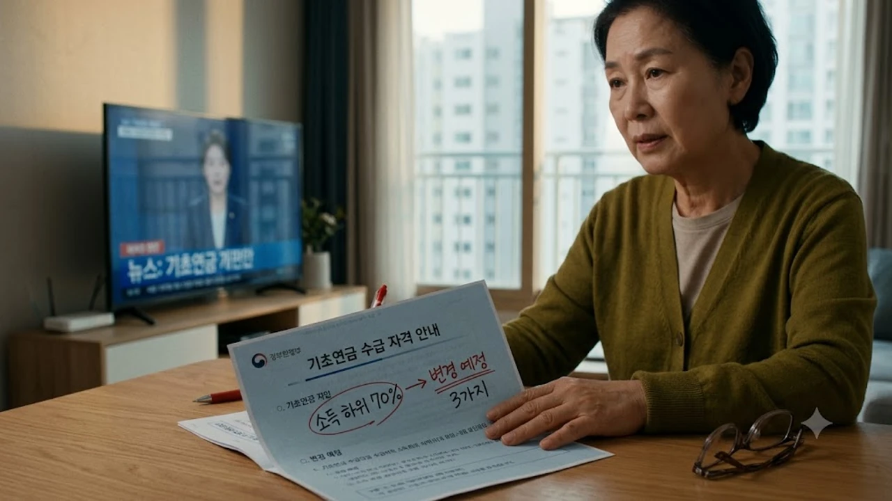

소득 하위 70% 노인에게 무조건 나눠주던 기초연금의 시대가 마침내 끝을 향해 가고 있습니다. 보건복지부가 저소득층 집중 지원을 골자로 한 새로운 **기초연금 개편안**을 내놓으면서, 노후 복지 혜택과 시니어 소득 보장의 판도가 완전히 뒤흔들리는 중입니다.


## 기초연금 개편안 핵심 쟁점과 추진 배경

> "솔직히 말하면, 재정이 바닥나는데 지금까지처럼 전원 다 퍼주는 방식은 불가능에 가깝습니다."

정부가 칼을 빼든 이유는 명확합니다. 65세 이상 인구 비율이 가파르게 치솟으면서 기존 방식을 유지할 재정 여력이 한계에 부딪혔기 때문입니다.

대한민국 통계청 인구추계 발표를 보면 2024년 말 65세 이상 고령인구 비중은 전체의 20%를 넘어서며 초고령사회로 공식 진입했습니다. 연간 80만 명에 달하는 베이비붐 세대(1955~1963년생)가 은퇴 전선에서 대거 노인 인구로 쏟아져 들어오면서, 지급 대상자 수는 2014년 435만 명 수준에서 2026년 현재 700만 명 선을 돌파했습니다. 수급 대상 머릿수가 기하급수적으로 팽창하자 복지 재정의 숨통이 완전히 조여진 셈입니다.

실제 2014년 7월 기초연금 출범 당시 단독가구 기준 월 최대 지급액은 20만 원, 연간 국고 부담 예산은 6조 9,000억 원 수준에 머물렀습니다. 그러나 2024년 기준 33만 4,810원, 2026년 기준 34만 원대까지 매년 물가상승률을 반영해 오르면서 연간 투입 예산만 24조 원을 가볍게 넘어섰습니다. 불과 12년 사이에 재정 지출 규모가 3.5배 이상 폭발한 셈이며, 현행 하위 70% 지급 방식을 방치하면 2030년에는 40조 원, 2040년에는 70조 원을 돌파한다는 국회예산정책처의 경고가 현실로 닥쳤습니다.

### 현행 하위 70% 일괄 지급제의 재정 한계
- **연간 예산 폭증**: 2014년 제도 도입 당시 7조 원 안팎이던 예산은 이미 수십조 원 단위로 불어났습니다.
- **포퓰리즘적 일괄 배분의 맹점**: 자산 여유가 있는 소득 상위 경계선까지 기계적으로 돈을 쥐여주다 보니, 정작 하루 한 끼를 걱정하는 극빈층 노인을 구제하지 못하는 모순이 깊어졌습니다.

경제협력개발기구(OECD) 통계에 따르면 2023년 기준 한국 노인 빈곤율은 40.4%로 회원국 중 압도적인 1위 불명예를 벗어나지 못하고 있습니다. 20조 원이 넘는 막대한 혈세를 매년 쏟아붓고도 노인 10명 중 4명이 빈곤의 늪에서 허덕이는 기현상은, 하위 70%라는 지나치게 넓은 그물망으로 복지 재정을 잘게 쪼개어 뿌렸기 때문입니다. 강남이나 수도권 요지에 시세 10억 원 안팎의 자가 주택을 보유한 채 금융 자산을 교묘히 분산한 고령층까지 수급권에 대거 걸려드는 사이, 단칸방 월세에 갇힌 노인에게 쥐어지는 돈은 여전히 30여만 원에 불과합니다.

### 초고령사회 진입에 따른 연금 개혁 불가피성
- 베이비붐 세대가 대거 노인층으로 편입되면서 매달 나가는 지급 총액이 통제 불가능한 속도로 불어났습니다.
- 일하는 청장년층이 급감하는 현실에서, 후세대의 조세 부담을 방치했다간 연금 체계 자체가 붕괴할 위험이 큽니다.

생산연령인구(15~64세)가 매년 수십만 명씩 증발하는 인구 절벽 앞에서 현행 방식을 밀어붙이는 것은 미래 세대에게 조세 폭탄을 떠넘기는 행위입니다. 2026년 9월 현재 생산연령인구 4명이 노인 1명을 부양하는 구조지만, 2050년에 이르면 청장년 1명이 노인 1명을 홀로 짊어져야 합니다. 결국 연금 지출의 절대적인 브레이크를 밟지 않고서는 국민연금 개혁조차 아무런 실효를 거둘 수 없다는 위기감이 정책 패러다임의 급선회를 이끌어냈습니다.

### 저소득 고령층 집중 지원으로의 패러다임 전환
- '모두에게 푼돈을' 쥐여주던 낡은 틀을 깨고 '가장 가난한 이들에게 뭉칫돈을' 밀어주는 구조로 바뀝니다.
- 최하위 빈곤층이 겪는 끼니와 주거 불안을 덜어내도록 한정된 세금을 가장 필요한 곳에 쏟아붓겠다는 취지입니다.

국제통화기금(IMF)과 세계은행 등 국제금융기구 역시 한국 정부를 향해 "보편적 복지라는 허울 좋은 명분을 버리고 취약계층 표적 복지로 전환하라"는 권고를 수년째 이어왔습니다. 이번 복지부 개편안은 단순한 총지출 삭감이 아닌, 분배 효율의 극대화를 겨냥합니다. 연금 재정의 증가 속도를 완만하게 조절하면서 빈곤층의 체감 생계비는 확실하게 보전하는 핀셋 복지로의 체질 개선이 본격적인 시동을 걸었습니다.

## 기존 방식 vs 차등 인상 개편안 집중 비교


기존의 획일적 지급 방식과 새로 바뀌는 차등 체계는 통장에 찍```markdown
소득 하위 70% 노인에게 무조건 나눠주던 기초연금의 시대가 마침내 끝을 향해 가고 있습니다. 보건복지부가 저소득층 집중 지원을 골자로 한 새로운 **기초연금 개편안**을 내놓으면서, 노후 복지 혜택과 시니어 소득 보장의 판도가 완전히 뒤흔들리는 중입니다.


## 기초연금 개편안 핵심 쟁점과 추진 배경

> "솔직히 말하면, 재정이 바닥나는데 지금까지처럼 전원 다 퍼주는 방식은 불가능에 가깝습니다."

정부가 칼을 빼든 이유는 명확합니다. 65세 이상 인구 비율이 가파르게 치솟으면서 기존 방식을 유지할 재정 여력이 한계에 부딪혔기 때문입니다.

### 현행 하위 70% 일괄 지급제의 재정 한계
- **연간 예산 폭증**: 2014년 제도 도입 당시 7조 원 안팎이던 예산은 이미 수십조 원 단위로 불어났습니다.
- **포퓰리즘적 일괄 배분의 맹점**: 자산 여유가 있는 소득 상위 경계선까지 기계적으로 돈을 쥐여주다 보니, 정작 하루 한 끼를 걱정하는 극빈층 노인을 구제하지 못하는 모순이 깊어졌습니다.

실제로 2014년 7월 첫 도입 당시 기초연금 대상자는 약 435만 명, 소요 예산은 6조 9,000억 원 수준에 불과했습니다. 그러나 2026년 현재 수급자는 700만 명을 돌파했고, 연간 투입 재정만 24조 원을 가볍게 넘어섰습니다. 매년 1조 원 이상의 국고가 추가 투입되는 구조 속에서 하위 70%라는 기계적 기준선은 재정 파탄의 주범으로 지목되었습니다.

서울 마포구에 거주하며 공시지가 9억 원대 아파트를 보유한 68세 은퇴자 박 모 씨의 사례가 대표적입니다. 금융자산이 적고 근로소득이 없다는 이유만으로 매달 30여만 원의 기초연금을 수령해 온 반면, 쪽방촌에서 폐지를 줍는 독거노인은 생계급여 차감 규정 탓에 기초연금을 받아도 고스란히 깎여나가는 역설이 지난 10년간 방치되었습니다.

### 초고령사회 진입에 따른 연금 개혁 불가피성
- 베이비붐 세대가 대거 노인층으로 편입되면서 매달 나가는 지급 총액이 통제 불가능한 속도로 불어났습니다.
- 일하는 청장년층이 급감하는 현실에서, 후세대의 조세 부담을 방치했다간 연금 체계 자체가 붕괴할 위험이 큽니다.

통계청이 발표한 인구 추계에 따르면 대한민국은 이미 65세 이상 고령 인구 비중이 20%를 넘어서는 초고령사회에 안착했습니다. 1955년부터 1963년 사이에 태어난 1차 베이비붐 세대 705만 명이 전부 노인 인구로 편입되면서 매달 국가가 쏟아부어야 하는 복지 비용이 한계점을 돌파했습니다. 생산가능인구(15~64세) 100명이 부양해야 할 노인 수가 2020년 21.7명에서 급격히 치솟는 구조적 절벽을 마주한 셈입니다.

지방의 현실은 훨씬 더 심각합니다. 전남 고흥군이나 경북 의성군 같은 소멸위험 지역은 고령 인구 비율이 이미 40% 안팎에 달합니다. 지자체 매칭 예산으로 감당해야 하는 기초연금 지방비 부담이 군 재정 자립도를 갉아먹으면서, 복지 혜택의 지속 가능성을 확보하기 위한 수술대 작업은 선택이 아닌 생존의 문제가 되었습니다.

### 저소득 고령층 집중 지원으로의 패러다임 전환
- '모두에게 푼돈을' 쥐여주던 낡은 틀을 깨고 '가장 가난한 이들에게 뭉칫돈을' 밀어주는 구조로 바뀝니다.
- 최하위 빈곤층이 겪는 끼니와 주거 불안을 덜어내도록 한정된 세금을 가장 필요한 곳에 쏟아붓겠다는 취지입니다.

OECD가 발표한 대한민국 노인 빈곤율은 40.4%로 회원국 압도적 1위라는 불명예를 수년째 이어오고 있습니다. 전체 노인의 70%에게 30만 원씩 쪼개주는 방식으로는 절대 빈곤을 탈출시키지 못한다는 전문가들의 지적이 쏟아졌습니다. 하위 70% 전원 지급이라는 허상을 버리고, 하위 30~40%에 재원을 몰아주어 실질적인 생계 보장액을 보장하는 선별적 복지 체계로의 대전환이 이번 개편안의 뼈대입니다.

보건복지부는 이번 개편을 통해 빈곤선 이하 최하위 계층에게 전달되는 급여액을 끌어올림으로써, 복지 사각지대에서 고독사와 영양실조 위기에 내몰린 독거노인들의 실질 소득을 즉각 끌어올리는 효과를 노리고 있습니다.

## 기존 방식 vs 차등 인상 개편안 집중 비교


기존의 획일적 지급 방식과 새로 바뀌는 차등 체계는 통장에 찍히는 실수령액부터 확연히 갈립니다.

| 구분 | 현행 제도 | 개편안 핵심 방향 |
| :--- | :--- | :--- |
| **지급 대상** | 65세 이상 소득 하위 70% 일괄 | 소득 구간별 선별 집중 지원 |
| **지급 방식** | 기준연금액 균등 분배 | 중위소득 연계 차등 인상 |
| **국민연금 연계** | 연계 감액 제도 일괄 적용 | 단계적 감액 완화 및 통폐합 |

### 소득 구간별 수령액 차등 구조 분석
- **중위소득 30~40% 이하 최저소득층**: 월 최대 40만 원 이상으로 인상 폭을 대폭 넓힙니다.
- **소득 하위 50~70% 경계층**: 기존 지급액에서 묶이거나 구간에 따라 단계적으로 감액 압박을 받습니다.

개편안의 핵심 골자는 기준연금액 40만 원 인상을 전체 계층에 동일 적용하지 않는다는 점입니다. 기준 중위소득 30% 이하인 최하위 빈곤 가구는 2026년 기준 현행 33만 4,810원에서 월 40만 원까지 단숨에 6만 원 이상 인상된 금액을 전액 현금 수령하게 됩니다. 끼니 해결조차 빠듯했던 최하위 120만 명가량이 즉각적인 수혜 대상에 포함됩니다.

반면 소득인정액이 선정기준선 끝자락에 아슬아슬하게 걸쳐 있는 하위 50~70% 구간 노인층은 인상 대상에서 완전히 배제되거나, 물가상승률 반영을 유예하는 방식으로 실질 수령액 동결 처분을 받습니다. 재정 증가를 틀어쥐면서 극빈층에게만 실질 구매력을 몰아주겠다는 계산입니다.

### 감액 대상자 발생 기준과 제외 위험군
- 어설프게 집 한 채나 통장 잔고가 남아 소득인정액 경계선에 걸친 계층은 아예 탈락권으로 밀려날 수 있습니다.
- 공시지가가 조금만 뛰어도 감액 페널티가 한층 촘촘하게 적용되어 실수령액이 깎입니다.

소득인정액 경계선에 위치한 수도권 중산층 고령 가구는 비상이 걸렸습니다. 경기도 부천시에 시세 6억 원(공시가격 약 4억 2,000만 원) 아파트 한 채를 보유하고 소액 배당 소득 40만 원을 받는 71세 정 모 씨의 경우, 현행 제도에서는 하위 70% 단독가구 선정기준액(213만 원)을 간신히 밑돌아 15만 원 안팎의 부분 감액 연금을 타왔습니다.

그러나 개편안에 따른 자산 평가 기준 현실화와 소득인정액 상한 축소가 동시에 맞물릴 경우, 정 씨는 아예 지급 대상에서 완전 탈락하게 됩니다. 특히 금융자산 3,000만 원 이상을 예금으로 묶어둔 시니어 가구들은 이자수득에 대한 인정 비율 상향 탓에 단 몇만 원 차이로 탈락 통지서를 받아들 위험이 극도로 높아졌습니다.

### 국민연금 연계 감액 제도 변경점
- 꼬박꼬박 국민연금을 냈다는 이유로 기초연금을 깎아버리던 독소 조항에 손을 댑니다.
- 성실 납부자가 바보가 되지 않도록 연계 감액 비율을 현실적으로 덜어내는 보완책이 맞물립니다. 복지 정책의 격변이 사회 전반에 미칠 파장이 궁금하다면 [사회 전체 글 보기](/posts/society/)에서 관련 흐름을 확인할 수 있습니다.

국민연금을 오랜 기간 성실히 납부해 월 50만 원 이상의 노령연금을 받는 가입자들은 기초연금이 최대 50%까지 뭉텅이로 깎여나가는 불이익을 겪어왔습니다. 2024년 말 기준 연계 감액 대상자만 70만 명에 육박하면서 국민연금 성실 납부자가 오히려 역차별을 당한다는 거센 조세 저항이 이어졌습니다. 20년 동안 꼬박꼬박 보험료를 부어 월 70만 원을 타는 사람이 연금을 전혀 내지 않고 기초연금 33만 원을 전액 받는 무기여 노인과 소득 격차가 얼마 나지 않는 비상식적인 구조가 원인이었습니다.

정부는 이번 개편을 통해 국민연금 연계 감액 기준선을 현행 기준연금액의 150%(약 50만 원)에서 200%(약 70만 원 선) 이상으로 끌어올리거나 감액률을 절반 수준으로 경감하는 절충안을 확정했습니다. 성실 납부자의 상대적 박탈감을 털어내고 국민연금 자진 임의가입 탈퇴 행렬을 틀어막겠다는 목적입니다.

## 내 수급 자격 달라질까? 모의 자가진단 가이드

통장에 들어올 연금이 깎일지 늘어날지는 세부 산정 공식을 뜯어봐야 윤곽이 나옵니다.

### 소득인정액 산정 방식 및 재산 공제 기준
- **소득평가액**: 근로소득 기본공제를 뺀 뒤 70%만 계산에 넣고, 사업소득과 이자·배당을 얹어 합산합니다.
- **재산의 소득환산액**: 아파트나 토지 같은 일반재산에서 지역별 기본재산액을 털어낸 후 연 4% 환산율을 매깁니다.

소득평가액 계산 시 근로소득 공제액은 2026년 기준 110만 원을 뺀 뒤 30% 추가 공제를 적용합니다. 월 200만 원의 급여를 받는 경비원 노인이라면 200만 원에서 110만 원을 뺀 90만 원에 70%를 곱해 월 63만 원만 근로소득으로 잡히게 됩니다. 여기에 국민연금 수령액, 이자 소득, 부동산 임대 소득이 100% 합산됩니다.

일반재산은 지역별 주거비 부담을 감안해 대도시 1억 3,500만 원, 중소도시 8,500만 원, 농어촌 7,250만 원을 기본 공제합니다. 만약 서울에 공시가격 5억 원 아파트를 보유하고 있다면 1억 3,500만 원을 뺀 3억 6,500만 원에 연 4%를 곱한 뒤 이를 12개월로 나눈 약 121만 원이 매월 재산소득으로 잡히는 구조입니다. 차량가액 4,000만 원 이상의 고급 승용차나 회원권을 보유했다면 그 가액 100%가 월 소득으로 고스란히 반영되어 즉각 탈락합니다.

### 1인가구 vs 부부가구 소득 역전 방지 감액 확인
- 부부가 둘 다 수급자일 때 칼질당하는 20% 일괄 감액 규정을 반드시 계산에 넣어야 합니다.
- 가구 합산 기준선 때문에 독거노인 1인가구보다 부부가구가 기준선을 살짝 넘어 탈락하는 사태가 속출합니다.

단독가구의 경우 기준액을 단 1,000원이라도 밑돌면 연금 수급권이 발생하지만, 부부가 함께 기초연금을 신청하면 각각의 기준연금액에서 20%씩 깎인 80%만 통장에 입금됩니다. 단독가구가 33만 4,000원을 받는다면 부부는 합산 66만 8,000원이 아니라 53만 4,000원 선으로 축소되는 방식입니다.

부부 합산 소득인정액이 기준선에 바짝 붙어 있는 경우 소득 역전 방지 감액까지 2중으로 작용합니다. 비수급자가 수급자보다 소득이 역전되는 현상을 막기 위해 2만 원 단위로 촘촘하게 잘라내는 계단식 감액이 적용되어, 최저 수급액인 3만 원대 푼돈만 입금되는 가구가 속출하는 이유가 바로 이 조항 때문입니다.

### 직역연금 연계 수급자의 변동 사항 점검
- 공무원, 군인, 사학연금 수령자와 그 배우자를 배제하는 큰 틀은 그대로 묶어둡니다.
- 다만 생계가 극도로 곤란한 직역연금 유족연금 특례자에 한해 예외 인정 범위를 미세 조정합니다.

공무원·군인·사립학교교직원·별정우체국 직원 등 직역연금 수급권자와 그 배우자는 소득 수준을 불문하고 기초연금법 제3조에 따라 원천 배제됩니다. 퇴직일시금을 받아 재산으로 굴리고 있더라도 직역연금 가입 이력이 확인되는 순간 신청서 접수 자체가 반려되는 철벽 규정입니다.

유일한 예외는 직역연금 가입 기간 10년 미만으로 일시금을 수령했거나, 유족연금을 받는 배우자 중 소득인정액이 극히 낮은 취약계층 일부입니다. 2026년 개편안에서는 직역연금 유족연금 수령액이 단독가구 최저생계비의 50%에 미치지 못하는 극빈 빈곤층에 한하여, 기초연금 차등 수급을 제한적으로 허용하는 구제 조항이 검토되고 있습니다.

## 손해 없이 혜택 챙기는 실전 수급 전략

제도가 바뀌는 흐름을 읽지 못하면 가만히 앉아서 매달 들어오던 연금을 날립니다.

### 금융재산 및 부동산 공시지가 변동 대응법
- **통장 잔액 관리**: 매달 1일 기준으로 조회되는 입출금 계좌 잔액이 튀지 않도록 사전에 묶어둘 필요가 있습니다.
- **주택 공시가격 추적**: 부동산 시세 변동으로 소득인정액이 상한선을 넘지 않는지 공시가격을 수시로 확인해야 합니다.

사회보장정보시스템(행복e음)은 매월 금융기관 전산망을 연계 조회해 금융재산을 파악합니다. 특히 3개월 평균 잔액이 아니라 조회 기준 시점의 통장 잔고가 그대로 포착되는 정기예금이나 MMF 계좌는 만기 해지 직후 보통예금에 방치해 두는 순간 소득환산액을 걷잡을 수 없이 밀어올립니다. 

부동산 역시 매년 4월 말 결정 공시되는 개별단독주택 및 공동주택 공시가격을 반드시 부동산 공시가격 알리미를 통해 체크해야 합니다. 공시가격이 5,000만 원만 올라도 월 환산 소득인정액은 약 16만 6,000원이 늘어나 탈락 커트라인을 넘어설 수 있습니다. 불합리하게 공시지가가 산정되었다면 5월 이의신청 기간을 이용해 실거래가 대비 과도한 평가를 낮추는 적극적인 방어가 필수적입니다.

### 주택연금 및 기초생활보장제도 동시 활용법
- 살고 있는 집을 주택연금에 묶으면 월 지급금이 부채로 잡혀 재산 산정액을 낮추는 방패가 됩니다.
- 기초연금을 받으면 생계급여가 깎이던 취약계층은 지자체 매칭 사업과 주거급여를 엮어 손실을 메워야 합니다.

자가 주택에 거주하며 현금 흐름이 막힌 고령층은 주택금융공사의 주택연금(역모기지론)을 정렛하게 결합해야 합니다. 주택연금을 신청해 매월 수령하는 연금액은 부채(대출금)의 증가로 누적되어 일반재산 평가액에서 차감되는 효과를 냅니다. 담보 채무로 인정받아 재산의 소득환산액을 합법적으로 낮추고, 통장으로는 비과세 연금을 타내면서 기초연금 수급 자격까지 보존하는 이중 레버리지 방식입니다.

국민기초생활보장 생계급여 수급자의 이른바 '줬다 뺏는 기초연금' 문제에 걸린 노인이라면 주거급여와 의료급여 체계로 무게중심을 옮겨야 합니다. 기초연금 수령으로 생계급여가 전액 삭감될 처지라면 연금 수급을 포기하기보다는, 관리비 지원과 통신비 감면, 의료급여 1종 수급권 방어에 맞춘 맞춤형 급여 분할 신청을 활용해 실질 가처분소득의 누수를 막아야 합니다.

### 지자체 시니어 복지 혜택과의 중복 수혜 팁
- 연금액이 줄거나 탈락 위기라면 지자체 노인 일자리 수당과 교통·의료 바우처를 즉각 신청해 손실을 벌충해야 합니다.
- 통신비 감면이나 에너지 바우처처럼 신청주의로 굴러가는 혜택을 놓치지 않도록 행정복지센터를 통해 전수 조회해야 합니다.

기초연금 수급권에서 탈락했거나 수령액이 반토막 났다면 지자체가 관할하는 노인 사회활동 지원사업(시니어클럽)의 공익활동형 또는 사회서비스형 일자리를 노려야 합니다. 월 30~60시간 참여로 29만~70만 원 수준의 활동비를 비과세 소득으로 확보할 수 있으며, 이 활동비는 기초연금 소득산정 시 전액 비과세 처리되는 강력한 장점이 있습니다.

아울러 이동통신 3사가 제공하는 월 최대 1만 2,100원의 통신비 감면, 동절기 최대 30만 원 이상 지원되는 한국에너지공단의 에너지 바우처, 만 65세 이상 무료 틀니·임플란트 건강보험 본인부담금 30% 특례 적용은 행정복지센터 창구에서 본인이 직접 신분증을 내고 신청하지 않으면 단 1원도 챙겨주지 않는 '신청주의' 제도입니다. 정기적으로 '복지로' 사이트의 복지서비스 모의계산기를 돌려보고 누락된 현물 감면 제도를 긁어모아 연금 삭감분을 상쇄해야 합니다.

#기초연금개편안 #기초연금수급자격 #기초연금차등인상 #2026기초연금 #소득인정액 #노후빈곤 #국민연금연계감액 #시니어복지혜택