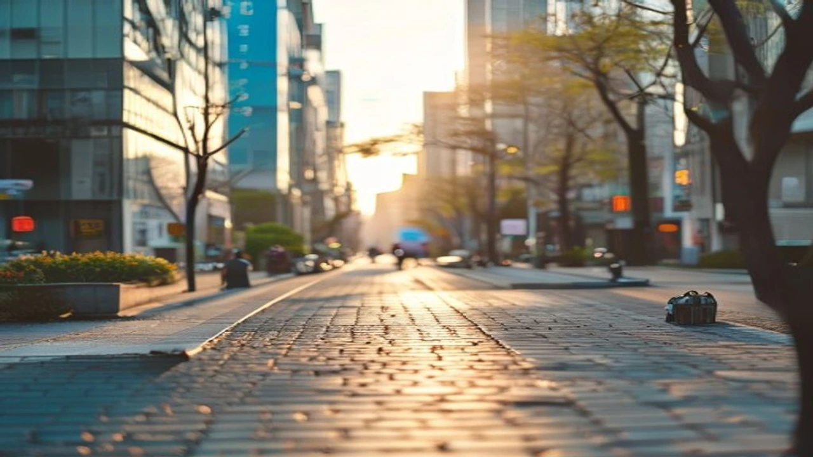
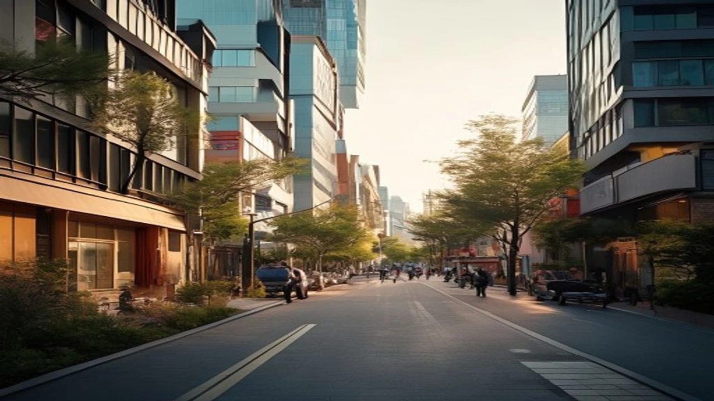

2026년 7월을 기점으로 대한민국 수도권의 쓰레기 처리 체계가 역사상 가장 큰 전환점을 맞이했습니다. 올해 초 전격 시행된 **수도권 매립 금지** 조치로 인해 가연성 생활폐기물의 직매립이 전면 차단되면서 각 지자체와 쓰레기 처리 현장은 연일 비상사태를 겪고 있습니다. 본격적인 여름철 고온다습한 날씨와 맞물려 적체된 폐기물 문제가 시민들의 일상까지 위협하는 현 상황의 핵심 원인과 대책을 명확히 정리합니다.

## 수도권 직매립 금지 전격 시행, 무엇이 달라졌나?

### 가연성 폐기물 직매립 제로화 제도의 핵심 내용
올해부터 적용된 자원순환기본법 시행령에 따라 서울, 경기, 인천 등 수도권 전역에서 발생하는 생활폐기물 중 불에 타는 성분의 쓰레기는 소각 가공이나 재활용 과정을 거치지 않고 땅에 바로 묻는 행위가 완전히 금지되었습니다. 과거에는 종량제 봉투에 담긴 혼합 폐기물이 그대로 인천 서구의 수도권매립지로 향했으나, 이제는 반드시 소각장에서 한 번 태운 후 남은 재만 매립해야 합니다. 환경부 발표에 따르면 이번 조치는 매립지 포화 시기를 늦추고 토양 오염을 방지하기 위한 필수적인 법적 구속력을 가집니다.

### 종량제 봉투가 사라진다? 현장 수거 방식의 변화
기존의 혼합 배출형 종량제 봉투 시스템은 사실상 종말을 고하고 있습니다. 가연성 물질과 비가연성 물질이 조금이라도 섞여 있으면 수거 차량이 전량 수거를 거부하는 '리턴제'가 현장에서 엄격하게 작동하기 시작했습니다. 

> **현장 수거 대행업체 관계자 인터뷰 요약**
> "과거에는 종량제 봉투 안에 플라스틱이나 음식물 쓰레기가 섞여 있어도 눈감아주는 경우가 많았지만, 지금은 소각장 반입 단계에서 전수 검사를 하기 때문에 혼합 배출된 봉투를 수거하면 업체가 통째로 벌금을 뭅니다."

이로 인해 아파트 단지 및 주택가 수거함 앞에는 수거 거부 스티커가 붙은 종량제 봉투가 쌓여가는 풍경이 일상화되었습니다.

### 서울·경기·인천 지자체별 단속 기준과 과태료 총정리
단속의 칼날은 더욱 날카로워졌습니다. 서울시의 경우 자치구별 특별단속반을 편성해 야간 시간대 종량제 봉투 파봉 검사를 수시로 진행하며, 적발 시 폐기물관리법에 따라 최고 100만 원의 과태료를 부과합니다. 경기도 역시 각 시·군별로 재활용 가능 자원의 혼합 배출을 집중 단속하고 있으며, 인천광역시는 매립지 소각재 반입 규정을 위반한 지자체에 대해 매립지 반입 정지라는 강력한 징계 조치를 예고했습니다. 시민들은 단순히 쓰레기를 버리는 행위 자체만으로도 법적 처벌을 받을 수 있는 무거운 책임감을 안게 되었습니다.

## 쓰레기 대란 시나리오: 왜 위기설이 돌까?

### 여름철 폭증하는 쓰레기량 vs 턱없이 부족한 소각장 용량
7월은 1년 중 배출량이 가장 가파르게 상승하는 시기입니다. 수박 등 계절 과일 껍질과 배달 음식 소비 증가, 그리고 장마철 습기로 인해 무게가 늘어난 폐기물이 소각장으로 몰려들고 있습니다. 현재 서울시가 보유한 4개 광역자원회수시설(마포, 노원, 양천, 강남)의 일일 처리 용량은 약 2,200톤 수준에 불과합니다. 그러나 서울에서 하루에 쏟아지는 가연성 생활폐기물은 3,000톤을 웃돌아, 매일 800톤 이상의 쓰레기가 갈 곳을 잃고 임시 적치장에 쌓이는 한계 상황에 봉착했습니다.

### '내 집 앞은 안 돼' 지역 이기주의와 지자체 입지 갈등 현주소
법은 시행되었으나 이를 뒷받침할 소각장 증설은 사면초가에 빠졌습니다. 서울시가 추진 중인 마포구 신규 소각장 건립 계획은 지역 주민들의 격렬한 반대 법정 공방으로 인해 착공조차 불투명한 상태입니다. 경기도 내 다수의 지자체 역시 소각시설 확충을 시도하고 있으나, 인근 주민들이 건강권 침해와 재산가치 하락을 이유로 강하게 저항하면서 행정 절차가 완전히 마비되었습니다. 대안 없는 규제가 낳은 전형적인 정책 병목 현상입니다.

### 자원회수시설(소각장) 증설에 성공한 지역과 실패한 지역 비교
갈등 해결의 실마리를 찾은 곳도 존재합니다. 일부 지자체는 소각장을 지하화하고 지상 부지에 대규모 수영장, 라이브러리, 친환경 공원을 조성하는 '복합 문화 타운' 전략으로 주민 동의를 이끌어냈습니다. 반면, 단순히 일방적인 행정명령과 보상금 제시만으로 밀어붙인 지역은 수년째 착공은커녕 주민 협의체 구성조차 하지 못한 채 갈등의 골만 깊어졌습니다. 결국 주민 소통 방식의 차이가 쓰레기 처리 인프라 확보의 성패를 갈랐습니다.

[관련 글 보기](/posts/society/)

## 쓰레기 대란이 바꾸는 우리 집 일상과 주거 트렌드

### "이제 필수가 된 음식물 처리기" 가전 업계의 뜻밖의 호재
혼합 배출 규제가 강화되면서 가전 시장의 지형도가 급변했습니다. 종량제 봉투에 음식물 쓰레기 잔여물이 묻어 있으면 가연성 폐기물 소각 처리가 불가능해지기 때문에, 가정 내에서 완벽하게 수분을 제거하거나 분쇄·건조하는 음식물 처리기가 건조기와 식기세척기를 잇는 필수 가전으로 등극했습니다. 실제로 가전 유통업계 매출 통계에 따르면 올해 상반기 친환경 미생물 분쇄 가전 부문의 매출은 전년 동기 대비 140% 이상 수직 상승했습니다.

### 제로 웨이스트 가구의 일주일 배출 일지로 본 현실적인 불편함
쓰레기를 최소화하려는 1인 가구의 삶도 고달프기는 마찬가지입니다. 일주일 동안 배달 음식을 전면 금지하고 전통시장에서 용기를 직접 지참해 장을 보는 '제로 웨이스트' 실험을 진행한 직장인들의 경험담을 살펴보면 현실적인 장벽이 가득합니다.

* 상품 포장재를 거부하기 위해 도보로 먼 거리의 전용 매장을 찾아가야 하는 시간적 비용 발생
* 플라스틱 용기에 부착된 라벨지를 열로 녹여 분리해야 하는 번거로움
* 얇은 비닐 한 장조차 철저히 세척해 건조해야 하는 가사 노동 시간의 증가

이처럼 환경적 가치를 지키기 위해 개인이 감당해야 하는 시간과 노력의 비용이 지나치게 높다는 불만이 팽배합니다.

### 아파트 단지별 쓰레기 분리배출 자율 규제와 입주민 갈등 사례
공동주택 내부 분위기도 살벌해졌습니다. 서울 시내의 한 대단지 아파트는 관리사무소 주도로 쓰레기 배출장 입구에 감시 카메라를 추가 설치하고, 재활용품 분리를 잘못한 세대의 CCTV 녹화 화면을 엘리베이터 모니터에 공개하는 강수를 두었습니다. 이 과정에서 개인정보 침해를 주장하는 입주민과 아파트 전체가 쓰레기 수거 거부 불이익을 당할 수 없다고 맞서는 입주자대표회의 간의 고소·고발 사태가 빈발하며 주거 공동체의 결속력이 저해되는 부작용이 나타나고 있습니다.

## 위기를 기회로 바꾸는 쓰레기 제로 라이프 실천 가이드

### 일회용품 줄이기 가치 소비의 장단점과 지속 가능한 팁
가장 직관적인 해결책은 일회용품 소비 자체를 억제하는 고통 분담입니다. 텀블러와 다회용 밀폐용기를 사용하는 가치 소비는 쓰레기 배출량을 즉각적으로 줄여주는 명확한 장점이 있습니다. 반면 다회용기를 세척하는 과정에서 과도한 물과 세제가 소비되어 또 다른 환경오염을 유발한다는 단점도 존재합니다. 따라서 무작정 새로운 텀블러를 기념품처럼 구매하기보다, 집에 이미 존재하는 용기를 최소 100회 이상 반복 사용하는 '진짜 친환경' 습관 정착이 요구됩니다.

### 플라스틱 고품질 재활용 리워드 앱 활용법과 앱테크 효과
버려지는 쓰레기를 자원화하여 현금성 포인트를 쌓는 영리한 소비자들도 늘고 있습니다. 투명 페트병이나 알루미늄 캔을 수거 장비에 투입하면 개당 10~20원씩 보상해 주는 자원순환 리워드 플랫폼이 큰 인기를 끌고 있습니다.

> **자원순환 앱테크 이용자 팁**
> "라벨을 깨끗이 제거하고 내부를 세척한 투명 페트병만 골라 모으면 한 달에 커피 한두 잔 값의 포인트를 현금화할 수 있습니다. 쓰레기 배출 스트레스도 줄고 소소한 용돈벌이도 되니 일석이조입니다."

### 쓰레기 수거 대란 속에서도 살아남는 가구별 현명한 대처 수칙
대란의 시대에 혼란을 피하기 위해서는 가구 유형별 맞춤형 배출 전략이 유효합니다. 1인 가구는 배출 주기가 길어 쓰레기가 장기간 방치되기 쉬우므로, 씻은 비닐과 플라스틱을 압축하여 부피를 줄이는 전용 압축기를 활용하는 편이 좋습니다. 다인 가구의 경우 배출량이 많은 만큼 가연성과 비가연성 마대 봉투를 미리 다량 확보하고, 지자체별로 매주 바뀌는 배출 요일 지침을 캘린더 앱에 등록해 수거 공백이 발생하지 않도록 철저히 관리하는 지혜가 실질적인 생존 전략입니다.

**함께 읽으면 좋은 글**
- [2027 요양병원 간병비 급여화 3가지 핵심](/posts/society/nursing-hospital-caregiving-benefit-2026/)
- [5060 시니어 빚투 급증, 노후파산 막는 법](/posts/society/society-1779888193725/)

#수도권매립금지 #쓰레기대란 #2026트렌드 #자원순환기본법 #소각장갈등 #분리배출기준 #음식물처리기 #제로웨이스트 #리워드앱테크