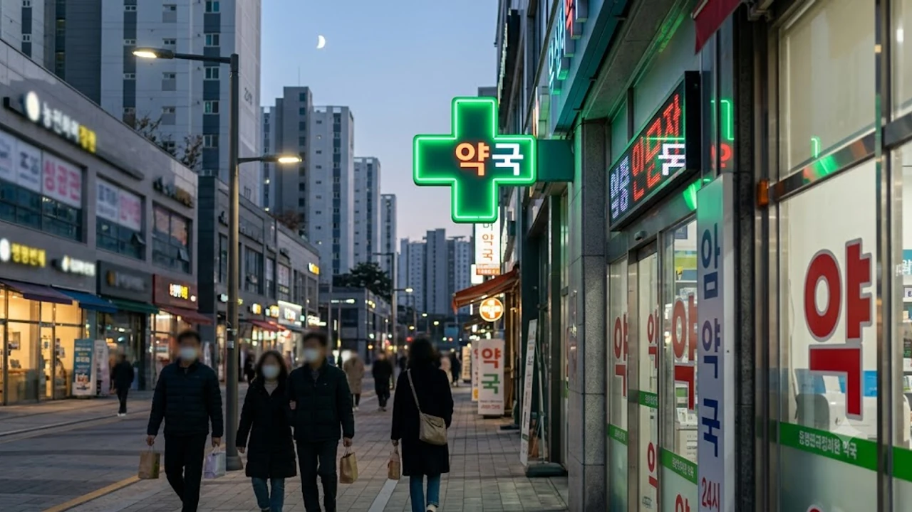

연휴 첫날 밤 열이 펄펄 끓거나 극심한 복통이 찾아왔을 때, 예전 생각만 하고 무작정 대학병원 응급실로 차를 몰았다간 문전박대를 당하거나 상상치 못한 진료비 청구서를 받아들기 십상이다. 당장 아파 죽겠는데 문을 연 동네 병원이 어디인지 몰라 발만 동동 구르는 비극을 피하려면, **2026 추석 문 여는 병원**과 당번 약국을 실시간으로 확인하는 시스템과 명절 비상응급 체계를 반드시 머릿속에 넣어둬야 한다. 당황해서 119 구급차 안에서 시간을 허비하지 않으려면 지금 당장 바뀌어버린 의료 현장의 현실을 직시해야 한다.

## 2026 추석 비상진료 체계 핵심 변경점

### 권역응급의료센터와 지역응급의료기관 역할 분담
솔직히 말하면, 지금 대형병원 응급실은 중증 환자가 아니면 아예 진입조차 차단하는 수준으로 문턱을 높였다. 전국 44개 권역응급의료센터는 뇌출혈, 심근경색, 중증 외상 환자처럼 분초를 다투는 환자만 집중적으로 수용한다. 반면 단순 골절, 열상, 복통 같은 증상은 지역응급의료센터나 지역응급의료기관으로 철저히 분산 배치된다. 예전처럼 "일단 큰 병원 가면 어떻게든 봐주겠지"라는 안일한 생각으로 접근했다가는 접수처에서 퇴짜를 맞고 길바닥에서 배회하는 최악의 사태를 맞이한다.

### 경증 환자 응급실 내원 시 본인부담금 변동 기준
이게 진짜 무서운 대목이다. 단순 감기나 가벼운 장염 같은 KTAS(한국형 응급환자 분류도구) 4~5등급에 해당하는 경증 환자가 권역응급의료센터를 방문하면, 진료비 본인부담률이 90%까지 치솟는다.

> "열 좀 나고 체한 것 같아서 대형병원 응급실에 들렀다가 진료비 영수증에 찍힌 수십만 원을 보고 기절할 뻔했다"는 원망 섞인 후기가 명절마다 쏟아지는 이유다.

- **KTAS 1~2등급 (중증)**: 심정지, 중증 외상, 의식 불명 (본인부담금 변동 없음)
- **KTAS 3등급 (중등증)**: 심한 복통, 호흡 곤란, 고열 동반 탈수 (기본 부담률 적용)
- **KTAS 4~5등급 (경증·비응급)**: 타박상, 단순 열감기, 가벼운 두드러기 (**본인부담률 90% 폭탄**)

자신의 증상이 애매하다면 대형병원 응급실 대신 문을 연 일반 동네 의원이나 중소 종합병원을 먼저 찾아가는 것이 지갑과 건강을 모두 지키는 길이다. 혹시 모를 긴급 상황에 대비해 안전망을 미리 파악해두는 것처럼 생활 속 필수 정보를 평소에 챙겨둘 필요가 있으며, 평소 일상 안전 시스템이 궁금하다면 [2026년 안심 귀가 서비스 완전 정리](/posts/society/youth-safety-stranger-anxiety-2026/) 글도 참고해볼 만하다.

### 추석 당직 병·의원 및 달빛어린이병원 지정 현황
이번 연휴 기간 전국 각 지자체는 하루 평균 약 4,000곳 이상의 동네 병·의원을 당직 의료기관으로 지정해 분산 진료를 유도하고 있다. 특히 밤마다 응급실을 뒤흔드는 소아 환자를 위해 야간·휴일 소아 외래 진료를 전담하는 달빛어린이병원을 전국 수십 개소로 확대 가동한다. 아이가 갑자기 열이 나거나 구토를 한다면 비싼 성인 응급실로 뛰지 말고, 거주지 인근의 달빛어린이병원 운영 여부부터 확인하는 것이 가장 빠르고 현명한 대처다.

## 실시간 추석 문 여는 병원·약국 스마트 조회법

### 응급의료포털 E-Gen 사이트 200% 활용법
가장 정확하고 공신력 있는 방법은 보건복지부가 운영하는 응급의료포털 E-Gen(e-gen.or.kr)이다. 연휴가 시작되면 사이트 메인 화면 전체가 '명절 비상진료기관 안내' 전용 모드로 전환된다.
- **주소 기반 검색**: 현재 위치한 시·도 및 구·동을 입력해 반경 1km~3km 내 진료 중인 병원 확인
- **진료과목 필터링**: 내과, 소아청소년과, 정형외과 등 명절에 사고가 잦은 과목만 선택 검색
- **실시간 진료 가능 여부**: 병원 운영 시간과 응급실 병상 잔여 현황 실시간 갱신

### 네이버 지도 및 카카오맵 명절 비상진료 탭 공략
포털 사이트 지도 앱도 명절에는 가장 직관적인 무기가 된다. 네이버 지도와 카카오맵 상단에 임시 개설되는 '명절진료', '응급진료' 전용 탭을 누르면 주변에서 실제로 문을 열고 영업 중인 기관만 지도 위에 표시된다. 단, 시스템 업데이트 지연이나 현장 사정으로 조기 마감하는 곳이 발생하므로, 무작정 찾아가지 말고 앱 화면에 적힌 전화번호로 미리 전화를 걸어 실제 접수가 가능한지 확인하고 출발해야 헛걸음을 막는다.

### 119와 129 전화 상담을 통한 응급실 병상 확인
인터넷 검색이 서툰 고령자나 운전 중 급박한 순간이라면 스마트폰 화면을 붙잡고 씨름할 시간이 없다. 국번 없이 **119(소방상황실)**나 **129(보건복지상담센터)**로 전화를 걸면 현재 운영 중인 가장 가까운 당직 의료기관과 약국을 상담원이 즉시 조회해 문자로 전송해 준다. 만약 환자 상태가 위독하다면 119 구급상황관리센터를 통해 이송 가능한 병원 병상 현황까지 다이렉트로 연결받아야 한다.

## 명절 응급실 이용 전 필수 체크리스트와 비용 폭탄 방지책

### 방문 전 유선 확인 없는 무작정 방문의 치명적 결과
"지도 앱에 영업 중이라고 떴으니 가보자"는 생각은 명절에 아주 위험하다. 의사 1인이 당직을 서는 중소 의원은 환자가 몰리면 접수를 일찍 마감해버리기 일쑤다. 문을 연 곳을 찾았더라도 반드시 전화를 걸어 "지금 방문하면 바로 진료 접수가 됩니까?"라고 물어야 한다. 확인 없이 무턱대고 찾아갔다가 대기 환자만 수십 명이라 3시간을 앉아서 기다려야 하는 황당한 사태를 겪게 된다.

### 연휴 기간 진찰료 공휴일 가산율 30%~50%의 실체
명절 연휴나 야간에 병원이나 약국을 이용하면 기본 진찰료와 조제료에 야간·공휴일 가산금이 붙는다. 기본적으로 평일 주간 대비 진찰료의 30%에서 많게는 50%까지 할증이 붙는다. 특히 심야 시간(오후 6시 이후~익일 오전 9시)에는 가산율이 더 커진다. 병원비가 평소보다 1.5배 가까이 청구된다고 해서 바가지를 쓴 게 아니라 법적으로 규정된 공휴 가산 제도 때문이다. 영수증을 보고 당황하지 않으려면 이 비용 체계를 미리 알고 있어야 한다.

### 경증 질환별 동네 당직 의원 이용 기준
모든 아픔이 응급실행을 뜻하지는 않는다. 아래와 같은 증상은 대형병원 대신 당직 의원으로 향하는 게 치료 속도도 빠르고 비용도 절약된다.
- **가벼운 식체 및 장염**: 명절 음식 과식으로 인한 설사나 구토는 당직 내과나 가정의학과 방문
- **가정 내 경미한 찰과상·자상**: 요리 중 칼에 베이거나 넘어진 상처는 당직 정형외과나 일반외과에서 봉합 치료
- **감기 및 단순 발열**: 해열제 복용 후 호전되는 가벼운 미열은 동네 이비인후과 진료

## 명절 연휴 상비약 구비와 셀프 응급처치 가이드

### 24시간 편의점 안전상비의약품 13종 품목 확인
동네 약국마저 모두 문을 닫았다면 24시간 운영하는 편의점이 마지막 보루다. 편의점에는 법적으로 지정된 안전상비의약품 13개 품목이 비치되어 있다.
- **해열진통제**: 타이레놀정, 어린이용타이레놀정, 어린이타이레놀현탁액
- **감기약**: 판콜에이내복액, 판피린티정
- **소화제**: 베아제정, 닥터베아제정, 훼스탈플러스정, 훼스탈골드정
- **파스류**: 신신파스아렉스, 제일쿨파프

주의할 점은 1회 구매 시 1일분만 구매할 수 있도록 제한되어 있다는 점이다. 사재기가 불가능하므로 가족 구성원이 많다면 미리 상비약을 준비해두는 편이 안전하다.

### 음식물 기도 폐쇄 시 대처하는 하임리히법 핵심 절차
송편이나 인절미 같은 떡을 먹다가 목에 걸리는 기도 폐쇄 사고는 매년 추석마다 반복되는 단골 참사다. 환자가 말을 하지 못하고 목을 감싸 쥐며 얼굴이 파래진다면 지체 없이 하임리히법을 실시해야 한다.
1. 환자의 등 뒤에 서서 양팔로 허리를 감싼다.
2. 한쪽 손으로 주먹을 쥐고 엄지손가락 쪽을 환자의 명치와 배꼽 중간에 댄다.
3. 다른 손으로 주먹을 감싼 뒤, 환자의 복부를 안쪽에서 위쪽으로 강하게 쳐올린다.
4. 이물질이 입 밖으로 튀어나올 때까지 빠르고 강하게 반복 압박한다.

의식을 잃고 쓰러진다면 즉시 바닥에 눕히고 119에 신고한 뒤 바로 심폐소생술(CPR)로 전환해야 뇌 손상을 막을 수 있다.

### 연휴 대비 필수 가정용 구급함 구성 요령
응급실을 갈 상황 자체를 만들지 않으려면 연휴 시작 전에 기본 구급함을 반드시 채워둬야 한다. 체온계, 소독약, 방수 밴드, 멸균 거즈, 압박 붕대, 지사제, 종합감기약, 항히스타민제(두드러기약)는 필수다. 연휴가 시작된 이후에는 약국을 찾아 돌아다니는 것 자체가 고역이므로 평소에 알찬 구급 세트를 집에 구비해두는 것만으로도 비상시 의료 공백을 충분히 버텨낼 수 있다.

[가정용 응급 구급함 세트 쿠팡에서 보기](https://www.coupang.com/np/search?q=%EA%B5%AC%EA%B8%89%ED%95%A8%EC%84%B8%ED%8A%B8&sourceType=affiliate&trackingCode=AF8691300)

#2026추석문여는병원 #추석연휴응급실 #EGen응급의료포털 #달빛어린이병원 #추석당번약국 #편의점상비약 #명절응급실본인부담금 #하임리히법응급처치