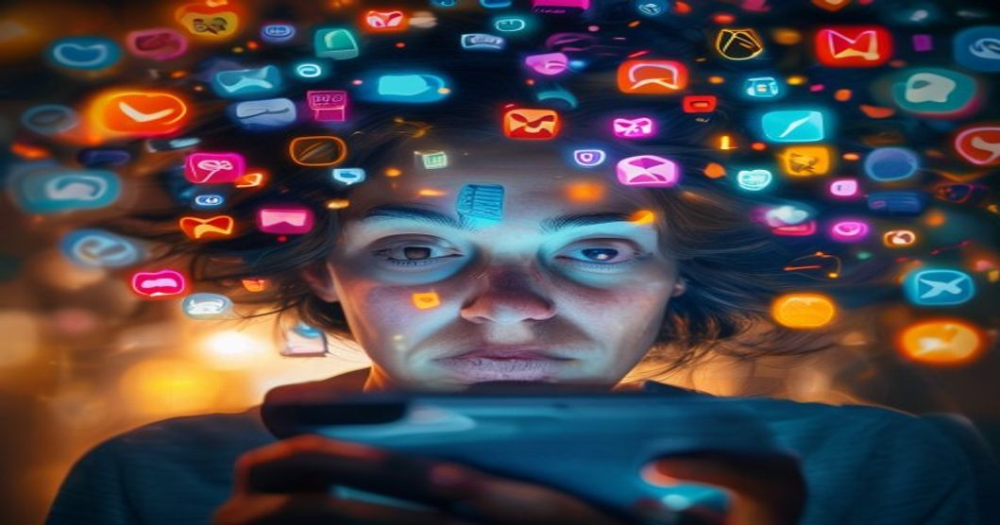

알림 소리에 반사적으로 손이 가고, 5분만 쉬어도 SNS를 확인하게 되는 요즘. 한국인의 스마트폰 하루 평균 사용 시간이 7시간을 넘어섰습니다. 그런데 역설적으로 지금 가장 빠르게 성장하는 트렌드 중 하나가 **디지털 단절**이에요. 폰 없는 여행, 소셜미디어 탈퇴, 아날로그 다이어리로의 회귀 — 이 흐름이 왜 지금 이토록 강해지고 있는지 들여다봅니다.

## 디지털 피로가 사회적 현상이 된 배경

### 끝없는 스크롤이 만드는 인지 과부하

인스타그램, 유튜브, 틱톡 등 주요 플랫폼은 사용자가 앱을 끄지 못하도록 설계돼 있습니다. 무한 스크롤, 자동 재생, 알림 최적화 등 이른바 '중독 설계(Addictive Design)'가 뇌의 도파민 회로를 끊임없이 자극해요. 그 결과 집중력 저하, 수면 장애, 우울감이 광범위하게 나타나고 있습니다.

### 비교 문화가 낳는 상시 불안감

SNS에서 보이는 타인의 삶은 하이라이트 릴입니다. 여행, 명품, 성취를 과시하는 콘텐츠에 하루 수백 번 노출되면서 '나만 뒤처지는 것 같은' 불안이 일상화됐어요. 심리학계에서는 이를 '소셜 비교 피로(Social Comparison Fatigue)'라 부르기 시작했습니다.

### 재택근무 확산이 가져온 경계 붕괴

일과 쉬는 시간의 경계가 사라지면서 디지털 기기는 24시간 업무 도구가 됐습니다. 퇴근 후에도 슬랙 알림이 오고, 휴가 중에도 이메일을 확인해야 한다는 압박이 만성 피로로 이어지고 있어요.

## 의도적 단절을 선택하는 사람들

### 폰 없는 여행과 디지털 디톡스 리트리트의 인기

제주도, 강원도 산간 지역에 스마트폰 반납 정책을 내건 숙소들이 생기고 있습니다. 예약이 몇 달 전부터 꽉 찰 정도로 수요가 폭발했어요. 해외에서도 포르투갈 알렌테주나 일본 야쿠시마처럼 와이파이 없는 오지 여행이 프리미엄 상품으로 자리잡았습니다.

### MZ세대의 역설 — 디지털 네이티브가 아날로그를 찾다

필름 카메라, 손편지, 종이 다이어리가 20대 사이에서 다시 유행하는 이유가 단순한 복고 취향 때문만은 아닙니다. 디지털에서 얻을 수 없는 '느린 속도', '불완전함', '물성(物性)'에 대한 갈증이 이 흐름을 만들고 있어요.

### SNS 계정 삭제와 사용 시간 제한 앱의 확산

인스타그램 계정을 아예 삭제하거나 특정 시간대에만 앱을 여는 '앱 타이머' 기능 사용자가 빠르게 늘고 있습니다. 스크린 타임 제한을 의식적으로 설정하는 것이 하나의 라이프스타일 선언이 됐어요.

## 기업과 사회가 대응하는 방식

### 법정 연결 차단권(Right to Disconnect)의 부상

프랑스에서 시작된 '연결 차단권'이 국내에서도 논의되기 시작했습니다. 퇴근 후 업무 연락을 법적으로 제한하는 방향의 입법 논의가 노동계와 정치권에서 진행 중이에요.

### 테크 기업의 웰빙 기능 강화 — 속죄인가 전략인가

애플, 구글 등 빅테크는 스크린 타임 관리, 집중 모드, 알림 요약 등 웰빙 기능을 꾸준히 강화하고 있습니다. 사용자의 신뢰를 유지하기 위한 전략이기도 하지만, 중독 설계와 공존하는 모순이라는 비판도 있어요.

### 학교 현장의 스마트폰 금지 실험

여러 지자체와 학교에서 수업 시간 스마트폰 수거를 의무화하는 실험이 진행 중입니다. 단기 성적 향상보다 학생들의 집중력과 또래 관계 질이 개선됐다는 보고가 잇따르고 있어요.

## 디지털과 아날로그의 균형을 찾는 법

### 하루 1시간 '의도적 오프라인' 실천

디지털 디톡스를 위해 세상과 완전히 단절할 필요는 없습니다. 하루 중 특정 시간대(예: 기상 후 1시간, 식사 시간)를 스크린 없이 보내는 작은 규칙이 큰 변화를 만들어요.

### 알림 설계를 내 손으로 재조정하기

모든 앱의 알림을 허용해두는 것이 기본값이 되어 있지만, 실제로 즉각 대응이 필요한 알림은 극히 일부입니다. 알림 허용 앱을 5개 이하로 줄이는 것만으로도 하루의 집중력 분산이 눈에 띄게 줄어요.

[2026년 건강 트렌드 — 직장인 루틴 관리법](/posts/health/)에서 다루는 수면 및 스트레스 관리 콘텐츠와 함께 읽으면 디지털 피로 회복에 더 실질적인 도움이 됩니다. 연결의 시대에 의도적으로 단절을 선택하는 것이 이제는 가장 지적인 삶의 방식이 되고 있어요.

**함께 읽으면 좋은 글**
- [진짜 돈 아끼는 2026 실용 소비 완전 정리](/posts/society/practical-ethical-consumption-guide-2026/)
- [청소년 SNS 금지 법안 진짜 시행될까? 3가지 쟁점 정리](/posts/society/youth-sns-ban-law-issues-2026/)

#디지털피로 #스마트폰중독 #디지털디톡스 #사회트렌드2026 #정신건강 #아날로그감성 #라이프스타일
