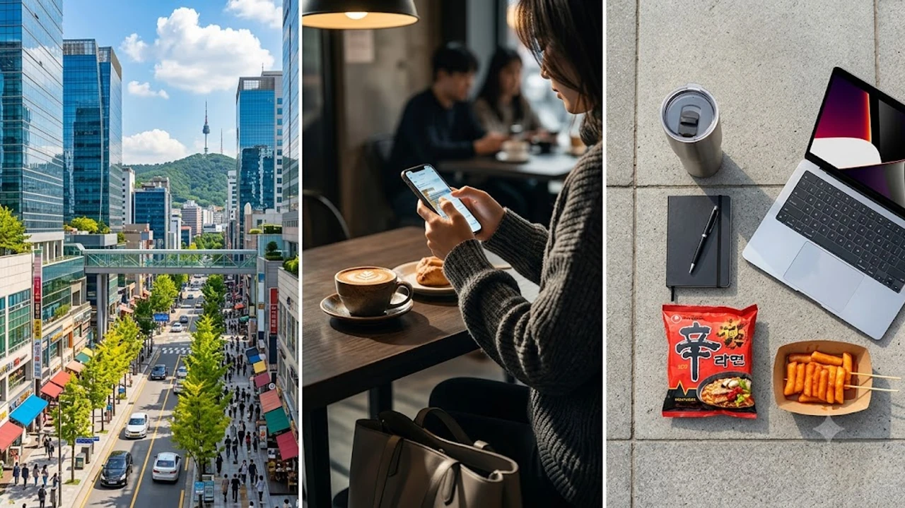

술을 마시고 운전대를 잡았는데 법원에서 무죄가 나왔다는 소식에 "이게 말이 되냐"며 분통을 터뜨리는 사람이 적지 않습니다. 하지만 엄격한 대한민국 형사 재판에서도 생명과 신체를 지키기 위한 극단적 선택 앞에서는 법의 잣대가 달라집니다. 최근 법원이 성폭행 위기를 벗어나려 차를 몰았던 피고인에게 형법상 **음주운전 긴급피난** 법리를 적용해 **위법성 조각 사유**를 인정하고 무죄를 선고했습니다.

## 음주운전 무죄 선고, 법원이 주목한 사건의 결정적 경위

### 위기 탈출을 위한 11km 주행과 갓길 정차 과정
사건 당일 피고인은 지인 모임 자리에서 술을 마신 뒤, 함께 있던 남성으로부터 노골적인 강제 추행과 성폭행 위협을 받았습니다. 인적이 끊긴 야간 도로변에서 위협을 피해 가까스로 본인 차량 안으로 몸을 피했으나, 가해 남성은 곧바로 뒤쫓아와 차 문손잡이를 거칠게 흔들며 협박을 이어갔습니다. 피고인은 현장을 벗어나기 위해 시동을 걸었고, 남성의 추격을 피해 11km가량을 내달린 끝에 안전지대인 갓길에 차를 멈춰 세웠습니다.

### 혈중알코올농도 수치와 112 긴급 신고 기록의 타임라인
단속 당시 피고인의 혈중알코올농도는 면허 취소 수준에 해당하는 만취 상태였습니다. 통상적인 단속이었다면 어떤 변명도 통하지 않을 상황이었습니다. 하지만 판결을 뒤흔든 결정적 증거는 분초 단위로 기록된 112 신고 내역이었습니다. 피고인은 차를 움직이기 직전부터 주행하는 내내 112에 구조 요청 전화를 걸어 다급하게 현장 위치와 위협 상황을 알렸고, 통화 내용 전체가 경찰 녹취 시스템에 고스란히 저장되어 있었습니다.

### 검찰 기소와 1심 재판부 판결이 엇갈린 핵심 이유
검찰은 아무리 급박했더라도 차 문을 잠근 채 경찰 출동을 기다리거나 대리운전을 부르는 차선책이 있었다며 도로교통법 위반 혐의로 기소했습니다. 그러나 1심 재판부의 판단은 단호했습니다. 차 문을 잠갔더라도 가해 남성이 유리창을 깨거나 추가 위해를 가할 위험이 컸고, 지리적 특성상 순찰차가 즉시 도착하기 어려운 격리지역이었다는 점을 들어 피고인의 행위를 정당한 피난으로 인정했습니다.

## 형법 제22조 긴급피난 성립 조건 3가지 비교분석

### 자기 또는 타인의 법익에 대한 '현재의 위난' 요건
긴급피난이 성립하려면 막연한 불안감이나 과거의 시비가 아니라 지금 당장 닥쳐온 **현재의 위난**이 존재해야 합니다.
> "형법 제22조 제1항: 자기 또는 타인의 법익에 대한 현재의 위난을 피하기 위한 행위는 상당한 이유가 있는 때에는 벌하지 아니한다."

단순히 말다툼 끝에 기분이 상해 자리를 떴다면 법적 보호를 받지 못합니다. 이번 재판에서는 성폭력이라는 강력범죄 위협이 눈앞에서 직접적으로 가해지고 있었다는 점이 객관적으로 입증되었습니다. 심야 시간대 신변 안전망의 현실적 한계는 [2026년 안심 귀가 서비스 완전 정리](/posts/society/youth-safety-stranger-anxiety-2026/)와 같은 공공 대책이 거듭 강조되는 이유와도 맞닿아 있습니다.

### 다른 선택지가 없었는가? 보충성과 상당성의 원칙
긴급피난의 두 번째 관문은 피난 행위 외에 다른 탈출구가 없어야 한다는 **보충성의 원칙**입니다. 피고인이 심야 야외에서 도보로 도망칠 경우 신체적 완력 차이로 붙잡힐 공산이 컸고, 정차 상태로 버티기엔 보복에 무방비로 노출될 수밖에 없었습니다. 차를 몰아 현장을 즉각 이탈하는 조치만이 유일하게 가능한 자구책이었음을 법원이 정당하게 평가했습니다.

### 피해 법익과 침해 법익의 균형성 평가 방식
법원은 피고인이 지키려 한 가치와 음주 주행으로 야기된 위험의 무게를 엄정하게 비교했습니다.
- **보호하려 한 법익**: 개인의 성적 자기결정권과 신체적 자유
- **침해된 법익**: 음주운전으로 인한 도로교통상의 잠재적 위험

음주운전은 무고한 시민을 위협하는 중범죄 행위입니다. 하지만 피고인은 차량 통행이 드문 새벽 도로를 택해 안전지대에 도달하자마자 운전을 중단했습니다. 재판부는 개인의 절대적 신체 안전을 지키는 가치가 도로교통상의 추상적 위험보다 우위에 있다고 결론지었습니다.

## 대리운전 거부·폭행 회피 상황과 이번 판결의 차이점

### 주차장 내 이동이나 단순 실랑이 사례와의 법적 격차
일반 운전자가 흔히 기대하는 "대리기사가 도로변에 차를 버리고 가버려 갓길로 몇 미터 옮겼다"는 주장은 법원에서 거의 통하지 않습니다. 비상등을 켜고 안전삼각대를 설치하거나 견인차를 부르는 합법적 대안이 존재하기 때문입니다. 술자리 단순 멱살잡이나 언쟁을 피하려 운전대를 잡았던 사건들 역시 법원은 예외 없이 유죄를 선고했습니다.

### 일반 운전자가 흔히 착각하는 긴급피난 오해 사례
솔직히 말해 법원이 음주운전에 긴급피난을 인정해 무죄를 선고하는 사례는 극히 드뭅니다. 다음 사유는 긴급피난 주장이 일절 받아들여지지 않습니다.
- "복통이 극심해 응급실로 직접 차를 몰았다" → 119 구급차 호출 의무 위반
- "폭우가 쏟아져 골목에서 큰길까지만 차를 뺐다" → 현재의 위난 불인정
- "동승자가 술주정을 부려 집까지 서둘러 운전했다" → 정차 후 하차 조치 가능

### 법정에서 입증 책임을 다하지 못했을 때 뒤따르는 리스크
재판에서 어설프게 무죄를 주장하다 패소하면 반성 없는 태도로 분류되어 양형상 혹독한 불이익을 받습니다. 단순 벌금형으로 끝날 사건이 실형이나 징역형 집행유예로 치솟는 경우가 허다합니다. 급박했던 정황과 다른 대안의 부재를 과학적인 물증으로 증명하지 못한다면 긴급피난 주장은 도리어 형량을 키우는 독이 됩니다.

## 예기치 못한 위기 상황 직면 시 대처 프로토콜

### 즉시 112 신고와 통화 유지 상태 확보 단계
신변 위협으로 차 안으로 도피했다면 출발 전 반드시 112 긴급통화부터 연결해야 합니다. 통화가 끊어지지 않도록 스피커폰을 켠 채 "위협을 피해 불가피하게 이동 중"이라는 사실과 위치 정보를 실시간 육성으로 남겨야 합니다. 이 통화 녹음 파일은 훗날 법정에서 피난의 진정성을 가르는 핵심 증거가 됩니다.

### 주변 CCTV 확인 및 차량 블랙박스 영상 보존 방법
위험 구역을 벗어난 즉시 안전한 장소에 정차하고 시동을 완전히 꺼야 합니다. 그런 다음 사건 발생 현장 주변의 방범 CCTV 위치를 확인하고, 실내 음성과 외부 충격이 저장된 블랙박스 메모리카드를 곧바로 분리해 보관해야 합니다. 영상 데이터가 덮어쓰기되는 순간 결백을 입증할 기회는 사라집니다.

### 형사 전문 변호인 조력 요청과 법적 소명 절차
경찰 대면 조사 단계에서 억울함만 감정적으로 호소하는 방식은 무력합니다. 형법 제22조의 구성 요건에 맞춰 시간대별 사실관계를 육하원칙으로 정리하고, 초기 조사부터 형사 전문 변호인의 입회하에 진술을 일관되게 유지해야만 억울한 사법 리스크를 방어할 수 있습니다.

[차량용 블랙박스 메모리카드 쿠팡에서 보기](https://www.coupang.com/np/search?q=%EC%B0%A8%EB%9F%89%EC%9A%A9%20%EB%B8%94%EB%9E%99%EB%B0%95%EC%8A%A4%20%EB%A9%94%EB%AA%A8%EB%A6%AC%EC%B9%B4%EB%93%9C&sourceType=affiliate&trackingCode=AF8691300)

#음주운전긴급피난 #음주운전무죄 #형법제22조 #위법성조각사유 #음주운전판결 #형사소송 #긴급피난성립요건 #정당방위