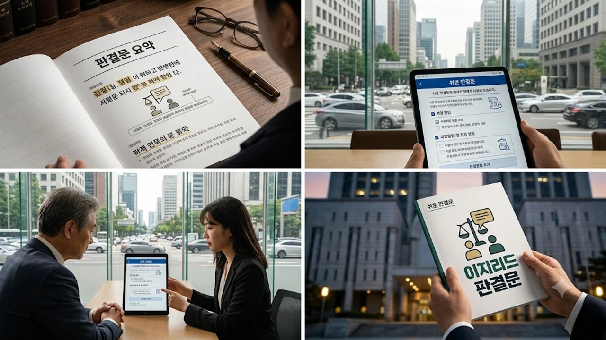

평생 법원 근처에도 가본 적 없던 사람이 어느 날 날아온 판결문 한 장을 펼쳤을 때 눈앞이 캄캄해지는 일은 흔합니다. 도대체 무슨 소리인지 알 수 없는 법률 용어와 난해한 문장 구조 때문에 **쉬운 판결문** 도입과 사법 접근성 확대 요구는 끊임없이 터져 나왔습니다. 정당하게 재판받을 권리를 지키기 위해 사법부가 내놓은 판결문 개선 제도의 실제 내용과 신청 자격을 낱낱이 파헤쳐 봅니다.

## 사법 장벽 낮추는 '쉬운 판결문' 제도의 핵심 개편 내용

### 한자어·복잡한 법률 용어의 쉬운 우리말 전환 원칙
솔직히 말해서, 일반 시민이 법원 판결문을 읽고 단번에 이해하기란 불가능에 가깝습니다. '피고는 원고에게 금원을 지급하라', '각하한다', '기각한다', '상계' 같은 단어부터 시작해 서너 줄씩 끝없이 이어지는 장문은 읽는 사람의 숨을 턱 막히게 만듭니다. 수십 년간 굳어진 법조계 특유의 권위주의적 문체를 걷어내고, 복잡한 일본식 한자어를 직관적인 일상 언어로 대체하는 것이 이번 개편의 뼈대입니다.

### 초등 수준 문장 구조와 시각 보조 자료 표준 예규 제정
핵심은 문장 구조 자체를 초등학교 고학년 수준으로 간결하게 쪼개는 작업입니다. 주어와 서술어의 거리를 대폭 좁히고 복문을 단문으로 분리해 직관적인 전달력을 확보합니다.

- **문장 분절화**: 한 문장에 사실관계와 법리적 판단을 섞지 않고 하나의 사실만 명시
- **시각화 도표 추가**: 금전 배상이나 상속 지분 등 계산이 복잡한 사안은 표와 인포그래픽으로 병기
- **핵심 결과 상단 배치**: 주문에만 짧게 두는 대신 당사자가 취해야 할 행동 요령을 요약문 형태로 제공

### 판결문 열람 및 사법 접근성 격차 해소 목적
판결 결과를 제대로 이해하지 못하면 불복 신청이나 항소 기한을 놓쳐 억울하게 권리를 날리는 사태가 발생합니다. 사법부가 이 제도를 도입한 이유는 사법 정의가 문해력 차이에 따라 불평등하게 작동하는 모순을 바로잡기 위함입니다. [사회 전체 글 보기](/posts/society/)를 통해 사법 복지 및 공공 정책의 변화 흐름을 함께 짚어볼 수 있습니다.

## 쉬운 판결문 신청 대상자 자격 및 적용 법원 범위

### 발달·지적장애인 및 고령층 등 문해력 취약계층 요건
누구에게나 무제한으로 발급되는 방식은 아닙니다. 문해력 격차로 인해 실제 소송 절차에서 심각한 불이익을 겪는 계층에게 우선 배정됩니다.

> "사법 절차의 주체인 당사자가 자신의 재판 결과를 스스로 온전히 납득할 수 있어야 헌법이 보장하는 재판받을 권리가 완성된다."

- **장애인복지법상 등록 장애인**: 발달·지적·자폐성 장애인 및 시각·청각장애인 당사자
- **기초 문해력 취약 고령층**: 복잡한 법률 서류 검토에 어려움을 겪는 만 70세 이상 고령층
- **다문화 가정 및 귀화자**: 한국어 소통 및 법률 어휘 문해력이 상대적으로 낮은 외국인 소송 당사자
- **나홀로 소송 당사자**: 변호사 선임 없이 직접 재판을 치르는 사회적 취약계층

### 민사·가사·형사 재판별 우선 시범 적용 대상
초기 시범 적용은 당사자 본인의 실생활과 직결된 사건 위주로 가동됩니다. 특히 친권, 양육권, 개명 등을 다루는 가사 소송과 임대차 보증금, 소액 대여금 분쟁 같은 민사 소액 재판에 우선 배치됩니다. 형사 재판의 경우 피고인이 발달장애인이거나 국선변호인이 조력하는 사건을 중심으로 적용 범위를 검토하고 있습니다.

### 국선대리인 연계 및 사법 지원 신청 증빙 서류
신청 과정에서 불필요한 행정 절차는 줄였습니다. 장애인등록증, 복지카드 사본, 수급자 증명서 등을 소송 제기 시 또는 재판 진행 중 제출하면 대상자로 등록됩니다. 국선대리인이 선임된 사건이라면 대리인의 직권 신청만으로도 쉬운 판결문 교부 결정이 내려집니다.

## 기존 판결문 vs 쉬운 판결문 차이점과 실효성 분석

### 기존 판결문 난해성과 취약계층 권리 침해 사례
실제로 지적장애를 가진 피고인이 판결 선고를 받고도 자기가 징역형을 받은 건지 집행유예를 받은 건지조차 이해하지 못한 채 항소 기간을 넘긴 사건들이 비일비재했습니다. 지난 대법원 판결과 관련해 형사 절차의 파급력을 짚은 [윤석열 1심 집행유예 선고, 397억 반환 진짜 가능할까?](/posts/society/yoon-first-trial-verdict-appeal-consequences-2026/) 사례처럼, 법률 문장의 불투명성은 늘 약자에게 더 가혹한 결과를 낳았습니다.

### 법적 효력 유지 여부와 원문과의 정합성 검증
당신이 모르는 진실 중 하나는 '쉬운 판결문'이 기존 원본 판결문을 완전히 없애는 대체재가 아니라는 점입니다. 법적 구속력을 갖는 정본 판결문은 그대로 보존되며, 쉬운 판결문이 공적 부속 서류로서 동일한 효력을 인정받는 구조를 취합니다.

| 비교 항목 | 기존 정본 판결문 | 쉬운 판결문(이지리드) |
| :--- | :--- | :--- |
| **언어 체계** | 고유 법률 한자어 및 복문 | 순화된 일상어 및 단문 |
| **시각 자료** | 텍스트 중심 서술 | 도표, 기호, 인포그래픽 추가 |
| **법적 효력** | 원본 정본 (100% 효력) | 원본과 동일 효력 부속 서류 |
| **주요 독자** | 법관, 변호사, 법조 실무진 | 당사자 본인 및 보호자 |

### 법조계 실무 부담 우려와 향후 보완 과제
판사 1인당 사건 처리 건수가 과도한 국내 현실에서 이중 판결문 작성이 업무 과중을 부를 것이라는 지적도 존재합니다. 한 문장마다 법적 의미가 엄밀하게 규정된 판결문을 일상어로 바꾸는 과정에서 발생할 수 있는 법리 왜곡 우려도 넘어야 할 산입니다. 이에 따라 인공지능 기반 초안 변환 시스템과 전문 검수 인력 배치가 병행되고 있습니다.

## 쉬운 판결문 실전 신청 절차와 사법 지원 활용 가이드

### 전자소송 포털 및 법원 종합민원실 신청 튜토리얼
신청 방법은 온라인과 오프라인 두 가지 경로로 나뉩니다.

- **대법원 전자소송 이용 시**: 소송 서류 제출 메뉴에서 '사법 지원 및 쉬운 판결문 신청서'를 선택한 뒤 관련 증빙 서류 첨부 후 제출
- **법원 현장 방문 시**: 관할 법원 종합민원실 사법접근성 지원 창구에 방문해 신청서 작성 및 접수

### 패소·승소 판결 후 항소 기한 내 확인해야 할 주의점
반드시 변론 종결 전, 즉 재판 절차가 완전히 끝나기 전에 미리 신청서를 제출해야 판사가 판결문 작성 단계에서 이를 반영합니다. 판결문을 송달받은 날부터 계산되는 항소 및 상고 기한(민사 14일, 형사 7일)은 쉬운 판결문을 수령하더라도 동일하게 적용되므로 날짜 계산에 각별히 유의해야 합니다.

### 대한법률구조공단 무료 지원 서비스와의 연계 방법
혼자서 서류 작성이 어렵다면 대한법률구조공단의 무료 법률 상담 창구를 거쳐 신청 대행 도움을 받을 수 있습니다. 소송을 직접 준비 중이거나 복잡한 서류 검토가 막막하다면 기본 생활 법률 가이드를 미리 훑어보는 것이 실질적인 방어권을 챙기는 첫걸음입니다.

[생활 법률 서적 및 기초 법률 가이드북 쿠팡에서 보기](https://www.coupang.com/np/search?q=%EB%B2%95%EB%A5%A0%EC%84%9C%EC%A0%81&sourceType=affiliate&trackingCode=AF8691300)

#쉬운판결문 #이지리드 #사법접근성 #법률용어순화 #나홀로소송 #사법지원제도 #항소기한확인 #대법원예규