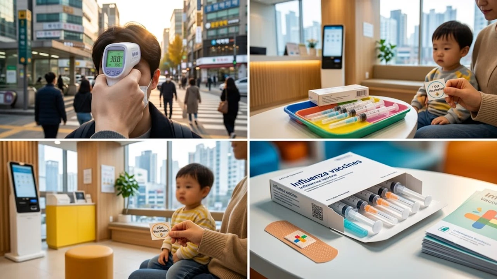

아침저녁으로 찬 바람이 불기 시작하자마자 질병관리청이 2026-2027절기 **독감 유행주의보**를 전격 발령했다. 평년보다 보름 이상 빠른 속도로 인플루엔자 의사환자 수가 유행 기준치를 넘어서며 방역 당국에도 비상이 걸렸다. 예년 생각만 하고 백신 접종을 11월로 미루다가는 고열과 근육통으로 응급실을 전전하는 최악의 사태를 맞을 수 있다.

## 예년보다 빠른 2026-2027절기 독감 유행주의보 발령 배경

### 질병관리청 발표 데이터와 유행 기준치 비교
솔직히 말하면 올가을 독감 확산 속도는 심상치 않다. 질병관리청 감염병 표본감시 결과에 따르면 외래환자 1,000명당 인플루엔자 의사환자(ILI) 분율이 기준치인 6.5명을 단숨에 돌파해 8.2명까지 치솟았다. 10월 중순 이후에나 발령되던 경보가 9월 초순에 울린 셈이다.

### 가을철 개학 및 일교차 확대에 따른 확산 추이
초·중·고등학교 2학기 개학과 맞물려 밀폐된 교실 환경이 바이러스 증폭기 역할을 했다. 10도 안팎으로 벌어지는 일교차 탓에 면역력이 급격히 떨어진 소아·청소년층을 중심으로 A형 인플루엔자 바이러스가 순식간에 번져나갔다. 단체생활 공간에서의 호흡기 비말 차단이 무너지면 유행 정점은 순식간에 찾아온다.

### 코로나19 등 호흡기 감염병과의 동시 유행 가능성
마스크 착용 의무가 완전히 사라진 첫가을이라는 점도 파급력을 키운다. 현재 의료 현장에서는 변이 코로나19와 리노바이러스, 마이코플라스마 폐렴까지 뒤섞여 나타나고 있다. 바이러스 두 종에 동시 감염되면 폐렴 같은 치명적인 합병증 발생 확률이 2배 이상 치솟기 때문에 단순 감기로 치부해서는 곤란하다. [사회 전체 글 보기](/posts/society/)에서 우리 일상을 위협하는 최신 공공 보건 이슈도 함께 점검해둘 필요가 있다.

## 2026년 독감 무료 예방접종 대상 및 일정 차이점

### 생애주기별 무료 지원 대상자 기준
당신이 모르는 진실 중 하나는 무료 접종 대상자라도 연령에 따라 오픈되는 접종 날짜가 완전히 다르다는 점이다. 국가필수예방접종(NIP) 지원 사업 대상자는 생후 6개월부터 만 13세 이하 어린이, 임신부, 그리고 만 65세 이상 고령층이다. 

- **생후 6개월~만 9세 미만(2회 접종 대상):** 가장 먼저 집중 접종 시작
- **1회 접종 대상 어린이 및 임신부:** 9월 하순부터 순차 개시
- **만 75세 이상 어작성하거나 서식을 적용할 원문 내용 또는 주제가 누락되었습니다. 어떤 내용으로 본문을 구성할지 알려주시면 요청하신 형식에 맞춰 바로 작성해 드리겠습니다.