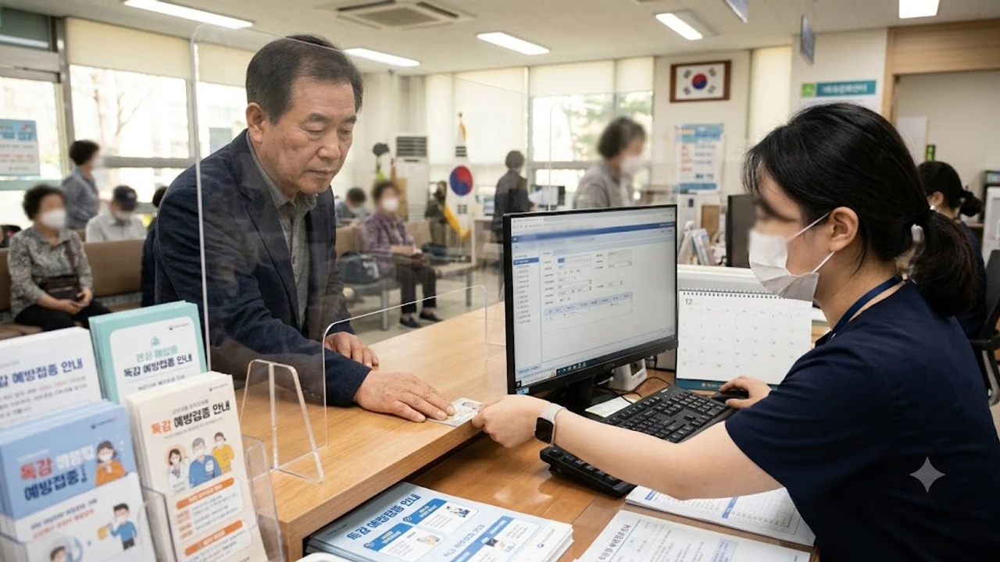

가을 환절기만 시작되면 병원마다 줄이 길게 늘어서지만 **2026 독감 예방접종**은 지원 대상 기준부터 병원별 재고 관리 방식까지 이전과 판도가 완전히 달라졌다. 인플루엔자 무료 백신 혜택을 당연히 받을 거라 믿고 방문했다가 현장에서 유료 결제 통보를 받고 발길을 돌리는 이들이 적지 않다. 매년 겪는 혼선이지만 정책 세부 지침을 제때 확인하지 않으면 헛걸음하기 십상이다.

## 2026년 독감 예방접종 무료 지원 대상 및 일정

### 연령별·대상별 무료 접종 시작일
질병관리청이 고시한 올해 국가예방접종(NIP) 사업은 혼잡을 막기 위해 연령대별 시작 시점을 철저히 쪼갰다. 생후 6개월부터 만 13세 이하 어린이, 임신부, 만 65세 이상 고령층이 핵심 무료 접종 대상이다. 고령층 내부에서도 만 75세 이상(1951년 이전 출생자)이 가장 먼저 문을 열고, 이후 70~74세, 65~69세 순으로 순차 접종을 진행한다. 날짜가 되기도 전에 동네 의원에 찾아가 백신을 요구하면 전산 등록 자체가 막혀 발길을 돌릴 수밖에 없다.

### 국가예방접종 지원 사업 변경 사항
올해부터는 위탁의료기관의 백신 실시간 재고 연동 시스템이 한층 엄격해졌다. 과거처럼 병원에 무작정 전화해 "백신 남았느냐"고 묻는 방식은 오차가 잦다. 예방접종도우미 사이트와 연동된 잔여 수량이 전산에 실시간 반영되므로, 사전 확인 없이 방문하면 백신 소진으로 헛걸음할 확률이 매우 높다. 지자체별로 취약계층(기초생활수급자, 차상위계층)에게 추가 지원하는 물량의 배정 시점도 보건소마다 상이하니 반드시 거주지 관할 보건소 공고를 대조해야 한다.

## 유료 접종과 무료 접종의 백신 종류 및 효과 비교

### 3가 백신과 4가 백신의 차이점
국가 무료 접종으로 공급되는 물량과 일반 병의원에서 3~4만 원을 받고 놔주는 유료 백신은 기본적으로 동일한 4가 백신(A형 2종, B형 2종 방어) 표준 규격을 따른다. 유료 백신이 면역원성 면에서 월등히 뛰어나다는 풍문은 사실과 거리가 멀다. 유료 백신은 생산 공정(유정란 배양 대 세포배양)과 제조사 브랜드 차이에서 오는 가격 차이일 뿐, 바이러스 방어 균주 자체는 세계보건기구(WHO) 권고를 동일하게 반영한다. 계란 알레르기가 심한 영유아나 성인이라면 유정란 방식 대신 세포배양 백신을 취급하는 병원을 골라 접종하는 편이 합리적이다.

### 국산 백신 대 수입 백신 효능 비교
국산 백신(녹십자, SK바이오사이언스 등)과 수입 백신(사노피 등) 사이에서 고민하는 이들이 여전히 많다. 임상 데이터 기준 항체 형성률은 두 군 모두 70~80% 선으로 유의미한 효능 차이를 보이지 않는다. 수입산 백신에 웃돈을 얹어 맞아야만 독감을 완벽히 피할 수 있다는 생각은 잘못된 정보다. 수입 여부보다 더 중요한 변수는 접종 시점이며, 항체 형성까지 최소 2주가 걸린다는 사실을 계산해 유행 정점 전에 맞아야 효과를 본다. 

## 올해 접종 시 반드시 알아야 할 장단점과 주의사항

### 무료 접종의 장점과 한계점
비용 부담 없이 검증된 4가 백신을 접종받을 수 있다는 점은 분명한 이점이다. 하지만 특정 시기에 수급이 몰려 조기 소진될 위험이 상존하며, 유정란 배양 방식 백신 위주로 물량이 편성되어 중증 알레르기 보유자 선택권이 좁다. 달걀 섭취 시 아나필락시스 반응을 겪은 이력자가 무료 접종을 고집하다가는 심각한 부작용 위험에 노출될 수 있으므로 전담의 상담을 선행해야 한다. 전반적인 복지 정책과 관련한 흐름은 [사회 전체 글 보기](/posts/society/)를 통해 다른 제도와 함께 비교해볼 수 있다.

> **접종 당일 주의사항**
> - 고열이나 급성 호흡기 증상이 있다면 접종을 며칠 미뤄야 한다.
> - 접종 후 바로 귀가하지 말고 병원 대기실에서 15~20분간 머물며 급성 알레르기 반응을 관찰한다.
> - 당일 격렬한 운동, 음주, 사우나는 면역 반응 형성을 방해하므로 엄격히 금한다.

### 동시 접종(코로나19 등)의 장단점
올가을에도 호흡기 감염병 동시 유행(트윈데믹) 우려 탓에 질병청은 코로나19 백신과의 동시 접종을 허용하고 있다. 왼팔에 독감, 오른팔에 코로나 백신을 맞아 한 번 방문으로 끝내는 편의성은 크다. 하지만 평소 백신 접종 후 몸살이나 발열 증상이 심했던 체질이라면 동시 접종 시 발생하는 면역 반응이 배로 겹쳐 2~3일간 일상생활에 지장을 겪을 수 있다. 면역 반응에 취약한 고령층은 며칠 간격을 두고 분산 접종하는 방법도 고려할 만하다.

## 동네 지정 병원 찾기 및 예약 실전 경험담

### 모바일 예약 앱 사용 후기
과거처럼 오전 일찍 병원 문 앞에 줄을 서는 방식은 시간 낭비다. '예방접종도우미' 사이트의 지정 의료기관 검색 메뉴를 활용하거나, 네이버 지도 및 카카오맵의 잔여 백신 실시간 현황을 연동해 조회하면 인근 내과·이비인후과의 백신 보유량을 즉각 파악할 수 있다. 접종 희망일 오전에 앱으로 재고를 확인하고 모바일 접수를 마친 뒤 내원하면 대기 시간을 10분 안팎으로 줄일 수 있다.

### 접종 당일 주의사항 및 대기 팁
점심시간 직후나 월요일 오전은 피하는 것이 상책이다. 일반 진료 환자와 접종 대기자가 뒤섞여 병원 내 감염 위험이 높아진다. 화요일에서 목요일 사이, 오후 2시 30분부터 4시 사이가 가장 한산하다. 접종 후에는 체온 조절을 위해 [체온계 및 상비 보온용품 쿠팡에서 보기](https://www.coupang.com/np/search?q=%EC%B2%B4%EC%98%A8%EA%B3%84&sourceType=affiliate&trackingCode=AF8691300) 등을 미리 구비해두고, 접종 부위 통증 완화를 위해 냉찜질 팩을 준비해두는 대비가 필요하다.

#2026독감예방접종 #독감무료대상 #인플루엔자백신 #4가백신 #예방접종일정 #질병관리청백신 #독감백신가격