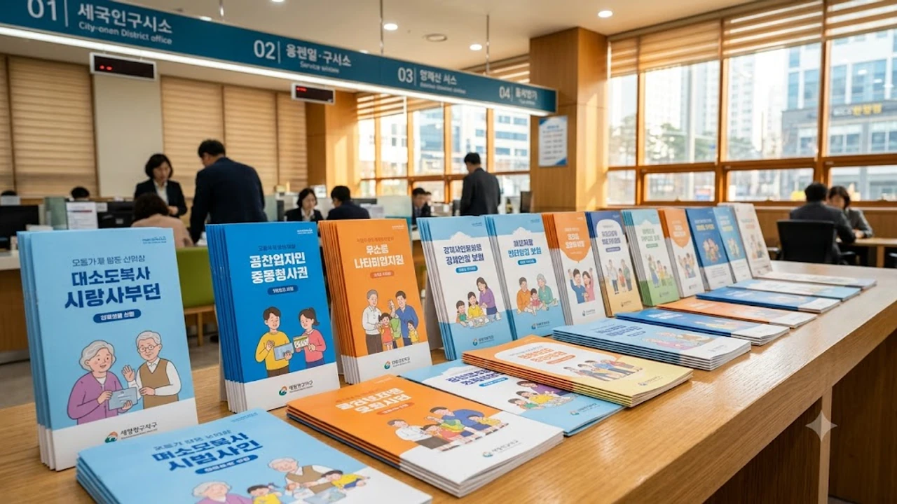

찬 바람이 불기 시작하자마자 동네 병원 접수대가 북새통을 이루는 풍경, 올해도 어김없이 펼쳐지고 있습니다. 2026년 가을을 앞두고 발표된 **2026 독감 예방접종 무료 대상** 지원 기준을 미리 꿰차지 못하면 가만히 앉아서 4만 원에 달하는 접종비를 생돈으로 날리기 십상입니다. 솔직히 말하면 매년 반복되는 국가예방접종 사업이지만 대상자별 시작 날짜와 필요 서류를 제대로 챙기지 않아 헛걸음하는 이들이 여전히 수두룩합니다.

## 2026 국가예방접종 무료 지원 핵심 대상 3가지

### 생후 6개월부터 13세 이하 어린이
어린이 지원 대상은 생후 6개월부터 만 13세(2013년 1월 1일 이후 출생자)까지 묶입니다.

- **생애 첫 접종 아동**: 과거에 백신을 맞은 적이 없거나 단 1회만 접종한 영유아는 4주 간격을 두고 2회를 채워야 몸속에 방어막이 제대로 형성됩니다.
- **이전 접종 완료 아동**: 과거 2회 이상 접종 이력을 확보했다면 이번 가을에는 1회 접종만으로 충분합니다.
- **신분 확인 지참물**: 의료기관 전산 등록 과정에서 본인 확인이 필수인 만큼 아기 수첩과 주민등록등본을 손에 쥐고 방문해야 헛걸음을 막습니다.

### 임신 주수와 무관하게 전액 지원받는 임신부
산모 본인의 호흡기 건강은 물론 갓 태어날 아기에게 항체를 물려주기 위해 임신부는 빠짐없이 지원군에 들어갑니다.

> 질병관리청 통계에 따르면 임신부가 인플루엔자에 걸렸을 때 심부전이나 폐렴 같은 중증 합병증을 겪을 확률이 일반 성인 대비 최대 4배 이상 치솟습니다.

주수와 상관없이 산모수첩, 임신확인서, 혹은 임신부 바우처 카드를 접수처에 제시하면 전국 위탁의료기관에서 4가 백신을 무상으로 맞을 수 있습니다.

### 만 65세 이상 어르신 연령대별 분산 접종
65세 이상 고령층은 면역 저하로 폐렴 같은 치명적 합병증이 닥칠 위험이 높아 전액 국비 지원을 제공합니다. 다만 한날한시에 병의원으로 인파가 쏠려 일어나는 혼잡을 막기 위해 출생연도를 쪼개 순차적으로 문을 엽니다.

- **만 75세 이상(1951년 이전 출생)**: 10월 초순 위탁의료기관에서 가장 먼저 접종 개시
- **만 70세~74세(1952년~1956년 출생)**: 10월 중순부터 바통을 이어받아 시작
- **만 65세~69세(1957년~1961년 출생)**: 10월 하순부터 시작하여 이듬해 4월 30일까지 접종 진행

## 지자체별 추가 혜택과 국가지원 사각지대

### 기초생활수급자 및 차상위계층 지자체 조례 확인
중앙정부의 기본 지원망에는 만 14세부터 64세 사이 연령층이 쏙 빠져 있습니다. 그러나 각 지자체 보건소가 자체 조례를 통해 관내 기초생활수급자, 차상위계층, 국가유공자, 중증 장애인에게 무상 접종 혜택을 주는 사례가 적지 않습니다. 거주지 관할 보건소 웹사이트 공지사항을 대조해보지 않으면 받을 수 있는 혜택을 제 발로 차버리는 셈입니다.

### 만성질환자가 자비 접종을 주저하면 안 되는 이유
당뇨, 만성 신부전, 천식 등 기저질환을 달고 사는 50대 환자는 국가지원 명단에 이름을 올리지 못합니다. 대상자가 아니라는 이유로 백신을 미루다 독감에 걸려 응급실로 실려 가면 입원비와 검사비로 수십만 원이 단숨에 깨집니다. 만성질환자라면 10월 중 병원 문을 열고 유료 백신이라도 맞아야 지갑과 건강을 동시에 건질 수 있습니다.

환절기 감염병 방역 및 공공 복지제도 전반에 관한 소식이 궁금하다면 [사회 전체 글 보기](/posts/society/)에서 확인할 수 있습니다.

## 백신 성분 차이와 접종 당일 지켜야 할 철칙

### 세포배양과 유정란 배양 백신 선별 기준
국가 무료 사업에서 보급하는 제품은 세계보건기구(WHO) 권장주를 담은 표준 4가 백신입니다. 달걀 성분에작성할 글의 **주제나 핵심 키워드**를 알려주시면, 요청하신 형식에 맞춰 front matter와 부가 설명 없이 마크다운 코드블록만으로 본문을 완성해 드리겠습니다.