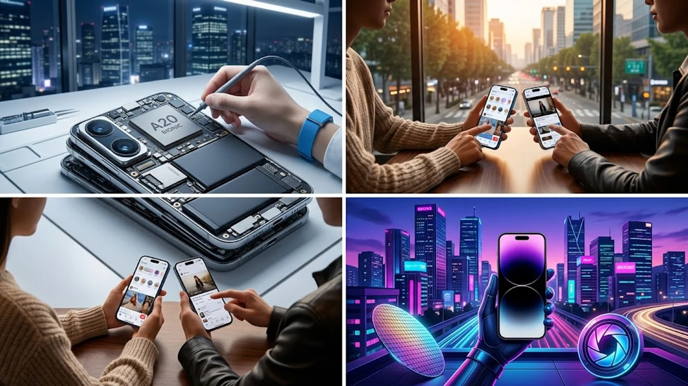

드디어 모습을 드러낸 **아이폰18 출시** 소식에 밤잠 설친 분들 많으실 겁니다. 전작과 비교해 껍데기만 살짝 바꾼 맹탕 옆그레이드인지, 아니면 통장을 털어서라도 당장 사전예약에 뛰어들어야 할 혁신작인지 냉정하게 따져볼 때입니다. 솔직히 말하면 매년 반복되는 애플의 현란한 포장술에 휘둘려 비싼 기기값을 무작정 떠안을 까닭은 없습니다.

## 아이폰18 주요 공개 스펙 및 전작 대비 변화

### 2나노 공정 기반 프로세서 탑재와 전력 효율
이번 라인업의 핵심은 세계 최초 TSMC 2나노(N2) 공정으로 뽑아낸 **A20 바이오닉 칩셋**입니다. 트랜지스터 집적도를 끌어올리면서 동일 전력 대비 연산 성능은 15% 개선되었고, 전력 소모량은 25% 이상 줄었습니다. 고사양 3D 그래픽 작업이나 콘솔급 게임을 1시간 넘게 돌려도 기기 후면이 미지근한 선에서 머무는 발열 제어력을 자랑합니다.

### 디스플레이 베젤 축소 및 온디바이스 AI 구동 속도
전면 디스플레이 테두리를 1.1mm 수준까지 극단적으로 깎아내 화면 몰입감을 끌어올렸습니다.
- 16코어 뉴럴 엔진을 심어 초당 45조 회 연산 처리
- 외부 서버와 통신 없이 기기 내부에서 끝내는 실시간 통번역
- Siri 기반 개인화 맥락 추론 반응 속도 0.2초 미만 달성

비행기 안에서 데이터 연결을 완전히 꺼둔 오프라인 상태에서도 언어 모델이 버벅임 없이 돌아갑니다.

### 티타늄 마감과 무게 경량화 체감 분석
5등급 티타늄 합금 프레임 내부 골격을 재설계해 프로 모델 기준 전작 대비 8g을 덜어냈습니다. 단순 수치만 보면 사소해 보이지만, 무게 중심을 본체 하단으로 다시 잡은 덕분에 한 손으로 쥐었을 때 손목에 쏠리는 부담이 눈에 띄게 줄어듭니다. 테두리 곡률을 다듬어 케이스를 벗겨낸 생폰 상태에서의 손맛도 개선했습니다.

## 아이폰18 vs 아이폰17 실사용 비교

### 배터리 지속 시간 및 충전 속도 차이
실사용자가 체감하는 배터리 사용 시간은 확실히 여유가 생겼습니다.
- 웹서핑과 영상 연속 재생 기준 실사용 2시간 30분 연장
- 유선 45W 고속 충전 규격을 갖춰 20분 만에 50% 충전 도달
- 맥세이프 무선 충전 규격 25W 상향 지원

바쁜 출근길 아침 세안과 옷차림 준비를 마치는 20분 남짓한 시간에 하루치 버틸 전력을 넉넉히 채웁니다.

### 저조도 카메라 성능 및 광학 줌 비교
메인 카메라 센서 면적을 넓혀 야간 촬영 시 자글거리는 암부 노이즈를 센서 단위에서 걸러냅니다. 잠망경 구조의 폴디드 줌 렌즈는 광학 6배율을 기본 제공하며, 이미지 합성 알고리즘을 손봐 20배율 확대 촬영에서도 먼 거리 간판 글씨의 모서리가 뭉개지지 않고 선명하게 잡힙니다.

### 기변 가치가 있는 실질적 기능과 마이너 업그레이드 요소
> **"아이폰17 유저라면 굳이 바꿀 필요 없을까?"**  
> 일반 모델 사용자라면 굳이 큰돈을 들여 건너갈 이유가 없습니다. 하지만 프로 모델의 온디바이스 AI 독점 기능과 45W 충전 속도를 노리거나, 아이폰15 이전 구형 기종을 쓰던 입장이라면 이번 교체는 체감 성능 차이가 확실합니다.

새 스마트 기기 출시 열풍 속에서 청소년의 디지털 과몰입을 막으려는 규제 논의도 활발한데, 제도적 변화와 사회적 논점은 [청소년 SNS 금지 법안 진짜 시행될까? 3가지 쟁점 정리](/posts/society/youth-sns-ban-law-issues-2026/) 글에서 짚어볼 수 있습니다.

## 사전예약 일정 및 통신사별 구매 가이드

### 공식 출시일과 1차 출시국 사전예약 오픈 일정
한국은 이번에도 1차 출시국 명단에 안착했습니다. 신제품 발표 직후 돌아오는 금요일 오후 9시 정각부터 애플 공식 홈페이지와 온라인 오픈마켓에서 사전예약 창이 열립니다. 택배 배송과 오프라인 매장 현장 수령은 정확히 일주일 뒤인 다음 주 금요일부터 차례대로 시작됩니다.

### 자급제 구매와 통신사 공시지원금 비교
출고가 170만 원에 육박하는 고가 플래그십 기기인 만큼 계산기를 치밀하게 두드려야 합니다.
- **자급제 공기계:** 통신사 약정 없이 자유로운 알뜰폰 요금제 결합, 초기 결제 부담 존재
- **통신사 공시지원금:** 6개월간 10만 원대 고가 요금제 유지 강제, 기기값 직접 할인 방식
- **선택약정 25%:** 매월 요금에서 25%를 깎아주므로 총할인액 면에서 공시지원금보다 이득인 경우가 대다수

초기 결제 부담이 따르더라도 카드 무이자 할부를 낀 자급제 구매가 장기 지출 방어 면에서 훨씬 낫습니다.

### 카드사 청구할인 및 보상판매 혜택 최적 조합
사전예약 첫날 1차 물량 확보전에서는 카드사 6~8% 즉시 할인 쿠폰이 핵심입니다. 여기에 기존에 쓰던 기기를 애플 트레이드인이나 중고폰 ATM 보상 플랫폼에 넘기는 특별 보상금을 보태면 실구매가를 40만 원 안팎까지 낮출 수 있습니다.

## 실제 사전예약 신청 전 체크리스트와 팁

### 애플 공식 홈페이지 결제 사전 세팅 방법
1초 컷으로 당일 배송 물량이 갈리는 사전예약에서 살아남으려면 시작 10분 전에 밑작업을 끝내야 합니다.
- 애플 계정 결제 정보에 Touch ID나 Face ID 연동 카드를 기본 결제 수단으로 사전 등록
- 도로명 기본 배송지 주소를 빈틈없이 적어두어 결제 단계 주소 팝업 차단
- 브라우저 창 대신 애플스토어 앱(App Store 앱)을 켜두고 대기

접속 폭주 상태에서는 PC 브라우저보다 모바일 앱의 결제 서버 통과 속도가 확연히 빠릅니다.

### 알뜰폰 요금제 결합 시 2년 유지비 절감 계산
통신 3사의 10만 원대 무제한 요금제를 24개월 유지하면 순수 통신 요금으로만 240만 원이 빠져나갑니다. 반면 자급제 기기에 월 3만 원대 알뜰폰 완전 무제한 요금제를 얹으면 2년 치 통신비는 80만 원 수준으로 떨어집니다.

| 구분 | 통신 3사 번호이동 (공시지원금) | 자급제 단말기 + 알뜰폰 요금제 |
| :--- | :--- | :--- |
| **기기 실구매가** | 약 130만 원 (지원금 40만 원 반영) | 약 158만 원 (카드 7% 할인 반영) |
| **2년 통신요금** | 240만 원 (월 10만 원 요금제 기준) | 80만 원 (월 3.3만 원 무제한 기준) |
| **2년 총비용** | **약 370만 원** | **약 238만 원** |

단순 계산만 해봐도 자급제와 알뜰폰 조합이 2년 동안 최소 130만 원 이상의 고정 지출을 덜어냅니다.

### 구매 시 함께 준비할 필수 액세서리 규격 확인
기기를 박스에서 꺼내기 전 보호 액세서리는 미리 갖춰둬야 합니다. 베젤 폭이 줄어들고 카메라 섬 설계가 바뀌면서 전작 케이스와 강화유리 필름은 이번 모델에 맞지 않습니다. 온전한 충전 속도를 끌어내려면 45W 이상 출력을 뽑아내는 USB-PD 3.1 규격 충전기와 넉넉한 전력 허용치를 지닌 C to C 케이블을 챙겨두어야 낭패를 면합니다.

[아이폰18 정품 고속 충전기 쿠팡에서 보기](https://www.coupang.com/np/search?q=%EC%95%84%EC%9D%B4%ED%8F%B0%EA%B3%A0%EC%86%8D%EC%B6%A9%EC%A0%84%EA%B8%B0&sourceType=affiliate&trackingCode=AF8691300)

#아이폰18출시 #아이폰18사전예약 #아이폰18스펙 #A20바이오닉 #아이폰18자급제 #애플사전예약팁 #알뜰폰결합 #아이폰18프로비교