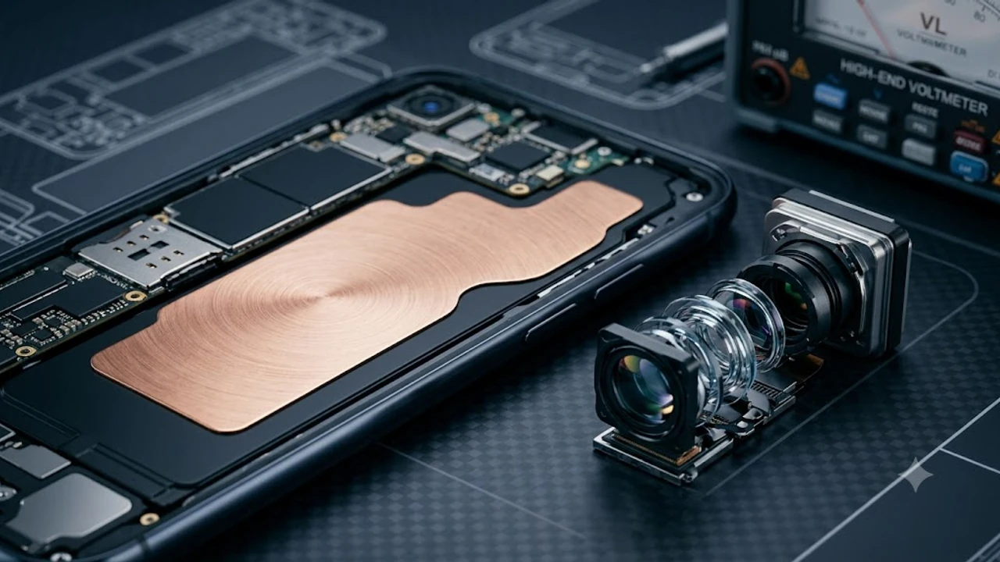

드디어 베일을 벗은 신제품을 두고 밤샘 토론이 이어지는 가운데, 구매 대기자들이 가장 촉각을 곤두세우는 대목은 단연 **아이폰18 출시일**과 체감 스펙 변화다. 혁신이 멈췄다는 냉소가 무색하게 해마다 통장이 털리는 이유는 실사용 영역에서 칼같이 파고드는 변화 폭 탓이다. 사전예약 일정부터 꼼꼼히 따져봐야 할 가격 변동 추이까지 군더더기 없이 직격한다.

## 아이폰18 공개 직후 확인된 출시일 및 사전예약 일정

### 한국 1차 출시국 확정과 사전예약 타임라인
한국 시장이 확고한 1차 출시국 지위를 굳히면서 국내 소비자도 글로벌 공개 직후 실물을 받아볼 수 있다. 공식 발표 직후 확정된 국내 사전예약은 발표 주간 금요일 자정(밤 12시)을 기점으로 일제히 문을 연다. 통신 3사와 공인 리셀러 매장 서버가 동시에 열리며 치열한 수량 쟁탈전이 벌어진다.

### 자급제 배송과 이동통신 3사 개통 시점
신청 물량 공식 수령과 번호이동 개통은 이듬주 금요일 오전 8시부터 전국 온·오프라인 유통망에서 진행된다. 자급제 기기는 출시일 새벽 배송망을 타고 문 앞까지 직배송되며, 통신사 기기변경 고객 역시 당일 아침 유심 신호를 내려 즉각 실사용에 돌입한다. 초도 물량이 넉넉지 않은 만큼 첫 타임을 놓치면 손에 쥐기까지 꼬박 한 달을 넘겨야 한다.

## 전작과 무엇이 달라졌나? 핵심 스펙 심층 비교

### 2나노 공정 기반 A20 칩셋 성능 분석
TSMC 2나노 파운드리 라인에서 찍어낸 A20 바이오닉은 전력 효율과 연산 능력을 한계치까지 밀어붙였다. 벤치마크 점수만 잔뜩 올려놓고 손바닥을 달구던 구형 기기들의 고질적 발열 문제를 뜯어고치기 위해 베이퍼 챔버 방열판을 하위 모델까지 싹 깔았다. 그래픽 자원을 극한까지 쥐어짜는 3D 렌더링이나 무거운 게임을 돌려도 프레임이 뚝뚝 끊기는 스로틀링 현상이 체감될 정도로 잡혔다.

### 카메라 센서 크기 및 가변 조리개 탑재 여부
프로 라인업 메인 카메라는 빛을 받아들이는 수광 면적을 20% 넓히고 물리 가변 조리개를 마침내 얹었다.
- 대낮 야외 촬영: 조리개 구경을 조여 주변부 왜곡과 하이라이트 뭉개짐을 완벽 차단
- 어두운 실내와 야경: 조리개를 활짝 열어 거친 노이즈를 지우고 칼 같은 디테일 확보
- 5배 광학 폴디드 줌: 손떨림 보정 모듈 반응 속도를 끌어올려 야간 줌 촬영 시에도 칼핀 유지

> "단순히 화소 수를 뻥튀기하는 마케팅 경쟁에서 벗어나, 렌즈 광학 구조와 신경망 후처리를 톱니바퀴처럼 맞물리게 짰다"는 현지 하드웨어 분석팀의 평가는 과장이 아니다.

### 배터리 효율과 디스플레이 주사율 개선점
기본형 모델까지 상시표시형 화면(AOD)과 1~120Hz 가변 주사율 기술이 마침내 안착했다. 적층형 배터리 셀 공법 덕분에 기기 무게나 두께를 키우지 않고도 실사용 시간을 2시간 남짓 벌었다. 패널 최대 밝기 역시 한낮 뙤약볕 아래서 2,500니트까지 번쩍 뿜어내며 야외 시인성 문제를 지웠다.

스마트폰 하드웨어 성능이 PC를 위협하는 수준까지 진화하면서 손안의 기기 과몰입과 디지털 통제권 이슈도 사회적 화두로 번지고 있다. 관련 법적 쟁점과 사회적 파장은 [청소년 SNS 금지 법안 진짜 시행될까? 3가지 쟁점 정리](/posts/society/youth-sns-ban-law-issues-2026/) 글에서 그 이면을 확인할 수 있다.

## 실제 구매 관점에서 본 아이폰18 장단점

### 실체화된 온디바이스 AI 기능과 디자인 변화
서버 통신 없이 폰 자체 신경망 엔진만으로 실시간 음성 통역, 사진 누끼 따기, 장문 문서 요약을 번개처럼 처리한다. 외부 클라우드로 사생활 데이터가 새어 나갈 구멍이 원천 차단된다. 모서리 곡률을 손바닥에 감기도록 미세 조정하고 티타늄 테두리를 매트한 브러시드 질감으로 깎아내 생폰으로 쥐었을 때 미끄러지는 불안감을 잡았다.

### 출고가 인상 부담과 기본 모델 급나누기 잔존
솔직히 말하면 부품 단가와 고환율을 핑계로 슬그머니 올려버린 출고가는 카드를 긁기 전 깊은 한숨을 부른다.
- 기본 용량 128GB 고수: 사실상 더 비싼 256GB 모델을 강매하는 교묘한 가격 책정
- 유선 전송 규격 차별: 기본형 모델 USB-C 단자 전송 속도는 여전히 구형 규격 묶기
- 알맹이 빠진 패키지: 환경 보호라는 명분 뒤에 숨겨진 충전기·번들 케이스 제외 정책

당신이 모르는 진실은, 폰으로 전문 영상 작업을 하지 않는 일반인이라도 PC 백업 속도에서 프로와 일반 모델의 체감 격차를 뼈저리게 느낀다는 점이다.

## 가장 빠르게 받는 아이폰18 사전예약 성공 가이드

### 오픈마켓 카드 할인 및 무이자 할부 팁
사전예약 당일 오픈마켓 서버는 0.1초 찰나에 희비가 엇갈린다. 신한, 삼성, 국민 등 메이저 카드사의 8~10% 즉각 청구 할인과 최장 24개월 무이자 혜택을 챙기려면 사전 세팅이 전부다.
- 본인인증 만료 여부 사전 점검
- 간편결제 생체인식(페이스아이디·지문) 전환
- 기본 배송지 주소록 단독 고정

### 통신사 공시지원금 vs 선택약정 요금제 혜택 비교
신규 전략 단말기는 통신사가 쥐여주는 단말 할인 지원금이 10만 원 안팎으로 매우 짜다. 월 8만 원이 넘는 무제한 요금제를 쭉 유지할 생각이라면 매달 통신 요금 25%를 깎아주는 선택약정이 총지출 계산기를 두드렸을 때 압도적으로 유리하다. 억지 부가서비스 3~4개를 몇 달간 끼워 파는 대리점 상술을 걷어내지 않으면 자급제 알뜰폰 조합보다 수십만 원을 눈먼 돈으로 바친다.

### 기존 기기 보상판매 최대 견적 노하우
공식 트레이드인이나 전문 중고 매입 플랫폼을 활용해야 체감 결제액을 깎는다. 겉면 잔기스보다 디스플레이 번인 유무와 배터리 수명 잔여치가 감가율을 가르는 핵심 칼자루다. 사전예약 직후 쏟아지는 플랫폼별 '보상금 5~10만 원 추가 얹어주기' 이벤트 주간에 기기를 반납해야 손해를 줄인다.

새 기기를 온전히 지키며 중고 방어율을 지키려면 사전예약 단계에서 핏감이 딱 떨어지는 정품 맥세이프 케이스를 미리 구비해 두는 편이 안전하다.

[아이폰18 정품 맥세이프 케이스 쿠팡에서 보기](https://www.coupang.com/np/search?q=%EC%95%84%EC%9D%B4%ED%8F%B0%20%EC%BC%80%EC%9D%B4%EC%8A%A4&sourceType=affiliate&trackingCode=AF8691300)

#아이폰18출시일 #아이폰18사전예약 #A20바이오닉 #자급제개통 #아이폰스펙비교 #가변조리개 #온디바이스AI #오픈마켓할인