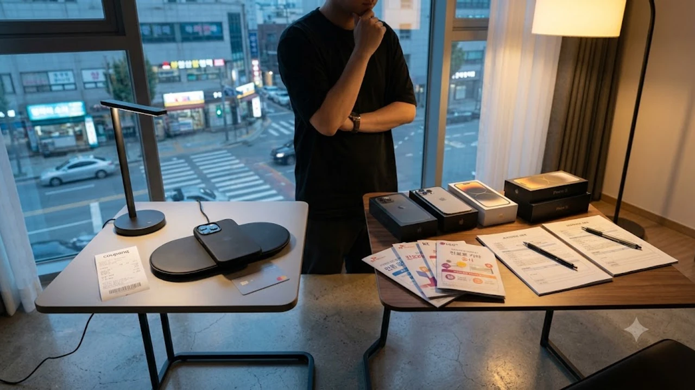

2026년 가을, 역대급 스펙으로 공개된 **아이폰18 사전예약**이 본격적으로 시작되면서 통신사 대리점과 오픈마켓의 눈치싸움이 치열합니다. 매년 반복되는 사전예약이지만, 올해는 초기 물량 수급 문제와 출고가 정책 변화가 겹쳐 셈법을 잘못 짜면 수십만 원을 허공에 날리는 꼴이 됩니다. 카드 즉시 할인율부터 요금제 결합 조건까지 실질적인 체감 혜택을 꼼꼼하게 따져봐야 손해를 막을 수 있습니다.

## 아이폰18 통신 3사 사전예약 혜택 전격 비교

### SKT·KT·LGU+ 공시지원금 vs 요금할인 실질 혜택

솔직히 말하면, 신형 아이폰을 구매하면서 공시지원금을 고르는 것은 제 돈을 다 버리는 선택입니다.

- **공시지원금 규모:** 통신 3사가 책정한 출시 초기 공시지원금은 10만 원대 고가 요금제를 선택해도 최대 15만~20만 원 선에 묶여 있습니다.
- **선택약정 25% 할인:** 월 69,000원 요금제만 써도 24개월간 총 414,000원의 통신비를 아낍니다. 월 10만 원대 요금제 사용자라면 할인액은 60만 원을 가뿐히 넘깁니다.

공시지원금에 대리점 추가지원금 15%를 끌어모아도 선택약정 요금할인의 절반 수준에도 미치지 못하므로, 무조건 **선택약정 25% 요금할인**을 골라야 이득입니다.

### 통신사별 단독 사은품 구성과 체감 할인율

통신 3사가 전면에 내세우는 화려한 사은품 패키지도 따져보면 허수가 많습니다.

- 겉으로는 수십만 원대 패키지라 홍보하지만, 정작 중고 장터에 되팔아도 제값을 받지 못하는 재고성 액세서리가 대부분입니다.
- '최대 30만 원 상당'이라는 문구 뒤에는 제휴 카드 신규 발급과 전월 실적 40만~70만 원을 꼬박꼬박 채워야 돌려받는 청구 할인과 캐시백이 섞여 있습니다.
- 월 9,900원짜리 부가서비스를 3개월 의무 유지해야 사은품을 지급하는 조건도 여전해, 실제 나가는 부가 비용만 3만 원에 달합니다.

### 약정 조건별 24개월 총 유지비 계산

단말기 할부금에 붙는 **연 5.9%의 할부 수수료**를 계산에서 빠뜨리기 쉽습니다. 170만 원짜리 단말기를 24개월 통신사 할부로 돌리면 이자만 약 10만 원 이상 더 냅니다.

> **24개월 총비용 계산 공식:**  
> (출고가 + 5.9% 할부이자) + (월 요금제 × 24개월 - 선택약정 25% 할인액) + (필수 부가서비스 유지비)

통신 3사의 고가 5G 요금제를 6개월간 강제로 쓰는 의무 조항까지 감안하면 총 지출액은 크게 늘어납니다.

## 자급제 vs 통신사 개통, 어디가 진짜 이득일까

### 쿠팡·11번가·공홈 카드 즉시 할인율 비교

온라인 커머스 자급제 물량이 오픈 직후 완판을 기록하는 이유는 단순합니다.

- **오픈마켓 카드 할인:** 쿠팡과 11번가는 특정 카드사(국민, 신한, 삼성 등) 결제 시 8~10% 즉시 할인과 함께 최대 12~22개월 무이자 할부를 붙입니다.
- **출고가 170만 원 기준:** 결제 단계에서 곧바로 13만~17만 원이 깎이고 할부 이자는 전혀 붙지 않습니다.
- **애플 공식 홈페이지:** 카드 즉시 할인은 없지만, 수령 후 14일 이내 단순 변심이라도 무조건 환불해 주는 강력한 이점이 있습니다.

초기 지출 방어와 무이자 분납이 목적이라면 카드 즉시 할인이 적용되는 오픈마켓 자급제가 훨씬 합리적입니다.

### 알뜰폰 요금제 결합 시 2년 유지비 절감 폭

진짜 통신비 부담은 기기값이 아니라 매달 계좌에서 빠져나가는 통신 요금에서 나옵니다.

- 통신 3사 무제한 요금제(선택약정 25% 적용 시 월 약 52,000원): 24개월 누적 요금 약 125만 원
- 알뜰폰 데이터 무제한 요금제(월 19,000~25,000원 선): 24개월 누적 요금 약 45만~60만 원

자급제 공기계에 알뜰폰 요금제를 얹으면 2년 동안 최소 65만 원에서 80만 원 이상의 현금을 절감합니다. 통신사가 쥐여주는 자잘한 사은품에 흔들릴 이유가 전혀 없습니다.

### 각 구매 루트별 초기 구매 비용 및 품절 속도

자급제의 유일한 걸림돌은 예약 시작과 동시에 벌어지는 초 단위 광클 전쟁입니다.

인기 색상과 256GB 기본 용량 모델은 결제 페이지 구경도 못 하고 30초 컷으로 품절됩니다. 반면 통신사 사전예약은 신청 자체는 수월하지만, 배정 순번이 뒤로 밀려 1차 발송일을 놓치면 2~3주를 꼬박 기다려야 하는 사태가 벌어집니다.

통신 정책이나 전반적인 물가 구조가 궁금하다면 [사회 전체 글 보기](/posts/society/)를 참고해 합리적인 소비 계획을 세워보는 것을 권합니다.

## 중고폰 트레이드인(보상 판매) 최대로 챙기는 법

### 애플 공식 트레이드인 vs 민팃 보상 금액 차이

기존 기기를 정리할 때 대충 처분하면 손에 쥘 수 있는 돈이 10만 원 넘게 깎여나갑니다.

- **애플 공식 트레이드인:** 찍힘이나 스크래치 등 일상적인 외관 흠집에 관대합니다. 액정이 깨지거나 메인보드가 죽은 상태가 아니라면 정해진 최대 보상가를 매겨줍니다.
- **민팃(MINTIT) ATM:** 인공지능 카메라 센서가 미세한 흠집까지 집어내 등급을 엄격하게 깎아냅니다. 단, 외관에 기스 하나 없는 S급 기기라면 애플 공식 기준가보다 더 높은 금액을 쳐줍니다.

흠집이 제법 있다면 애플 공식 보상판매로, 케이스와 필름으로 완벽히 관리한 기기라면 무인 매입기기를 이용하는 편이 유리합니다.

### 사전예약 추가 보상금(특별 보상) 적용 기준

사전예약 기간에만 한시적으로 얹어주는 '중고폰 특별 보상금'을 빠뜨려서는 안 됩니다.

- 통신사나 제휴 판매처에서 구형 모델을 반납하면 시세 매입가 외에 5만~15만 원의 추가 지원금을 더해줍니다.
- 3~4년 지난 구형 단말기나 배터리 효율이 크게 떨어진 기기일수록 추가 보상 프로그램의 가성비가 뛰어납니다.
- 다만 통신사 약정 조건이 걸린 프로그램은 기기 반납 후에도 고가 요금제를 유지해야 하는 독소 조항이 숨어 있을 수 있으니 약관을 잘 살펴야 합니다.

### 반납 전 데이터 백업 및 외관 등급 판정 팁

반납 바로 직전의 손질 하나로 매입 등급이 한 단계 올라갑니다.

- 디스플레이 강화유리를 떼어낸 뒤 알코올 스왑으로 액정 테두리의 먼지와 유분기를 깨끗이 닦아내야 센서 판정 오차를 줄입니다.
- 마이크 구멍과 충전 단자에 낀 먼지는 얇은 면봉으로 털어내야 감가 요인을 피합니다.
- 초기화 전 **아이클라우드 전체 백업**을 마치고, '나의 찾기'를 끈 다음 애플 계정을 완전히 로그아웃해야 매입 기기에서 정상 인식이 됩니다.

## 1차 수령을 위한 사전예약 성공 실전 튜토리얼

### 결제 수단 사전 등록과 간편결제 원클릭 세팅

사전예약 당일 승패는 결제창 진입 후 버튼을 누르는 3초 안쪽에 결정납니다.

- **생체 인증 고정:** 결제 인증 수단을 지문이나 페이스ID 등 생체 인증으로 단일화합니다.
- **기본 배송지 셋팅:** 배송지 목록을 하나만 남겨두고 '기본 배송지'로 고정해 주소 선택 창이 뜨는 지연 시간을 없앱니다.
- **간편결제 머니 충전:** 오픈마켓 자체 머니 잔액을 미리 채워두거나, 카드사 앱카드 결제창을 브라우저에 캐싱해 두어야 튕김 현상을 피합니다.

### 오픈 직전 서버 시계 활용 및 동시 접속 전략

스마트폰의 표준 시계와 예약 판매 사이트의 서버 시계는 1~2초가량 차이가 납니다.

- 서버 시계 확인 사이트를 띄워 두고 해당 커머스 서버 기준 59초 타이밍에 맞춰 새로고침을 누릅니다.
- 모바일 앱과 PC 웹 브라우저를 동시에 띄우되, 와이파이 연결 오류를 막기 위해 LTE/5G 데이터망 환경에서 접속하는 것이 안정적입니다.

### 구매 실패 시 취소표 노리는 시간대 및 팁

예약 오픈 5분 만에 실패 화면을 보았더라도 포기할 필요가 없습니다.

- **당일 취소표 방출:** 오픈 후 15분, 30분, 그리고 자정(00시) 전후로 카드 한도 초과나 중복 주문자들의 결제 취소 건이 시스템에 풀립니다.
- **새벽 미입금 취소분:** 오전 2시부터 4시 사이, 무통장 입금 미완료 취소분이나 단순 변심 매물이 재등록되는 타이밍을 노리면 1차 발송 순번을 낚아챌 수 있습니다.

[아이폰18 보호 케이스 및 필수 액세서리 쿠팡에서 보기](https://www.coupang.com/np/search?q=%EC%95%84%EC%9D%B4%ED%8F%B018+%EC%BC%80%EC%9D%B4%EC%8A%A4&sourceType=affiliate&trackingCode=AF8691300)

#아이폰18 #아이폰18사전예약 #아이폰사전예약혜택 #자급제알뜰폰 #아이폰자급제 #통신사지원금 #선택약정할인 #트레이드인 #아이폰18구매가이드