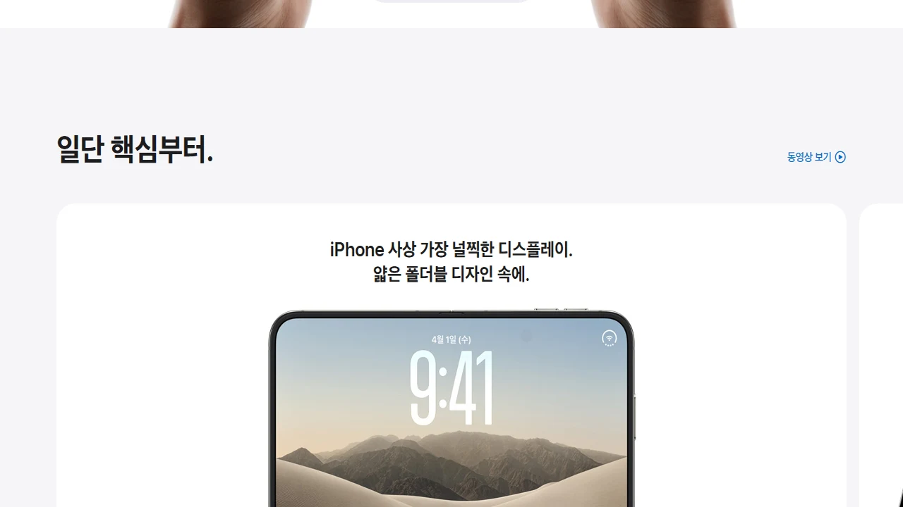
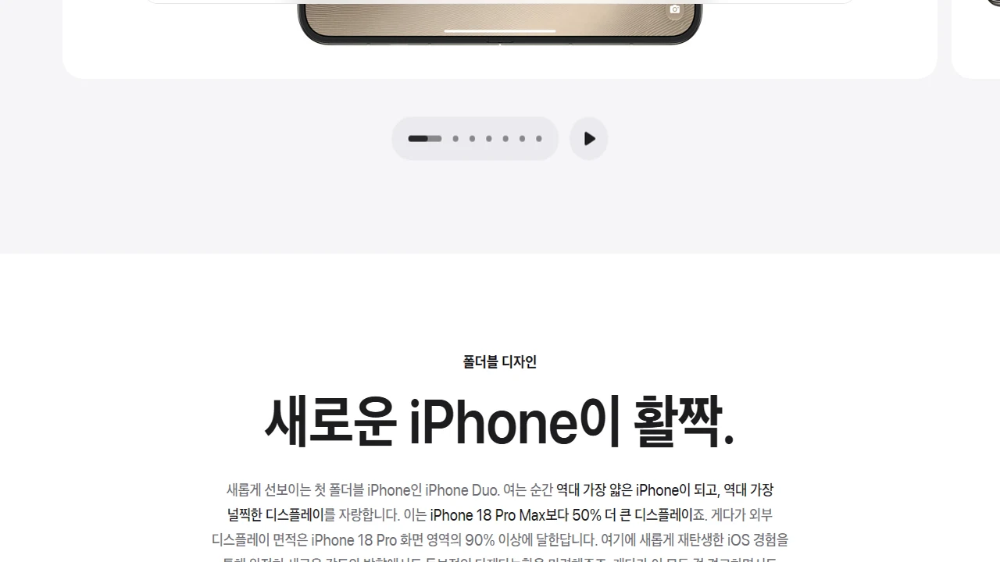

## 1. 아이폰 Duo 출시일 및 국내 사전예약 핵심 일정

> **핵심 타임라인**: 2026년 10월 16일(금) 사전예약 개시 → 10월 23일(금) 공식 출시 및 1차 수령 시작.

### 1-1. 글로벌 공개 및 국내 1차 출시국 일정 확정 (10월 16일 기준)
애플의 첫 폴더블 폼팩터 **아이폰 Duo** 사전예약 일정은 2026년 10월 16일 금요일로 확정되었습니다. 대한민국은 1차 출시국에 포함되었으며, 유통 채널별 시스템 오픈 시각은 엄격히 나뉩니다.

- **온라인 오픈마켓(쿠팡·11번가·SSG닷컴)**: 2026년 10월 16일(금) 00:00:00 전산 오픈
- **이동통신 3사(SKT·KT·LGU+)**: 2026년 10월 16일(금) 09:00:00 온라인 공식몰 및 전국 오프라인 대리점 접수 개시
- **애플 공식 홈페이지 및 애플스토어 앱**: 2026년 10월 16일(금) 21:00:00 접수 시작

공식 출시일은 일주일 뒤인 2026년 10월 23일 금요일입니다. 1차 물량 결제 완료자는 10월 23일 오전 07시부터 로켓배송 또는 퀵 배송을 통해 기기를 수령합니다. 애플스토어 명동·여의도·강남·홍대 매장 픽업 신청자는 당일 지정한 30분 단위 방문 타임슬롯에 맞춰 단말기를 받습니다.

### 1-2. 통신 3사 개통 vs 애플 공홈·자급제 접수 차이
어느 채널에서 단말기를 확보할지 사전에 확정해야 1차 배송 물량을 선점할 수 있습니다.

- **자급제(애플 공홈·오픈마켓)**:
  - 알뜰폰 LTE/5G 요금제 유지 가능 (월 고정 통신비 2~3만 원대 세팅)
  - 5~8% 신용카드 즉시 청구할인 적용
  - 통신사 부가서비스 의무 유지 조건 및 약정 위약금 전무
- **통신 3사(SKT·KT·LGU+) 가입**:
  - 공시지원금 대비 선택약정 25% 요금할인 적용 시 24개월간 총 60만~70만 원 절감
  - 제휴카드 전월 실적(30만~70만 원) 충족 시 월 1.5만~2.5만 원 추가 청구할인 연계
  - 중고폰 반납 보상 프로그램(2년 사용 후 출고가 최대 40~50% 보장 조건) 선택 가능

---

## 2. 아이폰 Duo 주요 스펙 및 하드웨어 성능

> **하드웨어 제원 요약**: 펼쳤을 때 7.8인치 내부 화면, 접었을 때 6.3인치 커버 화면, TSMC 2나노 A20 Pro 탑재, 출고가 2,190,000원(256GB)부터.

### 2-1. 폼팩터 규격: 인폴딩 디스플레이 및 티타늄 힌지 메커니즘
아이폰 Duo는 바(Bar) 형태의 그립감과 태블릿의 화면 면적을 단일 바디로 구현한 인폴딩 폼팩터입니다. 힌지 주름을 최소화한 물방울형 티타늄 힌지 부품을 장착했습니다.

- **디스플레이 사양**:
  - 커버 화면: 6.3인치 Super Retina XDR OLED (2,622 x 1,206 해상도, 460ppi, 1~120Hz ProMotion, 최대 2,500니트)
  - 내부 화면: 7.8인치 Ultra Retina 폴더블 OLED (2,488 x 2,224 해상도, 1~120Hz 가변 주사율, UTG 3세대 패널)
- **외형 치수 및 중량**:
  - 접었을 때 두께: **9.8mm** (카메라 섬 제외)
  - 펼쳤을 때 두께: **4.9mm**
  - 본체 무게: **245g** (5등급 티타늄 합금 프레임 적용으로 전작 프로 맥스 계열 대비 중량 상승폭 억제)

### 2-2. 차세대 A20 Pro 칩셋과 12GB RAM 기반 온디바이스 AI
내부 구동 성능은 대화면 분할 렌더링과 멀티태스킹을 지연 없이 처리하도록 전용 실리콘을 탑재했습니다.

- **프로세서**: TSMC 2나노 공정 기반 **A20 Pro** (6코어 CPU + 6코어 GPU + 16코어 차세대 뉴럴 엔진)
- **메모리(RAM)**: **12GB LPDDR5X** (iOS 온디바이스 애플 인텔리전스 상시 구동 목적)
- **배터리 용량**: 듀얼 셀 통합 **4,750mAh(추정)**, 유선 최대 35W 고속충전, 맥세이프 20W 무선충전
- **카메라 구성**:
  - 메인 4,800만 화소 퓨전 센서 (2세대 센서 시프트 OIS)
  - 4,800만 화소 초광각 센서 (매크로 접사 지원)
  - 4,800만 화소 5배 광학 망원 센서 (테트라프리즘 모듈)

### 2-3. 용량별 국내 출고가 명세표
아이폰 Duo는 128GB 옵션을 제외하고 256GB부터 출시합니다.

- **256GB**: 2,190,000원
- **512GB**: 2,450,000원
- **1TB**: 2,850,000원

---

## 3. 플랫폼별 사전예약 혜택 및 할인 조건 비교

> **비용 절감 핵심**: 무이자 할부와 즉시할인은 오픈마켓, 사은품과 기기값 분납은 통신사 직영몰이 유리합니다.

### 3-1. 오픈마켓(쿠팡·11번가·SSG닷컴) 자급제 즉시할인
자급제 플랫폼은 카드 결제 청구할인과 적립 혜택을 제공합니다. 무약정 기기 구매 수요가 집중되는 경로입니다.

- **카드사 즉시할인율**: 국민·신한·삼성·현대·롯데카드 결제 시 5%~8% 즉시할인 (최대 15만 원 한도)
- **무이자 할부 기간**: 150만 원 이상 결제 기준 최대 16개월~22개월 무이자 분납 지원
- **플랫폼 전용 혜택**:
  - 쿠팡: 로켓와우 회원 한정 10월 23일 오전 07시 도착 보장, 쿠페이 머니 결제 시 최대 1% 적립
  - 11번가: SK pay 결제 시 11페이 포인트 2만 점 적립, T멤버십 추가 5천 원 차감 적용
  - SSG닷컴: 신세계포인트 1만 점 적립 및 카드사 청구할인 연동

### 3-2. 이동통신 3사 개통 혜택 및 단말 케어 패키지
통신사 채널은 현금 할인 대신 전용 사은품과 단말 케어 상품 바우처를 결합해 제공합니다.

- **기본 사은품**: 정품 35W 듀얼 USB-C 전원 어댑터, 맥세이프 전용 클리어 케이스 번들 제공
- **애플케어플러스 연계**: AppleCare+ 가입 시 월 납부금의 30~50%를 12개월간 분할 지원 (단말 보험 부가서비스 결합 기준)
- **트레이드인(중고 보상)**: 아이폰 14 Pro, 15 Pro, 16 Pro 기기 반납 시 기본 중고 매입 시세 외 추가 보상금 10만~20만 원 지급

---

## 4. 1차 성공을 위한 10월 16일 사전예약 실전 행동 요령

> **결제 성공 기준**: 1차 물량은 시스템 오픈 후 40초 이내에 매진됩니다.

### 4-1. 오픈 10분 전 사전 세팅 체크리스트
단 3초의 입력 지연으로 배송일이 11월 중순으로 밀려납니다. 10월 15일 23시 50분까지 3가지 설정을 마쳐야 합니다.

1. **기본 배송지 1순위 고정**: 결제 도중 주소 입력창이 뜨지 않도록 기본 배송지를 등록하고 도로명 주소 오탈자를 점검합니다.
2. **원클릭 생체인증 결제 수단 등록**: 비밀번호 수동 입력은 탈락 원인입니다. 생체인증(Face ID, 지문) 또는 생체인증 생략 간편결제(쿠페이 원터치, 11Pay 등)를 기본 수단으로 지정합니다.
3. **카드 결제 한도 증액**: 단말기 가격이 200만 원을 넘기 때문에 한도 초과 오류가 자주 일어납니다. 카드사 앱에서 일시불/할부 이용 한도를 300만 원 이상으로 상향해 둡니다.

### 4-2. 서버 지연 대비 모바일 앱 진입과 취소표 확보 전략
접속자가 몰릴 때는 PC 웹 브라우저보다 모바일 앱의 결제 트래픽 처리가 빠릅니다.

- **통신 환경 구축**: 5G 셀룰러 데이터망에 연결된 스마트폰(앱 전용)과 유선 랜 PC 브라우저를 동시에 띄웁니다. 와이파이 핑 튐 현상을 방지하기 위해 스마트폰은 와이파이를 끕니다.
- **새로고침 타이밍**: 서버 시계(엔코초시계 기준) 59분 58초에서 59초로 넘어가는 순간 상세 페이지로 진입합니다.
- **심야 취소표 공략**: 10월 16일 00:00 결제 실패 시 중복 결제 취소 건과 한도 초과 자동 취소분이 풀리는 당일 00:40~01:10 사이, 그리고 오전 06:00 전후 새로고침으로 잔여 수량을 확보합니다.

---

## 5. 구매 가이드: 아이폰 Duo, 이런 사용자에게 적합합니다

> **선택 기준**: 245g 무게와 219만 원 이상의 출고가를 감수하고, 태블릿과 스마트폰을 단일 기기로 묶어 생산성을 끌어올릴 수 있는지가 핵심 판단 기준입니다.

### 5-1. 구매 추천 대상: 비즈니스 멀티태스커 및 프로 크리에이터
기존 6.7~6.9인치 화면 분할 환경에 물리적 제약을 느끼던 사용자에게 유효합니다.

- **주식·코인 트레이더 및 자산 관리자**: 한쪽 화면에 실시간 호가창을 띄우고, 다른 화면에서 주문창이나 텔레그램 속보를 동시에 검토하는 사용자
- **현장 도면·스프레드시트 확인 직무**: 외근 시 아이패드를 따로 꺼내지 않고 주머니에서 바로 PDF 도면, 노션, 엑셀 문서를 대화면으로 확인해야 하는 직무 종사자
- **기기 일원화 선호자**: 평소 아이패드 미니와 아이폰 프로를 동시에 휴대하며 무게 부담을 겪던 유저

### 5-2. 구매 보류 대상: 경량 휴대성 중심 유저 및 단순 소비자
아래 기준에 해당한다면 기변 만족도보다 무게와 비용에 대한 피로도가 앞섭니다.

- **200g 이하 기기 선호자**: 아이폰 Duo의 245g 무게는 손목 부담을 주므로, 기본형(170g 내외) 사용자는 적응하기 어렵습니다.
- **숏폼·영상 단순 시청층**: 릴스, 쇼츠, 유튜브 시청이 주 용도라면 16:9 또는 9:16 비율 특성상 화면 위아래 레터박스가 크게 남아 폴더블 대화면 면적을 절반밖에 쓰지 못합니다.
- **아이폰 15 Pro·16 Pro 사용자**: 웹서핑, 캐주얼 게임, 일상 사진 촬영 용도에서는 기존 프로세서 성능으로도 여유롭기 때문에 200만 원대 지출 대비 체감 효용이 낮습니다.

#아이폰Duo #아이폰Duo사전예약 #애플폴더블폰 #아이폰사전예약혜택 #자급제사전예약 #A20Pro #폴더블스마트폰