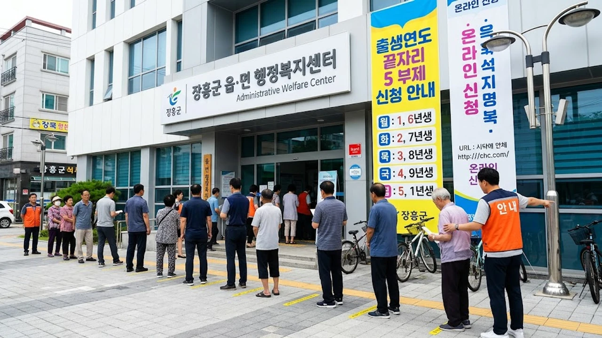

2026년 8월 31일부터 전남 장흥군에서 전 군민을 대상으로 1인당 30만 원씩 지급하는 **장흥군 지원금** 접수가 본격적으로 시작되었습니다. 고물가와 경기 침체 속에서 가계 부담을 덜어주기 위한 민생안정 정책인 만큼, 지원 대상 기준과 신청 기한을 정확히 챙겨야 놓치지 않고 혜택을 받습니다.


## 장흥군 민생지원금 30만원 지원 대상 및 자격 기준

### 1인당 30만원 지급 대상과 주민등록 기준일 요건
이번 지원금은 공고일 기준 장흥군에 주민등록상 주소를 두고 거주 중인 모든 군민에게 지급됩니다. 나이나 소득 수준과 무관하게 군민 1인당 30만 원이 일괄 지급되며, 외국인등록이 되어 있는 결혼이민자나 영주권자 역시 지급 대상에 포함됩니다. 2026년 8월 15일 24시를 기준으로 군 관내 읍·면에 정상 등재된 약 3만 5천여 명이 행정 전산망 전수조사를 거쳐 1차 수혜 대상자로 확정되었습니다.

기준```markdown
# 데이터 드리븐 검색엔진 최적화(SEO)와 AI 검색 환경의 변화: 실무 적용 가이드

디지털 마케팅 환경은 끊임없이 진화하고 있습니다. 과거에는 키워드 반복 빈도나 단순 백링크 확보만으로도 포털 사이트 상위 노출이 가능했던 시절이 있었습니다. 하지만 주요 검색 포털과 글로벌 검색 엔진의 알고리즘이 고도화되고 생성형 AI 기반의 답변 엔진이 도입되면서, 검색 최적화 전략은 근본적인 전환점을 맞이했습니다. 이제 검색 노출은 단순한 테크닉의 영역을 넘어 데이터 분석, 사용자 경험(UX), 그리고 브랜드 신뢰도가 유기적으로 맞물린 구조적 설계의 영역입니다.

본 글에서는 현업 실무자가 웹사이트 트래픽을 극대화하고 검색 결과 상위에 안정적으로 안착하기 위해 반드시 알아야 할 테크니컬 SEO, 콘텐츠 최적화, 그리고 생성형 AI 검색(GEO) 대응 방안을 단계별로 심층 분석합니다.

---

## 1. 테크니컬 SEO: 크롤러와 색인을 위한 기초 공사

아무리 훌륭한 콘텐츠를 제작하더라도 검색 로봇이 페이지를 읽어가지 못하거나 색인(Index)에 포함하지 못하면 아무런 가치가 없습니다. 테크니컬 SEO는 모든 검색 최적화의 뼈대 역할을 합니다.

### 웹사이트 구조와 크롤링 예산 최적화
* **robots.txt와 XML 사이트맵**: 검색 로봇에게 수집해야 할 경로와 수집을 차단해야 할 경로를 명확히 지정해야 합니다. 정기적으로 업데이트되는 동적 sitemap.xml을 검색 콘솔에 등록하여 신규 페이지가 빠르게 반영되도록 관리합니다.
* **표준 URL(Canonical Tag) 설정**: 동일하거나 유사한 콘텐츠가 여러 URL(예: 파라미터가 포함된 주소, 모바일/PC 분리 주소)로 서비스될 경우, 대표 URL을 지정해 중복 콘텐츠 페널티를 방지하고 링크 자산을 하나로 모아야 합니다.
* **사이트 계층 구조**: 메인 페이지에서 어떤 세부 페이지든 3~4회의 클릭 이내에 도달할 수 있도록 논리적인 내부 링크(Internal Link) 구조를 설계해야 합니다.

### 페이지 경험과 코어 웹 바이탈(Core Web Vitals)
검색 엔진은 사용자 경험을 순위 산정의 핵심 요소로 활용합니다. 로딩 성능과 시각적 안정성을 확보하는 것이 필수적입니다.
* **LCP(Largest Contentful Paint)**: 페이지에서 가장 큰 콘텐츠(주로 히어로 이미지나 메인 텍스트)가 렌더링되는 속도를 2.5초 이내로 유지해야 합니다. 차세대 이미지 포맷(WebP, AVIF) 적용, 캐싱 최적화, CDN 도입이 권장됩니다.
* **INP(Interaction to Next Paint)**: 사용자의 클릭, 탭, 키보드 입력 등에 페이지가 얼마나 기민하게 반응하는지를 측정하는 지표로, 200밀리초 이내 응답을 목표로 해야 합니다. 무거운 자바스크립트 실행을 지연시키거나 분할해야 합니다.
* **CLS(Cumulative Layout Shift)**: 페이지 로딩 중 레이아웃이 갑자기 변경되는 현상을 측정합니다. 이미지 및 동영상 요소에 항상 가로/세로 비율(width, height)을 지정하여 레이아웃 흔들림 점수를 0.1 이하로 낮춰야 합니다.

---

## 2. 콘텐츠 SEO: 검색 의도(Search Intent)의 정밀 타격

검색엔진의 자연어 처리 모델은 문장 속 단어의 표면적 일치 여부를 넘어, 사용자가 검색창에 해당 단어를 입력한 궁극적인 목적을 파악합니다.

### 4가지 핵심 검색 의도 분류
* **정보성 의도(Informational)**: 특정 주제에 대한 지식이나 해결책을 찾는 경우 (예: "GA4 이벤트 추적 방법", "크롤링 오류 해결법")
* **탐색적 의도(Navigational)**: 특정 브랜드나 사이트로 바로 이동하려는 경우 (예: "구글 서치 콘솔 로그인")
* **상업적 조사 의도(Commercial Investigation)**: 구매나 전환 이전에 비교 및 검토를 진행하는 경우 (예: "마케팅 자동화 툴 비교", "SEO 대행사 추천")
* **거래성 의도(Transactional)**: 실제 행동(구매, 등록, 문의)을 완료하려는 경우 (예: "SEO 컨설팅 신청", "온라인 마케팅 수강 등록")

콘텐츠를 기획할 때는 타깃 키워드가 어떤 의도에 속하는지 먼저 정의하고, 그 의도에 맞는 포맷(단계별 튜토리얼, 비교 표, Q&A 섹션 등)으로 본문을 구성해야 이탈률(Bounce Rate)을 낮추고 체류 시간을 늘릴 수 있습니다.

### E-E-A-T 기반의 권위성 확보
구글을 비롯한 현대 검색엔진은 E-E-A-T(경험 Experience, 전문성 Expertise, 권위성 Authoritativeness, 신뢰성 Trustworthiness)를 품질 평가의 기준으로 삼습니다.
* **실제 경험 증빙**: 이론적인 나열 대신 실제 프로젝트 데이터, A/B 테스트 결과, 실패와 개선 사례를 본문에 포함합니다.
* **작성자 프로필 명시**: 콘텐츠를 작성한 전문가의 이력, 자격, 소셜 링크를 하단에 투명하게 공개하여 콘텐츠의 신뢰도를 높입니다.
* **구조화 데이터 마크업(Schema.org)**: JSON-LD 형식을 활용하여 글쓴이(Author), 조직(Organization), FAQ, 제품(Product) 등의 정보를 기계 가독형 데이터로 추가 제공합니다.

---

## 3. 생성형 AI 검색(GEO) 시대의 대응 전략

대화형 검색 서비스와 포털의 AI 브리핑 기능이 보편화되면서, 기존의 "10개 파란색 링크" 모델에서 "AI 답변 요약 및 출처 링크 제공" 모델로 검색 트래픽 구조가 재편되고 있습니다. 이를 **GEO(Generative Engine Optimization)**라 부릅니다.

### AI가 인용하기 쉬운 콘텐츠 아키텍처
* **정의문과 핵심 결론의 전진 배치**: AI 모델은 문단 서두에 명확한 정의나 결론이 제시된 문장을 선호합니다. "A란 B를 의미하며, 이는 C 문제를 해결하기 위한 D 방식이다" 형태의 문장 구조를 섹션 첫머리에 배치합니다.
* **정형화된 데이터 제공**: AI는 복잡한 서술형 문장보다 표(Table), 번호 매기기(Ordered List), 불릿 포인트(Unordered List)로 정리된 정보를 더 정확하게 파싱하고 답변 생성 시 출처로 인용할 확률이 높습니다.
* **상호참조 및 맥락적 신뢰성**: 외부의 공신력 있는 연구 기관, 공식 문서, 저명한 통계 자료를 링크와 함께 명시하면 AI는 해당 콘텐츠를 팩트 기반의 신뢰도 높은 원천으로 평가합니다.

---

## 4. 데이터 기반 성과 분석과 지속적인 반복 개선

SEO는 한 번 배포하고 끝나는 일회성 작업이 아닙니다. 트래픽 데이터와 전환 지표를 지속적으로 모니터링하고 가설을 검증해야 합니다.

### 필수 추적 지표와 분석 도구
* **노출 수(Impressions)와 클릭률(CTR)**: 구글 서치 콘솔(Google Search Console)을 통해 순위는 높지만 클릭률이 낮은 페이지를 식별하고, 메타 타이틀(Title Tag)과 메타 디스크립션(Description)을 수정하여 카피라이팅을 최적화합니다.
* **페이지별 체류 시간과 스크롤 깊이**: 웹 로그 분석 도구를 활용해 사용자가 유입된 후 어디서 이탈하는지 파악하고, 콘텐츠의 중간 요약이나 시각 자료를 보강합니다.
* **키워드 순위 변동 추적**: 핵심 타깃 키워드의 주간/월간 순위 변화를 추적하여 알고리즘 업데이트에 따른 트래픽 손실을 사전에 감지하고 대응합니다.

---

검색엔진 최적화는 결국 "검색 로봇이 읽기 쉬운 구조" 위에 "사람이 읽고 문제를 해결할 수 있는 가치 있는 정보"를 올바르게 전달하는 과정입니다. 기술적 표준을 준수하면서 검색 사용자의 질문에 가장 완전하고 신뢰할 수 있는 답을 제공하는 웹사이트만이 지속 가능한 유기적(Organic) 성장을 달성할 수 있습니다.