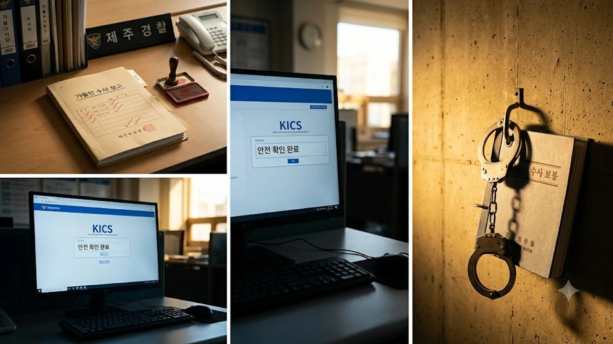

가족의 생사가 걸린 신고 전화 한 통에 국가는 과연 제 역할을 다했을까요? 2026년 8월 23일 터져 나온 **제주 실종 허위종결** 사태는 일선 수사 현장의 직무유기와 시스템 부실이 어디까지 곪아 터졌는지를 적나라하게 드러냈습니다. 피해자가 위급한 상황에 방치되는 동안, 내부 전산망에는 '안전 확인 완료'라는 거짓 기록만 번듯하게 남았습니다.

## 제주 실종사건 허위종결 파문과 체포 경위

### 장미란 씨 실종 조작 의혹에서 밝혀진 전말
사건의 시작은 단순 가출 접수가 아니었습니다. 피해자 유족들은 수차례에 걸쳐 구체적인 이동 경로와 마지막 행적 확인을 간청했습니다. 하지만 담당 수사관은 현장 확인이나 통신사 기지국 조회조차 제대로 거치지 않은 채, "대상자와 직접 통화해 이상 없음을 확인했다"는 허위 보고서를 작성해 결재를 올렸습니다. 뒤늦게 유족이 통화 내역 조회를 거듭 요구하며 진상을 파헤치자 조작된 전말이 수면 위로 드러났습니다.

### 51일 만에 숨진 채 발견된 60대 실종자 사례
이 비극은 명백히 막을 수 있었던 인재였습니다. 60대 남성 실종 신고가 접수된 직후 경찰이 거짓으로 사건을 털어버리면서 초기 골든타임은 통째로 날아갔습니다. 피해자는 결국 실종 51일 만에 싸늘한 주검으로 발견되었습니다. 초기에 기지국 반경 수색과 CCTV 확인만 신속히 진행했어도 살릴 수 있었던 목숨이었기에 공분은 걷잡을 수 없이 커졌습니다.

> "국가를 믿고 애타게 신고했는데 전산상으로 이미 끝난 사건이라니, 도대체 이게 말이 됩니까?" — 유가족 호소문 중

### 직무유기 및 공전자기록 위작 혐의 긴급체포 과정
제주경찰청 감찰계와 수사전담팀은 사안의 엄중함을 고려해 담당 경찰관 A경장을 **직무유기** 및 **공전자기록 위작·행사** 혐의로 8월 23일 전격 긴급체포했습니다. 단순한 업무 착오를 넘어 공문서를 고의로 꾸며내 수사를 강제 종결시킨 사실이 명백해졌기 때문입니다. 수사 당국은 구속영장을 신청하고 추가 은폐 정황을 집중 조사하고 있습니다.

## 경찰 수사 관리 시스템의 치명적 허점

### 통화 내역 대조 없는 단독 사건 종결 프로세스
현재 형사사법정보시스템(KICS)과 실종 관리 전산망은 담당자 1인의 양심에 전적으로 의존하는 구조입니다. 수사관이 시스템에 "본인 확인 완료"를 체크하면, 실제 통화 내역 캡처본이나 현장 대면 사진 같은 객관적인 증빙 자료를 첨부하지 않아도 손쉽게 종결 처리가 승인되는 치명적 구멍이 뚫려 있습니다.

### 다회차 신고에도 묵살된 현장 지휘·감독 부실
유족들이 2차, 3차 재신고를 넣으며 이상 징후를 알렸음에도 팀장과 과장 등 중간 관리자들은 기초적인 검증을 건너뛰었습니다. 결재 단계는 서류에 도장만 찍는 요식 행위로 전락했고, 관리자 누구도 실종자의 실제 안전 여부를 되짚지 않았습니다. 취약계층이나 위험에 노출된 시민들이 일상에서 불안을 호소하는 이유도 [2026년 안심 귀가 서비스 완전 정리](/posts/society/youth-safety-stranger-anxiety-2026/)와 같은 공적 치안 시스템의 현장 집행력이 겉돌고 있기 때문입니다.

### 실종 아동·성인 대응 매뉴얼의 구조적 차이점
현행 실종아동등의 보호 및 지원에 관한 법률은 아동, 치매환자, 지적장애인에 대해서만 강제 위치 추적 권한을 즉시 발동하도록 규정합니다. 성인 실종자는 기본적으로 단순 가출인으로 분류되어 영장 없는 위치 추적이 매우 까다롭습니다. 현장에서는 이러한 법적 공백을 핑계 삼아 성인 실종 사건을 손쉬운 '단순 종결' 대상 목록으로 치부하는 부실 관행이 만연해 있었습니다.

## 경찰청 전국 전수조사 착수와 파장

### 국가수사본부의 전국 실종 사건 점검 범위
파문이 전국으로 번지자 경찰청 국가수사본부는 전국 시·도경찰청을 상대로 최근 3년간 처리된 성인 실종 및 가출 사건 전수조사에 즉각 돌입했습니다.
- 전산망에 '본인 확인 종결'로 등록된 사건의 실제 통신 내역 일치 여부
- 장기 미제 실종 사건 중 현장 수색 일지가 조작된 의심 사례
- 고위험군 실종 접수 시 관리자 결재 라인의 교차 검증 이행 실태

### 재발 방지를 위한 이중 검증 및 전산 개편안
경찰청은 전산 시스템을 손질해 실종 사건을 매듭지을 때 '유가족 직접 확인 서명'이나 '통신사 수발신 공식 증빙' 등록을 필수 요건으로 지정하겠다고 밝혔습니다. 승인 절차 역시 일선 팀장 전결을 넘어 관할 서장 직보고 체계로 격상하는 방안이 추진되고 있습니다.

### 일선 수사관 업무 과중과 현장 책임 소재 공방
일각에서는 쏟아지는 업무량 대비 수사 인력이 턱없이 부족하다는 하소연을 내놓습니다. 그러나 사건 처리가 벅차다는 이유로 국민의 생명이 걸린 공문서를 날조한 행위는 어떤 변명으로도 덮을 수 없습니다. 인력 충원과 함께 고의적인 조작 행위에 대해서는 무관용 파면이라는 엄격한 책임을 물어야 한다는 목소리가 높습니다.

## 실종 신고 대응법과 유가족 권리 구제 절차

### 실종 발생 직후 초기 골든타임 신고 체크리스트
가족이나 지인의 연락이 두절되었을 때는 첫 단추를 어떻게 꿰느냐가 생사를 가릅니다. 단순 가출로 밀려나지 않도록 명확한 위험 징후를 수사관에게 못 박아야 합니다.
- **112 신고 즉시 접수번호 확보**: 말로만 끝내지 말고 정식 사건 접수 번호를 문자나 서면으로 받아둡니다.
- **기지국 최종 위치 및 이동 동선 특정**: 휴대전화 신호가 끊긴 마지막 기지국 위치를 확인하고 즉시 수색을 요청합니다.
- **위험 정황 증거 선제 제출**: 평소 동선 이탈, 신병 비관 메모, 다급했던 통화 기록 등 위험성을 입증할 객관적 자료를 건넵니다.

### 수사 지연·부실 처리 시 청문감사실 및 감찰 민원 절차
만약 담당 경찰이 미온적인 태도로 일관하거나 현장 조사를 미룬다면 즉각 상급 감찰 창구를 가동해야 합니다. 해당 경찰서 **청문감사인권관실**에 정식 민원을 제기하고, 시·도경찰청 감찰계에 수사관 교체 요구서를 제출해 수사 방치를 원천 차단해야 합니다.

### 직무유기 피해에 대한 국가배상 청구 요건
경찰관의 고의적인 전산 조작이나 방치로 인해 수색이 지연되어 사망 등 회복할 수 없는 피해를 입었다면, **국가배상법 제2조**에 따라 국가를 상대로 법적 배상 책임을 물을 수 있습니다. 공무원의 불법 행위를 명확히 입증하기 위해 초기 신고 접수증과 정보공개청구로 확보한 종결 보고서 사본을 확보해 두는 과정이 필수적입니다. 가족의 신변을 지키기 위해서는 신속한 제도적 대응과 함께 [위치 추적 스마트 태그 쿠팡에서 보기](https://www.coupang.com/np/search?q=%EC%83%9D%ED%95%84%ED%92%88&sourceType=affiliate&trackingCode=AF8691300) 같은 일상 속 자체 안전 예방책도 함께 챙겨두는 편이 좋습니다.

#제주실종사건 #허위종결 #경찰직무유기 #공전자기록위작 #실종수사매뉴얼 #국가배상청구 #실종골든타임 #경찰청전수조사