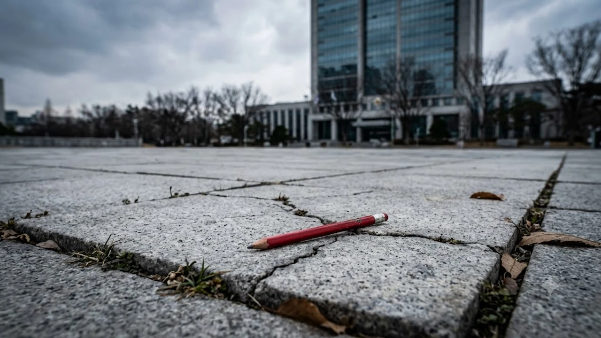

2026년 8월 21일, 교육 현장을 뒤흔든 충격적인 사태가 터졌습니다. 제주 지역 한 초등학교에서 발생한 집단 괴롭힘 피해자가 극단적 선택을 시도했음에도 공식 기록에서 감쪽같이 사라진 **제주 학폭 은폐** 사건으로 인해 교육감과 학교 관리자들이 경찰과 공수처에 전격 고발되었습니다. 아이가 생사의 갈림길에 섰는데 공문서에는 '사건 없음'으로 처리된 이 기막힌 현실 뒤에 숨겨진 실체를 짚어봅니다.

## 제주 다문화 초등생 학폭 은폐 사건 개요

### 피해 학생의 호소와 학교 측의 초기 대응 실태
솔직히 말하면 이번 사건은 예견된 참사였습니다. 다문화가정 출신 초등학생 A군은 수개월간 동급생들로부터 지속적인 언어폭력과 집단 따돌림에 시달렸습니다. 피해 학생과 학부모가 담임교사와 학교 측에 수차례 고통을 호소하고 도움을 요청했지만, 학교 측이 취한 조치는 단순 '아이들 간의 사소한 다툼'으로 치부하는 안일한 면담이 전부였습니다.

> "아이가 학교에 가기 두렵다고 울부짖을 때 학교가 한 일은 가해 학생들과 억지 악수를 시킨 것이 전부였습니다." — 피해 학부모 기자회견 발언 중

### 극단적 선택 시도 발생에도 서류에서 누락된 경위
견디다 못한 A군이 결국 극단적 선택을 시도하는 비극이 발생했습니다. 현행법상 즉시 교육지원청에 보고하고 가해·피해 학생 분리 및 학교폭력대책심의위원회(학폭위) 개최 절차를 밟아야 했습니다. 하지만 놀랍게도 관할 교육청 전산망과 교육행정정보시스템(NEIS) 어디에도 해당 사안은 등록되지 않았습니다. 사건 자체가 서류상 완전히 증발해 버린 셈입니다.

### 교육감·학교 관리자 형사고발 전개 과정
시민단체 '정치하는엄마들'과 피해자 측은 8월 21일 오전 제주도의회 도민카페에서 긴급 기자회견을 열었습니다. 이들은 김광수 제주특별자치도교육감을 비롯해 학교장, 교감, 담당 장학사 등 총 7명을 직무유기 및 직권남용권리행사방해 혐의로 제주경찰청과 고위공직자범죄수사처(공수처)에 고발장을 제출하며 엄정한 수사를 촉구했습니다.

## 학교와 교육청의 조직적 은폐 의혹 3가지 핵심 쟁점

### 법적 의무 보고 절차 무시와 허위공문서 작성 의혹
이게 말이 됩니까? 학교안전사고 및 학교폭력예방법에 따르면 중대 사안 발생 시 24시간 이내에 상급 기관 보고가 원칙입니다. 그러나 학교 측은 자체 종결 요건을 충족하지 못했음에도 상부 보고를 누락했고, 심지어 정기 실태조사 공문에는 '해당 없음'으로 허위 작성해 제출했다는 의혹을 받고 있습니다.

### 교육감 사전 인지 논란과 사후 지원 해태 혐의
피해 학부모 측은 교육청 직소 민원과 면담 신청을 통해 교육감에게 직접 사태의 심각성을 전달했다고 밝혔습니다. 그러나 교육청 수뇌부는 이를 적극적으로 조사하거나 피해 아동을 위한 긴급 심리 치료를 지원하기는커녕, 하급 기관에 책임을 떠넘기며 수수방관했다는 비판을 피하기 어렵습니다.

### '셀프 감사' 논란을 빚은 교육청 자체 조사 계획의 한계
사태가 공론화되자 교육청은 부랴부랴 내부 감사를 진행하겠다고 밝혔습니다. 하지만 관리·감독 주체인 교육청이 스스로를 조사하겠다는 전형적인 '제 식구 감싸기'식 대처에 불과합니다. 피해자 단체가 경찰과 공수처라는 외부 사정기관을 선택한 결정적인 배경이 바로 여기에 있습니다. 교육 정책과 청소년 안전망의 신뢰가 무너진 상황에서 사회적 보호 시스템에 대한 전반적인 의구심은 [청소년 SNS 금지 법안 진짜 시행될까? 3가지 쟁점 정리](/posts/society/youth-sns-ban-law-issues-2026/)와 같은 정책 논쟁과도 맞닿아 있습니다.

## 다문화가정 학생 학폭 보호 체계와 현행 제도의 맹점

### 다문화 아동 대상 언어·문화적 괴롭힘 사각지대
다문화가정 청소년들은 언어 발달이나 문화적 차이로 인해 집단 따돌림의 표적이 되기 쉽습니다. 특히 물리적 폭력뿐만 아니라 교묘한 언어폭력과 사이버 괴롭힘이 결합되는 경우가 많아 겉으로 드러나지 않는 경우가 허다합니다.

- **한국어 미숙을 빌미로 한 조롱과 집단 배제**
- **모국 문화 비하 및 혐오 표현의 일상화**
- **학부모의 학교 행정 제도 이해 부족을 악용한 가해 사실 축소**

### 가해자 분리 및 피해자 보호 조치가 작동하지 않은 원인
현행 제도는 피해자가 신청하더라도 학교장의 재량권이라는 명목 아래 즉각 분리가 지연되는 허점이 있습니다. 교내 평판 하락과 기관 평가 감점을 우려한 학교 관리자들이 사건을 덮으려 할 때, 이를 통제할 독립적인 감시 기구가 부재하다는 점이 이번 비극을 키웠습니다.

## 경찰·공수처 수사 전망과 재발 방지 대책

### 직무유기 및 직권남용 혐의 적용 가능성과 법적 쟁점
형법 제122조(직무유기)는 공무원이 정당한 이유 없이 직무수행을 거부하거나 유기한 때 성립합니다. 수사기관은 학교 관리자와 교육청 장학관들이 학폭 접수 사실을 알고도 고의로 누락했는지, 상부의 외압이나 은폐 지시가 존재했는지를 규명하는 데 수사력을 집중하고 있습니다.

### 제2의 은폐 사태를 막기 위한 긴급 보고 시스템 개선안
더 이상 학교와 교육청의 자의적인 판단에 아이들의 안전을 맡겨둘 수 없습니다. 은폐를 원천 차단하기 위해서는 학교를 거치지 않고 외부 전문기관이나 경찰청으로 직접 연동되는 '원스톱 학폭 직통 신고 시스템' 구축이 필수입니다. 또한 학교폭력 사안을 은폐·축소한 교직원에 대해 무관용 원칙을 적용해 즉각 직위 해제하는 징계 강화가 뒤따라야 합니다.

학교 밖에서도 자녀의 이동 동선과 신변 안전을 확인하기 위해 위치 확인 기능을 갖춘 기기를 찾는 학부모가 늘고 있습니다. [키즈 스마트워치 쿠팡에서 보기](https://www.coupang.com/np/search?q=%ED%82%A4%EC%68%EC%8A%A4%EB%A7%88%ED%8A%B8%EC%9B%8C%EC%B9%98&sourceType=affiliate&trackingCode=AF8691300)를 통해 실시간 보호 기능을 확인해 볼 수 있습니다.

당신이 모르는 진실은 언제나 서류 너머에 있습니다. 고통받는 아이들이 더 이상 어른들의 행정 편의주의와 침묵 속에 방치되지 않도록 철저한 수사와 제도 개혁이 이뤄져야 합니다.

#제주학폭은폐 #김광수교육감고발 #다문화학폭 #학교폭력은폐 #공수처고발 #직무유기 #학교폭력대책심의위원회 #제주초등생학폭 #교육청감사