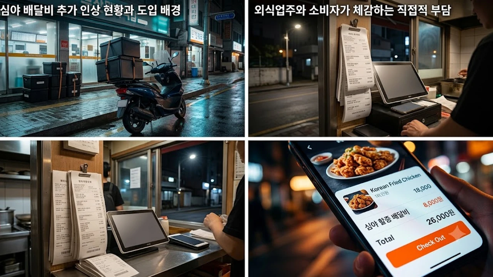

야식 한 번 시키려다 결제창에 뜬 추가 요금을 보고 손이 멈칫한 경험이 누구나 있을 것입니다. 2026년 8월 들어 주요 플랫폼들이 잇따라 **심야 배달비** 할증 체계를 손질하면서 외식 물가 전반에 거센 파장이 일고 있습니다. 기본 배달팁에 심야 추가 할증까지 더해지면서 소비자 체감 가격은 이미 임계점을 넘었다는 비판이 쏟아집니다.


## 심야 배달비 추가 인상 현황과 도입 배경

### 주요 배달 플랫폼 할증 체계 개편 내역
주요 플랫폼 3사는 밤 11시부터 익일 새벽 4시까지 적용되는 야간 배달 기본 할증을 기존 1,000원에서 건당 최대 2,500원~3,000원 선으로 올렸습니다. 여기에 기상 악화나 우천 시 적용되는 중복 할증 체계까지 겹치면서, 소비자가 지불해야 하는 최종 배달팁은 단숨에 6,000원~8,000원까지 치솟았습니다. 15,000원짜리 야식 단품을 주문했을 때 음식값의 절반 이상이 배송 비용으로 빠져나가는 셈입니다.

실제로 2026년 8월 12일 자정 무렵 서울 마포구 공덕동 일대에서 14,000원짜리 떡볶이 세트를 주문하려던 직장인 이모 씨는 최종 배달료 7,800원을 마주하고 결제창을 닫았습니다. 기본 거리 요금 3,500원에 심야 특수 할증 2,500원, 그리고 당시 발효된 우천 할증 1,800원이 덧붙은 결과였습니다. 배달 품목의 단가보다 배송비가 50%를 훌쩍 넘는 왜곡된 구조가 고착화되면서 배달 주문 건수 자체가 전월 대비 급감하기 시작했습니다.

플랫폼 업체들은 2026년 상반기 내내 누적된 적자 폭과 라이더 이탈률을 근거로 제시합니다. 수도권 외곽이나 주문 밀집도가 떨어지는 주택가의 경우 심야 시간대 콜 배차 성공률이 40%대 밑으로 떨어지는 사태가 빈번했다는 설명입니다. 이에 따라 인상 폭을 구간별로 세분화해 심야 피크 시간대(새벽 1시~3시)에 최대 가산율을 부과하는 요금제를 8월 1일 자로 전면 적용했습니다.

### 배달 플랫폼 및 라이더 협의회의 공식 입장
플랫폼 측은 야간 시간대 라이더 공급 부족을 해결하기 위한 고육지책이라고 항변합니다. 심야 노동에 따른 사고 위험성과 기피 현상을 완화하려면 합당한 수수료 보상이 뒷받침되어야 한다는 계산입니다.

> "심야 배달 기피 현상을 완화하고 안정적인 배차를 유지하려면 야간 배달 수수료 개편은 피할 수 없는 조치다."

라이더 단체 역시 야간 운행의 구조적 위험을 감안하면 정당한 대가라는 입장을 밝히고 있지만, 소비자와 자영업자들의 시선은 싸늘하기만 합니다. 전국배달라이더협회는 2026년 7월 발표한 노동환경 실태조사를 인용하며 새벽 시간대 이륜차 사고 발생률이 낮 시간대 대비 2.7배 높다는 수치를 내세웠습니다. 라이더 1인당 위험부담금이 보전되지 않으면 심야 콜을 거부하는 파행이 불가피하다는 논리입니다.

하지만 점주협의회 측은 플랫폼이 중간 수수료율 인하 같은 자구책은 외면한 채, 요금 인상 부담을 고스란히 최종 소비자와 입점 점주에게 전가하고 있다고 맞섭니다. 라이더 실수령액 증가분보다 플랫폼이 수취하는 결제 중개 수수료 증가 폭이 더 크다는 정산 내역서가 공개되면서 노사 간 공방은 격화되고 있습니다.

## 외식업주와 소비자가 체감하는 직접적 부담


### 배달 주문 취소율 증가와 자영업 매출 타격
외식업주들은 심야 매출 급감을 온몸으로 겪고 있습니다. 결제 직전 배달료를 확인한 고객의 이탈률이 치솟으면서 심야 영업 자체를 접는 매장이 속출하는 실정입니다.
- **주문 포기 급증**: 장바구니에 담았다가 최종 배달 요금을 보고 결제를 포기하는 고객 급증
- **업주 마진 잠식**: 고객 이탈을 막기 위해 가맹점주가 배달비를 자체 부담하다가 팔수록 손해를 보는 구조 형성
- **야간 영업 포기**: 전기세와 인건비 부담에 주문량마저 꺾여 심야 불을 끄는 골목 식당 속출

서울 관악구 신림동에서 6년째 족발 전문점을 운영하는 박모 씨는 2026년 8월 넷째 주 야간 주문 건수가 전년 동기 대비 42% 폭락했다고 토로했습니다. 주문 창에서 이탈하는 비율이 급격히 치솟자 매장에서 배달팁 2,000원을 대신 부담하는 할인 프로모션을 걸었으나, 남는 마진이 건당 1,000원 안팎으로 줄어들어 결국 아르바이트생을 내보내고 새벽 영업을 전면 중단했습니다.

한국외식업중앙회가 2026년 8월 20일부터 26일까지 회원사 1,200곳을 대상으로 실시한 긴급 설문조사에 따르면, 심야 영업을 지속 중인 응답자의 68.4%가 "심야 배달료 개편 이후 야간 매출 적자가 누적되고 있다"고 답했습니다. 임대료와 심야 전기 요금 인상분에 플랫폼 할증까지 겹치면서 야간 골목 상권의 생존 기반이 송두리째 흔들리는 양상입니다.

### 1인 가구 및 야간 소비자의 지출 변화
퇴근 후 늦은 시간 끼니를 때우던 1인 가구의 타격이 유독 큽니다. 최소 주문 금액을 맞추기 위해 불필요하게 사이드 메뉴를 얹던 소비 습관마저 무너지면서 야식 소비 자체가 얼어붙었습니다. 외식비 지출 방어에 나선 소비자들은 이제 배달앱을 켜는 대신 편의점 간편식이나 대형마트의 냉동 야식으로 빠르게 발길을 돌리고 있습니다. 플랫폼의 무리한 가격 인상이 전체 주문 수요를 깎아먹는 자충수가 된 셈입니다.

통계청이 발표한 2026년 2분기 가계동향조사에서 1인 가구의 음식·숙박 지출액은 전 분기 대비 4.1% 줄어들며 7분기 만에 마이너스 전환했습니다. 고물가 상황에서 고정 지출을 줄이려는 소비자들이 가장 먼저 배달 외식을 잘라낸 셈입니다. 직장인 밀집 구역인 판교의 20대 개발자 김모 씨는 매달 40만 원에 달하던 야식 배달 지출을 8월부터 0원으로 묶어두고 퇴근길 할인 편의점 도시락으로 대체했습니다.

이러한 소비 패턴 변화는 편의점 유통 데이터에서도 즉각 확인됩니다. GS25와 CU의 2026년 8월 심야 시간대(23시~04시) 냉동안주류 및 즉석조리 밀키트 매출은 전년 대비 각각 31.4%, 28.9% 급증했습니다. 비싼 배달 수수료를 물고 음식을 기다리느니 집 앞 편의점에서 전자레인지 조리 식품을 집어 들겠다는 실속형 소비자가 대거 이동한 결과입니다.

## 심야 배달비 인상에 대한 찬반 쟁점 분석

### 야간 노동 안전권 및 보상 강화 논리
찬성 측은 심야 시간대 운행에 따르는 시야 확보 문제, 피로도 누적, 교통사고 위험성을 근거로 내세웁니다. 주간보다 가혹한 조건에서 운행하는 만큼 위험 할증료가 붙는 것은 당연한 안전장치라는 주장입니다. 적절한 보상이 이뤄지지 않으면 심야 배달망 자체가 무너져 결국 서비스 이용이 불가능해진다는 점도 핵심 명분으로 꼽힙니다.

한국교통안전공단 도로교통 통계에 따르면 2025년 기준 자정 이후 발생한 이륜차 중대 재해 사고 사망률은 주간 시간대 대비 3.4배에 달했습니다. 야간 시야 제한, 불법 유턴 차량 노출, 취객 돌발 보행 등 현장 위험 요인이 상존합니다. 건당 3,000원대의 낮은 보상 체계로는 생명의 위협을 감수할 배달 노동자를 현장에 묶어둘 수 없다는 라이더 노조의 주장은 현장의 엄연한 현실을 담고 있습니다.

해외 주요 국가의 사례를 들어 야간 노동에 1.5배에서 2배의 페널티 요율을 법제화한 미국 뉴욕주나 영국 런던의 생활임금 제도를 도입해야 한다는 목소리도 이어집니다. 배달 인프라를 단순 편의 시설이 아닌 공공 필수 물류 체계로 인식한다면, 위험 야간 노동에 합당한 비용을 지불하는 사회적 합의가 먼저 정착되어야 한다는 논리입니다.

### 골목상권 위축 및 물가 연쇄 상승 우려
반대 측은 이번 인상이 골목상권의 숨통을 조이고 외식 물가 인상을 부추기는 기폭제가 된다고 꼬집습니다. 플랫폼 수수료 인상이 음식 가격 인상으로 번지고, 이는 다시 소비자 외면과 자영업 폐업이라는 악순환의 고리를 완성합니다. 사회 전반의 체감 경기와 직결되는 사안인 만큼, 최근 생활 안전망과 공공 인프라를 다룬 [2026년 안심 귀가 서비스 완전 정리](/posts/society/youth-safety-stranger-anxiety-2026/)와 마찬가지로 배달 플랫폼의 독점적 요금 체계를 제도적으로 다뤄야 한다는 목소리가 커지고 있습니다.

소비자연대 조사에 따르면 8월 한 달간 수도권 주요 배달 전문점 500곳 중 27.2%가 배달비 인상에 대응해 전 메뉴 가격을 1,000원에서 2,000원씩 올렸습니다. 배달 수수료가 메뉴 가격을 끌어올리고, 오른 메뉴 가격이 다시 최종 배달 결제액을 부풀려 전체 외식 물가 통계를 밀어 올리는 풍선효과가 발생한 셈입니다.

공정거래위원회 역시 배달 3사의 요금 인상 과정에서 담합이나 우월적 지위 남용 행위가 있었는지 현장 조사에 착수했습니다. 심야 필수 생활 서비스로 자리 잡은 배달 산업에서 시장 지배력을 남용해 일방적으로 소비자와 가맹점주에게 요금을 떠넘기는 행위는 시장 실패를 자초한다는 지적이 국회 정무위원회 국정감사 자료를 통해서도 제기되었습니다.

## 야간 배달비 부담을 줄이는 현실적인 대안

### 포장 할인 혜택 및 공공 배달앱 활용법
배달앱의 과도한 수수료를 피하려는 소비자들은 발 빠르게 대안을 찾고 있습니다.
- **방문 포장 적극 활용**: 매장 자체 픽업 할인(1,000원~3,000원)을 적용받아 배달 요금 전액 방어
- **공공 배달앱 전환**: 지자체 공공 배달앱의 지역화폐 캐시백과 저렴한 수수료 체계 활용
- **생활권 공동 주문**: 아파트 단지나 오피스텔 커뮤니티를 통한 근거리 묶음 배달 이용

지자체가 운영하는 공공 배달앱은 대안 플랫폼으로 재조명받고 있습니다. 경기도 공공배달앱 배달특급과 서울배달플러스는 2026년 8월 15일부터 9월 말까지 야간 주문 전용 15% 할인 쿠폰과 지역사랑상품권 7~10% 캐시백 결제를 묶어 제공하는 특별 방어 프로모션을 시작했습니다. 입점 가맹점 중개 수수료가 1~2%대로 민간 플랫폼(9.8~10.8%)에 비해 현저히 낮아, 업주들이 포장 할인액을 500원~1,000원 더 얹어주는 자발적 참여도 이어지고 있습니다.

대학가와 신도시 오피스텔 단지에서는 카카오톡 오픈채팅방이나 동네 생활 커뮤니티 앱을 통한 '배달 공동구매'가 정착 단계에 진입했습니다. 같은 아파트 동이나 오피스텔 라인에 사는 3~4명이 한 매장에서 음식을 묶어 주문한 뒤 로비에서 분배해 배달비를 인당 1,500원 이하로 쪼개는 방식입니다. 플랫폼이 부과하는 8,000원대 단독 배달 요금을 우회하는 생활 밀착형 방어책입니다.

### 마트 야간 픽업 및 냉동 편의식 대체 트렌드
치솟은 외식 배달료에 지친 소비자들은 에어프라이어 전용 냉동 야식과 밀키트로 방향을 틀었습니다. 마트의 심야 즉석식품 마감 할인이나 대용량 보관용 간편식을 구비해 두고 직접 조리해 먹는 방식이 가성비 대안으로 자리 잡았습니다. 불필요하게 새어나가는 배달료를 아끼고 냉동 간편식을 미리 채워두는 편이 식비 방어에 훨씬 유리합니다.

이마트와 롯데마트가 집계한 2026년 8월 냉동 육가공 안주류(막창·닭발·치킨) 매출은 전년 동월 대비 34.6% 증가했습니다. 2인분 기준 18,000원~22,000원을 호가하는 배달 야식 대신, 에어프라이어로 15분 만에 조리 가능한 7,000원~9,000원대 냉동 가정간편식(HMR)을 3~4팩씩 대량 쟁여두는 가구가 늘어난 결과입니다. 1회 주문 시 소```markdown
[날짜: 2026-09-02] [섹션: 사회] [제목: 2026 심야 배달비 인상 논란]

야식 한 번 시키려다 결제창에 뜬 추가 요금을 보고 손이 멈칫한 경험이 누구나 있을 것입니다. 2026년 8월 들어 주요 플랫폼들이 잇따라 **심야 배달비** 할증 체계를 손질하면서 외식 물가 전반에 거센 파장이 일고 있습니다. 기본 배달팁에 심야 추가 할증까지 더해지면서 소비자 체감 가격은 이미 임계점을 넘었다는 비판이 쏟아집니다.


## 심야 배달비 추가 인상 현황과 도입 배경

### 주요 배달 플랫폼 할증 체계 개편 내역
주요 플랫폼 3사는 밤 11시부터 익일 새벽 4시까지 적용되는 야간 배달 기본 할증을 기존 1,000원에서 건당 최대 2,500원~3,000원 선으로 올렸습니다. 여기에 기상 악화나 우천 시 적용되는 중복 할증 체계까지 겹치면서, 소비자가 지불해야 하는 최종 배달팁은 단숨에 6,000원~8,000원까지 치솟았습니다. 15,000원짜리 야식 단품을 주문했을 때 음식값의 절반 이상이 배송 비용으로 빠져나가는 셈입니다.

실제로 2026년 8월 17일부터 수도권 전역에 전면 적용된 A사의 신규 정산안을 확인해 보면, 심야 피크 시간대(자정~새벽 3시)에 거리당 추가 과금(500m당 600원)까지 연동되도록 알고리즘이 바뀌었습니다. 기존에는 강남구 역삼동에서 논현동 일대 1.8km 거리를 배달할 때 3,800원이던 배달팁이 이번 개편 직후 7,200원으로 89.4% 폭등했습니다. 비가 내리던 8월 29일 새벽 1시경에는 일부 단건 배달 주문 건의 최종 청구 금액이 배달료만 9,300원을 찍으며 온라인 커뮤니티를 뜨겁게 달궜습니다.

이러한 요금 폭탄은 비단 수도권 중심가에만 국한되지 않습니다. 경기 남부 신도시와 부산 서면, 대구 동성로 등 지방 핵심 상권에서도 주류 및 분식 프랜차이즈의 심야 배달료가 평균 6,500원 선으로 굳어졌습니다. 통계청이 2026년 9월 1일 발표한 8월 외식 물가 지수 세부 항목 중 '외식 부대 배송 서비스 비용 지수'는 전년 동월 대비 31.8% 급등해 관련 통계 작성 이래 역대 최고치를 기록했습니다.

### 배달 플랫폼 및 라이더 협의회의 공식 입장
플랫폼 측은 야간 시간대 라이더 공급 부족을 해결하기 위한 고육지책이라고 항변합니다. 심야 노동에 따른 사고 위험성과 기피 현상을 완화하려면 합당한 수수료 보상이 뒷받침되어야 한다는 계산입니다.

> "심야 배달 기피 현상을 완화하고 안정적인 배차를 유지하려면 야간 배달 수수료 개편은 피할 수 없는 조치다."

라이더 단체 역시 야간 운행의 구조적 위험을 감안하면 정당한 대가라는 입장을 밝히고 있지만, 소비자와 자영업자들의 시선은 싸늘하기만 합니다.

민주노총 서비스연맹 배달플랫폼노조가 2026년 7월 라이더 1,240명을 대상으로 진행한 설문조사 결과, 심야 운행 시 시야 미확보 및 취객 돌발 행동 등으로 인한 아차사고 경험률은 주간의 3.4배에 달하는 68.2%로 나타났습니다. 노조 측은 심야 기피 현상으로 인해 라이더 공급이 30% 이상 줄어드는 자정 이후 배차 지연 사태를 막으려면 최소 건당 3,000원의 위험 수당이 고정급 형태로 반영되어야 한다고 강력히 요구해 왔습니다.

플랫폼 운영사들은 심야 호출 성공률이 62%까지 곤두박질치던 상황에서 할증 조치 이후 84%까지 정상화되었다는 내부 데이터를 근거로 듭니다. 그러나 정작 늘어난 배달비 중 플랫폼 중개 수수료와 결제망 수수료가 비례 차감되면서 라이더가 실질적으로 손에 쥐는 순수익 증가분은 건당 1,200원 남짓에 불과하다는 지적도 끊이지 않고 있습니다.

## 외식업주와 소비자가 체감하는 직접적 부담


### 배달 주문 취소율 증가와 자영업 매출 타격
외식업주들은 심야 매출 급감을 온몸으로 겪고 있습니다. 결제 직전 배달료를 확인한 고객의 이탈률이 치솟으면서 심야 영업 자체를 접는 매장이 속출하는 실정입니다.
- **주문 포기 급증**: 장바구니에 담았다가 최종 배달 요금을 보고 결제를 포기하는 고객 급증
- **업주 마진 잠식**: 고객 이탈을 막기 위해 가맹점주가 배달비를 자체 부담하다가 팔수록 손해를 보는 구조 형성
- **야간 영업 포기**: 전기세와 인건비 부담에 주문량마저 꺾여 심야 불을 끄는 골목 식당 속출

서울 마포구 공덕동에서 7년째 족발집을 운영하는 김모(51)씨의 포스기 기록을 보면, 심야 할증이 확대된 8월 10일부터 31일까지의 심야 주문 건수는 일평균 28건에서 9건으로 67.8% 폭락했습니다. 고객 이탈을 막으려 점주 부담 배달 지원금을 기존 건당 1,500원에서 3,000원으로 늘렸으나, 팔면 팔수록 영업이익률이 4.2%까지 주저앉자 결국 8월 25일부터 새벽 3시 마감을 자정 마감으로 단축했습니다.

자영업자 온라인 커뮤니티에는 지난 한 달간 '심야 배달 종료 공지문' 양식을 묻는 게시글만 800건 이상 등록되었습니다. 심야 매출이 전체 매출의 40% 이상을 차지하던 피자, 치킨, 야식 전문점의 경우 매출 하락에 따른 월 고정 임대료와 야간 알바 시급(2026년 기준 주휴수당 포함 시급 13,000원 안팎)을 감당하지 못해 8월 한 달에만 수도권 배달 전문 매장 140여 곳이 폐업 절차를 밟았습니다.

### 1인 가구 및 야간 소비자의 지출 변화
퇴근 후 늦은 시간 끼니를 때우던 1인 가구의 타격이 유독 큽니다. 최소 주문 금액을 맞추기 위해 불필요하게 사이드 메뉴를 얹던 소비 습관마저 무너지면서 야식 소비 자체가 얼어붙었습니다. 외식비 지출 방어에 나선 소비자들은 이제 배달앱을 켜는 대신 편의점 간편식이나 대형마트의 냉동 야식으로 빠르게 발길을 돌리고 있습니다. 플랫폼의 무리한 가격 인상이 전체 주문 수요를 깎아먹는 자충수가 된 셈입니다.

서울 관악구 신림동의 원룸촌에 거주하는 3년 차 직장인 박모(29)씨는 주 3~4회 이용하던 심야 배달앱을 8월 중순 완전히 삭제했습니다. 14,000원짜리 떡볶이 세트에 기본 배달료 4,000원, 심야 할증 2,500원, 지역 할증 1,000원이 붙어 총 21,500원이 결제창에 찍히는 것을 본 뒤 결심한 변화입니다. 대신 퇴근길 지하철역 인근 편의점에 들러 4,000원대 냉동 간편식과 캔맥주를 구매하는 것으로 야식 방식을 변경했습니다.

실제로 국내 주요 편의점 4사의 2026년 8월 심야 시간대(23시~04시) 냉동 안주류, 컵라면, 도시락 매출은 전년 동기 대비 28.4% 상승했습니다. 특히 에어프라이어로 10분 만에 조리 가능한 냉동 닭발, 막창, 피자류의 매출 성장률은 44.1%에 달했습니다. 고물가 속에서 주머니 사정이 팍팍해진 2030 세대 1인 가구가 배달앱 결제를 가장 먼저 줄여야 할 지출 1순위로 꼽으면서 소비 생태계의 판도가 재편되고 있습니다.

## 심야 배달비 인상에 대한 찬반 쟁점 분석

### 야간 노동 안전권 및 보상 강화 논리
찬성 측은 심야 시간대 운행에 따르는 시야 확보 문제, 피로도 누적, 교통사고 위험성을 근거로 내세웁니다. 주간보다 가혹한 조건에서 운행하는 만큼 위험 할증료가 붙는 것은 당연한 안전장치라는 주장입니다. 적절한 보상이 이뤄지지 않으면 심야 배달망 자체가 무너져 결국 서비스 이용이 불가능해진다는 점도 핵심 명분으로 꼽힙니다.

도로교통공단이 2026년 상반기에 집계한 이륜차 사고 통계에 따르면, 심야 시간대(22시~06시) 발생한 사고의 치사율은 주간 대비 2.6배 높았습니다. 어두운 골목길 노면 파손, 불법 주정차 차량으로 인한 사각지대, 야간 음주 운전 차량과의 충돌 위험 등 배달 노동자가 마주하는 위험 요소가 물리적으로 증폭되기 때문입니다.

노동 경제학계 연구진 역시 필수 플랫폼 노동자의 건강권과 휴식권을 보장하기 위해서는 야간 노동에 대한 50% 이상의 경제적 보상 가산이 제도화되어야 한다고 분석합니다. 야간 할증이 원천 차단될 경우 라이더의 심야 이탈이 가속화되어 배차 대기 시간이 90분 이상으로 늘어나고, 이는 배달 품질 저하로 이어져 장기적으로는 플랫폼 생태계 자체가 붕괴한다는 논리입니다.

### 골목상권 위축 및 물가 연쇄 상승 우려
반대 측은 이번 인상이 골목상권의 숨통을 조이고 외식 물가 인상을 부추기는 기폭제가 된다고 꼬집습니다. 플랫폼 수수료 인상이 음식 가격 인상으로 번지고, 이는 다시 소비자 외면과 자영업 폐업이라는 악순환의 고리를 완성합니다. 사회 전반의 체감 경기와 직결되는 사안인 만큼, 최근 생활 안전망과 공공 인프라를 다룬 [2026년 안심 귀가 서비스 완전 정리](/posts/society/youth-safety-stranger-anxiety-2026/)와 마찬가지로 배달 플랫폼의 독점적 요금 체계를 제도적으로 다뤄야 한다는 목소리가 커지고 있습니다.

한국소비자단체협의회가 2026년 8월 20일 발표한 배달 수수료 모니터링 보고서에 따르면, 심야 배달비가 2,000원 이상 오르자 조사 대상 가맹점의 41.3%가 배달 메뉴 단가를 500원에서 1,500원가량 인상한 것으로 나타났습니다. 배달비 상승이 제품 가격 상승을 촉발하고, 매장을 직접 찾는 오프라인 소비자에게까지 비용 부담이 전가되는 '도미노 물가 인상'이 확인된 셈입니다.

공정거래위원회 역시 3대 배달 플랫폼이 비슷한 시기에 약속이라도 한 듯 심야 할증 요금제를 개편한 과정에서 담합이나 우월적 지위 남용 행위가 있었는지 여부를 놓고 현장 조사에 착수했습니다. 전기·가스 등 공공요금 인상에 이어 생활 밀착형 플랫폼 비용까지 통제를 벗어나면서, 서민 경제의 마지막 보루인 골목상권의 자생력을 보호할 법적 상한제 도입 논의가 국회 환경노동위원회와 정무위원회에서 본격화되고 있습니다.

## 야간 배달비 부담을 줄이는 현실적인 대안

### 포장 할인 혜택 및 공공 배달앱 활용법
배달앱의 과도한 수수료를 피하려는 소비자들은 발 빠르게 대안을 찾고 있습니다.
- **방문 포장 적극 활용**: 매장 자체 픽업 할인(1,000원~3,000원)을 적용받아 배달 요금 전액 방어
- **공공 배달앱 전환**: 지자체 공공 배달앱의 지역화폐 캐시백과 저렴한 수수료 체계 활용
- **생활권 공동 주문**: 아파트 단지나 오피스텔 커뮤니티를 통한 근거리 묶음 배달 이용

지자체가 운영하는 '배달특급', '땡겨요', '대구로' 등 공공 배달앱은 8월 한 달간 신규 가입자 수가 7월 대비 평균 156% 증가했습니다. 공공앱은 입점 수수료율이 1~2%대로 민간 플랫폼(9.8~10.8%)보다 현저히 낮아 자영업자들이 자체적으로 2,000원~4,000원 수준의 심야 전용 할인 쿠폰을 발행하는 사례가 늘고 있습니다. 지역사랑상품권을 연동할 경우 7~10%의 선할인 또는 캐시백까지 중복 적용되어 실질 지출을 30% 이상 낮출 수 있습니다.

소비자들의 주문 방식도 전화 주문 후 직접 매장을 방문하는 '레트로 픽업'으로 전환되는 추세입니다. 네이버 지도나 카카오맵의 매장 전화 버튼을 눌러 직접 포장 주문을 넣으면, 배달팁 7,000원을 아끼는 것은 물론 포장 할인 2,000원까지 더해져 총 9,000원의 비용 절감 효과를 거둡니다. 왕복 15분 도보 이동으로 야식 한 그릇 값의 40%를 방어하는 셈입니다.

### 마트 야간 픽업 및 냉동 편의식 대체 트렌드
치솟은 외식 배달료에 지친 소비자들은 에어프라이어 전용 냉동 야식과 밀키트로 방향을 틀었습니다. 마트의 심야 즉석식품 마감 할인이나 대용량 보관용 간편식을 구비해 두고 직접 조리해 먹는 방식이 가성비 대안으로 자리 잡았습니다. 불필요하게 새어나가는 배달료를 아끼고 냉동 간편식을 미리 채워두는 편이 식비 방어에 훨씬 유리합니다.

이마트와 롯데마트 등 대형 할인점의 2026년 8월 21시 이후 즉석조리 코너(델리) 마감 세일 매출은 전년 동월 대비 37.2% 증가했습니다. 정가 15,900원이던 순살치킨 한 팩이 마감 시간대에는 9,900원까지 할인 판매되면서 퇴근길 직장인들이 줄을 서서 집어가는 진풍경이 연출되고 있습니다. 

온라인 장보기를 통해 대용량 냉동 가공육(닭꼬치, 버펄로 윙, 곱창전골 등)을 쟁여두는 가구도 급격히 늘었습니다. 배달 1회당 지출되는 30,000원(음식값 23,000원 + 배달팁 7,000원)이면 냉동 안주류 4~5팩을 구비할 수 있어 1회 야식 단가를 6,000원 안팎으로 억제할 수 있기 때문입니다. 

[냉동야식 쿠팡에서 보기](https://www.coupang.com/np/search?q=%EB%83%89%EB%8F%99%EC%95%BC%EC%8B%9D&sourceType=affiliate&trackingCode=AF8691300)

#심야배달비 #배달비인상 #배달팁할증 #자영업배달료 #야식배달 #외식물가 #배달앱수수료 #공공배달앱 #포장할인 #알뜰소비