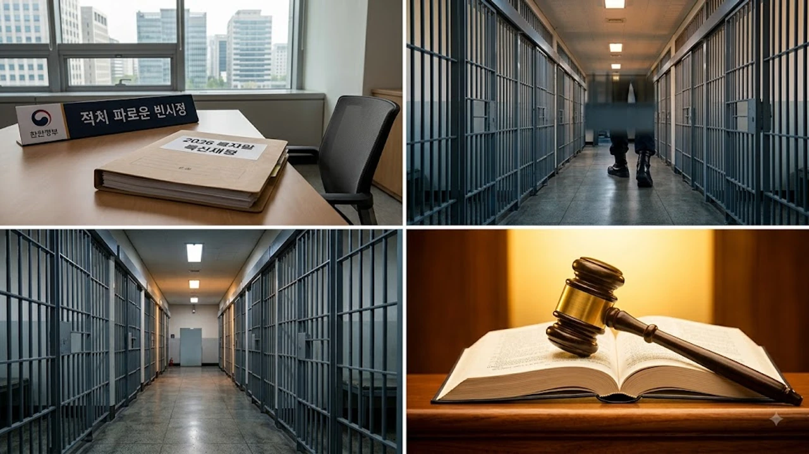

해마다 8월 15일만 되면 정치인과 대기업 총수의 이름을 줄줄이 읊어대던 특별사면 명단이 올해는 깨끗이 사라졌습니다. 법무부가 유력 인사 사면을 전면 배제한 채 수용시설 포화 상태를 풀기 위한 일반 모범수 위주의 **광복절 가석방** 카드를 꺼내 들면서 사회적 논쟁이 거세졌습니다. 당신이 모르는 진실은, 이번 결정이 단순한 온정주의 정책이 아니라 터지기 직전인 교정 현장의 숨통을 틔우기 위한 고육지책이라는 점입니다.

## 2026년 광복절 특사 전면 실종의 배경

### 사면심사위원회 미개최와 원칙주의 기조
솔직히 말하면, 선거철마다 되풀이되던 '화합' 명분의 줄사면은 사법 체계에 대한 냉소만 키웠습니다. 이번에는 심사 테이블 자체를 차리지 않으면서 정치권의 사면 청탁 창구가 원천 차단되었습니다. 형벌 집행의 공정성을 지키겠다는 정책적 결단이 반영된 결과입니다.

### 정재계 유력 인사 배제에 쏠린 시선
대기업 총수나 유력 정치인의 조기 복권 기대감은 보기 좋게 빗나갔습니다. 헌정 질서와 관련된 굵직한 사법 판단이 이어지는 와중에 유력자 면죄부 남발은 여론의 즉각적인 반발을 부릅니다. 실제로 [윤석열 1심 집행유예 선고, 397억 반환 진짜 가능할까?](/posts/society/yoon-first-trial-verdict-appeal-consequences-2026/)와 같은 사법 이슈들이 대중의 날 선 감시를 받는 상황에서, 정치적 사면 강행은 자충수에 불과했습니다.

### 특사와 가석방의 본질적 법적 차이
두 제도를 혼동하는 사람이 적지 않지만 적용 원리는 판이합니다. 특별사면은 형 선고의 효력을 없애거나 집행을 면제하는 대통령의 고유 권한입니다. 반면 가석방은 정해진 복역률을 채운 수형자를 조건부로 풀어주는 법무부 행정처분으로, 잔여 형기 동안 강력한 보호관찰을 감수해야 합니다.

## 한계에 부딪힌 교정시설 과밀화 실태

### 수용정원 120% 초과가 불러온 교정 붕괴
전국 교도소와 구치소의 평균 수용률은 정원의 120% 선을 진작에 넘어섰습니다. 5~6인용 거실에 8~9명이 칼잠을 자야 하는 비좁은 공간 속에서 재소자 간 폭력과 인권 침해 소송이 끊이지 않고 있습니다.

> "교정시설의 물리적 수용 한계 초과는 단순한 불편을 넘어 재범 방지 교육 자체를 마비시키는 구조적 재난이다."

### 현장 교도관의 업무 과중과 보안 공백
수용 인원은 불어나는데 관리 인력은 턱없이 부족합니다. 교도관 1명이 감당해야 할 수형자 수가 한계치를 넘어서며 야간 순찰과 계호 업무에 치명적인 공백이 생겼습니다. 교도관 개인의 소진 문제를 넘어 시설 내 안전사고로 번지는 뇌관입니다.

### 국가배상 청구 소송 증가와 재정적 압박
과밀 수용으로 인한 헌법소원과 손해배상 청구가 잇따르고 있습니다. 법원이 수용 거실 면적 부족에 따른 국가 책임을 인정하는 판결을 연속해서 내놓으면서, 정부로서는 수용 밀도를 즉각 낮추지 않고는 막대한 배상금 판결을 감당하기 힘든 처지입니다.

## 모범수 조기 사회복귀 확대의 핵심 기준

### 엄격해진 복역률 심사 지표
가석방 문턱을 낮춘다고 해서 아무나 문을 나서는 것은 아닙니다. 형법상 형기의 3분의 1을 채우면 심사 요건이 되지만, 실무상으로는 70~80% 이상을 채우고 징벌 없이 기능자격을 취득한 모범 수형자 위주로 걸러냅니다.

- 초범 및 과실범 중심의 대상자 압축
- 징역형 복역 기간 중 무사고·성실 노역 기록 확인
- 재범 위험성 평가(KORAS) 저위험군 한정 선발

### 고위험 강력범죄자의 완전 차단
이게 말이 되냐는 식의 불안을 잠재우기 위해 강력범죄 통제선은 한층 견고해졌습니다. 살인, 강도, 성범죄, 상습 음주운전, 조직폭력 사범은 가석방 확대 기조 속에서도 철저히 배제됩니다. 법무부는 재범 위험성이 조금이라도 포착되는 강력 사범을 조기 석방 검토 대상에서 원천 차단하고 있습니다.

### 전자감독과 보호관찰관 밀착 동행
형기를 채우기 전 풀려난 가석방자는 남은 기간 보호관찰관의 1대1 통제를 받습니다. 외출 제한이나 음주 금지 같은 준수사항을 어기는 즉시 가석방 처분이 취소되고 교도소로 재수감되므로, 만기 출소자보다 더 엄격한 관리망에 묶입니다.

## 가석방 확대가 던진 사회적 질문과 보완책

### 피해자 보호와 사회 안전망의 충돌
가장 예민한 지점은 범죄 피해자의 회복과 법적 정의입니다. 가해자가 조기에 거리를 활보한다는 사실 자체로 피해자는 극심한 공포를 느낍니다. 형량 감경이라는 오해를 사지 않으려면 출소 통보 시스템과 피해자 접근 금지 등 실효성 있는 격리 조치가 뒤따라야 합니다.

### 실질적 교화 프로그램의 민낯
교도소 문을 일찍 열어주는 것만으로는 재범의 고리를 끊어낼 수 없습니다. 기술 교육과 심리 치료, 안정적인 일자리 연계가 빠진 조기 석방은 범죄의 재수감 회전문만 돌릴 뿐입니다. 교정 본연의 기능을 살려내는 재활 인프라 구축이 선행되어야 합니다.

### 사법 형평성에 대한 국민적 신뢰 회복
권력자 중심의 특사 관행을 깬 것은 바람직하지만, 일반 수형자 가석방 역시 명확한 원칙 아래서 움직여야 합니다. 밀실 심사를 걷어내고 심사 기준과 사후 관리 지표를 투명하게 공개해야만 '사법 시스템이 공정하게 작동한다'는 사회적 신뢰를 지켜낼 수 있습니다.

#광복절가석방 #2026광복절특사 #사면심사위원회 #교정시설과밀화 #모범수가석방 #법무부가석방기준 #보호관찰제도 #형벌집행