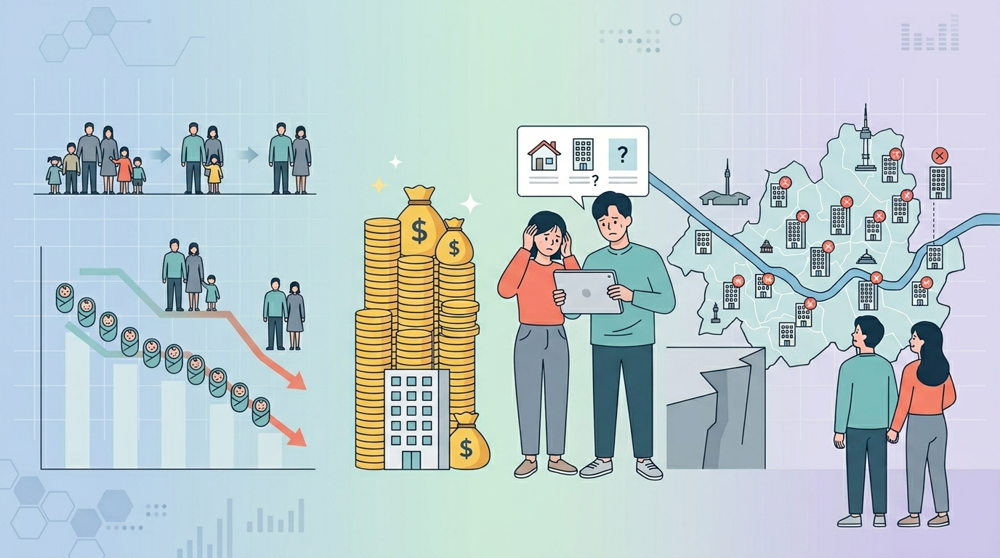

대한민국에서 결혼과 출산을 기피하는 가장 큰 원인으로 주거비 부담이 해마다 손꼽힙니다. 소득 상승률에 비해 턱없이 높은 집값은 청년 세대에게 가정을 꾸릴 엄두조차 내지 못하게 만드는 거대한 장벽이 되었습니다. 정부가 잇따라 저출생 극복 주거 지원 정책을 쏟아내고 있지만, 현장의 청년들은 왜 여전히 냉소적인 걸까요?

## 주거비 부담이 출산율에 미치는 영향

정부는 대출 규제 완화와 주거 공급 확대를 아우르는 저출생 극복 주거 지원 정책을 연이어 발표했습니다. 신생아 특례대출부터 청년 주택드림 청약통장까지 여러 지원책이 시장에 나왔지만, 이것이 실제로 출산율을 끌어올리는 마중물 역할을 하는지 살펴볼 필요가 있습니다.

### 소득 기준과 대출 문턱의 엇박자

많은 청년이 주거 지원 정책의 취지에는 공감하면서도 까다로운 지원 조건에 좌절감을 토로합니다. 특히 맞벌이 부부는 합산 소득 기준을 조금만 초과해도 혜택 대상에서 제외되는 사각지대에 빠집니다. 열심히 일해서 소득이 늘어날수록 오히려 정부 지원에서 멀어지는 아이러니가 반복됩니다.

### 수도권 집값을 반영하지 못한 한도

정책 대출이 지원하는 주택 가격 기준과 대출 한도가 서울·수도권의 실제 매매가와 괴리가 큽니다. 청년들이 선호하는 직주근접 지역 아파트 가격은 이미 정책 기준을 한참 상회해, 결국 외곽으로 밀려나거나 대출을 포기해야 하는 구조적 한계가 존재합니다.

## 신생아 특례대출과 청년 주택드림 통장 실제 체감

최근 시행된 주거 지원 정책 중 가장 주목받는 카드는 신생아 특례대출과 청년 주택드림 청약통장입니다. 기존 정책보다 금리 우대 폭을 넓히고 가입 대상을 확대한 것이 특징으로, 자산 형성기 청년들에게 실질적인 내 집 마련 기회를 제공하겠다는 목표를 내세웁니다.

### 저금리가 주는 이자 절감 효과

신생아 특례대출의 가장 큰 장점은 시중은행에서 보기 힘든 1\~2%대 저금리입니다. 연간 수백만 원에 달하는 이자를 아낄 수 있어 영끌로 전락할 위험을 낮춰 줍니다. 청년 주택드림 통장도 청약 당첨 시 분양가의 80%까지 저리 연계 대출을 제공해 초기 자본이 부족한 세대에게 발판이 됩니다.

### 아이를 낳아야만 열리는 혜택의 모순

가장 큰 맹점은 순서가 뒤바뀌었다는 지적입니다. 집이 있어야 안정감을 느끼고 결혼·출산을 결심하는데, 현행 정책은 먼저 아이를 낳아야 파격 대출을 해주는 구조입니다. 출산 유인책이라지만, 청년 세대에게는 선후 관계가 맞지 않는 부담스러운 제안으로 다가옵니다.

## 청년들이 말하는 주거 정책의 한계

직장인 커뮤니티와 청년 주거 포럼에서 나오는 실제 반응은 정부의 낙관적 발표와 차이가 큽니다. 정책 수혜를 입은 소수의 성공 사례도 있지만, 대다수는 여전히 높은 주거 장벽 앞에 무력감을 호소합니다.

### 빚내서 집 사라는 정책 기조에 대한 거부감

청년들은 저금리 대출도 결국 미래 소득을 담보로 한 부채임을 잘 알고 있습니다. 고용 불안이 심화되는 상황에서 수억 원을 수십 년 갚아야 한다는 사실 자체가 큰 리스크입니다. 자산이 없는 청년에게 대출 한도를 늘려주는 방식은 근본 해결책이 될 수 없다는 목소리가 높습니다.

### 공공임대주택의 좁은 평수와 품질 문제

대출이 부담스러운 청년들이 눈을 돌리는 공공임대주택은 공급 물량이 적을 뿐더러 면적이 지나치게 좁아 아이를 키우기 부적합하다는 평가가 많습니다. 출산율 제고라는 목적 달성에는 한계가 명확한 지점입니다.

## 진짜 효과 낼 주거 정책 방향

주거비 부담 완화가 저출생 극복의 핵심 열쇠라는 점은 변함없습니다. 하지만 임기응변식 대출 완화나 생색내기용 공급만으로는 청년들의 얼어붙은 출산 의지를 돌리기 어렵습니다. 패러다임의 전환이 요구됩니다.

프랑스·독일 등 출산율 회복에 성공한 나라들은 단순히 집을 사도록 유도하는 대신, 평생 안정적으로 거주할 장기 공공임대를 대거 확보하고 아이를 낳을수록 더 넓은 평수로 이동할 수 있는 권리를 보장했습니다. 우리나라도 청년들이 주거 불안 공포에서 벗어날 수 있도록 근본적인 구조 개혁이 필요합니다.

> [한국 부동산 시장 전망](/posts/kr-realestate/)도 함께 읽어보세요.

### 소득 기준의 과감한 완화

맞벌이가 보편화된 청년 세대 현실에 맞게 주거 지원 소득 제한 장벽을 대폭 낮춰야 합니다. 소득이 있다는 이유로 패널티를 받는 구조를 개선하고, 첫째 아이 출산 시부터 파격적인 주거 지원을 보장하는 과감함이 필요합니다.

### 육아 특화 주거 단지 조성

단순히 면적을 넓히는 것을 넘어, 단지 내 국공립 어린이집·공동 육아 나눔터·안전한 통학로를 갖춘 육아 특화 주거 복합 단지를 대대적으로 확충해야 합니다. 주거와 보육이 한 공간에서 해결되는 환경이 갖춰져야 청년들은 출산을 긍정적으로 검토하게 됩니다.

**함께 읽으면 좋은 글**
- [무빈소 장례 진짜 확산, 장단점 비용 완전 정리](/posts/society/no-parlor-funeral-trend/)
- [2027 수능 원서접수 20일 사전입력! 꼭 챙길 3가지](/posts/society/sat-2027-application-online-guide/)

#저출생 #주거지원 #신생아특례대출 #청년주택 #부동산정책 #출산율 #사회정책 #청년주거