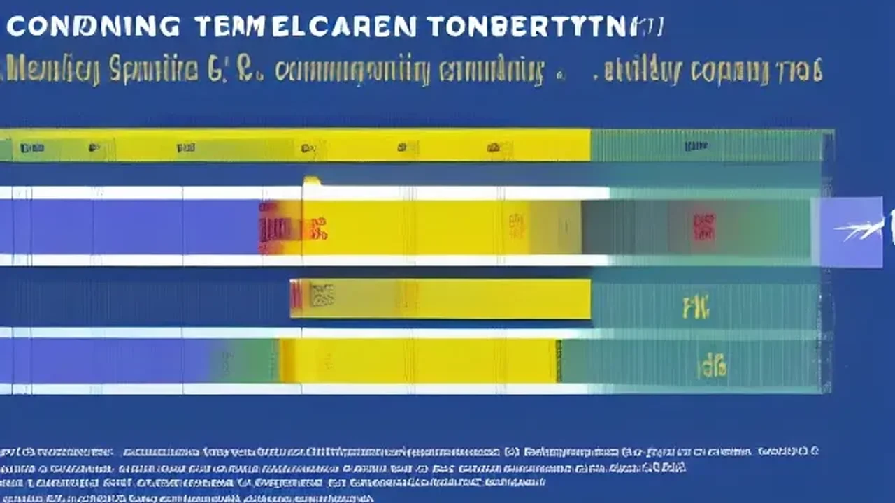

2026년 현재 대한민국 사회는 타인의 시선이나 집단의 기준을 과감히 탈피하여 오롯이 나만의 기준을 세우는 삶에 열광하고 있습니다. 이러한 변화는 단순한 소비 성향을 넘어 직업, 관계, 여가 등 일상 전반을 관통하는 거대한 **미코노미 트렌드**로 완전히 정착했습니다. 외부의 평가보다 내 안의 정서적 만족과 자기결정권을 최우선으로 삼는 이 새로운 라이프스타일의 본질과 실천법을 철저히 파헤칩니다.

## 미코노미 트렌드, 왜 2026년 사회의 중심이 되었나?

### 과거의 1인 가구 트렌드 vs 현재의 미코노미 차이점
과거의 1인 가구 트렌드가 단순히 혼자 사는 사람들의 인구 통계학적 증가나 어쩔 수 없이 혼자 밥을 먹는 '혼밥' 같은 외형적 현상에 주목했다면, 지금의 미코노미는 심리적 주체성에 기반을 둡니다. 과거에는 사회적 고립이나 경제적 한계로 인해 나타난 수동적 선택이 많았지만, 현재는 다인 가구에 속해 있더라도 개인의 시간과 독립적 의사결정을 철저히 보장받으려는 능동적 성향이 강합니다. 즉, 외로움을 극복하는 단계에서 벗어나 **혼자만의 풍요로움을 적극적으로 기획하는 단계**로 진화했습니다.

### 타인의 표준을 거부하는 '자기결정권'의 확산 배경
사회가 정해놓은 복종의 트랙, 예컨대 '몇 살에는 취업하고 몇 살에는 결혼하여 집을 사야 한다'는 전통적인 인생 타임라인이 무너진 결과입니다. 생성형 AI의 일상화와 디지털 고도화로 인해 개인이 확보할 수 있는 정보와 자립 능력이 커지면서, 조직이나 집단의 기대에 나를 맞출 이유가 사라졌습니다. 내 삶의 운전대를 내가 잡겠다는 강력한 **자기결정권** 욕구가 MZ세대를 넘어 40대 직장인들까지 급속도로 번지고 있습니다.

### 숫자로 보는 '나다움' 중심 소비 및 라이프스타일 통계
글로벌 시장조사기관의 2026년 상반기 소비자 동향 보고서에 따르면, 전체 설문 응답자의 74.3%가 "제품을 구매할 때 유행이나 브랜드 인지도보다 내 주관적 만족도를 가장 먼저 고려한다"고 답했습니다. 특히 자기계발 및 멘탈 케어 분야의 개인 맞춤형 구독 서비스 매출은 전년 동기 대비 42% 이상 급성장했습니다. 이는 대중적인 유행을 따르는 매스 마켓이 종말을 고하고, 철저히 파편화된 **초개인화 니치 마켓**이 주류가 되었음을 증명하는 지표입니다.

## 내 삶에 적용하는 미코노미 소비의 명과 암

### 정서적 만족과 자존감을 높이는 미코노미의 긍정적 효과
주체적인 소비와 라이프스타일은 자존감을 방어하는 강력한 심리적 요새 역할을 수행합니다. 타인과의 비교를 멈추고 온전히 내 감정과 신체 상태에 집중 투자하기 때문에 일상적인 스트레스 저항력이 높아집니다.
> "남들이 좋다는 고급 외제차 대신, 내 체형에 완벽히 맞춘 프리미엄 미니벨로 자전거를 구매해 주말마다 한강을 달립니다. 남의 시선에서 해방되니 비로소 진짜 휴식이 무엇인지 알게 되었습니다." - 40대 직장인 주말 자전거 라이더의 고백

### 과소비와 사회적 고립을 유발하는 초개인화의 부작용
반면 나 홀로 최고를 누리겠다는 심리가 지나친 과소비나 욜로(YOLO)의 변형으로 변질될 위험성도 존재합니다. 내 만족이라는 명분 아래 감당하기 어려운 고가의 맞춤형 상품을 충동구매하거나, 타인과의 소통을 완전히 차단한 채 자신만의 세계에 갇히는 **디지털 은둔형 외톨이** 현상이 사회적 병리 현상으로 연결되기도 합니다. 알고리즘이 추천하는 취향에 갇혀 새로운 경험의 기회를 스스로 박탈하는 부작용도 관찰됩니다.

### 중심을 잡는 현명한 '가치 소비'의 균형점 찾기
충동적인 소유욕과 진정한 정서적 충족을 명확히 구분하는 지혜가 요구됩니다. 단순한 물질적 소유를 위한 지출을 지양하고, 경험의 확장이나 신체적·정신적 성장을 이끄는 영역에 비용을 배분하는 훈련이 필요합니다. 지출 전 3일간 유예 기간을 두는 '냉각기 법칙'을 적용하거나, 한 달 총지출 중 미코노미 자금의 상한선을 15% 이내로 제한하는 명확한 가이드라인을 수립해야 자산의 건전성을 지킬 수 있습니다.

[관련 글 보기](/posts/society/)

## 직장인 A씨의 미코노미 독립 라이프 실천기

### 획일적인 회사 생활에서 나만의 사이드 프로젝트 개척하기
중견기업 마케팅 부서에서 근무하는 40대 직장인 A씨는 회사 직함 외에 또 다른 자아를 구축했습니다. 퇴근 후 매일 1시간씩 개인 작업실에서 AI 이미지 생성 툴과 자동화 도구를 활용해 자신만의 가상 인플루언서 콘텐츠를 제작합니다. 회사가 요구하는 규격화된 업무에서 얻지 못하는 창작의 희열을 사이드 프로젝트를 통해 보충하며, 조직의 불안정성에 흔들리지 않는 독립적인 정서적 자립 기반을 다져가고 있습니다.

### 온전한 휴식을 주는 나홀로 프리미엄 호캉스와 셀프 케어
A씨는 분기에 한 번씩 아무런 일정을 잡지 않고 서울 근교의 프리미엄 스파 호텔을 혼자 방문합니다. 인맥 관리를 위한 주말 모임이나 경조사 참석을 과감히 줄여 확보한 예산과 시간을 오롯이 자신에게 재투자하는 방식입니다. 스마트폰을 완전히 끄고 아날로그 서적을 읽거나 숲길을 걸으며 타인의 감정에 무방비로 노출되었던 뇌를 리셋하는 자기만의 **셀프 케어 루틴**을 고수합니다.

### 커뮤니티의 의무감에서 벗어나 취향 중심의 관계 맺기
동창회나 향우회처럼 지연과 학연으로 묶인 의무적 네트워크를 정리한 자리에는 오직 취향으로만 결속된 느슨한 연대가 들어섰습니다. A씨는 주말마다 일본 시티팝이나 J-Pop을 연주하는 직장인 취미 밴드에서 드럼을 연주합니다. 나이나 직급, 배경을 묻지 않고 오직 '음악적 취향' 하나로만 소통하며, 필요할 때 모이고 연주가 끝나면 깔끔하게 헤어지는 **느슨한 결속(Loose Coupling)**의 매력 속에서 깊은 해방감을 만끽합니다.

## 오늘부터 시작하는 '나다운' 라이프스타일 설계법

### STEP 1: 내 안의 핵심 가치와 진짜 취향 발견하기
타인의 유행에 휩쓸리지 않으려면 내가 진짜로 좋아하는 것이 무엇인지 아는 '취향의 데이터화'가 선행되어야 합니다. 일주일 동안 돈과 시간이 무제한으로 주어졌을 때 가장 하고 싶은 행동 10가지를 노트에 적어봅니다. 그중 과시용 목적을 제외하고 온전히 혼자 있을 때도 즐거울 만한 행동 3가지를 추려내어, 그것을 나만의 핵심 가치이자 취향의 이정표로 삼습니다.

### STEP 2: 불필요한 감정 낭비를 줄이는 관계 다이어트 실행하기
- **알림 끄기**: 단체 대화방의 무의미한 대화와 소셜 미디어 알림을 차단하여 감정의 소모를 막습니다.
- **거절 기준 수립**: 내 휴식 시간이나 주관적 가치를 침해하는 제안에는 "미리 계획된 일정이 있다"며 정중하고 명확하게 거절 의사를 표시합니다.
- **인간관계 시각화**: 내 삶에 긍정적인 에너지를 주는 사람과 에너지를 갉아먹는 사람의 명단을 작성해 보고, 후자와의 접촉 빈도를 점진적으로 줄입니다.

### STEP 3: 미코노미 맞춤형 구독 서비스 및 자산 관리 루틴 세우기
라이프스타일을 지속 가능하게 만드는 최종 단계는 구조적 환경 구축입니다. 무분별한 소비를 방지하기 위해 매월 고정비와 저축액을 먼저 제외한 뒤, '오롯이 나를 위한 행복 예산' 통장을 별도로 분리합니다. 이 예산 범위 내에서 멘탈 케어 어플리케이션, 1인 맞춤형 식단 배송, 혹은 전문 도서 큐레이션 서비스 등 내 성장을 돕는 초개인화 구독 서비스를 선별해 매칭함으로써 일상의 루틴을 정교하게 다듬어 나갑니다.

**함께 읽으면 좋은 글**
- [813대책 결혼페널티 폐지 조건 진짜 바뀔까?](/posts/society/813-real-estate-marriage-penalty-2026/)
- [검찰 '보완수사권 폐지' 국회 통과 및 수뇌부 전격](/posts/society/society-issue-20260801/)

#미코노미트렌드 #초개인화 #자기결정권 #나다움 #가치소비 #라이프스타일 #사이드프로젝트 #셀프케어 #느슨한연대 #2026트렌드