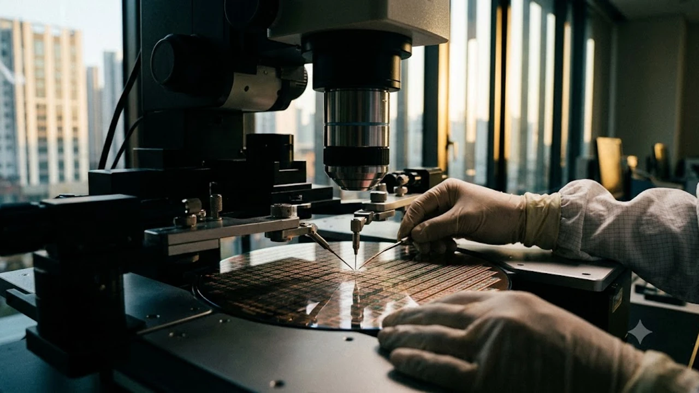

인공지능 가속기 시장의 병목을 부수는 핵심 열쇠는 바로 **고대역폭 메모리**입니다. 생성형 AI 연산량이 폭증하면서 연산 장치의 클럭을 올리는 것만으로는 한계에 부딪혔고, 물리적인 데이터 대역폭을 확장하는 패러다임 전환이 필수가 되었습니다. AI 가속기 생태계의 판도를 바꾸는 차세대 아키텍처의 실체를 직설적으로 짚어봅니다.

## 데이터 전송 속도의 물리적 한계를 깨는 아키텍처 혁신

### 3차원 적층 구조와 TSV 공정의 진화
솔직히 말하면 기존 2D 평면 패키징 방식으로는 대규모 언어 모델의 데이터 요구량을 감당할 수 없습니다. 수천 개의 미세 구멍을 뚫어 칩 상하부를 수직 관통 전극(TSV)으로 연결하는 3D 적층 기술은 인터커넥트 길이를 획기적으로 줄였습니다. 신호 지연을 최소화하면서 데이터 전송 통로인 I/O 핀 수를 수천 개 단위로 늘려 초당 테라바이트급 전송 속도를 실현합니다.

### 베이스 다이의 공정 전환과 로직 융합
과거 단순 연결 통로에 불과했던 최하단 베이스 다이는 이제 첨단 파운드리 로직 공정을 직접 적용하는 추세입니다. 컨트롤러와 테스트 회로를 넘어 일부 연산 기능까지 베이스 다이에 통합되면서 지연 시간을 줄이고 전력 소모를 통제하는 구조로 진화하고 있습니다.

### 단위 면적당 전력 효율 개선의 실체
> 대역폭이 아무리 높아도 발열과 전력 소모를 잡지 못하면 하이퍼스케일러 데이터센터에 투입될 수 없습니다.

신형 구조에서는 구동 전압을 낮추고 전력 분배 네트워크(PDN)를 최적화하여 비트당 에너지 소비량을 이전 세대 대비 두 자릿수 비율로 절감했습니다. 무작정 클럭을 올리는 방식 대신 병렬성을 극대화해 에너지 효율을 방어하는 방식입니다.

## 차세대 패키징 공정 경쟁과 방열 기술의 충돌

### 마이크로 범프와 하이브리드 본딩의 격돌
현재 널리 쓰이는 마이크로 범프 접합은 단수가 12단, 16단으로 올라갈수록 두께와 전기적 저항에서 한계를 드러냅니다. 이에 따라 칩과 칩을 구리 직접 접합 방식으로 연결하는 하이브리드 본딩이 전면 도입되고 있습니다. 범프가 차지하던 공간을 없애 칩 간격을 극단적으로 좁히고 신호 전달 특성을 극대화하는 방식입니다.

### 첨단 몰딩 소재를 활용한 열 방출 전략
적층 단수가 높아질수록 내부 코어에서 발생하는 열을 밖으로 빼내는 것이 최대 난제로 꼽힙니다. 에폭시 몰딩 컴파운드(EMC)의 열전도율을 끌어올리고, 칩 사이에 액상 충전재를 빈틈없이 채우는 매스 리플로우 공정 고도화가 필수적인 안전장치로 자리 잡았습니다.

### 2.5D 인터포저와 기판 대형화 이슈
GPU와 고대역폭 메모리를 한 기판 위에 얹는 인터포저 면적이 급격히 커지면서 휨 현상(Warpage)과 수율 저하가 심각한 과제로 떠올랐습니다. 실리콘 인터포저 외에도 유기물 소재나 유리 기판(Glass Substrate)을 적용하려는 시도가 활발해지는 이유입니다.

## 커스텀 설계 도입과 AI 워크로드 맞춤화 흐름

### 고객 맞춤형 다이 설계와 파운드리 협업 체계
기성품을 일괄 공급하던 전통 메모리 비즈니스는 사실상 끝났습니다. 빅테크 기업들이 자체 가속기 칩 스펙에 맞춰 메모리 컨트롤러 인터페이스와 핀 배열을 독자적으로 요구하기 때문입니다. 메모리 제조사와 글로벌 파운드리 기업 간의 밀착 협력이 제품 완성도를 결정짓는 핵심 변수입니다.

### PIM 기술 결합을 통한 메모리 내 연산 실현
프로세싱 인 메모리(PIM) 구조는 메모리 내부 뱅크마다 연산 유닛을 심어 데이터 이동 자체를 줄입니다. 폰 노이만 구조의 고질병인 메모리 병목 현상을 원천 차단하여 AI 추론 처리 효율을 대폭 끌어올립니다.

### 데이터 정합성 유지와 온다이 ECC 고도화
초미세 공정 적용으로 발생할 수 있는 비트 오류를 실시간으로 교정하기 위해 내장형 에러 정정 코드(On-Die ECC)의 비중이 커졌습니다. 고속 전송 중 발생하는 일시적 오류를 자가 복구함으로써 시스템 다운타임을 방어합니다.

## 시장 판도 변화와 산업 인프라에 미치는 영향

### 데이터센터 랙 밀도와 액체 냉각 도입 가속화
고대역폭 메모리가 집적된 차세대 서버 랙은 기존 공랭식 시스템으로는 감당할 수 없는 수준의 열을 뿜어냅니다. 수랭식 직접 냉각(DLC)과 침전 냉각 기술이 데이터센터 필수 인프라로 자리 잡으면서 하드웨어 설계 전반의 패러다임이 뒤바뀌고 있습니다.

### 공급망 수율 격차와 가격 프리미엄 형성
단 한 장의 웨이퍼 결함으로도 전체 패키지가 폐기되는 첨단 공정 특성상, 수율 격차가 곧 기업의 영업이익률로 직결됩니다. 기술적 진입장벽이 워낙 높아 상위 제조사의 독점적 프리미엄 구조는 당분간 깨지기 어렵습니다.

### 산업 전반에 미치는 기술적 파급 효과
하드웨어 인프라의 급격한 변화는 소프트웨어 생태계와 제반 사회 구조에도 연쇄적인 영향을 미치며, 디지털 전환기 전반의 흐름을 빠르게 재편하고 있습니다. 이와 관련된 생태계 변화 흐름은 [사회 전체 글 보기](/posts/society/)에서 확인할 수 있습니다.

차세대 컴퓨팅 환경에 최적화된 하드웨어 장비와 주변 기기는 [컴퓨팅 부품 쿠팡에서 보기](https://www.coupang.com/np/search?q=%EC%BB%B4%ED%93%A8%ED%84%B0%EB%B6%80%ED%92%88&sourceType=affiliate&trackingCode=AF8691300)를 통해 비교할 수 있습니다.

#고대역폭메모리 #AI반도체 #반도체패키징 #하이브리드본딩 #TSV공정 #데이터센터 #PIM기술