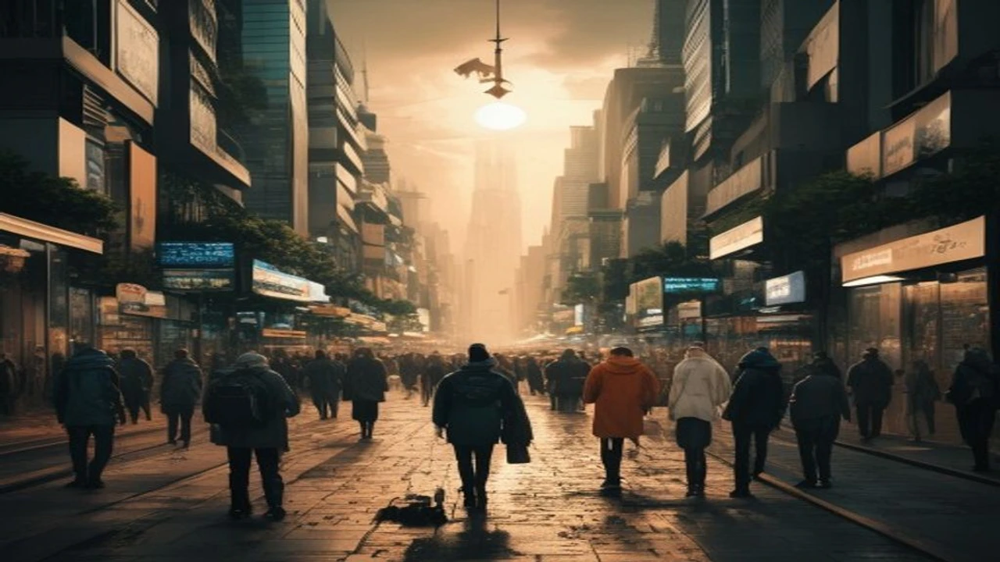

최근 고물가 기조와 1인 가구의 가파른 증가세 속에서 **무빈소 장례**가 새로운 장례 문화의 대안으로 급부상하고 있습니다. 과거에는 경제적 빈곤이나 연고자가 없는 경우에만 제한적으로 선택되던 방식이었으나, 이제는 허례허식을 줄이고 애도에만 집중하려는 합리적 선택으로 인식이 바뀌는 추세입니다. 통계청과 시장조사전문기관의 최근 조사에 따르면 성인 남녀 10명 중 7명이 빈소 없는 장례에 찬성할 만큼 사회적 공감대가 넓어지고 있습니다.

## 허례허식 빼고 애도 집중, 무빈소 장례가 진짜 뜨는 이유

### 기존 3일장과 무빈소 장례의 절차적 차이점
전통적인 3일장은 임종 직후 빈소를 마련하여 안치, 입관, 조문객 접대, 발인, 화장까지 총 72시간 동안 복잡한 격식을 치릅니다. 반면 빈소 없는 장례는 고인을 병원 안치실에 모신 후 조문객을 받는 접객실을 따로 차리지 않습니다. 유족은 집에서 대기하거나 안치실 인근에서 휴식을 취하다가, 이튿날 입관식을 치르고 곧바로 화장장으로 이동하여 발인 절차를 마무리합니다. 물리적인 공간과 조문 절차가 과감하게 생략되는 것이 핵심입니다.

### 장례 비용 70% 절감하는 구조적 배경
일반적인 3일장 평균 비용은 약 1,200만 원에서 1,500만 원 선에 달합니다. 이 중 가장 큰 비중을 차지하는 것이 빈소 임대료(평균 200만 \~ 300만 원)와 조문객 접대용 음식값(평균 400만 \~ 600만 원)입니다. 무빈소 방식을 택하면 이 두 가지 핵심 항목이 완전히 사라지므로, 필수 비용인 안치실 사용료, 관·수의 등 용품비, 운구 차량비, 화장장 수수료 정도만 발생합니다. 실제 집행 금액은 150만 원에서 250만 원 안팎으로 줄어들어 유족의 경제적 부담을 획기적으로 낮춥니다.

### 1인 가구 급증과 장례 문화에 대한 인식 변화
전체 가구 중 1인 가구 비중이 35%를 넘어선 현시점에서 부고를 알릴 일가친척이나 찾아올 조문객 자체가 적은 현실적 한계도 작용합니다. 보건복지부 조사에 따르면 '장례는 허례허식보다 고인을 기리는 마음이 우선'이라는 답변이 80%를 상회했습니다. 남들의 시선이나 사회적 체면 때문에 막대한 빚을 지며 호화 장례를 치르기보다, 실속을 챙기고 유족의 삶에 집중하는 실용주의적 사고관이 반영된 결과입니다.

## 무빈소 장례의 현실적인 장단점과 겪어본 사람들의 경험담

### 비용 절감과 온전한 추모: 직접 치러본 유족의 긍정적 평가
> "작년에 아버님 장례를 조문객 없이 치렀습니다. 3일 내내 손님 맞이하고 술상 차리느라 정작 슬퍼할 겨를도 없었던 친척들의 장례식과 달리, 오롯이 직계 가족 5명이 모여 조용히 아버님과의 추억을 이야기하며 애도할 수 있어 깊은 위로를 받았습니다." (경기도 수원시 거주, 30대 직장인 K씨)
불필요한 육체적 피로가 없어 고인을 보내는 마지막 순간에 온전한 정신으로 집중할 수 있었다는 후기가 지배적입니다.

### 부고 범위를 둘러싼 친지간의 의견 갈등과 해결책
모든 가족 구성원이 이 방식에 쉽게 동의하는 것은 아닙니다. 특히 전통적 관습을 중시하는 조부모나 친척 어르신들은 "아무리 그래도 어떻게 빈소도 없이 사람을 보내느냐"며 강하게 반발하는 사례가 빈번합니다. 실제로 상가에서 고성이 오가는 갈등을 피하려면, 임종 전 가족 회의를 통해 고인의 사전 의사(유언장 등)를 명확히 공유해야 합니다. 비용 절감액의 일부를 친척들의 교통비나 식대 등 다른 방식으로 배려하는 지혜도 요구됩니다.

### 조문객을 받지 못해 생기는 아쉬움과 디지털 추모의 대안
평소 고인과 교류가 깊었던 지인들이 나중에 사망 소식을 듣고 서운함을 토로하거나, 제대로 작별 인사를 하지 못해 안타까워하는 단점이 존재합니다. 이러한 한계를 보완하기 위해 최근에는 부고장에 온라인 추모관 링크를 첨부하는 방식이 쓰입니다. 지인들은 모바일 공간에서 고인의 사진을 보며 추모 글을 남기고, 유족 역시 일일이 답장해야 하는 번거로움을 줄이면서 진심 어린 위로를 주고받습니다.

[관련 글 보기](/posts/society/)

## 손해 보지 않는 합리적인 무빈소 장례 진행 절차 가이드

### 임종 직후부터 안치실 이동까지 초기 대응 요령
병원이든 자택이든 사망 진단서(또는 사체검안서) 발급이 첫 단추입니다. 진단서가 있어야 장례 용품 이용과 안치실 입실이 가능하므로 최소 5\~10부를 여유 있게 발행해 두는 편이 유리합니다. 이후 이용하고자 하는 병원 장례식장이나 전문 안치 시설에 연락하여 시신 인양 및 운구 차량을 요청합니다. 이때 경황이 없다고 병원 측이 연계한 고가의 사설 운구차를 덜컥 이용하면 과다한 요금이 청구되므로 사전 단가 확인을 거쳐야 합니다.

### 입관식과 화장장 예약 시 반드시 체크해야 할 주의사항
장례 2일 차에 진행되는 입관식은 유족이 고인의 모습을 보는 유일하고 공식적인 시간입니다. 빈소는 없더라도 입관 전문 예식실을 대여하여 단정하게 수의를 입히고 관에 모시는 과정은 정식으로 진행됩니다. 화장장 예약은 국내 장사정보시스템(e하늘)을 통해 사망 즉시 신청해야 합니다. 수도권의 경우 화장 수요가 몰려 원하는 시간에 예약하기 어려우므로, 장례 지도사의 도움을 받아 임종 직후 가장 빠른 관내·외 화장장을 확보하는 절차가 필수적입니다.

### 상조회사 무빈소 패키지 가입 시 특약 독소조항 구별법
일부 부도덕한 후불제 상조업체들은 90만 원짜리 초저가 패키지를 미끼로 내걸고 계약을 유도한 뒤, 현장에서 폭리를 취합니다. 계약서 조항을 꼼꼼히 살피지 않으면 다음과 같은 항목에서 추가 비용 부과 폭탄을 맞게 됩니다.
- 관과 수의의 재질을 저급품으로 책정해 두고 현장에서 업그레이드 유도
- 버스나 리무진의 기본 제공 거리(예: 왕복 50km)를 터무니없이 짧게 잡아 추가 거리당 과도한 할증 부과
- 수의를 입히는 인력(염습사) 수당이나 야간 출동 수당 별도 청구
따라서 반드시 '추가 비용 없음' 항목이 명시된 확정 견적서를 서면으로 받아두어야 손해를 막습니다.

## 나에게 맞는 상조 서비스와 맞춤형 추모 형태 비교

### 대형 상조사 정기 상품 vs 후불제 상조 서비스 조건 비교
선불식 대형 상조회사의 일반 상품은 기본적으로 3일장 기준(400만 \~ 600만 원 선)으로 설계되어 있어 무빈소로 전환할 경우 사용하지 않은 물품(접객 도우미, 버스 등)에 대한 환급 비율이 낮아 유족에게 불리합니다. 반면 후불제 상조는 처음부터 필요한 품목만 골라 구성하는 '다이어트형 패키지'를 제공하므로 100만 원 중후반대에 맞춤형 집행이 가능합니다. 다만 후불제는 업체의 신뢰도를 검증하기 어렵다는 리스크가 있으므로 이용자 후기와 자본금 규모를 대조해야 합니다.

### 빈소는 없지만 격식은 갖추는 '가족장'과의 비용 차이
많은 이들이 무빈소 장례와 가족장을 혼동하지만 명확한 차이가 존재합니다. 가족장은 작은 크기의 빈소(가족실)를 1\~2일간 단기 임차하여 직계 가족들만 모여 제사를 지내고 종교 예식을 치르는 방식입니다. 음식도 가족들이 먹을 소량만 준비합니다. 무빈소는 접객실 자체를 아예 빌리지 않으므로 시설 사용료 면에서 가족장보다 대략 150만 원에서 300만 원가량 비용이 더 저렴합니다. 집안의 종교적 배경과 의례의 강도를 고려하여 절충안을 택하는 태도가 권장됩니다.

### 고인의 뜻을 기리는 새로운 대안, 친환경 자연장과의 연계 방법
화장을 마친 후 골분을 골장(산골)하거나 납골당에 안치하는 대신 수목장, 잔디장, 화초장 등 자연장으로 마무리를 짓는 유족이 크게 늘었습니다. 산림청 통계에 의하면 인위적인 석조 묘지보다 자연친화적 장지를 선호하는 비율이 해마다 증가하는 모양새입니다. 빈소를 생략하여 아낀 예산을 경기도나 외곽 지역의 관리 상태가 우수한 사설 수목장 유치 비용으로 돌림으로써, 일회성 장례식보다 고인이 영면할 영구적인 공간에 투자하는 가치관의 이동이 뚜렷해지고 있습니다.

**함께 읽으면 좋은 글**
- [노인 나이 70세 상향? 바뀌는 혜택 완전 정리](/posts/society/senior-age-limit-70-benefits-2026/)
- [813대책 결혼페널티 폐지 조건 진짜 바뀔까?](/posts/society/813-real-estate-marriage-penalty-2026/)

#무빈소장례 #장례비용 #가족장 #상조서비스 #장례식절차 #online추모 #수목장 #합리적소비 #고령화사회