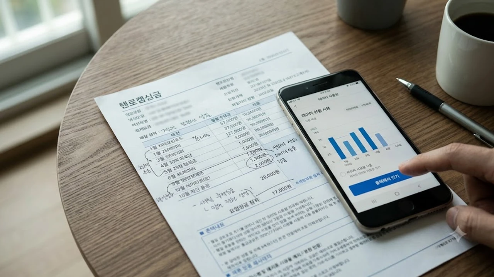

달력이 10월로 넘어가는 순간 매달 빠져나가던 요금 고지서와 행정 절차는 소리 없이 크게 바뀝니다. 이번 **10월 바뀌는 생활정책**은 통신비와 신분 확인, 일상 재난 대응까지 우리 지갑과 직결된 핵심 제도를 정면으로 겨냥하고 있습니다. 모르면 내 돈만 고스란히 새어나가고 알면 일상이 즉각 편해지는 핵심 알짜 변경점들을 모았습니다.

## 통신비 거품 걷어내는 최적요금제 고지 의무화

### 쓰지도 않는 100GB 요금제와의 작별
통신 3사가 가입자의 실사용량을 분석해 가장 알맞은 저렴한 요금제를 주기적으로 통보해야 하는 법적 의무가 본격적으로 가동됩니다. 평균 사용량이 15GB 안팎인데도 6~7만 원대 고가 요금제에 묶여 있던 가입자는 통신사 알림을 확인하고 버튼 한 번으로 기본료를 월 2~3만 원 절감할 수 있게 됩니다.

### 알뜰폰 환승 문턱 완화와 위약금 투명화
약정 기간이 끝났는데도 자동 갱신을 방치하던 관행에 제동이 걸립니다. 약정 만료 30일 전과 당일에 정확한 잔여 위약금과 알뜰폰 유심 이동 시 예상 절감액이 알림톡으로 명시됩니다. 통신사 간 결합할인에 묶여 발을 빼지 못하던 가계에 실질적인 이동 자유가 주어집니다.

## 지갑 없이 스마트폰 하나로 끝내는 신분증 전면 개편

### 민간 플랫폼 어디서나 모바일 주민등록증 발급
정부24 앱에만 갇혀 있던 모바일 주민등록증이 시중 주요 은행 앱과 간편결제 플랫폼 전반으로 전면 개방됩니다. 플라스틱 카드를 꺼낼 필요 없이 스마트폰 잠금 해제 한 번이면 관공서 민원 발급부터 병원 본인 확인, 공항 탑승 수속까지 동일한 법적 효력으로 처리됩니다.

### 오프라인 위변조 위험 원천 차단
육안 검사에 의존하던 실물 신분증의 도용 취약점을 보완하기 위해 1회용 동적 QR코드 검증 체계가 기본값으로 적용됩니다. 캡처본이나 화면 녹화본은 인증 시스템에서 즉각 차단되며, 폰을 분실하더라도 통신사 원격 잠금과 연동되어 개인정보 유출을 방어합니다. 일상 속 개인정보 보호와 안전망 정비에 대한 흐름은 [2026년 안심 귀가 서비스 완전 정리](/posts/society/youth-safety-stranger-anxiety-2026/) 흐름과도 정확히 맞닿아 있습니다.

## 글자 수 2배 늘어난 재난문자와 정밀 대피 안내

### 혼란 키우던 단문 문자에서 우회로 지도 링크까지
기존 45자 내외의 짤막한 통보로 혼선을 빚던 긴급재난문자의 글자 수가 대폭 확대됩니다. 단순한 사고 발생 통보에 그치지 않고 구체적인 우회 도로 안내, 근처 임시 대피소 위치, 현장 통제 구역이 상세 문장으로 전달됩니다.

### 침수·산사태 위험 구역 거주자 타깃 알림
위치 기반 정밀도가 기존 시·군 단위에서 읍·면·동 세부 반경으로 좁혀집니다. 산사태 취약 지구 경사면이나 상습 침수 하천 주변 반경 500m 이내 체류자에게 우선 경보가 발송되어 한밤중 돌발 기상이변에 대비할 골든타임을 확보합니다.

## 직장인 육아지원 확대와 행정 절차 단축

### 단기 육아휴직 쪼개 쓰기 신청 간소화
자녀의 갑작스러운 입원이나 학교 행사 등 돌발 돌봄 공백에 쓸 수 있는 단기 육아휴직을 연 1회 단위가 아닌 며칠 단위로 쪼개어 쓰는 절차가 회사 승인 단계에서 간소화됩니다. 근로자가 증빙 서류를 정부 전산망을 통해 직접 제출하면 고용보험 지원금이 사업주를 거치지 않고 직접 지급됩니다.

### 병원 방문 전 필수 서류 비대면 원스톱 전송
영유아 검진 결과표와 예방접종 증명서를 보건소나 병원에서 종이로 뗄 필요가 없습니다. 모바일 앱에서 진료 병원으로 다이렉트 전송할 수 있는 시스템이 연계되어 복잡한 행정 서류 발급 비용과 대기 시간을 동시에 줄여줍니다. 10월부터 바뀌는 일상 행정에 발맞춰 가계 정리와 서류 보관을 점검할 때 필요한 물품은 [스마트 생활용품 쿠팡에서 보기](https://www.coupang.com/np/search?q=%EC%83%9D%ED%95%84%ED%92%88&sourceType=affiliate&trackingCode=AF8691300)를 통해 확인해볼 수 있습니다.

#10월생활정책 #통신비절약 #모바일주민등록증 #재난문자개편 #육아휴직제도 #생활정보2026 #정책체크