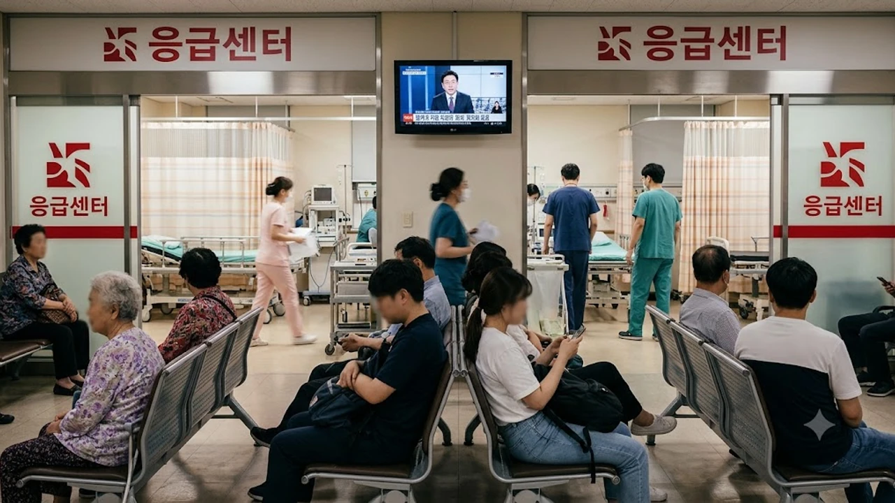

징검다리 황금연휴만 되면 한밤중에 아이가 갑자기 고열을 앓거나 심하게 체해 온 가족이 패닉에 빠집니다. 문 연 동네 의원이 없어 무작정 대학병원으로 차를 몰았다가 꽉 찬 대기실에서 대여섯 시간을 허비하는 광경이 되풀이되는데, 이번 10월 연휴 응급실 진료 현황을 꿰고 있지 않으면 헛걸음하다 골든타임을 날리기 십상입니다. 영문도 모른 채 진료비 폭탄을 맞지 않으려면 지자체와 당국이 가동하는 비상진료 시스템의 룰부터 챙겨야 합니다.

## 10월 연휴 응급진료 체계 운영 현황

솔직히 말하면 연휴 기간 권역 대학병원 응급실은 이미 북새통입니다. 보건복지부와 각 지자체가 가동하는 비상진료체계는 위독한 사람을 먼저 살리기 위해 경증 환자를 의도적으로 걸러내는 구조로 돌아갑니다.

### 당직 병·의원 및 약국 지정 확대 내역
보건소와 행정복지센터는 관할 지역 의원과 약국을 묶어 일자별 당번제를 강제 운영합니다. 공공의료원뿐만 아니라 동네 이비인후과·내과·소아과도 지정된 날짜엔 의무적으로 셔터를 올려야 합니다. 약국 유리창에 붙은 휴업 팻말 앞에서 발을 동동 구르지 않으려면 관할 구청 공지나 전산망에 등록된 순번 당직 명단을 출발 전에 반드시 대조해야 합니다.

### 중증 응급환자 우선 분류 기준 안내
응급실은 먼저 온 순서대로 번호표를 뽑아 들어가는 은행 창구가 아닙니다. 전산에 등록되는 한국형 응급환자 분류도구(KTAS) 등급이 진료 순서를 결정합니다. 1~2등급 판정을 받는 심근경색, 뇌출혈, 다발성 골절 환자가 병상에 직행하며, 4~5등급으로 분류되는 단순 장염, 미열, 찰과상 환자는 앞선 환자의 처치가 끝날 때까지 대기실 플라스틱 의자에서 밤을 지새워야 합니다.

### 지역별 비상진료센터 24시간 가동 체제
권역응급의료센터는 중환자실과 수술실을 연계한 심뇌혈관 응급 시술에 집중합니다. 반면 일반적인 열상 봉합, 단순 골절 부목 고정, 복통 수액 처치는 2차 종합병원이나 지역응급의료기관 비상진료실이 훨씬 빠릅니다. 숨이 가쁘거나 의식이 흐려지는 위급 상황이 아니라면 동네 2차 병원으로 방향을 트는 편이 대기 시간을 대폭 줄이는 지름길입니다.

## 실시간 문 여는 병원·약국 조회 3가지 경로

포털에 무작정 상호명을 검색해 옛날 번호로 전화를 걸면 끊긴 신호음만 듣게 됩니다. 국가 공공망이 실시간으로 갈아 끼우는 3가지 공식 채널을 지금 휴대폰 화면에 띄워두어야 합니다.

### 응급의료포털(E-Gen) 모바일 실시간 지도 활용법
가장 믿을 만한 창구는 국립중앙의료원이 운영하는 **응급의료포털 E-Gen** 웹페이지와 전용 앱입니다. GPS 위치를 켜면 현 반경 1~3km 내에서 지금 접수를 받는 병·의원과 약국이 지도에 핀으로 꽂힙니다. 당직 의사 진료과목, 소아 야간 진료 여부, 실시간 접수 마감 잔여 시간까지 분 단위로 갱신됩니다.

### 119 및 120 다산콜센터 유선 안내 요청 가이드
모바일 네트워크가 불안정하거나 어르신 혼자 대처해야 하는 상황이라면 유선 전화가 가장 확실합니다. 119 구급상황관리센터나 서울·경기 120 다산콜센터로 걸면 전문 상담 요원이 발신자 위치 주변에서 즉시 문을 열고 있는 병원과 당직 약국 주소를 문자로 찍어줍니다. 119는 단순 병원 안내 전용 회선을 분리해 접수하므로 위급 환자 통화를 가로막지 않고 이용할 수 있습니다.

### 주요 포털 및 지도 앱 비상진료 태그 검색 요령
카카오맵과 네이버 지도 검색창에 '명절 진료', '휴일 병원', '야간 약국' 필터를 걸면 실시간 영업 중인 시설만 추려집니다. 원내 사정으로 조기 마감하는 돌발 변수가 생길 수 있으므로, 지도 앱에 등록된 직통 번호로 사전 확인 후 이동하는 방식이 안전합니다. 야간 이동 중 안전 문제가 염려된다면 [2026년 안심 귀가 서비스 완전 정리](/posts/society/youth-safety-stranger-anxiety-2026/) 내용을 함께 점검해 두는 것도 큰 도움이 됩니다.

## 경증 질환 발생 시 대처 및 비용 절감 팁

이게 말이 되냐 싶겠지만, 단순 몸살이나 배탈로 상급종합병원 응급실을 찾았다가는 진료비 고지서를 보고 뒷목을 잡게 됩니다. 본인부담금 체계가 대폭 개편되었기 때문입니다.

### 달빛어린이병원 및 야간 진료 클리닉 이용 장점
만 18세 이하 소아 환자가 야간이나 공휴일에 고열을 앓는다면 무조건 응급실 대신 보건복지부 지정 **달빛어린이병원**을 찾아가야 합니다. 소아청소년과 전문의가 연휴 밤 11시까지 진료하며, 진료비 역시 일반 외래 수준으로 책정되어 응급실 진료비의 4분의 1 수준에 불과합니다.

### 응급실 경증 환자 본인부담금 인상 대비책
정부 지침 개정으로 권역응급의료센터나 대학병원 응급실을 방문한 KTAS 4~5등급 경증 환자의 본인부담 진료비율은 기존 50~60% 선에서 **90%까지 대폭 상향**되었습니다. 피검사나 수액 하나만 맞아도 수십만 원 청구서가 발송됩니다. 가벼운 탈수나 두통은 지역 일반의원이나 2차 병원 외래 당직실을 찾는 것이 지갑을 지키는 비결입니다.

### 비대면 진료 플랫폼 휴일 처방전 발급 활용 절차
가벼운 피부 발진이나 단순 감기, 소화불량 증상이라면 휴일에도 가동되는 비대면 진료 앱을 쓰는 편이 현명합니다. 화상 통화로 의사 문진을 거친 후, 휴일 운영 약국으로 전자 처방전을 전송해 대기 없이 약만 수령하면 끝납니다. 감염병 유행 시기에는 원내 2차 감염 위험까지 차단할 수 있습니다. 사회 전반의 복지 및 생활 의료 정책 변화는 [사회 전체 글 보기](/posts/society/)에서 폭넓게 확인할 수 있습니다.

## 연휴 응급실 방문 전 필수 체크리스트

긴급한 순간일수록 준비물 하나를 빠뜨려 진료 접수대에서 퇴짜를 맞는 황당한 일이 벌어집니다. 집을 나서기 전 세 가지만 차분하게 챙기면 낭패를 겪지 않습니다.

### 신분증 및 영유아 기본 서류 지참 확인
> 본인 확인 의무화 법안 시행으로 인해 주민등록증, 운전면허증, 모바일 신분증이 없으면 건강보험 급여 혜택을 받지 못하고 비급여 전액 본인부담으로 처리됩니다.

미성년 자녀는 주민등록등본이나 건강보험증 사본을 모바일 사진으로라도 반드시 구비해야 원활한 본인 인증과 진료 접수가 진행됩니다.

### 방문 전 유선 전화로 잔여 병상·진료과 확인
E-Gen 앱에 영업 중으로 떠 있더라도 현장 상황은 초단위로 바뀝니다. 소아과 진료 가능 여부, CT 촬영 기사 근무 여부, 성형외과 봉합 수술 가능 여부는 당직 의료진 현황에 따라 실시간으로 마감됩니다. 무턱대고 이동하지 말고 차에 타자마자 원무과로 전화해 "현재 성인 외상 봉합 가능한가", "소아 열 환자 접수 받는가"를 직접 확인해야 합니다.

### 가정 상비약 우선 점검 및 경미한 증상 대처 요령
아이 해열제 교차 복용(아세트아미노펜 계열과 이부프로펜 계열), 소화제, 지사제, 소독약, 식염수는 연휴 시작 전 미리 구비해 두는 것이 상책입니다. 체온이 38도 초반이라면 옷을 가볍게 입히고 미온수 마사지를 병행하며 해열제를 4~6시간 간격으로 교차 투약하는 조치만으로도 응급실행을 피할 수 있습니다.
[가정용 비상구급함 세트 쿠팡에서 보기](https://www.coupang.com/np/search?q=%EB%B9%84%EC%83%81%EA%B5%AC%EA%B8%89%ED%95%A8&sourceType=affiliate&trackingCode=AF8691300)

#연휴응급실 #문여는병원 #휴일지킴이약국 #EGen #달빛어린이병원 #응급실진료비 #비상진료체계