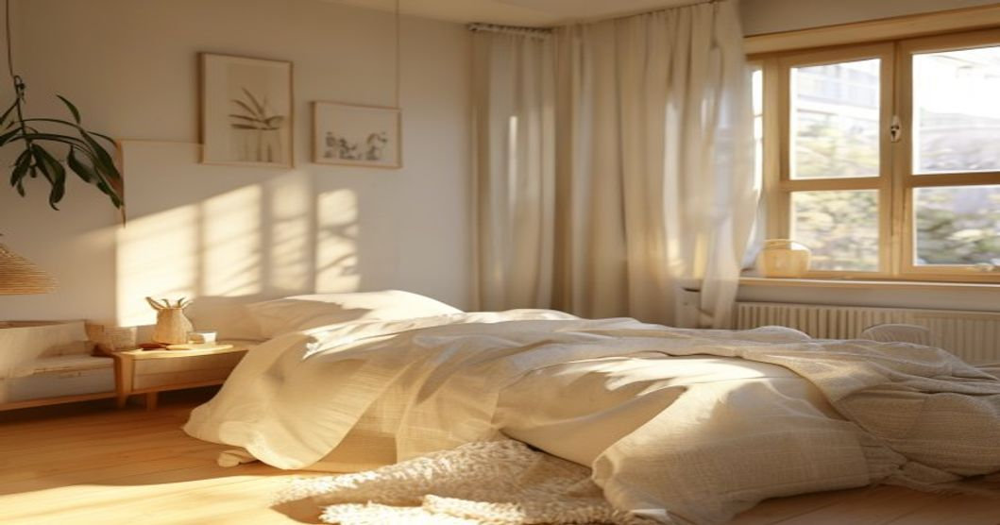
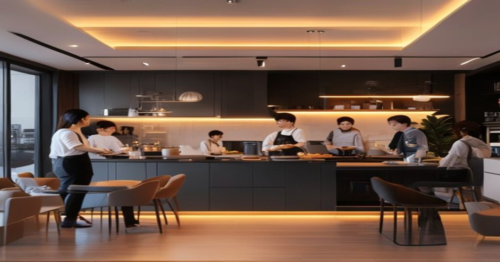

매달 내는 월세는 아깝고, 그렇다고 누군가와 완벽히 공간을 공유하자니 사생활이 침해될까 봐 망설여진 적 있으신가요? 혼자 살면 외롭고 둘이 살면 괴로운 현대인들의 모순적인 심리가 2026년 현재 새로운 거주 형태로 나타나고 있습니다. 바로 혼자만의 독립된 방을 가지면서도 거실이나 주방은 공유하며 이웃과 적당한 거리를 유지하는 이른바 1.5가구 라이프스타일입니다. 극단적인 고립 대신 완충 지대를 찾는 청년들의 주거 실험이 본격화되는 추세입니다.

## 1인 가구 한계 넘은 1.5가구 등장 배경

최근 통계청 발표를 보면 청년층의 고립감과 1인 가구의 외로움 지수가 역대 최고치를 기록했습니다. 완전히 혼자 사는 삶이 주는 자유로움 이면에는 짙은 고독감과 경제적 부담이라는 현실적인 벽이 존재합니다.

### 느슨한 연대를 원하는 청년들

개인주의가 심화되면서도 역설적으로 타인과의 연결을 갈구하는 욕구는 줄어들지 않았습니다. 완전히 묶여 있는 가족이나 동거인 관계는 부담스럽지만, 필요할 때 대화를 나눌 수 있는 이웃을 곁에 두고 싶어 하는 심리가 반영되었습니다.

### 주거비 상승이 불러온 현실적 타협

치솟는 주거비와 생활 물가는 청년들에게 큰 부담입니다. 보증금과 월세를 온전히 혼자 감당하기보다 공용 공간을 쉐어함으로써 고정 지출을 줄이려는 합리적인 경제적 계산이 맞물려 있습니다.

## 실제 사례로 보는 1.5가구 거주 형태

단순한 셰어하우스를 넘어 진화한 형태의 주거 모델들이 전국적으로 확산되고 있습니다. 각자의 라이프스타일에 맞춰 변형된 공간들이 주목받는 중입니다.

### 대기업 참여형 프리미엄 코리빙 하우스

침실과 화장실은 철저히 개인 공간으로 분리되어 도어락이 설치되어 있습니다. 반면 대형 라운지, 공유 주방, 헬스장, 미팅룸 같은 고가 프리미엄 시설은 입주민 전체가 공유하며 자연스럽게 교류하는 형태입니다. 주기적으로 열리는 네트워킹 파티나 취미 클래스를 통해 외로움을 달랩니다.

### 친구끼리 따로 또 같이 사는 '한 지붕 두 문'

마음이 맞는 친구나 동료들이 빌라나 아파트 한 층을 통째로 빌려 개조하는 사례도 늘었습니다. 가운데 거실을 두고 양옆으로 완벽히 차단된 독립 가구를 배치해 급할 때는 서로 돕고 일상에서는 간섭하지 않는 방식을 취합니다.

## 우리가 주목해야 할 장점과 단점

모든 주거 형태가 그렇듯 이 새로운 흐름 역시 확실한 명암을 지니고 있습니다. 본인의 성향을 파악하지 않고 무턱대고 선택했다가는 낭패를 보기 십상입니다.

### 정서적 안정감과 비용 절감 효과

가장 큰 메리트는 고립감 해소입니다. 퇴근 후 불 꺼진 방에 혼자 들어가는 쓸쓸함 대신, 불이 켜진 공용 거실에서 가벼운 인사를 나누는 것만으로도 정서적 위안을 얻습니다. 세탁기, 건조기, 정수기 등 대형 가전제품을 공유하므로 초기 자취 비용이 대폭 절감됩니다.

### 사생활 침해와 구성원 간 갈등 리스크

공용 공간의 청소 상태나 소음 문제는 언제나 시한폭탄 같은 존재입니다. 아무리 규칙을 정해도 타인의 생활 소음이나 냄새에서 완벽히 자유로울 수 없기에 예민한 성격의 소유자라면 오히려 스트레스가 배가될 위험이 있습니다.

## 나에게 맞는 주거 방식을 찾는 방법

새로운 트렌드에 무조건 탑승하기보다 자신의 생활 패턴과 성향을 객관적으로 분석하는 과정이 선행되어야 합니다.

### 나의 개인 공간 성향 테스트하기

하루 중 온전히 혼자만의 시간이 얼마나 필요한지 계산해봐야 합니다. 타인의 시선이 조금이라도 느껴질 때 피로감을 크게 느낀다면 코리빙 형태보다는 전통적인 원룸이 맞을 수 있습니다. 반대로 누군가와 대화하며 에너지를 얻는 편이라면 긍정적인 대안이 됩니다.

### 주거 계약 전 체크해야 할 필수 조건

공유 주거를 선택할 때는 커뮤니티 관리자가 상주하는지, 청소 대행 서비스가 포함되어 있는지, 방음 시설이 철저한지 반드시 현장에서 확인해야 합니다. 입주 계약서에 공용 공간 이용 규칙과 분쟁 조절 조항이 명확히 기재되어 있는지도 놓치지 말아야 할 대목입니다. 이 대안적 삶의 방식이 단순한 유행을 넘어 미래 주거의 표준으로 자리 잡을 수 있을지는 [서울 부동산 시장의 흐름](/posts/kr-realestate/seoul-realestate-outlook-2026/)과도 맞물려 있습니다. 주거 안정을 고민하는 청년이라면 두 관점을 함께 살펴보는 것을 권합니다.

**함께 읽으면 좋은 글**
- [저출생 주거정책 2026, 청년의 현실은?](/posts/society/low-birth-housing-2026/)
- [5060 시니어 빚투 급증, 노후파산 막는 법](/posts/society/society-1779888193725/)

#1점5가구 #코리빙하우스 #셰어하우스 #청년주거 #1인가구 #외로움해소 #주거트렌드 #공유경제 #2026트렌드