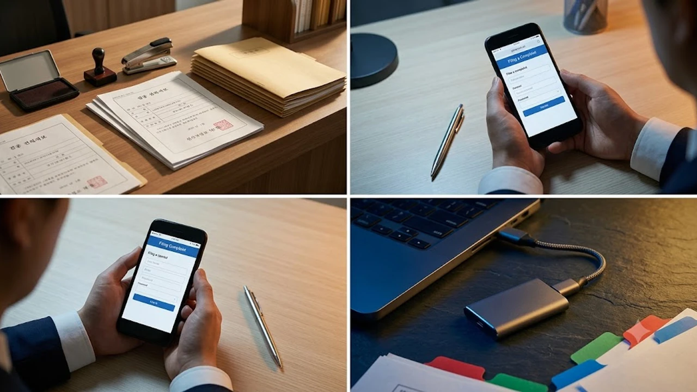

2026년 10월 2일, 76년간 유지되던 검찰청이 공식 해체되면서 **공소청 출범 고소방법**을 둘러싼 혼란이 현장에서 터져 나오고 있습니다. 사기나 횡령 피해를 입자마자 서초동 검찰청 종합민원실로 달려가 고소장을 들이밀던 방식은 이제 법적으로 완전히 막혔습니다. 새로 바뀐 수사·기소 분리 체계의 동선을 모르면 피해 입증 서류가 기관 사이를 헛돌다 골든타임을 허무하게 날릴 수밖에 없습니다.

## 검찰청 해체와 공소청 체제의 현실

### 76년 만의 검찰청 폐지와 수사·기소의 절단
솔직히 말하면, 이번 개편은 단순한 현판 교체가 아니라 형사 사법 시스템의 뼈대를 갈아엎은 일입니다. 법 개정에 따라 과거 기소권과 수사지휘권, 자체 수사 인력을 모두 틀어쥐었던 검찰청이라는 조직 자체가 법률상 영구 소멸했습니다. 새로 들어선 공소관청은 오로지 재판에 피고인을 넘기는 공소 제기와 법정 공소 유지 권한만 행사하며, 범인을 직접 추적하고 증거를 압수하는 현장 수사 기능은 완전히 떨어져 나갔습니다.

### 공소청의 한계와 중대범죄수사청의 분리 출범
새로 문을 연 공소청은 '기소 전담 조직'이라 자체 수사관을 이끌고 압수수색을 나가거나 피의자를 긴급체포할 권한이 없습니다. 대신 부패·경제·방위사업 등 중대 범죄를 전담 수사하는 별도 기구로 행정안전부 산하 **중대범죄수사청(중수청)**이 공식 가동되었습니다. 한 건물 안에서 수사와 기소가 원스톱으로 끝나던 시대는 끝났고, 수사 기관과 기소 기관이 서류를 엄격히 주고받으며 통제하는 구조로 바뀌었습니다. 권력형 비리나 대형 의혹 사건의 법정행 역시 [윤석열 1심 집행유예 선고, 397억 반환 진짜 가능할까?](/posts/society/yoon-first-trial-verdict-appeal-consequences-2026/) 사안처럼 공소청의 깐깐한 법리 검증을 통과해야 성립합니다.

### 미제 고소 사건의 강제 배당과 처리 지연
기존 검찰청 특수부나 형사부 캐비닛에 쌓여 있던 진행 중 사건들은 혼선 그 자체입니다. 검사의 직접 수사권이 사라진 탓에 검사실에서 수사 중이던 일반 사기·배임 사건 수만 건이 관할 경찰서와 중수청으로 강제 이송되었습니다. 손때 묻은 수사 기록이 경찰로 넘어가 새 수사관을 배정받는 과정에서 최소 2~3개월의 병목 현상이 발생하고 있습니다. 고소인 스스로 내 사건의 새 배당 번호와 담당 부서를 추적하지 않으면 서류는 캐비닛 속에서 그대로 잠자게 됩니다.

## 사기 피해 발생 시 완전히 달라진 고소 접수 경로

### 검찰 직고소 금지와 국가경찰 단일 창구화
이게 말이 되냐 싶겠지만, 억대 전세사기나 코인 다단계 피해를 겪었더라도 공소청 민원실에는 고소장 서류 한 장 낼 수 없습니다. 일반 사기, 횡령, 배임 사건의 1차 접수 창구는 무조건 **국가경찰(경찰서 수사과 경제범죄수사팀)**로 일원화되었습니다. 과거처럼 "경찰 수사가 미덥지 못하니 검찰청에 곧장 넣겠다"는 우회 접수 통로는 완전히 차단되었습니다. 헛걸음하지 않으려면 피고소인의 주소지나 피해 발생지 관할 경찰서 민원실을 1순위로 찾아가야 합니다.

> **접수 핵심 원칙:** 공소청은 민간 고소장을 직접 받지 않으며, 서류를 들고 찾아가도 경찰서로 접수처를 돌리라는 반려 안내를 받습니다.

### 5억 이상 경제범죄의 중수청 관할 기준
신설된 중수청의 문턱은 일반 시민에게 매우 높습니다. 특정경제범죄 가중처벌 등에 관한 법률(특경법)의 적용을 받는 이득액 5억 원 이상의 대형 사기나 횡령, 3천만 원 이상의 뇌물수수 사건 등 법에 규정된 6대 중대범죄 요건을 충족해야만 중수청 직고소 대상이 됩니다. 피해액이 5억 원을 밑도는 일반 사기 사건은 선택의 여지 없이 일선 경찰서 경제팀의 문을 두드려야 합니다.

### 온라인 고소·고발 통합 전산망의 분리
형사사법포털(KICS) 사이트 역시 완전히 갈라졌습니다. 경찰청 전산망과 공소청 시스템이 분리 운영되므로, 온라인으로 고소장을 접수할 때는 '경찰청 범죄신고·사건접수 통합시스템'을 이용해야 정상 접수됩니다. 접수증 발급 주체가 '경찰청'으로 찍히는지 반드시 확인해야 하며, 공소청 전산망에서는 이미 기소 결정이 내려진 재판 진행 내역만 확인할 수 있습니다.

## 경찰 불송치 결정 시 이의신청 실전 대응 전략

### 직접 보완수사 폐지와 경찰 책임 구조
당신이 모르는 진실 중 가장 치명적인 지점은 검사의 '직접 보완수사'가 사라졌다는 사실입니다. 예전에는 경찰이 혐의 입증이 어렵다며 '불송치' 결정을 내려도, 억울함을 호소하면 검사가 직접 계좌를 추적하거나 피의자를 소환해 반전을 만들어내는 경우가 있었습니다. 이제 공소청 공소관은 오직 서류만 검토한 뒤 경찰에 "이 대목을 다시 수사하라"며 **보완수사 요구**만 내려보낼 수 있습니다. 경찰 1차 수사 단계에서 결정적 물증을 심어두지 못하면 사건이 미궁으로 빠질 위험이 훨씬 커졌습니다.

### 3개월로 못 박힌 이의신청 법정 기한
경찰 수사관으로부터 불송치 결정 통지서를 받았다면 지체할 시간이 없습니다. 개정 법률에 따라 고소인의 이의신청권 행사 기한은 통지서를 받은 날부터 **3개월 이내**로 제한됩니다. 이 기한을 하루라도 넘기면 불송치 결정이 그대로 확정되어 사건은 영구 종결됩니다. 통지서를 받자마자 정보공개청구로 불송치결정서 원문과 수사관의 판단 이유를 확보해 허점을 찾아내야 합니다.

- **기한 확인:** 통지서 수령 날짜 기준 90일 이내에 관할 경찰서에 이의신청서가 도달해야 인정
- **정보공개 청구:** 수사결과통지서 세부 이유서와 피의자 진술 요약본 원문 즉각 열람
- **물증 보강:** 경찰이 누락한 입출금 메모, 통화 녹취록 포렌식 기록을 증거 순번 매겨 재제출
- **법리 오인 지적:** 경찰이 민사 사안으로 치부한 편취 고의성을 구체적 판례를 들어 반박

### 재수사 요구를 이끌어내는 문서 작성법
이의신청서에 "억울해서 살 수가 없다"는 식의 감정적 호소는 백날 써봐야 휴지통으로 직행합니다. 공소관이 경찰 수사관에게 재수사를 명령하게 만들려면 법리적 결함을 정밀 타격해야 합니다. "피의자가 편취금을 변제할 능력이 전혀 없었음을 입증하는 금융 거래 내역서가 수사 기록에서 누락되었으므로 형사소송법상 재수사 요구권을 행사해 줄 것을 요청함"과 같이 공소관이 경찰에 보낼 공문 문구를 직접 쥐여준다는 마음으로 써야 서류가 다시 움직입니다.

## 개편된 형사 제도 속 고소인의 실전 생존법

### 경찰 접수번호와 담당 수사관 직통망 확보
사건이 시작되면 기존의 단일 사건번호 관리 방식은 통하지 않습니다. 경찰 수사 단계의 '사건접수번호'를 문자메시지로 즉시 메모하고, 배정된 담당 수사관의 직통 내선 번호와 소속 팀을 파악해야 합니다. 사건 진행이 한 달 이상 멈춰 있다면 정보공개포털을 통해 수사 진행 상황 통지서를 공식 청구해 수사관의 수사 의지를 끌어올리는 악착같음이 필요합니다.

### 자체 증거 수집과 포렌식 데이터의 완결성
수사 기관들이 서로 관할을 다투거나 서류 검토를 지연시키는 사이 피의자는 증거를 인멸하고 재산을 빼돌립니다. 경찰 인력이 부족하다고 한탄해 봐야 내 돈을 찾아주지 않습니다. 통화 녹음 파일 전문, 계좌 이체 확인증, 메신저 대화 캡처본을 육하원칙에 맞춰 바인더에 철하고 일목요연한 목차를 붙여 고소 첫날 한 번에 밀어 넣어야 수사가 막힘없이 돌아갑니다.

### 서류 유실 방지와 디지털 증거 영구 보존
사건 기록이 경찰서, 중수청, 공소청 사이를 오가며 우편 발송과 데이터 이관을 거치는 과정에서 첨부 서류 누락 사고가 실제로 터지고 있습니다. 모든 원본 증빙 서류는 고화질 PDF로 스캔해 외장 저장장치에 분산 보관하고, 경찰에 낸 고소장 원본과 수사 접수증을 실물 파일철에 묶어 두는 철저함이 내 권리를 지켜줍니다.

사법 기관이 알아서 증거를 찾아 범인을 단죄해 주던 시절은 지났습니다. 분리된 수사·기소 환경에서 내 권익을 건져내는 무기는 빈틈없는 디지털 증거 보존과 서류 관리입니다. 방대한 녹취 음성 파일, 계좌 입출금 데이터, 계약서 스캔본을 안전하게 암호화해 보관할 수 있는 [초고속 대용량 외장SSD 쿠팡에서 보기](https://www.coupang.com/np/search?q=%EC%99%B8%EC%9E%A5SSD&sourceType=affiliate&trackingCode=AF8691300) 장비로 만일의 서류 누락에 철저히 대비하는 편이 안전합니다.

#공소청 #검찰청폐지 #중대범죄수사청 #사기고소방법 #형사소송법개정 #경찰불송치이의신청 #형사고소절차 #수사기소분리