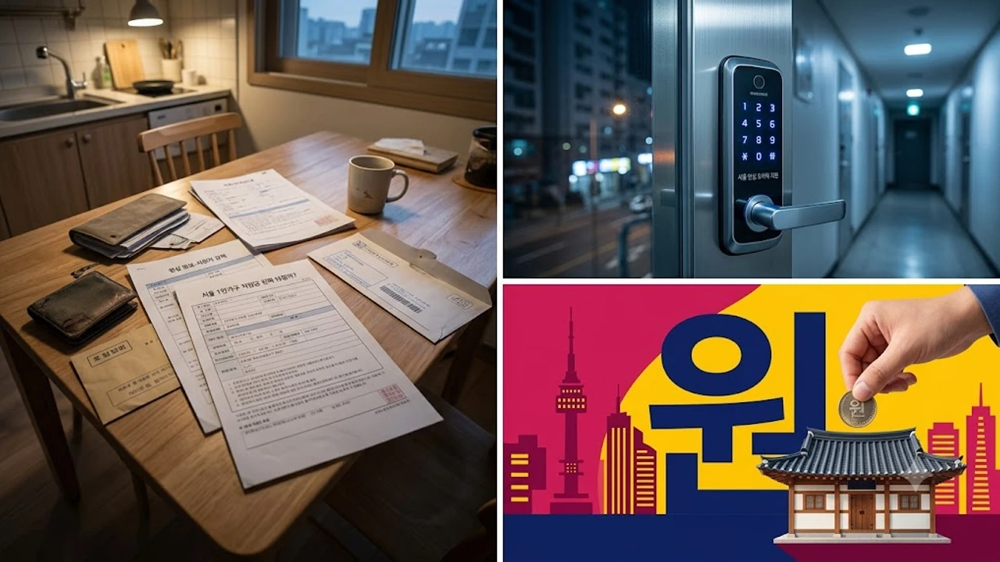

서울 시내 전체 가구 셋 중 하나를 훌쩍 넘어선 1인가구 비중 속에서, 이번 가을 발표된 **서울 1인가구 지원** 개편안은 단순한 전시성 홍보를 넘어선 실질적 구조 조정을 담고 있습니다. 월세 부담과 생활 안보 문제로 고민하던 독거 청년과 중장년층 사이에서 과연 내 통장과 주거지에 직접 닿는 실질적 혜택이 맞는지에 대한 갑론을박이 뜨겁습니다.

## 체감 지원금과 현실 괴리, 무엇이 문제인가

### 현금성 보조의 엄격한 소득 기준과 사각지대
솔직히 말하면 매번 쏟아지는 지자체 복지 공약 중 대다수는 기준선에 걸려 탈락하기 일쑤였습니다. 기준 중위소득 120% 혹은 150% 이하라는 문턱은 쥐꼬리만 한 급여를 받는 사회초년생조차 '애매한 소득자'로 분류해 바깥으로 밀어냈습니다. 실질적인 주거비 지출과 공과금 상승 폭을 고려하지 않은 서류상 소득 심사는 청년층의 박탈감만 키웠습니다.

### 바우처 형태의 실효성 논란과 현장 반응
직접적인 현금 입금이 아닌 제한적 용도의 바우처 지급은 사용처가 극히 제한되어 실생활 체감도가 크게 떨어졌습니다. 편의점이나 전통시장 일부 가맹점에서만 쓸 수 있는 형태로는 치솟는 월세나 보증금 이자를 감당할 수 없습니다. 현장에서는 "차라리 교통비나 통신비 직접 감면이 훨씬 현실적"이라는 목소리가 터져 나오는 실정입니다.

### 세대별 지원 편중과 중장년 1인가구의 소외
그동안의 1인가구 대책은 주로 2030 청년층과 독거노인 계층에 양극화되어 집중되었습니다. 정작 실직, 이혼 등으로 고립 위기에 놓인 4050 중장년 단독 가구는 복지 혜택의 사각지대에 방치되었습니다. 고독사와 질병 위험에 무방비로 노출된 중장년층을 포용하는 촘촘한 안전망 재설계가 절실한 시점입니다.

## 주거 불안 해소 대책과 안심 장치 개편

### 전월세 안심계약 도움서비스의 현주소
부동산 중개 사기와 깡통전세 공포 속에서 서울시가 운영 중인 안심계약 도우미 제도는 확연한 명암을 보입니다. 공인중개사 자격을 가진 상담사가 현장 동행까지 해주는 서비스는 호평을 받았으나, 특정 자치구에 예약이 쏠려 정작 필요할 때 상담을 잡기 어렵다는 치명적인 한계가 여전합니다. 청년 주거 안정을 꾀하려면 [버스하우스 청년주택 진짜 해법일까?](/posts/society/youth-bus-house-housing-issue-2026/) 논의처럼 거주 인프라 공급과 밀접하게 연계해야 합니다.

### 안심마을 보안관과 여성 1인가구 방범 실효성
골목길 취약 구역을 심야 순찰하는 안심마을 보안관은 주거 밀집 지역 거주자들에게 심리적 안정감을 제공했습니다. 귀갓길 불안을 덜어주는 제도로는 [2026년 안심 귀가 서비스 완전 정리](/posts/society/youth-safety-stranger-anxiety-2026/)와 같은 지자체 연계망이 함께 가동 중입니다. 다만 단순 가시적 순찰에 그치지 않고 스마트 CCTV 및 지능형 비상벨과의 시스템 통합이 뒤따라야 범죄 예방력을 극대화할 수 있습니다.

> "현관문 앞 도어벨 카메라 설치 지원은 실질적인 안도감을 주었지만, 이사 갈 때마다 철거와 재설치를 자부담해야 하는 점은 개선이 시급합니다." — 관악구 봉천동 거주 3년 차 직장인 인터뷰 중

## 돌봄·고립 예방 시스템의 구조적 전환

### 병원 안심동행 서비스의 유료화와 이용 장벽
갑자기 몸이 아파 거동이 힘들 때 병원 접수부터 귀가까지 보호자 역할을 대신해 주는 동행 서비스는 1인가구의 필수 안전망으로 자리 잡았습니다. 그러나 기본 이용료 외에 추가 시간당 자부담 비용이 붙으면서, 경제적 취약 계층이 정작 큰 수술이나 정밀 검사를 앞두고 부르기엔 부담스럽다는 현실적 벽이 존재합니다.

### 고독사 고위험군 조기 발굴과 스마트 센서망
전력 사용량과 수도 사용량 급감, 휴대폰 통화 기록 부재를 감지해 위험 신호를 울리는 IoT 스마트 플러그 사업은 고립 가구 관리에 뚜렷한 진전을 가져왔습니다. 기계적 알람에 그치지 않고 복지 플래너가 당일 현장 방문을 의무화하는 시스템이 갖춰져야 실질적인 생명 보호로 이어집니다.

### 마음건강 상담 인프라의 질적 확장
우울감과 사회적 고립을 호소하는 단독 가구를 위한 1:1 심리상담 센터는 대기 기간만 평균 2~3개월에 달합니다. 상담 횟수를 늘리는 것도 필요하지만, 위기 징후 발견 시 즉각적인 정신건강의학과 전문의 치료 연계까지 이어지는 원스톱 체계 구축이 급선무입니다.

## 놓치면 후회하는 신청 절차와 실속 챙기기

### 서울시 1인가구 포털 '씽글벙글 서울' 200% 활용법
모든 사업의 출발점은 서울시 전용 포털입니다. 회원가입 후 거주 자치구를 설정해 두면 해당 동네에서만 진행하는 방범 세트 지원, 무료 건강검진, 요리 교실 등 알짜 혜택 알림을 실시간으로 받아볼 수 있습니다. 포털 내 자가진단표를 통해 본인이 수혜 대상인 항목을 5분 만에 걸러내는 작업부터 시작해야 합니다.

### 자치구별 자체 지원 예산과 특화 프로그램 선점
시 전체 공통 사업 외에 강남구, 관악구, 마포구 등 1인가구 밀집 자치구는 자체 구비를 투입해 독자적인 혜택을 추가 제공합니다. 이사비 지원 바우처나 방범 방충망 무료 시공처럼 선착순으로 마감되는 구정 특화 사업은 분기 초 공고를 확인하는 발 빠른 움직임이 필수입니다.

### 신청 탈락을 막는 서류 검증 노하우
주민등록등본상 세대분리 여부, 건강보험료 납부확인서 상의 부양자 등재 관계는 단독 가구 신청 시 가장 잦은 탈락 원인입니다. 신청 전 정부24를 통해 본인이 온전한 1인 단독 세대주로 분리되어 있는지, 건강보험료가 지역/직장가입자 기준선에 부합하는지 사전 검증을 마쳐야 헛걸음을 피할 수 있습니다.

[1인가구 방범도어락 필수 생필품 쿠팡에서 보기](https://www.coupang.com/np/search?q=%ED%98%84%EA%B4%80%EB%AC%B8+%EB%8F%84%EC%96%B4%EB%9D%BD&sourceType=affiliate&trackingCode=AF8691300)

#서울1인가구지원 #1인가구정책 #서울시복지혜택 #청년주거지원 #안심귀가서비스 #병원안심동행 #고독사예방 #씽글벙글서울