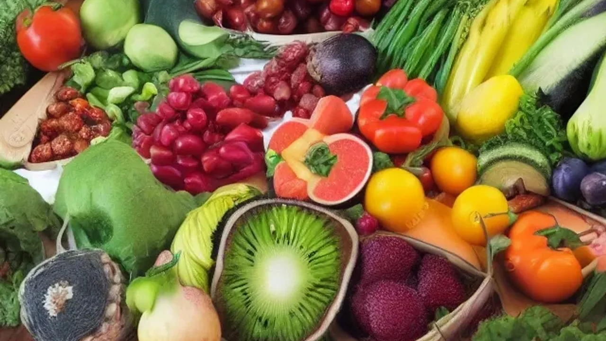
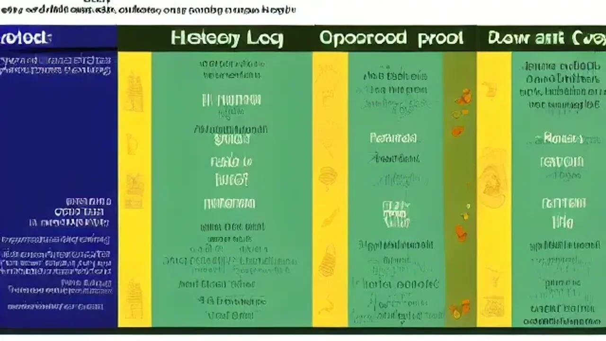

Markdown
2026년 들어 건강한 삶을 지속하고자 하는 대중의 열망이 커지면서 일상 속 웰니스 전환이 가속화되고 있습니다. 특히 급격한 신체 노화를 예방하고 활력을 되찾기 위한 구체적인 방법으로 **저속노화 식단**을 선택하는 이들이 급증하는 추세입니다. 현대인의 식습관 문제를 근본적으로 해결해 줄 수 있는 이 식단의 과학적 원리와 실천 가이드를 명확히 정리했습니다.

## 2026년 왜 모두가 '저속노화 식단'에 열광할까?

### 노화 가속하는 현대인의 식습관과 저속노화의 과학적 원리
정제 탄수화물과 액상과당 위주의 배달 음식은 혈당을 급격히 높여 췌장에 무리를 주고 세포 염증을 유발합니다. 서울아산병원 노년내과 연구팀의 분석에 따르면, 단순당 tobacco와 정제 곡물의 과도한 섭취는 체내 최종당화산물(AGEs)을 축적시켜 실제 나이보다 생체 시계를 빠르게 돌리는 핵심 원인으로 지목되었습니다. 저속노화 라이프는 혈당 지수(GI)가 낮은 복합 탄수화물과 풍부한 식이섬유를 배치하여 신체 산화 스트레스를 억제하는 과학적 원리에 기반합니다. 세포 수준의 미토콘드리아 기능을 유지하여 노화 속도를 자연스럽게 늦추는 방식입니다.

### 단순한 다이어트와 저속노화 라이프스타일의 결정적 차이점
체중 감량만을 목적으로 삼는 일반적인 다이어트는 극단적인 칼로리 제한이나 단일 영양소 배제를 동반하여 오히려 피부 탄력 저하나 탈모 같은 노화 증상을 부추기기 쉽습니다. 반면 이 웰니스 식단은 체중 숫자에 연연하지 않고 장기적인 장내 미생물 생태계(마이크로바이옴) 개선과 혈당 안정성을 최우선 가치로 둡니다. 칼로리를 굶어서 줄이는 것이 아니라, 영양소의 질적 전환을 통해 신체 내부의 만성 염증을 제거하는 관점의 차이가 존재합니다.

### 초고령화 사회, 2030 세대부터 시작되는 웰니스 전환 트렌드
과거에는 노화 방지가 50대 이상 장년층의 전유물로 여겨졌으나, 2026년 현재는 젊은 층이 이 트렌드를 주도합니다. 이른바 '가속노화' 환경에 노출된 20대와 30대 직장인들이 식곤증, 만성 피로, 집중력 저하를 극복하고자 스스로 밥상을 바꾸기 시작했습니다. 사회 전체적으로 고령화가 가속화되면서 질병 없이 건강하게 나이 드는 '웰에이징'에 대한 대중적 인식이 전 세대에 걸쳐 확고하게 뿌리내렸습니다.

## 일상에서 바로 시작하는 저속노화 밥상 실천법

### 거꾸로 식사법: 채소, 단백질, 탄수화물 순서로 먹는 구체적 방법
음식을 입에 넣는 순서만 변경해도 혈당 스파이크를 상당 부분 예방할 수 있습니다. 식사를 시작할 때 가장 먼저 샐러드나 나물 같은 식이섬유를 충분히 섭취하여 장벽에 일종의 방어막을 형성합니다. 그 후 두부, 생선, 육류 등의 단백질 성분을 먹고, 밥이나 면 같은 탄수화물은 맨 나중에 섭취하는 일련의 과정입니다. 이 방식을 적용하면 포만감이 빠르게 유도되어 자연스럽게 정제 탄수화물 섭취량이 줄어드는 이점이 있습니다.

### 밥상부터 바꾸는 저당·고식이섬유 대체 식재료 고르기
흰쌀밥과 밀가루 면을 퇴출하고 대체 식재료를 채워 넣는 작업이 필요합니다. 현미, 귀리, 카무트, 렌틸콩을 믹스한 잡곡밥은 식이섬유가 풍부해 소화 흡수 속도를 늦춰줍니다. 

> **식재료 전환 핵심 팁**
> - 일반 백미밥 → 귀리, 카무트, 렌틸콩을 4:3:3 비율로 섞은 잡곡밥
> - 밀가루 소면 → 두부면 또는 메밀 함량 80% 이상의 메밀면
> - 설탕 및 올리고당 → 알룰로스 또는 스테비아 천연 감미료

[관련 글 보기](/posts/society/)

### 바쁜 직장인을 위한 일주일 단위 웰니스 밀프레프 루틴
매일 완벽한 조리를 반복하기 어려운 직장인들은 주말을 활용한 밀프레프(Meal Prep) 가이드가 유용합니다. 일요일 저녁, 일주일 동안 먹을 잡곡밥을 소분하여 냉동 보관하고 브로콜리, 파프리카, 양배추를 씻어 밀폐 용기에 담아둡니다. 닭가슴살이나 삶은 달걀 같은 단백질원을 1회 분량씩 포장해 두면 출근 전 빠르게 건강한 도시락을 구성할 수 있어 지출과 시간을 동시에 절약합니다.

## 30일간 직접 체험해 본 저속노화 라이프의 신체 변화

### 만성 피로와 식곤증이 사라진 첫 2주간의 솔직한 후기
매일 오후 2시만 되면 찾아오던 극심한 식곤증과 무기력증을 개선하고자 한 달간 직접 식단 전환을 시도했습니다. 정제 탄수화물을 끊고 렌틸콩 잡곡밥과 채소 위주의 식단을 유지한 지 불과 7일 만에 점심 식사 후 뇌가 흐려지는 브레인 포그 증상이 눈에 띄게 완화되었습니다. 혈당이 급격히 오르내리는 롤러코스터 현상이 차단되면서 하루 종일 일정한 에너지가 유지되는 경험을 했습니다.

### 웨어러블 기기로 측정한 수면의 질 및 생체 데이터 변화
실제 스마트워치의 생체 데이터 수치를 확인한 결과, 식단 변경 전 평균 65점에 머물던 수면 점수가 3주 차에 접어들며 82점까지 상승했습니다. 야식과 정제당 섭섭취를 제한하자 수면 중 심박수가 안정되었고, 깊은 수면(Deep Sleep)의 비율이 기존 대비 약 18% 증가했습니다. 아침에 눈을 떴을 때 느껴지는 신체 무거움이 줄어들어 컨디션 관리가 한결 수월해졌습니다.

### 식단 전환 과정에서 겪은 명현 현상과 주의해야 할 부작용
모든 과정이 순탄한 것만은 아니었습니다. 평소 정제당 섭취량이 많았던 탓에 식단 시작 후 첫 3일 동안은 가벼운 두통과 무기력감 같은 일종의 탄수화물 금단 증상을 겪었습니다. 또한 갑작스럽게 식이섬유 섭취량을 늘리다 보니 초기 일주일간 복부 팽만감과 가스가 차는 불편함이 동반되기도 했습니다. 이러한 부작용을 막기 위해서는 수분 섭취량을 평소보다 500ml 이상 늘리고 조리된 채소부터 천천히 적응해 나가는 단계적 접근이 요구됩니다.

## 저속노화 식단 vs 일반 웰니스 식단 장단점 총정리

### 혈당 스파이크 방지와 면역력 강화라는 뚜렷한 장점
가장 확실한 이득은 인슐린 분비 체계의 안정화입니다. 세포 염증 반응을 유발하는 혈당 스파이크를 원천 차단하므로 피부 트러블이 가라앉고 안색이 맑아지는 시각적 변화를 마주합니다. 장내 유익균의 먹이가 되는 식이섬유 공급량이 늘어나면서 면역 세포의 70%가 집중된 장 건강이 살아나 감기 등 자잘한 질병에 걸리는 빈도가 확연히 줄어듭니다.

### 초기 식재료 비용 부담과 외식 환경에서의 실천적 한계점
반면 단점도 명확합니다. 귀리, 카무트, 유기농 채소, 아보카도 오일 등 고품질 식재료를 구비하는 과정에서 초기 가계 식비 지출이 기존보다 상승할 수 있습니다. 더욱이 대한민국 외식 환경은 대부분 설탕과 흰 밀가루를 기반으로 조리되므로, 직장 동료들과 함께하는 점심 식사 자리에서 나만의 웰니스 기준을 완고하게 관철하기가 현실적으로 어렵다는 실천적 한계가 따릅니다.

### 지속 가능한 건강 관리를 위한 나만의 타협점 찾는 법
극단적인 완벽주의는 오히려 중도 포기를 부르기 쉽습니다. 따라서 일상 생활과 타협할 수 있는 현명한 완급 조절 규칙을 세우는 방안을 권장합니다. 집에서 먹는 아침과 저녁 식사는 철저하게 저속노화 기준을 준수하되, 회사 동료들과 함께하는 점심 식사 시에는 일반식을 먹되 밥 양을 반으로 줄이고 채소 반찬을 먼저 집어먹는 식으로 유연함을 발휘하는 원리입니다. 주 1회 정도는 원하는 음식을 편하게 즐기는 치팅데이를 허용하는 행동이 지치지 않고 라이프스타일을 지속하게 만드는 원동력이 됩니다.

#저속노화식단 #웰니스전환 #혈당스파이크 #가속노화방지 #식곤증극복 #장내미생물 #거꾸로식사법 #잡곡밥레시피 #건강라이프스타일 #2026트렌드