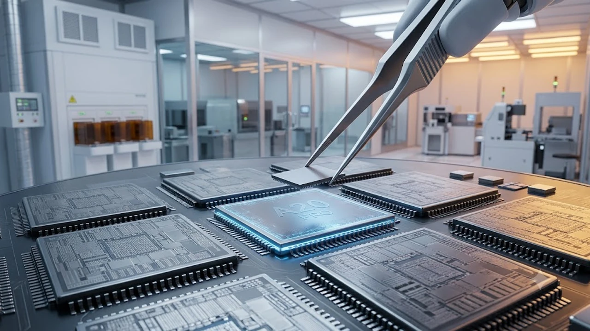

매년 9월이면 반복되는 신제품 출시 경쟁 속에서 이번 아이폰18 발표는 유독 체감 온도가 남다릅니다. 전자기기 교체 주기를 훌쩍 넘긴 구형 스마트폰 이용자들까지 온디바이스 AI 구동 범위와 프로세서 공정 혁신을 따져보며 출시 시점을 정밀하게 계산하고 있습니다.

## 아이폰18 공개일정 및 국내 사전예약 시점 분석

### 2026 애플 가을 키노트 확정 일정과 중계 채널

애플은 통상 9월 둘째 주 화요일이나 수요일에 글로벌 키노트 행사를 엽니다. 2026년 가을 스페셜 이벤트 역시 한국 시각 기준 9월 9일 새벽 2시로 가닥이 잡혔습니다. 애플 공식 홈페이지와 유튜브 채널을 통해 실시간 송출되며, 이번 행사에서는 스마트폰 외에도 차세대 애플워치 라인업이 나란히 베일을 벗습니다.

### 1차 출시국 포함 여부와 통신 3사 사전예약 타임라인

한국이 연속으로 1차 출시국에 이름을 올리면서 대기 시간은 확 줄었습니다. 글로벌 공개 직후 주말인 9월 11일(금)부터 국내 이동통신 3사와 오픈마켓 자급제 채널의 사전예약 페이지가 일제히 열립니다. 자급제 1차 배송 물량은 오픈 10분 만에 마감되는 패턴이 굳어진 만큼, 결제 수단과 배송지를 사전에 등록해두지 않으면 10월 중순 이후로 수령일이 밀리기 십상입니다.

### 공식 출시일 배송 일정과 매장 수령 팁

사전예약 1차 물량의 공식 수령일은 9월 18일(금)입니다. 당일 새벽 배송을 보장하는 온라인 오픈마켓 채널을 집중 공략하거나, 명동·하남·홍대 등 오프라인 애플스토어 픽업 첫 회차(오전 8시~9시)를 선점해야 출시 당일 지체 없이 실물을 손에 쥐고 개통을 마칠 수 있습니다.

## 2나노 A20 칩셋과 온디바이스 AI 주요 성능 변화

### TSMC 2나노 공정 기반 A20 프로 칩 성능 측정치

솔직히 말하면 지난 몇 세대 동안의 AP 업그레이드는 체감 성능 면에서 다소 심심했던 것이 사실입니다. 그러나 이번 A20 프로는 TSMC의 차세대 2나노(GAA) 공정을 적용해 단위 면적당 트랜지스터 집적도를 비약적으로 끌어올렸습니다. 긱벤치 멀티코어 점수 기준 전작 대비 18% 이상의 연산력 향상과 22% 수준의 전력 효율 개선을 확보해 헤비 유저들의 기대를 모으고 있습니다.

### 클라우드 연동 없는 차세대 애플 인텔리전스 구동 범위

당신이 모르는 진실 중 하나는 기존 스마트폰 AI 기능의 절반 이상이 외부 클라우드 서버와 데이터를 주고받는 방식이었다는 점입니다. 반면 이번 기기는 16코어 전용 NPU 대역폭을 두 배로 넓혀 음성 메모 실시간 요약, 고용량 사진 편집, 복합 연산 처리를 오프라인 상태에서 즉각 수행합니다. 개인정보 유출 우려를 원천 차단하는 진정한 온디바이스 환경이 비로소 완성된 셈입니다.

### 배터리 효율 개선과 고발열 해소 설계 차이

> "초미세 공정 도입의 진짜 가치는 피크 전력 제어와 지속 성능 유지력에서 판가름 난다."

내부 냉각 구조에 대형 베이퍼 챔버를 전 모델 기본 장착하여 고사양 3D 렌더링 작업이나 고화질 영상 촬영 중 발생하던 쓰로틀링 현상을 억제했습니다. 실제 동일 사용 시간 기준 발열 온도가 3도 이상 낮아져 배터리 수명 저하를 방어합니다.

## 아이폰18 라인업별 디스플레이 및 카메라 스펙 비교

### 전 모델 120Hz 프로모션 적용 및 베젤 두께 변화

일반 모델 구매자들의 원성을 샀던 화면 주사율 급나누기가 마침내 종식되었습니다. 기본형과 플러스 라인업에도 1~120Hz 가변 주사율 디스플레이가 탑재되어 스크롤 버벅임 없는 매끄러운 화면 전환을 체감할 수 있습니다. 보더 리덕션 구조(BRS)를 고도화해 베젤 두께 역시 프로 모델 기준 1.1mm 수준까지 얇아졌습니다.

### 가변 조리개 메인 카메라 탑재에 따른 야간 촬영 성능

후면 메인 광각 렌즈에 물리적 가변 조리개 메커니즘이 도입되었습니다. 주광 환경에서는 F2.4로 조여 주변부 왜곡과 빛 번짐을 잡고, 광량이 부족한 야간 실내나 어두운 골목길에서는 F1.4까지 활짝 열어 센서 노이즈를 획기적으로 줄여줍니다. 야간 인물 모드 결과물의 심도 표현력이 전문가용 렌즈 못지않은 완성도를 보여줍니다.

### 기본형과 프로 모델 간 급나누기 실질적 체감 요소

- **하우징 소재**: 기본형 알루미늄 vs 프로 등급 유광 티타늄 프레임
- **망원 줌 배율**: 일반 2배 센서 크롭 vs 프로 전용 5배 잠망경 테트라프리즘
- **전송 인터페이스**: 기본형 USB 3.2 지원 vs 프로 모델 고속 썬더볼트 대역폭
- **화면 밝기**: 실외 피크 밝기 기준 기본형 2,200니트, 프로 라인업 2,800니트

플랫폼 규제나 기술 격차가 일상에 미치는 영향이 궁금하다면 [사회 전체 글 보기](/posts/society/)를 함께 확인해 볼 필요가 있습니다.

## 출고가 인상 전망과 구형 모델 보상판매 가이드

### 2나노 제조 단가 인상에 따른 예상 출고가 범위

이게 말이 되냐는 반응이 나올 법도 한 부분은 바로 기기 가격입니다. TSMC 2나노 웨이퍼 단가가 장당 3만 달러를 돌파함에 따라 출고가 방어에 제동이 걸렸습니다. 국내 기본형 기준 130만 원대 초반, 프로 모델은 160만 원대 중반부터 시작할 공산이 큽니다. 용량 옵션을 512GB나 1TB로 올리는 순간 체감 부담액은 200만 원 선을 훌쩍 넘깁니다.

### 기존 기종별 트레이드인 최대 혜택 공략

비싼 신형 기기를 가장 합리적으로 품는 방법은 보상판매(Trade-in) 시세가 꺾이기 전에 기존 기기를 반납하는 전략입니다. 신제품 사전예약 직후 2주간 추가 보상 프로모션이 붙는 시점을 이용해야 중고 플랫폼 직거래 스트레스 없이 최대 60만~80만 원대 정산금을 확보할 수 있습니다.

### 자급제 알뜰폰 조합과 통신사 공시지원금 실구매가 계산

통신사 고가 5G 요금제 6개월 유지 의무와 유료 부가서비스 조건을 꼼꼼히 따져보면 무약정 자급제에 알뜰폰 무제한 요금제를 결합하는 방식이 2년 총비용 면에서 최소 40만 원 이상 절약됩니다. 공시지원금이 10만 원 안팎에 묶일 것이 뻔한 초기 개통 시즌에는 카드사 즉시 할인 혜택을 낀 자급제 단말기 선택이 정답입니다.

[아이폰 정품 고속 충전 액세서리 쿠팡에서 보기](https://www.coupang.com/np/search?q=%EC%95%84%EC%9D%B4%ED%8F%B0%EA%B3%A0%EC%86%8D%EC%B6%A9%EC%A0%84%EA%B8%B0&sourceType=affiliate&trackingCode=AF8691300)

#아이폰18 #아이폰18출시일 #아이폰18스펙 #A20칩셋 #온디바이스AI #애플이벤트 #스마트폰사전예약 #자급제알뜰폰