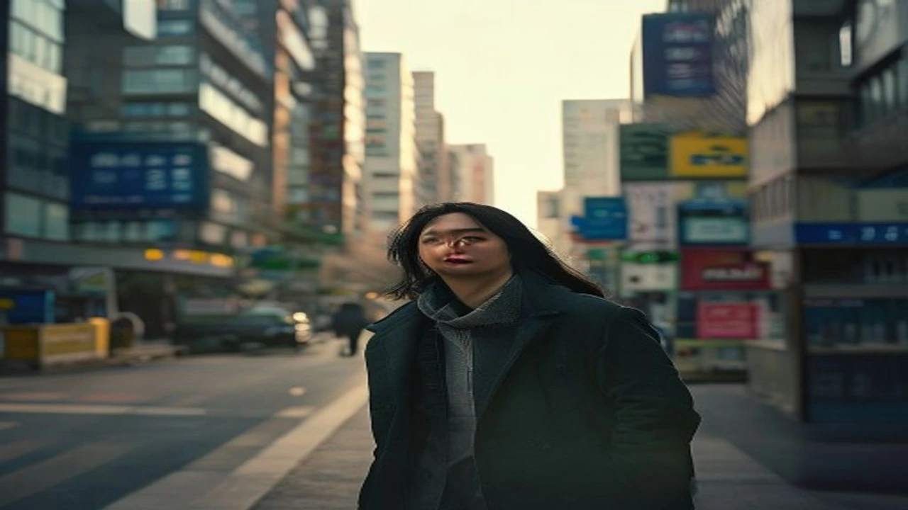

2026년 7월 27일, 법원이 윤석열 전 대통령의 공직선거법 위반 혐의에 징역형 집행유예를 때리면서 정치권과 사회 전체가 거센 후폭풍에 휩싸였습니다. 핵심 이슈인 **윤석열 1심 선고** 직후 피고인 측은 판결에 불복해 3시간 만에 항소장을 던졌고, 당선무효형 확정 시 국민의힘이 토해내야 할 397억 원 규모의 선거보전금 반환 문제가 판을 흔드는 최대 쟁점으로 떠올랐습니다. 400억 원에 달하는 돈을 진짜 반환해야 하는지, 법적 쟁점과 향후 재판 판도를 가감 없이 짚어봅니다.

## 2026년 7월 27일 윤석열 전 대통령 1심 선고 결과와 주요 쟁점

### 징역 1년 6개월·집행유예 3년 선고의 법적 의미
솔직히 말하면 이번 1심 재판부가 내린 징역 1년 6개월에 집행유예 3년은 정치권의 판세 계산을 완전히 박살 낸 판결입니다. 당선 무효 기준선인 벌금 100만 원을 아득히 뛰어넘는 중형이 꽂혔기 때문입니다. 피선거권 박탈형이 최종 확정되면 당선 무효 효력이 발생하고, 이는 곧 해당 후보를 간판으로 세웠던 정당의 선거 보전금 환수라는 거대한 재정 폭탄으로 직결됩니다.

### 공직선거법 위반 혐의 인정 배경과 재판부 판단 요지
재판부는 피고인이 대선 당시 터뜨린 핵심 해명 발언들을 정당한 정치적 수사가 아닌, 유권자 판단을 왜곡하려 한 허위사실 공표로 못 박았습니다. 표심을 흔들 목적과 고의성이 명백해 선거 공정성을 심각하게 훼손했다는 게 법원의 단호한 결론입니다.

### 선고 직후 3시간 만에 제출된 윤 전 대통령 측 항소장
판결문 먹물이 마르기도 전인 선고 3시간 만에 변호인단이 항소장을 접수했습니다. 1심 재판부의 사실오인과 법리오해를 좌시하지 않겠다는 강력한 반발이자 배수진입니다. 전격적인 항소로 사건은 즉시 서울고등법원으로 넘어갔으며, 양측은 2심에서 사실관계 재입증을 두고 사활을 건 진흙탕 법리 공방을 예고했습니다.

## 당선무효형 확정 시 국민의힘 397억 원 선거보전금 반환 법리

### 공직선거법상 정당 선거보전금 반환 의무 규정
당신이 모르는 진실 중 하나는 이 재판의 진짜 여파가 정당의 '통장 잔고'를 직접 타격한다는 점입니다. 공직선거법 제265조 및 제265조의2에 따르면, 정당이 추천한 대선 후보가 공직선거법 위반으로 징역형이나 100만 원 이상의 벌금형을 확정받으면 정당은 중앙선거관리위원회로부터 받아 간 선거 비용 전액을 도로 뱉어내야 합니다.

### 과거 사례와 비교해 본 397억 원 반환 시나리오
과거 국회의원이나 지자체장 선거에서 수억 원대 보전금이 환수된 적은 있습니다. 하지만 대선 단위에서 400억 원에 육박하는 거액을 정당이 일시에 토해내야 하는 상황은 대한민국 헌정사상 전례가 없습니다.

> **선거보전금 환수 법리 핵심 요약**
> * **환수 주체:** 중앙선거관리위원회
> * **환수 대상:** 정당(국민의힘)에 지급된 대선 선거비용 보전금 전체
> * **환수 금액:** 약 397억 원 (대선 당시 보전받은 총액)
> * **집행 조건:** 대법원 상고심에서 징역형 또는 100만 원 이상 벌금형 최종 확정 시

### 국민의힘 당사 및 정당 재정 구조에 미칠 영향
이게 말이 되냐는 탄식이 정당 내부에서 나올 수밖에 없는 이유가 바로 여기에 있습니다. 397억 원은 정당 하나를 사실상 껍데기만 남기는 거액입니다. 여의도 당사 매각이나 매달 들어오는 국고보조금 압류까지 이어질 수 있는 사안이기에, 정당 차원의 사법적·행정적 총력 대응이 불가피합니다. 사회 전반에 걸친 파장은 [사회 최신 트렌드](/posts/society/society-1783259692082/)에서도 주요 이슈로 다뤄질 만큼 파급력이 큽니다.

## 2심 항소심 재판 일정과 향후 법적·정치적 관전 포인트

### 상고심(대법원) 최종 확정까지 예상 소요 기간
공직선거법 제270조는 선거범 재판을 '1심 6개월, 2심 및 3심은 전심 선고 후 각 3개월 이내'에 끝내도록 규정합니다. 현실적으로 지연되는 경우가 잦지만, 사안의 파급력을 고려할 때 고등법원 2심 판결은 향후 3~5개월 내에 신속히 나올 가능성이 높습니다. 대법원 최종 확정까지도 1년을 넘기지 않을 것이라는 관측이 우세합니다.

### 검찰과 피고인 양측의 항소 이유서 핵심 논령 예상
* **피고인(윤 전 대통령 측):** 1심 재판부의 허위사실 인정에 대한 법리 오해 주장, 정치적 표현의 자유 범주에 속한다는 점을 강조하며 무죄 주장.
* **검찰 측:** 형량이 범죄의 중대성에 비해 가볍다는 양형 부당 주장 및 구형량 유지 요청.

### 정치권 반응 및 사회적 여론 형성의 분수령
여야는 판결 직후 격렬하게 대립하고 있습니다. 여권과 보수 진영은 "정치적 의도가 개입된 가혹한 판결"이라며 항소심에서의 반전을 기약하는 반면, 야권은 "사법 정의가 실현된 결과이며 선거보전금 환수 절차를 차질 없이 준비해야 한다"고 압박 수위를 바짝 끌어올렸습니다.

## 국민과 지지자가 알아야 할 향후 절차와 핵심 가이드

### 집행유예 판결에 따른 피고인의 법적 신분 변화
1심 판결만으로 형이 확정된 것은 아닙니다. 무죄추정의 원칙에 따라 항소심과 상고심 재판이 진행되는 동안 피고인의 법적 신분은 '재판을 받는 피고인' 상태로 유지됩니다. 따라서 당장 인신구속이 이뤄지거나 법적 불이익이 최종 확정되는 것은 아닙니다.

### 확정 판결 전까지의 선거 보전금 반환 소송 유예 요건
가장 많은 이들이 착각하는 대목이 바로 보전금 반환 시점입니다. 선관위가 국민의힘을 상대로 397억 원 환수 조치를 단행하려면 반드시 **대법원의 최종 확정 판결**이 나와야 합니다. 1심이나 2심에서 중형이 선고되더라도 판결이 확정되지 않은 상태에서는 환수 처분을 내릴 수 없습니다.

### 이번 판결이 향후 사법·정치 지형에 남긴 시사점
이번 판결은 정치인의 선거 발언에 대해 사법부가 어디까지 엄격한 잣대를 댈 수 있는지 보여준 선례입니다. 법적 기준과 사회적 파장을 둘러싼 논쟁은 비단 정치 영역에만 국한되지 않습니다. 최근 논란이 되는 [청소년 SNS 금지 법안 진짜 시행될까? 3가지 쟁점 정리](/posts/society/youth-sns-ban-law-issues-2026/)와 같은 정책적 갈등처럼, 사법적 판단이 대중의 삶과 정치 지형 전체를 흔드는 현상은 더욱 거세질 전망입니다.

#윤석열1심선고 #공직선거법위반 #397억반환 #국민의힘선거보전금 #윤석열집행유예 #선거비용환수 #항소심쟁점