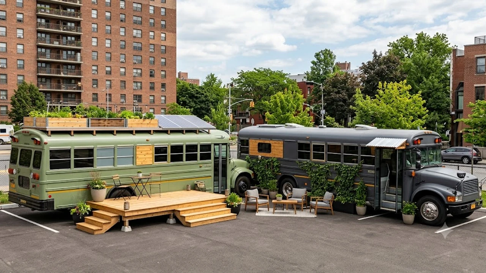

최근 정치권에서 폐버스를 개조해 대학가 임시 주거 공간으로 활용하자는 **버스하우스 청년주택** 제안이 나와 청년층의 거센 반발을 사며 논란이 더욱 열악해지고 있다. 솔직히 말해서 청년 주거난 해법이라는 명목으로 제시된 이 구상은 당사자인 2030 세대에게 깊은 허탈감과 분노를 안겨준다. 치솟는 월세와 청년 매입임대 부족이라는 현실적 고통 속에서 나온 대안이 고작 '버스에서 살라'는 것인지 묻지 않을 수 없다.

## 버스하우스 청년주택 제안 배경과 발단

### 폐버스 개조 청년주택 구상 내용
이번 논란은 국회 국토교통위원회 소속 황희 더불어민주당 의원이 폐기 예정인 버스를 리모델링하여 초저가 청년 주택으로 공급하자는 정책 아이디어를 발표하면서 시작됐다. 대학가나 역세권 부지에 버스를 배치하고 내부를 침실, 수건·세면 공간, 소형 주방으로 개조해 청년들에게 저렴하게 임대하자는 취지다.

### 해외 보트하우스 사례와의 차이점
발의자 측은 해외의 '보트하우스'나 모듈러 주택처럼 유휴 자원을 활용한 친환경적이고 신속한 주거 공급 모델이라고 주장한다. 하지만 운하 문화가 발달하고 정박 인프라가 갖춰진 유럽의 보트하우스와 달리, 대중교통 폐차량을 개조한 주거 공간은 차체 단열과 단수·단전 등 기본적인 주행/주거 규격부터 극명한 차이를 보인다.

### 정책 제안 직후 급속 확산된 청년층 반응
발표 직후 인터넷 커뮤니티와 SNS는 폭발했다. "집이 없지 자존심이 없냐", "나 반포살지롱, 센트럴 버스하우스에" 같은 자조 섞인 패러디 밈이 쏟아져 나왔다. 청년 주거 환경 개선을 고민해야 할 정치권이 오히려 청년들의 삶을 기어이 바닥으로 몰아넣는 탁상공론을 펼치고 있다는 냉소가 지배적이다.

---

## 버스하우스 논란의 핵심 쟁점 및 비판

### 주거 질과 안전성 측면의 한계
가장 큰 문제는 주거 환경의 기본 조건이다. 버스는 얇은 철판과 유리창으로 이루어져 있어 여름철 폭염과 겨울철 한파에 극도로 약하다. 
> **"단열재를 강화한다고 해도 철제 차량 특유의 결로와 곰팡이를 막기 어렵다. 화재 발생 시 출입구가 한정되어 있어 인명 피해 위험도 매우 높다."** — 건축·소방 전문가의 공통된 지적

### 정치권과 시민사회의 맞대응 및 여론
여당과 야당 내부에서조차 "현실을 몰라도 너무 모르는 내로남불식 발상"이라는 비판이 제기됐다. 청년층 단체들 역시 기부나 임시 구호 물품 다루듯 청년 주거를 접근하는 시각 자체를 문제 삼았다. 청년이 원하는 것은 '최소한의 존엄성을 지킬 수 있는 정상적인 집'이지 컨테이너나 버스 같은 임시 구조물이 아니다.

### 임시방편적 접근에 대한 사회적 우려
문제를 뿌리 뽑지 않고 자극적인 이벤트성 정책으로 땜질하려는 시도는 이전에도 반복되어 왔다. 안전 및 복지 시스템 전반이 흔들리는 사회적 분위기 속에서 이러한 미봉책은 정부 정책에 대한 신뢰를 무너뜨린다. 사회 전반의 안전망 구축 및 정책적 실효성에 대해 궁금하다면 [사회 전체 글 보기](/posts/society/)를 통해 관련 이슈들을 확인할 수 있다.

---

## 기존 청년 주거 지원 정책과의 비교 분석

### 청년 매입임대 및 행복주택과의 차이
기존 LH나 SH에서 진행하는 청년 매입임대주택 및 행복주택은 정식 건축법 기준을 충족하는 영구·장기 임대 형태다. 반면 버스하우스는 대지 지분이나 정식 건축물대장에 등재될 수 없는 가설물에 가깝다. 주거권 보장은커녕 전입신고나 보증금 보호 같은 법적 테두리조차 불투명하다.

### 예산 대비 실익 및 공급 속도 비교
* **기존 임대주택:** 부지 확보와 시공에 최소 2~3년 소요, 비용이 많이 들지만 장기 자산으로 활용 가능.
* **버스하우스:** 개조 비용 개당 수천만 원 소요, 차량 수명 한계로 3~5년 내 폐기 필요.
* **실익 분석:** 초기 세팅 비용은 적어 보일지 몰라도 상하수도 인프라 연결, 주차장 부지 임대료, 매년 유지보수비를 합산하면 결코 가성비 높은 대안이 아니다.

### 청년 가구가 실제로 원하는 주거 환경 조건
당신이 모르는 진실은 청년들이 단순히 '싼값'만을 원하는 게 아니라는 점이다. 청년들이 원하는 핵심 주거 조건은 다음과 같다.
- **안전한 보안 환경:** 도어락, CCTV, 출입 통제 시스템
- **대중교통 접근성:** 지하철역 및 버스정류장 도보권
- **기본적인 주거 인프라:** 방음, 단열, 개인 욕실 및 세탁 공간

---

## 청년 주거난 해결을 위한 구체적 가이드 및 제언

### 실질적인 청년 주거 안정 대책 방향
진짜 필요한 것은 보여주기식 특이한 주택이 아니다. 도심 내 유휴 국공유지를 적극 활용해 고밀도 소형 주택을 짓거나, 역세권 빌라·원룸을 공공이 장기 임차해 청년에게 저렴하게 재임대하는 **매입임대 제도 확대**가 훨씬 현실적이다.

### 청년층이 활용 가능한 현행 주거 지원 활용법
현재 주거난으로 고통받고 있다면 당장 활용 가능한 공공 정책부터 챙겨야 한다.
- **청년월세 특별지원:** 소득 요건 충족 시 월 최대 20만 원(최대 12개월) 지원
- **버팀목 전세자금 대출:** 청년 전용 저리(연 1~2%대) 전세자금 융자
- **LH·SH 청년매입임대:** 분기별 공고를 통해 시세 30~50% 수준으로 입주

### 지속 가능한 주거 복지 생태계 구축 방안
청년을 사회의 건강한 구성원으로 세우려면 '버려진 버스'에 격리할 것이 아니라, 정당한 주거권을 누릴 수 있는 제도를 설계해야 한다. 청년 주거 정책은 시혜적 시선이 아닌 국가의 미래 투자라는 관점에서 근본적으로 재설계되어야 할 때다.

**함께 읽으면 좋은 글**
- [AI 시대 생존 전략, 휴먼인더루프 완전 정리(진짜 중요)](/posts/society/ai-human-in-the-loop-survival-2026/)
- [2026 건강지능 높이는 진짜 맞춤형 관리법](/posts/society/health-quotient-lifestyle-2026/)

#버스하우스 #청년주택 #청년주거정책 #청년매입임대 #청년월세지원 #주거복지 #황희의원폐버스