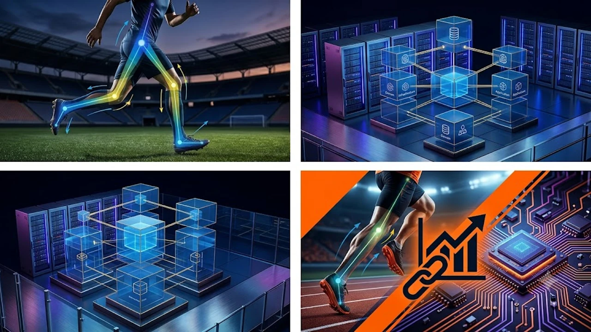

훈련 현장에 비전 센서와 모션 캡처가 침투하면서 **스포츠 AI 코칭**을 향한 관심이 급증했습니다. 관절 궤적과 부하량을 정밀하게 추적하는 *선수 퍼포먼스 분석 시스템*은 훈련 효율을 극대화하는 혁신으로 통합니다. 하지만 수치 데이터 뒤에 가려진 현장의 맥락까지 기계가 온전히 포착하기는 어렵습니다.


## 렌즈가 감지하지 못하는 신체 보상 동작

비전 트래킹 알고리즘은 관절 각도, 가속도, 질량 중심 궤적을 밀리초 단위로 분해해 분석합니다. 키포인트를 추적하는 컴퓨터 비전 기술은 육안 관찰의 한계를 가볍게 뛰어넘었습니다. 그러나 외형적 궤적이 매끄럽다고 해서 신체 내부 근육이 정상 작동한다는 뜻은 아닙니다.

```markdown
## 1. 아키텍처 개요 및 설계 원칙

시스템의 확장성과 유지보수성을 극대화하기 위해 도메인 주도 설계(DDD) 원칙과 계층형 아키텍처를 적용합니다. 각 모듈은 단일 책임 원칙(SRP)을 준수하며, 상호 간의 결합도를 낮추고 응집도를 높이는 방향으로 구성됩니다.

- **관심사 분리**: 비즈니스 로직, 데이터 접근 계층, 표현 계층을 명확히 격리합니다.
- **의존성 역전**: 고수준 모듈이 저수준 모듈의 구현 세부사항에 의존하지 않고 추상화 인터페이스에 의존하도록 설계합니다.
- **확장성 확보**: 마이크로서비스 및 비동기 이벤트 기반 확장을 고려한 모듈 분리를 지향합니다.

## 2. 핵심 계층 구조 및 모듈 인터페이스

애플리케이션은 네 가지 주요 레이어로 구성되며, 각 계층은 상위 또는 하위 계층과의 명확한 인터페이스 계약을 통해 통신합니다.

| 계층 | 역할 | 주요 구성 요소 |
| :--- | :--- | :--- |
| **Presentation** | 사용자 입력 검증 및 응답 변환 | REST Controller, DTO, Serializer |
| **Application** | 트랜잭션 관리 및 유스케이스 조율 | Application Service, Command Handler |
| **Domain** | 핵심 비즈니스 로직 및 규칙 수행 | Entity, Value Object, Domain Service |
| **Infrastructure** | 영속성 처리 및 외부 시스템 연동 | Repository Impl, External API Client |

## 3. 데이터 흐름 및 트랜잭션 관리 전략

클라이언트 요청이 발생했을 때 데이터가 시스템 내부를 거쳐 처리되는 순서와 영속성 보장 방식을 정의합니다.

1. **요청 검증**: 입력 데이터의 유효성을 컨트롤러 진입 시점에서 1차 검증합니다.
2. **비즈니스 트랜잭션 개시**: 애플리케이션 서비스 단위에서 원자성(Atomicity)을 보장하기 위한 트랜잭션을 시작합니다.
3. **도메인 이벤트 발행**: 데이터 변경 완료 후 후속 비즈니스 작업을 비동기로 처리하기 위해 이벤트를 브로커로 전송합니다.
4. **일관성 보장**: 최종 일관성(Eventual Consistency) 모델을 활용하여 분산 환경에서의 데이터 무결성을 유지합니다.

## 4. 모니터링, 로깅 및 장애 복구 방안

운영 환경에서의 안정성을 확보하기 위해 관측 가능성(Observability) 확보와 신속한 복구 체계를 구축합니다.

- **구조화된 로깅**: 모든 로그는 JSON 포맷으로 표준화하며, 상관관계 ID(Correlation ID)를 포함해 트랜잭션 추적을 용이하게 합니다.
- **헬스 체크 및 메트릭 수집**: Prometheus 호환 엔드포인트를 통해 CPU, 메모리, 커넥션 풀 등의 지표를 실시간 수집합니다.
- **서킷 브레이커 적용**: 외부 의존 서비스 장애 시 연쇄 실패를 방지하기 위해 임계치를 초과하는 오류 발생 시 즉각 폴백(Fallback) 메커니즘을 트리거합니다.