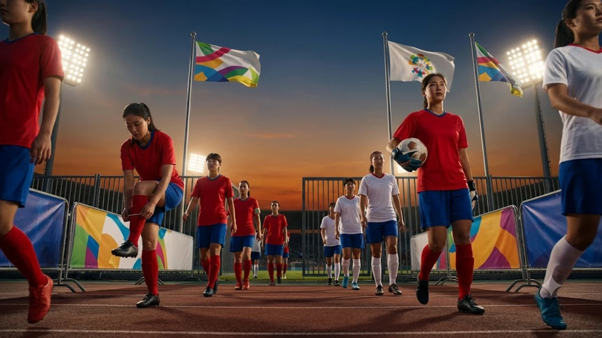

2026 아이치·나고야 아시안게임 개막이 코앞으로 다가오면서 **2026 아시안게임 일정**을 챙기려는 스포츠 팬들의 움직임이 분주해졌다. 대한민국 선수단이 원정 무대에서 펼칠 메달 사냥과 라이벌전 맞대결은 가을 스포츠 축제의 핵심 관전 포인트다. 태극전사들의 메달 레이스를 빠짐없이 챙기기 위해 필수 대진과 실시간 중계 경로를 짚었다.

## 2026 나고야 아시안게임 개막 D-2 주요 관전 포인트

### 9월 19일 개막식 일정 및 대회 규모
제20회 아이치·나고야 아시안게임은 9월 19일 아이치현 스타디움에서 화려한 막을 올린다. 아시아올림픽평의회(OCA) 45개 회원국에서 약 1만 5,000명의 선수가 참가해 40여 개 종목에서 400개 이상의 금메달을 놓고 격돌한다. 한국 선수단은 역대 최대 규모 원정 선수단을 파견해 종합 순위 2위 탈환을 정조준하고 있다.

### 축구 대표팀의 역대 최초 4연속 금메달 도전
황선홍호의 뒤를 잇는 축구 대표팀은 아시안게임 역사상 유례없는 4회 연속 우승이라는 금자탑에 도전한다. 23세 이하(U-23) 자원과 와일드카드 조합은 2014 인천, 2018 자카르타·팔렘방, 2022 항저우에 이어 다시 한번 금빛 피날레를 노린다. 병역 혜택과 직결된 대회 특성상 유망주들의 집중력은 최고조에 달해 있다. 더 넓은 무대인 [2026 FIFA 월드컵 한국 대표팀, 16강 넘을 수 있을까](/posts/sports/worldcup-2026-korea-preview/)에서 활약할 차세대 스타들이 이번 대회에서 어떤 역량을 발휘할지 지켜보는 것도 흥미롭다.

### 야구 대표팀의 명예 회복과 숙적 일본전 관전 요소
KBO 리그의 젊은 에이스들로 꾸려진 야구 대표팀은 숙적 일본을 꺾고 금메달을 목에 걸겠다는 각오다. 일본은 사회인 야구 중심의 실업 선발대로 팀을 꾸리지만, 기본기와 정교함에서 프로 선수들을 위협하는 만만찮은 전력을 자랑한다. 도쿄돔과 나고야돔을 거쳐 온 베테랑 지도자들의 지략 대결이 경기 판도를 좌우할 변수다.

## 지상파 3사 및 OTT 실시간 생중계 채널 선택법

### 지상파 중계진 라인업과 채널별 중계 강점
KBS, MBC, SBS 지상파 3사는 메달 획득 가능성이 높은 종목을 중심으로 특별 중계 부스를 꾸린다. 해설진의 친절한 설명과 박진감 넘치는 샤우팅 캐스팅은 현장 분위기를 거실로 고스란히 옮겨온다.

- **KBS:** 정통파 캐스터 중심의 안정감 있는 중계
- **MBC:** 특유의 재치 있는 입담과 직관적 데이터 해설
- **SBS:** 박진감 넘치는 리액션과 생생한 현장감 연출

### 모바일 OTT 실시간 스트리밍 시청 경로
이동 중이거나 TV 접근이 어려운 상황이라면 네이버 스포츠, 아프리카TV, 웨이브(Wavve) 등의 플랫폼이 최적의 대안이다. 네이버는 실시간 응원톡 기능과 하이라이트 클립을 10초 단위로 빠르게 제공해 접근성이 뛰어나다. 데이터 소모를 줄이면서도 실시간 소통을 원하는 사용자에게 안성맞춤이다.

### 끊김 없는 고화질 시청 팁과 다시보기 플랫폼
모바일 시청 시 트래픽 폭주로 인한 버퍼링을 막으려면 1080p 고화질 설정과 함께 저지연(Low Latency) 스트리밍 옵션을 켜두어야 한다. 주요 경기 다시보기 풀영상과 하이라이트는 지상파 3사 공식 유튜브 채널 및 각 방송사 홈페이지 다시보기 센터에서 경기 종료 1시간 이내에 순차적으로 업로드된다.

## 태극전사 골든 데이와 주요 경기 핵심 타임테이블

### 축구·야구 조별리그 첫 경기 및 토너먼트 로드맵
축구 조별리그는 개막식 이전인 9월 중순부터 조기 시작해 토너먼트 일정을 밟는다.작업할 주제나 작성할 원문 내용을 알려주시면 요청하신 형식에 맞춰 마크다운 코드블록으로 바로 출력해 드리겠습니다. 어떤 내용으로 작성해 드릴까요?