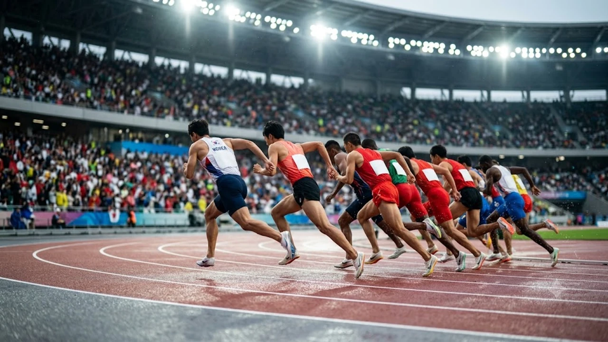

2026 아이치·나고야 아시안게임이 막을 올리면서 대한민국 선수단의 메달 레이스가 본격적인 궤도에 진입했다. 초반부터 한중일 3국의 치열한 메달 순위 다툼이 불붙은 가운데 종합 2위 탈환이라는 대표팀의 목표가 현실이 될지 아시아 스포츠 팬들의 관심이 집중된다.


## 2026 아이치·나고야 아시안게임 초반 메달 레이스 판도

### 개막 직후 한중일 3강 메달 획득 현황 비교
대회 극초반 판세는 중국의 압도적 물량 공세와 개최국 일본의 홈 어드밴티지가 맞부딪치는 흐름이다. 한국은 수영과 사격 등 초반 집중 종목에서 기대 이상의 메달을 따내며 선두 그룹과의 격차를 좁혀가고 있다. 중국이 기초 종목에서 메달 점유율을 독식하는 사이, 한국과 일본은 특정 전략 종목의 결승 무대에서 정면충돌하며 매일 순위표 앞자리를 바꾸는 접전을 벌인다.

### 대한민국 대표팀의 초기 종합 순위 수성 가능성
한국 선수단은 전통적으로 초반 레이스에서 탄탄한 기본 점수를 확보해야 후반 구기 종목과 투기 종목에서 탄력을 받는다. 

> "대회 1주 차에 설정한 목표 금메달 획득률의 80% 이상을 달성해야만 대회 종료 시점까지 일본과의 2위 싸움에서 주도권을 쥔다."

초반 레이스의 핵심 관건은 기대를 모았던 유망주들이 실전 무대에서 메달권에 얼마나 안착하느냐에 달렸다.

### 전 대회 대비 상위권 국가들의 전력 변화 추이
직전 항저우 대회와 비교하면 상위권의 지형은 한층 촘촘해졌다. 우즈베키스탄과 카자흐스탄 등 중앙아시아 국가들이 레슬링, 복싱, 유도 등 격투 종목에서 금메달을 휩쓸며 한중일 독주 체제에 균열을 내고 있다. 이는 상위권 국가 간의 순수 금메달 격차를 줄이는 요인으로 작용해 한국의 종합 순위 계산법을 한층 복잡하게 만든다.

## 효자 종목 성과와 종합 순위를 가를 핵심 변수


### 펜싱·수영·양궁 등 핵심 종목별 메달 수확률
한국의 순위 방정식을 지탱하는 기둥은 단연 펜싱과 양궁, 그리고 황금세대가 버티는 수영이다. 
- **펜싱:** 사브르와 에페 종목에서 세대교체를 성공적으로 마친 젊은 검객들이 개인전과 단체전 메달을 정조준한다.
- **수영:** 자유형과 계영 종목에서 아시아 신기록을 넘보는 선수들의 금빛 질주가 이어지고 있다.
- **양궁:** 세계 최강의 면모를 재확인해야 하는 부담 속에서도 남녀 개인·단체전 전 종목 석권을 목표로 화살을 날린다.

국제 스포츠 대회의 뜨거운 열기와 전력 분석 흐름은 [스포츠 전체 글 보기](/posts/sports/)를 통해 다른 메이저 대회 정보와 함께 확인할 수 있다.

### 구기 종목과 신규 도입 세부 종목의 득실 분석
축구와 야구, 배구 등 구기 종목은 메달 총량 자체보다는 선수단 전체 사기를 끌어올리는 기폭제 구실을 한다. 특히 e스포츠와 브레이킹 등 최근 정식 종목으로 굳건히 자리 잡은 세부 종목에서 금메달을 얼마나 보태느냐가 막판 순위표의 소수점 승부를 가르는 실질적 변수다.

### 예상 밖 복병 국가들의 선전과 상위권 지각변동
동남아시아와 남아시아 국가들의 특정 종목 집중 투자도 눈여겨봐야 한다. 배드민턴, 세팍타크로, 사격 등에서 발생한 이변은 한국이 계산해 둔 메달 플랜에 직접적인 차질을 빚기도 한다. 예상치 못한 복병에게 금메달을 내주는 순간, 라이벌 일본과의 격차는 순식간에 벌어질 수밖에 없다.

## 개최국 일본의 홈 어드밴티지와 한국의 순위 다툼

### 개최국 이점을 앞세운 일본 대표팀의 초반 독주 양상
아이치현 일대 경기장을 가득 메운 홈 관중의 일방적 응원과 현지 환경 적응력은 일본 대표팀에 날개를 달아줬다. 일본은 체조, 스케이트보드, 가라테 등 자신들이 강세를 보이는 종목을 집중 배치해 대회 초반 은·동메달 수까지 싹쓸이하며 종합 메달 집계에서 기세를 올리고 있다.

### 한일 맞대결 종목 결과에 따른 종합 2위 경쟁 구도
결국 이번 대회의 최대 관전 포인트는 한일전 맞대결의 승패다. 유도, 펜싱, 탁구 등 두 나라가 결승 길목에서 마주치는 종목마다 금메달 1개의 가치는 실질적으로 2개의 효과를 낸다. 우리가 이기면 1점을 얻고 상대의 1점을 지우는 제로섬 승부이기 때문이다.

### 원정 경기장 적응과 판정 변수가 미치는 실질적 영향
원정팀 선수들에게 경기장 환경과 미세한 홈 텃세는 심리적 압박으로 다가온다.
- 실내 체육관의 독특한 조명과 바닥재 탄성
- 접전 상황에서 홈 선수에게 우호적인 판정 분위기```markdown
요청하신 형식에 맞춘 기본 마크다운 서식 예시입니다. 구체적인 주제나 작업할 텍스트를 알려주시면 이 형식 그대로 본문을 작성해 드립니다.