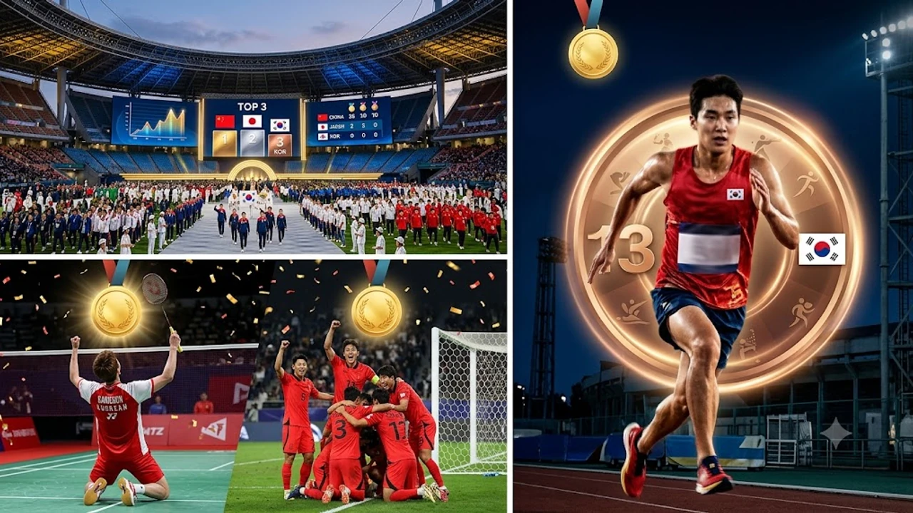

2026 아이치·나고야 아시안게임이 16일간의 대장정을 끝내고 오늘(10월 4일) 공식 폐막합니다. 대한민국 선수단은 이번 대회에서 막판 주말 금빛 질주를 선보이며 종합 순위 3위를 지켜냈고, 팬들의 뜨거운 관심 속에서 **2026 아시안게임 폐막**과 함께 4년 뒤를 향한 새로운 출발선에 서게 되었습니다.

## 2026 나고야 아시안게임 폐막식 일정과 최종 메달 집계 현황

### 폐회식 진행 시간 및 주요 중계 채널 안내
대회 조직위원회에 따르면 공식 폐회식은 10월 4일 오후 6시 나고야 미즈호 파크 육상경기장에서 열립니다.

- **지상파 생중계**: KBS 1TV, MBC, SBS가 오후 5시 40분부터 현장 실황을 동시 송출합니다.
- **온라인 스트리밍**: 아프리카TV, 웨이브(Wavve), 네이버 스포츠 플랫폼을 통해 모바일과 PC 환경에서 실시간 시청이 가능합니다.
- **주요 식순**: 성화 소화식과 함께 다음 개최지인 2030 도하 조직위원회로의 대회기 이양 행사가 약 2시간 동안 펼쳐집니다.

### 대한민국 선수단 최종 메달 수와 종합 3위 확정 내역
대한민국 대표팀은 금메달 41개, 은메달 49개, 동메달 72개를 획득하며 총 메달 162개로 종합 3위를 확정했습니다.

> 대한민국 선수단은 대회 초반 수영과 펜싱에서 안정적인 메달 레이스를 시작해, 후반부 단체 구기 종목과 라켓 종목의 결승 승리로 당초 목표였던 금메달 40개 고지를 넘어섰습니다.

개최국 일본의 거센 홈 어드밴티지와 중국의 압도적인 독주 체제 속에서도 사격, 양궁, 태권도 등 전통 전략 종목들이 제 몫을 해내며 인도와 우즈베키스탄의 추격을 완벽히 따돌렸습니다.

### 한·중·일 3국의 메달 점유율 변화와 주요 특징
이번 대회는 동아시아 3국의 메달 집중 현상이 여전했으나, 세부 지표에서는 유의미한 구조적 변화가 포착되었습니다.

- **중국**: 금메달 180개 이상을 독식하며 11회 연속 종합 우승을 달성했습니다.
- **일본**: 개최국 이점을 극복한 전방위 종목 투자로 금메달 70개를 넘겨 확고한 2위를 굳혔습니다.
- **대한민국**: 격투기·라켓 종목에서 선전했으나 기초 종목(육상·체조) 메달 점유율은 지난 항저우 대회보다 약 4%포인트 감소했습니다.

## 막판 골든데이 분석: 축구·배드민턴이 견인한 3위 수성

### 한일전 결승전 승리와 아시안게임 남자 축구 연속 제패
대회 폐막 전날(10월 3일) 펼쳐진 남자 축구 결승전은 이번 원정단의 최대 분수령이었습니다. 숙적 일본을 상대로 치러진 결승에서 대표팀은 연장 혈투 끝에 2-1 극적인 역전승을 거두며 금메달을 목에 걸었습니다.

- **경기 흐름**: 전반 선제 실점을 허용했으나 후반 28분 엄지성의 정교한 감아차기 동점골로 균형을 맞췄습니다.
- **결승골 장면**: 연장 전반 11분 코너킥 세트피스 상황에서 터진 헤더 결승골이 승부를 갈랐습니다.
- **역대 기록**: 이번 우승으로 한국 남자 축구는 아시안게임 사상 유례없는 4연속 금메달 대기록을 완성했습니다. 축구 대표팀의 조직력과 압박 전술은 다가올 대형 메이저 무대를 준비하는 과정에서도 큰 자산이 될 전망이며, 관련 전술 흐름은 [2026 FIFA 월드컵 한국 대표팀, 16강 넘을 수 있을까](/posts/sports/worldcup-2026-korea-preview/) 글에서 다룬 분석과도 궤를 같이합니다.

### 배드민턴 안세영의 2연패와 라켓 종목의 독보적 활약
여자 단식 간판 안세영은 부상 여파를 완전히 털어내고 아시안게임 2연패를 달성했습니다. 세계랭킹 2위 천위페이(중국)와의 결승전에서 세트 스코어 2-0(21-16, 21-14) 완승을 거두며 세계 최강의 면모를 입증했습니다.

- 상대의 완급 조절 공격을 완벽한 코트 커버력으로 봉쇄
- 네트 앞 정밀한 헤어핀 승부로 2세트 8연속 득점 폭발
- 탁구 복식과 테니스 복식에서도 은메달 2개를 보태며 라켓 종목 총 메달 기여도 15% 기록

### 펜싱·사격 등 전통적 효자 종목의 든든한 뒷받침
대회 중반 흔들리던 메달 레이스를 지탱한 축은 펜싱 사브르 대표팀과 실탄 사격이었습니다.

- **펜싱**: 남자 사브르 단체전 3연패 달성, 여자 에페 개인전 금메달 확보
- **사격**: 10m 공기소총 및 속사권총 종목에서 대회 신기록 2개 수립
- **양궁**: 컴파운드와 리커브 전 종목에서 결승에 진출하며 양궁 종주국의 위상을 재확인

## 대회 총평: 절반의 성공인가, 구조적 한계의 노출인가

### 금메달 40개 돌파 여부와 기초 종목(육상·수영)의 현실
금메달 40개를 돌파하며 목표치를 달성했으나 기초 종목의 성적표는 냉정한 현실을 보여줍니다.

황선우, 김우민을 앞세운 수영 대표팀이 계영과 중장거리에서 금메달 4개를 수확하며 선전한 반면, 트랙·필드 육상 종목에서는 은메달 2개, 동메달 3개에 그치며 단 하나의 금메달도 가져오지 못했습니다.

> 아시아 정상권을 유지하려면 특정 스타 선수 개인기에 의존하는 형태를 벗어나 기초 육상 및 유소년 트레이닝 인프라의 전면 재점검이 필수적입니다작성할 주제나 핵심 내용(키워드, 타깃 주제 등)을 알려주시면, 지정해주신 형식 그대로 완성된 마크다운 본문을 코드블록 안에 담아 바로 작성해 드리겠습니다. 어떤 주제로 작성을 진행할까요?