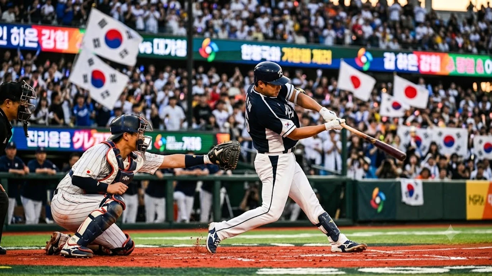

2026 아이치·나고야 아시안게임 최고의 격전지인 **한일전 야구 결승전**이 오늘(9월 27일) 저녁 토요하시 시민구장에서 열립니다. 슈퍼라운드에서 일본 사회인 야구 대표팀에 0-5 영봉패를 당하며 고개를 떨궜던 대한민국 대표팀이 과연 설욕과 함께 아시안게임 5연패의 대업을 완성할 수 있을지 팬들의 이목이 쏠립니다. 24시간 만에 다시 마주한 숙적과의 일전인 만큼, 벤치의 수 싸움과 그라운드 위 디테일 하나가 금메달의 색깔을 결정짓습니다.

## 0-5 굴욕 딛고 결승 안착: 류지현호 설욕의 무대

### 중국전 9-2 완승으로 확인한 타선 반등 신호
한국 대표팀은 26일 중국과의 슈퍼라운드 2차전에서 장단 11안타를 몰아치며 9-2 대승을 거두었습니다. 일본전에서 3안타 빈공에 허덕이며 차갑게 식었던 타격감이 하루 만에 살아난 점이 고무적입니다. 특히 4번 타자 노시환의 쐐기 2점 홈런과 테이블세터진의 연속 도루가 터지면서 공격의 활로를 뚫었습니다. 유인구를 걷어내고 실투를 장타로 연결하는 적극적인 배팅 카운트 공략이 주효했습니다.

### 7이닝 1실점 역투 최민석과 불펜 소모 최소화
선발 최민석의 7이닝 1실점 9탈삼진 호투는 결승전을 앞둔 마운드 운영에 천금 같은 여유를 안겼습니다. 투구수 88개로 긴 이닝을 완벽히 지워내면서 조병현, 박영현 등 핵심 필승조 불펜 투수들이 온전히 하루 휴식을 취했습니다. 단기전 토너먼트에서 투수진의 어깨 피로도는 구위와 직결되는 요소인 만큼, 결승전 9이닝 전력투구를 위한 완벽한 발판을 마련했습니다.

### 일본 사회인 대표팀의 만만찮은 경기력
결승 상대인 일본은 토요타 자동차, 닛폰통운 등 명문 실업리그 최정예 선수들로 진용을 짰습니다. 프로 1군 선수가 없다고 얕보다간 슈퍼라운드처럼 일격을 맞습니다. 정교한 제구력을 갖춘 투수진과 틈을 주지 않는 내야 수비, 볼카운트 2스트라이크 이후에도 끈질기게 파울을 걷어내는 작전 수행 능력은 프로 1.5군을 능가하는 조직력을 자랑합니다.

## 결승전 선발 매치업과 마운드 총동원 시나리오

### 퀵후크 타이밍과 마운드 올인 전략
단기전 결승에 내일은 없습니다. 한국 벤치는 선발 투수가 1회부터 흔들리거나 주자를 둘 이상 모으면 주저 없이 두 번째 투수를 올리는 빠른 템포의 계투책을 준비하고 있습니다. 

- **1~3회 초반 승부**: 선발 투수의 제구력 안정 여부에 따라 3회 이전 조기 교체 가능성 상존
- **중반 허리 싸움**: 140km 후반대 패스트볼과 까다로운 체인지업을 구사하는 롱릴리프 투입
- **후반 잠그기**: 8회와 9회 확실한 탈삼진 능력을 갖춘 마무리 카드로 일본의 추격 차단

국제 토너먼트 승부수를 읽는 시야를 넓히고 싶다면 [스포츠 전체 글 보기](/posts/sports/)를 함께 둘러보는 것도 좋은 방법입니다.

### 일본 특유의 정교한 완급조절과 벌떼 계투
일본 마운드는 한 명의 에이스에게 의존하기보다 각기 다른 구종을 주무기로 쓰는 투수들을 1~2이닝씩 잘라 던지게 하는 계투 작전을 즐겨 씁니다. 지난 맞대결에서도 좌완 기교파와 우완 사이드암을 연달아 투입해 한국 타자들의 히팅 타이밍을 철저하게 흐트러뜨렸습니다. 140km 초반의 속구라도 낮게 떨어지는 포크볼과 컷패스트볼이 예리해, 타자가 스스로 존을 좁히지 않으면 헛스윙 삼진을 당하기 십상입니다.

### 투구수 제한 변수 속 롱릴리프의 몫
대회 규정상 투구수 제한이 걸려 있는 만큼, 경기 중반 3~4이닝을 무실점으로 책임질 롱릴리프의 어깨가 무겁습니다. 타선이 한 바퀴 돈 뒤 맞이하는 4회부터 6회 사이가 가장 큰 승부처입니다. 이 구간에서 실점을 최소화하고 대등한 흐름을 유지해야만 7회 이후 필승 불펜 싸움에서 승기를 잡을 수 있습니다.

## 타선의 침묵을 깨라: 슈퍼라운드 무득점이 남긴 숙제

### 낯선 투구 폼과 낮은 존 공략법
슈퍼라운드 0-5 패배의 주원인은 일본 투수들의 디셉션(투구 숨김 동작)과 보더라인을 찌르는 제구에 완전히 말려든 탓이었습니다. 한국 타자들은 바깥쪽 낮은 스트라이크 존에 걸치는 공에 연신 방망이를 헛돌렸습니다. 결승전 승리를 위해서는 볼카운트가 몰리기 전, 초구와 2구째 스트라이크 존 한가운데로 들어오는 실투를 놓치지 않고 통타하는 결단력이 요구됩니다.

> "국제대회 낯선 투수를 상대할 때는 생각보다 배트를 짧게 잡고 빠른 카운트에 승부를 봐야 한다."

### 중심 타선 장타와 테이블세터 출루의 연계
점수를 뽑으려면 1, 2번 타자가 살아서 득점권에 위치해야 중심 타선의 한 방이 빛을 발합니다. 지난 한일전처럼 루상이 비어 있는 상태에서 나오는 산발 안타는 상대 배터리에 아무런 압박을 주지 못합니다. 끈질긴 풀카운트 승부로 볼넷을 골라내고 누상을 흔드는 기동력이 살아나야 일본 벤치의 볼 배합을 무너뜨릴 수 있습니다.

### 작전 야구 디테일: 번트 수비와 주루 집중력
일본은 1루에 주자가 나가면 곧바로 희생번트나 런앤히트 작전을 구사해 압박 수위를 높입니다. 

- 투수와 1·3루수의 기민한 번트 타구 대시
- 2루 베이스 커버 호흡과 외야수들의 백업 수비
- 주루 시 상대 외야수의 송구 능력 확인 후 과감한 추가 진루

이러한 세밀한 플레이 하나가 팽팽한 투수전의 균형을 한순간에 깨뜨립니다.

## 아시안게임 5연패 도전: 결승전 관전 포인트

### 토요하시 시민구장 환경과 중계 시청 안내
결승전은 오늘 오후 6시 30분 토요하시 시민구장에서 플레이볼을 선언합니다. 공중파 3사(KBS, MBC, SBS)와 주요 온라인 스포츠 플랫폼을 통해 실시간 생중계됩니다. 인조잔디 특유의 빠른 타구 속도와 저녁 시간대 불어오는 바닷바람이 외야 뜬공 포구에 어떤 영향을 미칠지 지켜보는 재미가 쏠쏠합니다.

### 1회 선취점이 가를 경기 주도권
단기전 토너먼트 결승에서는 선취점을 올리는 팀이 심리적 우위를 완전히 독점합니다. 1회 초 공격에서 기선을 제압하면 투수 운용에 숨통이 트이지만, 먼저 실점하면 조급증에 빠져 작전 선택지가 급격히 줄어듭니다. 1회 양 팀 선발 투수의 초구 스트라이크 비율과 톱타자의 타석 접근법이 오늘 승부의 첫 번째 분수령입니다.

### 병역 혜택 동기부여와 원정 응원 압박 극복
한국 젊은 선수들에게 아시안게임 금메달은 커리어를 좌우하는 병역 혜택과 직결되어 동기부여가 남다릅니다. 다만 지나친 중압감은 득점권 찬스에서의 경직된 스윙이나 실책성 플레이로 이어질 위험이 큽니다. 일본 홈 팬들의 일방적인 응원 열기를 이겨내고 평정심을 유지하는 멘탈 관리가 마지막 순간 웃을 팀을 결정합니다.

[야구 응원용품 쿠팡에서 보기](https://www.coupang.com/np/search?q=%EC%8A%A4%ED%8F%AC%EC%B8%A0%EC%9A%A9%ED%92%88&sourceType=affiliate&trackingCode=AF8691300)

#한일전야구결승 #아시안게임야구 #야구국가대표 #아시안게임5연패 #류지현호 #토요하시시민구장 #사회인야구대표팀