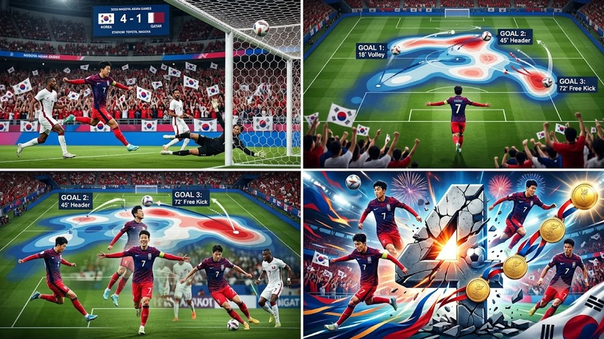

2026 나고야 아시안게임 남자 축구 조별리그 첫 경기에서 **엄지성 해트트릭**이 터지며 한국 대표팀이 카타르를 상대로 기분 좋은 4-1 완승을 거뒀습니다. 아시안게임 4연패라는 전무후무한 기록을 정조준한 대표팀은 첫 경기부터 특유의 빠른 템포와 정교한 측면 전환을 앞세워 메달 전선에 청신호를 켰습니다. 공격의 첨병으로 나선 엄지성은 문전 앞 차분한 침착성을 과시하며 경기장을 찾은 축구 팬들의 탄성을 자아냈습니다.

## 2026 나고야 아시안게임 첫판 카타르전 4-1 완승 현장

### 전반 흐름을 바꾼 엄지성의 연속 골 장면 분석
경기 초반 카타르의 거친 몸싸움에 잠시 주춤하던 대표팀은 전반 18분 엄지성의 선제골 한 방으로 흐름을 완전히 가져왔습니다. 페널티 박스 왼쪽 모서리 부근에서 공을 잡은 엄지성은 특유의 날카로운 헛다리 페인팅으로 수비수의 발을 묶어둔 뒤, 먼 쪽 골포스트를 찌르는 오른발 감아차기로 골망을 갈랐습니다. 이어 전반 34분 속공 상황에서는 하프라인 부근부터 빈틈을 파고들어 단독 돌파를 감행했고, 각도를 좁히며 나온 골키퍼 키를 툭 넘기는 절묘한 칩샷으로 연거푸 골망을 흔들었습니다.

### 중원 장악과 측면 전환으로 무너진 카타르 수비진
한국의 3선 허리 라인은 높은 볼 점유율을 바탕으로 카타르의 5백 밀집 수비를 좌우로 사정없이 흔들었습니다. 중앙에서 잔패스로 상대 시선을 한곳에 묶어둔 직후 반대편 측면으로 크게 열어주는 롱 전환 패스가 연이어 맞아떨어졌습니다.
* 전반 볼 점유율 64% 유지
* 페널티 박스 내 유효 슈팅 7회 생성
* 상대 역습 전환 차단 성공률 80% 기록

### 첫 단추 꿴 황선홍호의 공격 전개 완성도 평가
소집 기간이 짧아 조직력에 의문부호가 붙었던 것도 사실이지만, 뚜껑을 열어본 그라운드 위의 호흡은 매끄러웠습니다. 원터치 패스를 앞세운 간결한 탈압박과 2선 공격진의 유기적인 위치 스위칭은 카타르 수비 블록에 균열을 내기 충분했습니다. 일전에 다뤘던 [2026 FIFA 월드컵 한국 대표팀, 16강 넘을 수 있을까](/posts/sports/worldcup-2026-korea-preview/)의 지적 사항이었던 빌드업 템포 지연 현상을 이번 경기에서는 발 빠른 측면 침투와 군더더기 없는 전진 패스로 말끔하게 지워냈습니다.

## 엄지성 해트트릭이 증명한 유럽파 에이스의 파괴력

### 스완지시티 출전 경험이 만든 문전 침착성과 결정력
잉글랜드 챔피언십 스완지시티에서 거친 피지컬 대결을 매주 버텨낸 시간은 헛되지 않았습니다. 후반 12분 페널티 박스 안 난전 상황에서 튕겨 나온 세컨드 볼 낙하지점을 침착하게 선점한 뒤 왼발 발리슛을 꽂아 넣으며 해트트릭을 완성했습니다. 찰나의 순간에도 시야를 확보한 채 무게중심을 단단히 유지하는 밸런스는 유럽 무대 주전 경쟁을 통해 축적된 내공을 입증했습니다.

> "박스 안에서는 반 박자 빠른 슈팅 타이밍이 모든 것을 결정짓는다."

### 밀집 수비를 뚫어낸 오프더볼 움직임과 슈팅 궤적
상대 오프사이드 트랩을 부수는 뒷공간 침투가 돋보였습니다. 공이 발에 닿지 않는 순간에도 카타르 센터백들의 시야 밖으로 빠져나가는 사선 동선을 집요하게 가져가며 동료 미드필더들에게 시원한 패스 길을 틔워줬습니다. 골문 구석을 찌른 슈팅 궤적 역시 골키퍼의 손끝이 닿지 않는 사각지대를 정확히 꿰뚫었습니다.

### 대표팀 내 전술적 롤과 세트피스 전담 키커로서의 영향력
단순한 마무리 공격수를 넘어 전담 키커로서의 날카로운 킥 감각도 빛났습니다. 코너킥과 프리킥 찬스마다 문전으로 정확히 휘어 감긴 크로스는 동료 수비진의 타점 높은 헤더로 이어졌고, 후반 추가시간 터진 네 번째 골 역시 엄지성의 날카로운 프리킥 리바운드에서 출발했습니다.

## 아시안게임 남자 축구 4연패 도전, 남은 조별리그와 토너먼트 변수

### D조 잔여 경기 일정 및 로테이션 운영 시나리오
조별리그 첫 단추를 완벽한 승리로 장식하며 향후 토너먼트를 대비한 로테이션 전략에 한결 숨통이 트였습니다. 남은 조별리그 2, 3차전은 상대적 약체와의 연전인 만큼 주전 멤버의 체력을 아끼고 벤치 자원의 실전 감각을 끌어올리는 영리한 경기 운용이 펼쳐질 공산이 큽니다.

- **1차전:** 카타르전 4-1 승리 (조 1위 유리한 고지 점령)
- **2차전:** 로테이션 전면 가동 및 세부 전술 점검
- **3차전:** 주전 경기 감각 조율 및 조 1위 16강 진출 확정

### 일본·우즈베키스탄 등 유력 경쟁국 전력과의 맞대결 비교
금메달 경쟁의 최대 걸림돌인 일본과 우즈베키스탄의 기세도 만만치 않습니다. 안방 이점을 등에 업은 일본은 정교한 패스 워크가 강점이며, 우즈베키스탄은 U-23 무대에서 검증된 탄탄한 피지컬과 순간적인 역습 전환 속도를 자랑합니다. 단판 승부로 펼쳐지는 토너먼트에서 이들을 무너뜨리려면 엄지성을 비롯한 결정력을 갖춘 유럽파 해결사의 한 방이 필연적입니다.

### 빽빽한 경기 간격에 따른 체력 안배와 부상 방지책
아시안게임 축구는 사실상 이틀 간격으로 경기가 이어지는 강행군입니다. 덥고 습한 환경 속에서 근육 경련이나 부상을 막으려면 의무팀의 빠른 회복 지원과 컨디션 관리가 뒤따라야 합니다. 경기 후반 승부의 추가 기운 시점마다 신속하게 교체 카드를 쓰는 과감한 벤치 결단이 4연패의 숨은 열쇠입니다.

## 카타르전 승리로 본 대표팀 최종 메달 획득 가능성

### 공격진 화력 대비 보완해야 할 실점 위기 수비 조직력
4골을 몰아친 화려한 공격력 이면에 후반 중반 내준 실점 장면은 되짚어볼 대목입니다. 상대의 긴 롱패스 역습 한 번에 포백 라인 간격이 벌어지며 일대일 위기를 자초한 실책은 토너먼트 상위 라운드에서 뼈아픈 부메랑이 될 수 있습니다. 수비 밸런스 재정비가 필수적입니다.

### 와일드카드와 유럽파 시너지 효과의 실질적 극대화 방안
와일드카드로 합류한 베테랑 자원들이 경기장 안팎에서 중심을 잡아주며 2선 자원들의 활동 반경이 한층 넓어졌습니다. 미드필더 진영에서의 과감한 탈압박과 적극적인 수비 가담이 받쳐주면서 엄지성을 비롯한 전방 공격수들이 수비 부담을 덜고 공격에 온전히 에너지를 쏟아붓는 시너지가 만들어졌습니다.

### 금메달 로드맵을 위한 16강 이후 토너먼트 핵심 승부처
조별리그 통과를 넘어 8강, 4강으로 올라갈수록 세트피스 집중력과 페널티킥 상황에서의 담대함이 메달의 색깔을 가릅니다. 4연패를 노리는 황선홍호는 카타르전 대승의 자신감을 이어가되 뒷공간 수비 불안을 확실히 통제해야 합니다. 날카로운 창끝에 단단한 방패가 더해진다면 아시안게임 4회 연속 금메달이라는 대기록은 현실이 될 수 있습니다.

[축구화 축구용품 쿠팡에서 보기](https://www.coupang.com/np/search?q=%EC%8A%A4%ED%8F%AC%EC%B8%A0%EC%9A%A9%ED%92%88&sourceType=affiliate&trackingCode=AF8691300)

#엄지성 #엄지성해트트릭 #2026아시안게임축구 #나고야아시안게임 #황선홍호 #아시안게임축구4연패 #카타르전대승 #스완지시티엄지성 #U23대표팀