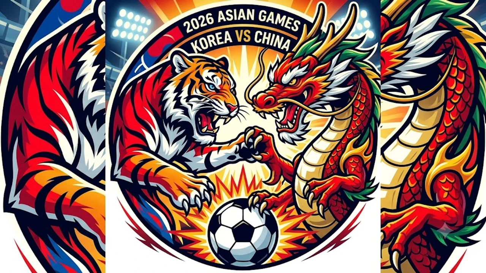

2026 나고야 아시안게임 남자 축구 준결승에서 성사된 이번 **아시안게임 축구 한중전**은 대회의 흐름을 가르는 최대 격전지다. 전날 여자 대표팀이 4강에서 고배를 마신 직후라 남자 대표팀의 4연속 금메달 도전과 결승 진출 여부에 팬들의 이목이 쏠리고 있다.

## 2026 아시안게임 남자 축구 4강 대진과 한중전 경기 일정

### 준결승 킥오프 시간과 실시간 중계 채널

한국과 중국의 준결승 맞대결은 오늘 오후 3시에 킥오프 휘슬이 울린다. 지상파 3사(KBS, MBC, SBS)가 일제히 라이브 방송을 편성했으며, 해설위원들의 전략 분석과 현장 연결이 경기 시작 20분 전부터 집중 배치된다. 평일 낮 시간대 경기인 만큼 모바일 환경에서 시청하는 팬들이 대거 몰릴 것으로 보인다.

### 지상파 3사 및 OTT 생중계 시청 팁

스마트폰이나 태블릿으로 경기를 지켜본다면 통신 환경과 스트리밍 딜레이를 고려해야 한다. 각 방송사 온에어 플랫폼 외에도 아프리카TV, 웨이브 등 주요 OTT 플랫폼을 통해 고화질 중계를 선택할 수 있다. 접속자가 폭증하는 하프타임이나 득점 직후 버퍼링을 피하려면 저지연(Low-Latency) 모드를 지원하는 플랫폼을 골라 접속하는 편이 현명하다.

---

## 4강까지의 여정: 한국의 압도적 공격력 vs 중국의 극단적 실리 축구

### 대표팀의 토너먼트 득점 루트와 핵심 공격진 활약상

조별리그부터 8강까지 대표팀이 보여준 파괴력은 뚜렷한 패턴을 지닌다. 측면 풀백의 적극적인 오버래핑에 이은 컷백, 2선 공격수들의 유기적인 침투가 매 경기 득점을 만들어냈다. 특히 상대 수비가 촘촘하게 내려앉을 때 박스 바깥에서 시도하는 과감한 중거리 슛과 세트피스 약속된 플레이가 혈을 뚫어줬다.

> 토너먼트 단판 승부에서는 점유율 수치보다 박스 안에서의 집중력과 첫 번째 기회를 골로 연결하는 결정력이 승패를 가른다.

단기 토너먼트를 치르는 대표팀의 체력 관리와 스쿼드 운용 방식은 [2026 FIFA 월드컵 한국 대표팀, 16강 넘을 수 있을까](/posts/sports/worldcup-2026-korea-preview/) 분석에서도 다뤘듯 국제대회 토너먼트의 성패를 가르는 공통 분모다.

### 짠물 수비와 거친 압박으로 올라온 중국의 전력 해부

중국은 점유율을 과감히 포기하고 5백에 가까운 극단적인 밀집 수비로 4강에 안착했다. 상대 공격수의 전진 패스 길목을 몸싸움으로 끊어내고, 볼을 탈취한 직후 최전방 장신 공격수를 향해 롱볼을 붙이는 패턴이 핵심이다. 경기 템포를 의도적으로 늦추며 세트피스 한 방을 노리는 실리 축구는 한국 입장에서도 결코 방심할 수 없는 위협 요소다.

---

## 결승 진출을 결정지을 한중전 3대 핵심 변수

### 초반 거친 파울 유도와 심판 판정 리스크 대응법

중국 특유의 거친 압박과 신경전은 언제나 판정 시비를 부른다. 특히 경기 초반 볼 경합 과정에서 발목이나 허벅지를 노리는 깊은 태클이 들어올 때 감정적으로 맞대응하면 경기가 말린다. 주심의 판정 성향을 빠르게 파악하고 불필요한 항의로 카드를 수집하지 않는 평정심이 요구된다.

### 선제골 타이밍에 따른 경기 운영 시나리오 비교

- **전반 20분 이내 선제골 성공 시**: 중국의 텐백이 무너지며 뒷공간이 열려 대량 득점 흐름으로 전환 가능
- **전반 무득점 교착 상태 지속 시**: 조급해진 패스 미스가 상대의 롱볼 역습 기회로 연결될 위험 급증
- **예상 밖 선제 실점 허용 시**: 극단적인 시간 끌기와 파울 연타에 휘말리며 경기 운영 전체가 흔들릴 위기

전반 30분 안에 선제골을 뽑아내 수비 라인을 끌어내는 작업이 승부의 열쇠다.

### 4연속 금메달 도전의 최대 관문: 체력 안배와 카드 관리

준결승을 넘어 결승전을 바라보는 팀이라면 로테이션과 카드 관리를 떼어놓고 생각할 수 없다. 경고 누적으로 결승전에 결장하는 선수가 나오지 않도록 2골 차 이상 리드를 잡는 즉시 핵심 미드필더와 수비진을 교체해 체력을 아끼는 벤치의 결단이 따라야 한다.

---

## 결승전 예상 상대와 아시안게임 4연패 달성 시나리오

### 반대편 4강 일본 vs 사우디아라비아 승부 전망

반대편 블록에서는 기술 축구의 일본과 탄탄한 피지컬을 앞세운 사우디아라비아가 격돌한다. 일본은 짧은 패스 워크와 탈압박을 앞세워 주도권을 쥐려 할 것이고, 사우디는 강력한 중원 압박과 빠른 카운터로 맞불을 놓을 공산이 크다. 양 팀 모두 체력 소모가 극심한 승부가 예상된다.

### 한일전 결승 리턴매치 성사 가능성 점검

한국이 중국을 꺾고 일본이 사우디를 제압한다면 아시안게임 무대에서 또 한 번의 숙명적인 한일전 결승 리턴매치가 성사된다. 2018년과 2022년에 이어 4연속 우승이라는 대기록을 완성하기 위한 최종 관문이다. 현장 관전이나 가을 야외 스포츠 활동을 준비 중이라면 필수 장비를 꼼꼼히 챙겨두는 것도 좋다.

[축구화 및 스포츠 서포트 용품 쿠팡에서 보기](https://www.coupang.com/np/search?q=%EC%8A%A4%ED%8F%AC%EC%B8%A0%EC%9A%A9%ED%92%88&sourceType=affiliate&trackingCode=AF8691300)

#아시안게임축구 #한국중국축구 #2026아시안게임 #남자축구4강 #아시안게임중계 #한중전 #축구국가대표팀 #4연속금메달