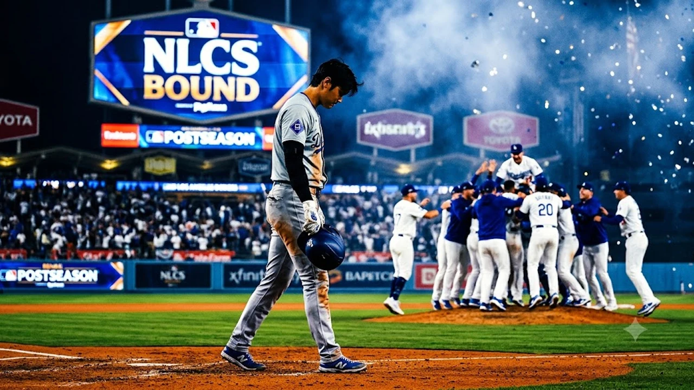

로스앤젤레스 다저스가 디비전시리즈 접전 끝에 챔피언십시리즈 무대를 밟으며 2026 가을야구의 주인공 자리를 굳혔습니다. 하지만 현지 언론과 팬들의 시선은 팀의 환호 뒤편에 자리한 **다저스 NLCS 오타니** 쇼헤이의 이례적인 방망이 침묵에 쏠려 있습니다. 정규시즌 내내 메이저리그를 폭격하던 괴물 타자가 단기전에서 헛스윙을 연발하는 이유를 구체적인 현장 기록으로 짚었습니다.

## 다저스 NLCS 진출 확정과 오타니의 이례적인 침묵

### NLDS 4차전 승리와 샴페인 파티 뒤편의 긴장감
애틀랜타 브레이브스와의 NLDS 4차전에서 다저스는 불펜 릴레이 호투를 엮어 4-1 승리를 거두고 시리즈 전적 3승 1패로 내셔널리그 챔피언십시리즈(NLCS) 티켓을 따냈습니다. 라커룸은 탄성과 샴페인 거품으로 뒤덮였지만, 1번 지명타자로 나선 오타니 쇼헤이는 4타수 무안타 2삼진으로 고개를 떨궜습니다. 팀의 승리에도 불구하고 본인의 타격 타이밍이 완전히 망가졌다는 사실을 누구보다 잘 알고 있었습니다.

### 포스트시즌 4경기 타격 지표로 본 오타니의 현재 흐름
이번 가을 오타니의 방망이는 정규시즌 MVP 페이스와 극명한 대조를 이룹니다. 단기전 4경기에서 남긴 세부 숫자는 심각성을 고스란히 드러냅니다.

- **타율**: 0.125 (16타수 2안타)
- **장타율**: 0.188 (2루타 1개, 홈런 0개)
- **삼진 비율**: 37.5% (6탈삼진)
- **타구 평균 속도**: 88.4마일 (정규시즌 95.2마일에서 6.8마일 폭락)

외곽 보더라인을 찌르는 상대 배터리의 볼배합에 방망이 중심이 번번이 빗나갔고, 인플레이 타구 질 자체가 눈에 띄게 떨어졌습니다.

### 조기 퇴근 후 배팅 게이지로 향한 오타니의 결단
현지 전담 기자들의 취재에 따르면 오타니는 샴페인 세리머니가 한창이던 클럽하우스를 빠져나와 실내 훈련장 배팅 게이지로 직행했습니다. 자정 무렵까지 전력분석팀과 타격 영상을 프레임 단위로 돌려보며 티 배팅을 반복했습니다. 다저스의 NLCS 상대가 결정된 순간에도 환호 대신 배트를 쥔 손에 테이핑을 다시 감았습니다.

## 오타니 가을 타격 부진, 어디서 꼬였나

### 정규시즌 대비 급감한 패스트볼 대응력과 타이밍
가장 큰 문제는 시속 97마일을 웃도는 강속구에 배트 헤드가 밀리는 현상입니다. 

> "정규시즌에는 몸쪽 높은 코스 직구를 특유의 빠른 손목 회전으로 받아쳐 장외로 날렸지만, 지금은 공 반 개 차이로 늦어 파울 타구만 양산하고 있다." — 현지 전력분석팀 리포트

직구 타이밍을 맞추지 못하니 둥글게 휘어지는 변화구에도 속수무책으로 배트가 끌려 나옵니다.

### 집요한 바깥쪽 변화구 유인구와 헛스윙 비율 증가
상대 투수들은 오타니의 중심이 앞쪽으로 일찍 쏠리는 약점을 놓치지 않았습니다. 하이 패스트볼로 시선을 위로 묶어둔 뒤, 2스트라이크에서는 바깥쪽 플레이트 밖으로 멀찍이 도망가는 슬라이더와 체인지업을 던졌습니다. 스트라이크 존 바깥 공에 배트가 나간 비율(O-Swing%)은 정규시즌 26%에서 이번 가을야구 41%까지 폭등했습니다. 

### 팔꿈치 복귀 후 투타 균형 조절이 남긴 피로도 변수
시즌 후반기부터 라이브 피칭과 불펜 투구를 병행하며 투구 빌드업 강도를 높인 스케줄도 타격 밸런스를 흔든 주범입니다. 하체와 골반 부위의 누적 피로 탓에 타격 시 중심축을 지탱하는 왼쪽 골반 회전이 반 박자 무뎌졌습니다. 하체의 지지 없이 상체 힘으로만 당겨 치다 보니 배트 궤적이 찌그러졌습니다. 정상급 무대에서 단기전 컨디션 관리가 얼마나 승패를 가르는지는 [스포츠 전체 글 보기](/posts/sports/)의 다른 분석에서도 생생하게 확인됩니다.

## 밀워키 브루어스 NLCS 맞대결과 천적 투수 공략법

### 밀워키 마운드의 좌타자 상대 볼배합 패턴 분석
챔피언십시리즈에서 맞붙는 밀워키 브루어스는 메이저리그 30개 구단 중 좌타자 피출루율이 가장 낮은 팀입니다. 변칙적인 투구 폼을 지닌 좌완 불펜진이 촘촘하게 버티고 있습니다.

- **좌완 선발의 백풋 슬라이더**: 우타자 몸쪽이자 좌타자 뒷발 뒤꿈치를 겨냥하는 궤적
- **불펜의 사이드암 스페셜리스트**: 좌타자 시야에서 공이 등 뒤에서 날아오는 듯한 릴리스 포인트
- **존 상단 하이 패스트볼**: 카운트를 유리하게 잡고 타자의 스윙 궤적을 퍼올리게 유도

오타니가 조급함을 버리고 침착하게 볼을 골라내지 못한다면 밀워키의 마운드 덫에 그대로 걸려들 공산이 큽니다.

### 다저스 상위 타선(베츠·프리먼)과의 연계 득점 공식
오타니 혼자 힘으로 경기를 풀 필요는 없습니다. 2번 무키 베츠와 3번 프레디 프리먼은 디비전시리즈 후반으로 갈수록 절정의 타격감을 과시했습니다. 오타니가 장타 욕심을 내려놓고 출루율에 무게를 두면, 뒤를 받치는 중심 타선의 화력이 불을 뿜습니다. 1번 타자가 끈질기게 공을 던지게 만드는 것만으로도 상대 선발의 투구수 누적을 유도하는 강력한 압박이 됩니다.

### 밀러 파크 원정에서 살아날 오타니의 장타 포인트
밀워키의 안방 아메리칸 패밀리 필드(구 밀러 파크)는 대표적인 타자 친화 구장입니다. 우측 담장까지의 거리가 짧고 개폐식 돔 지붕 구조라 바람의 방해를 거의 받지 않습니다. 극단적인 당겨치기 스윙을 교정해 센터 방면으로 라인드라이브 타구를 밀어 보낸다면 타구 체공 시간이 길어져 홈런포 재가동을 노릴 수 있습니다.

## 월드시리즈 진출을 위한 오타니 반등 시나리오

### 타격 폼 미세 조정과 초구 공략 적극성 회복
오타니의 반등은 타석 셋업 자세를 본래대로 되돌리는 일에서 출발합니다. 앞발의 스트라이드 타이밍을 미세하게 앞당겨 빠른 공에 반응할 여유 공간을 확보해야 합니다. 한가운데 몰리는 실투를 머뭇거리지 않고 초구부터 돌리는 특유의 배짱을 회복하는 순간 상대 배터리의 볼배합 계산은 꼬이기 시작합니다.

### 지명타자로서의 출루율 우선 전략과 벤치 지시
데이브 로버츠 감독은 타순 변경 없이 오타니를 1번 지명타자로 계속 밀어붙이겠다고 선을 그었습니다. 벤치가 바라는 해답은 무리한 홈런 스윙이 아닌 '투구수 빼앗기'입니다. 파울을 걷어내며 풀카운트 승부 끝에 볼넷을 얻어 걸어 나가는 것만으로도 다저스 더그아웃 전체에 폭발적인 활력을 불어넣습니다.

### 챔피언십시리즈 1차전 선발 매치업과 관전 포인트
월드시리즈 무대로 가는 길목인 1차전은 경기 초반 오타니의 첫 타석 승부에서 시리즈 전체 향방이 결정됩니다. 침묵을 깨는 통렬한 2루타 한 방이면 가을 내내 따라붙던 우려는 순식간에 날아갑니다. 자신을 한계까지 몰아세우며 새벽 훈련을 자청한 야구 천재가 밀워키의 방패를 뚫고 포효할 수 있을지 전 세계 야구팬의 시선이 집중되고 있습니다.

[야구용품 및 트레이닝 장비 쿠팡에서 보기](https://www.coupang.com/np/search?q=%EC%8A%A4%ED%8F%AC%EC%B8%A0%EC%9A%A9%ED%92%88&sourceType=affiliate&trackingCode=AF8691300)

#다저스 #오타니쇼헤이 #NLCS #메이저리그포스트시즌 #밀워키브루어스 #MLB가을야구 #다저스챔피언십시리즈