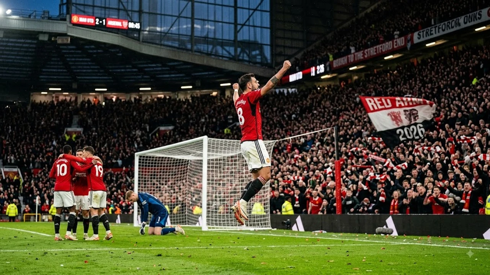

2026 북중미 월드컵의 여운이 가시기도 전에 축구 팬들의 심장을 뛰게 할 **2026 EPL 개막전**의 막이 올랐다. 프리미어리그 순위 싸움의 판도를 가늠할 1라운드는 각 구단이 여름 이적시장에서 갈고닦은 새로운 전술 철학을 날것 그대로 드러낸 격전지였다.

## 2026-27 EPL 개막 라운드 주요 경기 결과 및 총평

### 빅6 첫 경기 성적표와 초반 흐름 분석
우승 트로피를 정조준하는 전통의 강호들은 첫 판부터 확연한 체급 차이와 전력의 명암을 드러냈다. 맨체스터 시티와 아스널은 특유의 하프스페이스 장악과 유기적인 볼 순환으로 상대 수비 블록을 무너뜨리며 깔끔한 무실점 승리를 챙겼다. 반면 여름 동안 판을 갈아엎었던 첼시와 맨체스터 유나이티드는 3선에서의 간격 유지 실패로 상대의 날카로운 롱카운터에 여러 차례 실점 위기를 자초했다.

- **맨체스터 시티**: 페널티 박스 외곽을 집요하게 두드린 끝에 2-0 깔끔한 셧아웃 승리
- **아스널**: 세트피스 약속된 패턴 플레이를 적중시키며 까다로운 원정길 승점 3점 수확
- **리버풀**: 양 측면 윙포워드의 폭발적인 직선 돌파를 앞세워 화력전 끝에 승리

### 예상 밖의 복병 등장: 개막전 최대 이변 경기
1라운드의 진정한 백미는 승격팀과 중하위권 언더독들의 거침없는 전방 압박이었다. 안방에서 상위권 팀을 맞이한 복병들은 걸어 잠그기보다 높은 위치에서부터 거친 몸싸움을 걸며 상대를 당황하게 만들었다. 강팀의 빌드업 시발점을 끊어내고 단 두세 번의 패스로 슈팅까지 연결하는 속공 전개는 올 시즌 승점 자판기 같은 팀은 없다는 사실을 명백히 보여줬다.

### 1라운드로 확인한 각 팀 전술 완성도 비교
월드컵 여파로 짧아진 프리시즌 탓에 사령탑의 전술 완성도가 경기력의 8할을 결정했다. 기존 스쿼드의 뼈대를 온전히 유지한 구단들은 85% 이상의 안정적인 패스 성공률을 기록하며 위기 상황을 침착하게 넘겼다. 반면 풀백을 중앙 미드필더로 기용하는 등 포메이션 실험을 단행한 팀들은 공수 전환 국면에서 치명적인 턴오버를 쏟아냈다.

---

## 여름 이적생 공식 데뷔전 활약도 완벽 비교

### 첫 경기부터 터진 대형 영입생들의 공격포인트
천문학적인 몸값을 증명해야 하는 특급 공격수들은 데뷔전부터 날카로운 발끝을 과시했다. 수비 라인을 부수는 절묘한 침투와 군더더기 없는 원터치 피니시로 골망을 흔들며 홈 팬들의 기립박수를 이끌어냈다.

> "새 무대에서 터진 개막전 첫 골은 이적료라는 무거운 족쇄를 단숨에 풀어버리는 가장 강력한 해독제다."

국제무대에서 절정의 골 감각을 자랑했던 공격수들이 리그에서도 화력을 뿜어내자, 축구 팬들의 관심은 자연스레 [메시 음바페 월드컵 득점왕 경쟁, 2026 골든부트는 누구?](/posts/sports/worldcup-2026-golden-boot-race-messi-mbappe/) 포스팅에서 다뤘던 세계적인 골게터들의 득점 레이스로 번지고 있다.

### 수비 불안을 노출한 신규 이적 자원의 장단점
화려한 공격진과 달리 후방 라인에 가세한 신입 센터백과 풀백들은 거친 잉글랜드 무대의 피지컬에 고전했다. 후방 빌드업 시야는 번뜩였지만, 박스 안 공중볼 경합이나 빠른 발을 앞세운 상대 윙어와의 일대일 승부에서 파울을 남발하며 세트피스 위기를 헌납했다. EPL 특유의 숨 가쁜 템포에 완벽히 녹아들기까지는 적응의 시간이 더 필요하다.

### 이적료 대비 가성비 기대주 vs 보완이 시급한 선수
실속 면에서 눈도장을 찍은 쪽은 합리적인 금액으로 낚아챈 중원 살림꾼들이었다. 그라운드 전역을 쉼 없이 누비며 수비 커버와 볼 배급을 묵묵히 수행해 코칭스태프의 눈도장을 받았다. 반면 클럽 레코드를 경신하며 기대를 한몸에 받았던 일부 테크니션들은 상대의 거친 협력 수비에 가로막혀 턴오버만 양산한 채 조기 교체됐다.

---

## 개막전으로 미리 보는 올 시즌 판도 변화 3가지

### 우승 경쟁 구도: 디펜딩 챔피언 vs 도전자들의 전력차
최상위권의 승패를 가른 결정적 차이는 후반 60분 이후 가동되는 벤치 뎁스였다. 디펜딩 챔피언은 주전급 교체 카드를 대거 투입하며 경기 막판까지 전방 압박의 강도를 유지해 상대 수비진을 지치게 만들었다. 반면 추격하는 입장인 도전자들은 주전 11명이 빠진 뒤 경기 주도권을 급격히 내주는 구조적 한계를 노출했다.

- **스쿼드 뎁스**: 벤치 자원의 파괴력이 90분 전체의 승패를 결정
- **전술적 유연성**: 경기 중 포메이션을 즉각 바꾸는 대처 능력에서 상위권 팀이 우세
- **부상 리스크 관리**: 빽빽한 시즌 일정 속 로테이션 완성도가 최종 순위를 결정

### 챔피언스리그 티켓(Top 4) 싸움의 새로운 변수
유럽대항전 진출권을 노리는 4위권 다툼은 그 어느 시즌보다 치열하다. 막대한 자본력을 앞세워 취약점을 메운 중상위권 복병들이 상위권 팀의 발목을 언제든 잡을 수 있는 화력을 갖췄기 때문이다. 이제는 빅매치 승리보다 하위권 팀을 상대로 승점 3점을 확실히 긁어모으는 결정력이 4강 안착의 절대적 기준이다.

### 중위권 혼전과 강등권 탈출을 위한 전술적 키포인트
승점 1점이 절실한 잔류 경쟁권 구단들은 일찌감치 실리 중심의 규율 축구를 꺼내 들었다. 세트피스 한 방과 촘촘한 두 줄 수비가 생존의 필수 조건이다. 초반 연패 늪에 빠져 사기가 꺾이지 않고 끈끈하게 버텨내는 팀만이 잔류 안정권으로 치고 나갈 수 있다.

---

## 2026 EPL 2라운드 주요 빅매치 일정 및 시청 가이드

### 놓치면 안 될 2라운드 핵심 매치업 프리뷰
돌아오는 주말 2라운드에서는 개막전 승리로 기세를 탄 팀들 간의 맞대결이 기다리고 있다. 특히 승점 6점짜리 라이벌전은 시즌 초반 흐름을 선점하기 위한 혈투가 될 전망이다. 1라운드에서 노출된 전술적 약점을 일주일이라는 짧은 시간 안에 얼마나 메웠는지가 승패의 분수령이다.

### 국내 중계 플랫폼별 시청 팁 및 시간대 확인
주요 격돌은 국내 시청자들의 접근성이 좋은 주말 밤 시간대(오후 8시 30분, 오후 11시)에 집중 배치됐다. 공식 중계 플랫폼의 멀티뷰 기능을 활용하면 동시간대 진행되는 여러 구장의 경기를 한눈에 비교하며 전술 변화를 직관적으로 파악할 수 있다.

### 시즌 초반 승점 관리가 중요한 팀별 관전 포인트
초반 5경기의 성적표는 한 시즌 전체의 팀 분위기와 감독의 입지를 좌우한다. 연승으로 기세를 굳힐 팀과 전술 플랜B를 서둘러 꺼내야 할 팀이 어디인지 선발 라인업의 변화를 눈여겨볼 때다. 더 자세한 축구 분석 흐름은 [스포츠 전체 글 보기](/posts/sports/)에서 확인할 수 있다.

#2026EPL #프리미어리그개막전 #EPL순위 #EPL하이라이트 #해외축구이적생 #프리미어리그빅6 #축구전술분석 #EPL2라운드일정