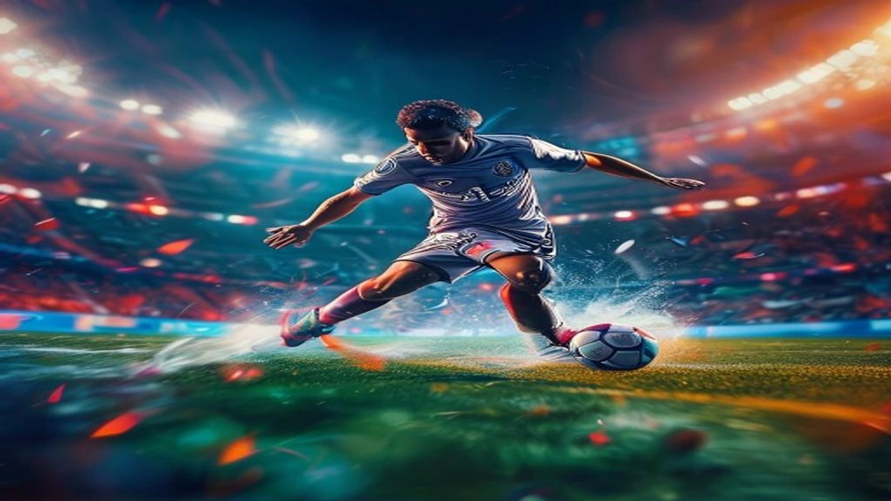

2026 북중미 월드컵 32강 토너먼트에서 세계 축구계를 뒤흔든 초대형 이변이 터졌습니다. 강력한 우승 후보 전차군단 독일이 파라과이의 육탄 방어에 막혀 조기 탈락하는 굴욕을 맛보았습니다. 이번 **독일 월드컵 탈락** 참사는 단순한 패배를 넘어 대표팀 지휘부의 전술적 파산과 경질론으로 번지며 전 세계 축구계를 뜨겁게 달구고 있습니다.

## 전차군단의 몰락: 독일 파라과이전 패배와 이변의 재구성

### 32강 승부차기 잔혹사: 결정적 실책의 순간들
전후반과 연장전까지 110분이 넘는 시간 동안 2:2로 승부를 가리지 못한 양 팀의 운명은 잔혹한 승부차기에서 갈렸습니다. 독일은 믿었던 베테랑 미드필더와 신성 공격수가 차례로 파라과이 골키퍼의 선방에 막히며 최종 스코어 3:4로 무릎을 꿇었습니다. 마지막 다섯 번째 키커의 슛이 골대를 맞고 나오는 순간 독일 관중석은 거대한 침묵에 잠겼으며 선수들은 피치 위에 주저앉아 눈물을 흘렸습니다. 현장에서 경기를 지켜본 외신 기자들은 유독 큰 경기 승부차기에서 강했던 독일이 이러한 집중력 저하를 보인 것은 역사상 유례없는 사건이라 평가했습니다.

### 파라과이의 그물망 수비 vs 독일의 무기력한 창
파라과이는 객관적인 전력 열세를 극복하기 위해 경기 시작부터 철저한 파이브백(5-back) 형태의 두터운 수비 블록을 형성했습니다. 중앙 밀집 지역을 뚫어내지 못한 독일은 무의미한 횡패스와 성공 확률이 낮은 롱볼 크로스만 남발하며 스스로 자멸하는 길을 택했습니다. 파라과이는 역습 상황에서 단 세 차례의 날카로운 유효 슈팅 중 두 개를 골로 연결하는 치명적인 효율성을 보여주었습니다. 독일 공격진은 상대의 육탄 방어와 압박에 가로막혀 경기 내내 이렇다 할 위협적인 슈팅을 기록하지 못했습니다.

## 독일 월드컵 탈락 진짜 원인: 전술적 문제점 비교분석

### 세대교체 실패인가 감독의 고집인가: 라인업의 한계
이번 대회에서 전차군단이 노출한 아킬레스건은 노쇠화된 미드필더진과 확실한 해결사의 부재였습니다. 사령탑은 세대교체 흐름을 외면한 채 본인의 전술을 오랫동안 수행해 온 익숙한 베테랑 자원들을 대거 중용하는 고집을 부렸습니다. 그 결과 전반전 중반 이후부터 급격한 체력 저하가 발생했고, 파라과이의 젊고 빠른 미드필더들과의 기동력 싸움에서 완패했습니다. 분데스리가에서 최고의 활약을 펼치던 신예 공격 자원들은 벤치를 지키거나 뒤늦은 시간대에 교체 투입되어 흐름을 바꾸기엔 역부족이었습니다.

> "현대 축구는 활동량과 빠른 공수 전환이 핵심인데, 이번 독일 대표팀의 라인업은 4년 전 전술에 멈춰 서 있는 듯한 무기력함을 보여주었다." — 유럽 축구 통계 매체 분석관

### 한지 플릭 체제와 현 사령탑의 전술적 차이점 및 장단점
과거 강한 전방 압박과 유기적인 패스 플레이로 유럽을 호령했던 한지 플릭 감독 시절과 비교하면 현 체제의 전술은 지나치게 경직되어 있습니다. 한지 플릭 체제는 양 측면 풀백의 적극적인 오버래핑과 중앙 공격형 미드필더의 유기적인 스위칭이 확실한 장점으로 꼽혔습니다. 반면 현재 전술은 안정적인 빌드업을 지향한다는 명목 하에 후방에서 볼을 돌리는 시간이 지나치게 길어 상대 수비가 대형을 갖출 시간을 벌어준다는 치명적인 단점이 존재합니다. 높은 점유율을 기록하고도 실속 있는 기회를 만들지 못하는 고질적인 멍에를 짊어지게 된 배경입니다.

[관련 글 보기](/posts/sports/)

## "절대 사퇴는 없다" 감독 경질론 찬반 쟁점 완전 정리

### 경질 찬성파의 논리: 경기력 저하와 전술적 유연성 부족
계속되는 비판 속에서도 사령탑이 인터픔를 통해 "자진 사퇴는 없다"는 입장을 고수하자 현지 여론은 급격히 악화되었습니다. 경질을 강하게 요구하는 찬성파들은 유로 대회에 이어 이번 월드컵까지 이어진 전술적 실패를 주된 근거로 제시합니다. 상대 팀의 맞춤형 전략에 전혀 대응하지 못하는 모습과 경기 중 교체 타이밍을 매번 놓치는 유연성 부족은 이미 개선의 여지가 없다는 파트가 지배적입니다. 축구 전문가들은 더 늦기 전에 사령탑을 교체해야 다가오는 국제 대회에서 체면을 치를 수 있다고 목소리를 높입니다.

### 경질 반대파의 논리: 대안 부재와 계약 위약금 리스크
반면 계약 기간이 아직 남아 있는 상황에서 무작정 경질을 감행하는 것은 현실적인 장벽이 가로막고 있다는 주장도 만만치 않습니다. 가장 큰 걸림돌은 막대한 규모의 위약금이며, 당장 독일 대표팀의 지휘봉을 잡아 암흑기를 수습할 만한 세계적인 명장의 매물이 시장에 흔치 않다는 점입니다. 소방수 역할을 맡길 대안이 명확하지 않은 상태에서 감독을 내쫓는다면 오히려 선수단 내의 극심한 혼란과 계파 갈등만 부추길 수 있다는 우려가 제기됩니다.

* **경질 찬성:** 전술적 무능함 입증, 즉각적인 체질 개선 및 세대교체 필요
* **경질 반대:** 천문학적인 위약금 발생, 마땅한 차기 감독 후보군 부재로 인한 혼란 가중

## 독일 축구의 향후 행보와 사령탑 교체 시나리오

### 차기 독일 대표팀 감독 유력 후보 TOP 3 장단점
독일축구협회(DFB)가 전격적인 경질 카드를 꺼내 들 경우, 차기 사령탑으로 거론되는 인물은 크게 세 명으로 압축됩니다. 첫 번째 후보는 전술적 혁신성이 뛰어난 젊은 전술가로, 선수단 장악력이 우수하지만 큰 무대 토너먼트 경험이 적다는 것이 단점입니다. 두 번째는 오랜 기간 클럽 무대에서 수많은 우승 트레이너를 거친 베테랑 명장이나, 그의 높은 연봉 요구액을 협회가 감당할 수 있을지가 미지수입니다. 마지막 후보는 독일 축구의 철학을 잘 이해하는 내부 승진 케이스인데, 신선함이 떨어지고 대대적인 쇄신을 이끌기엔 무게감이 부족하다는 비판을 받습니다.

### 유로 대회 및 차기 월드컵을 향한 독일 축구 협회(DFB)의 쇄신 방향
독일 축구가 과거의 영광을 되찾기 위해서는 단순히 지도자 한 명을 바꾸는 수준을 넘어 유소년 시스템부터 전술 트렌드까지 전면적인 개혹에 착수해야 합니다. 기술위원회는 현대 축구의 속도전에 걸맞은 피지컬과 기술을 겸비한 유망주들을 적극적으로 발굴하여 대표팀 체질을 개선하겠다는 로드맵을 구상 중입니다. 이번 월드컵 32강 잔혹사를 예방 주사 삼아 시스템 중심의 축구를 부활시키고 대표팀의 장기적인 발전 방향을 재정립하는 것만이 몰락한 축구 명가를 재건할 유일한 열쇠입니다.

**함께 읽으면 좋은 글**
- [손흥민 LAFC 출전시간 제한 조치 감독이 밝힌 3가지 이유](/posts/sports/lafc-son-heung-min-playing-time-management-2026/)
- [손흥민 톨루카전 슈팅0개 침묵에도 웃은 진짜 이유](/posts/sports/lafc-son-heung-min-toluca-leagues-cup-2026/)

#독일월드컵탈락 #2026월드컵이변 #전차군단몰락 #축구감독경질론 #파라과이전승부차기 #독일축구협회 #월드컵32강결과 #차기감독후보