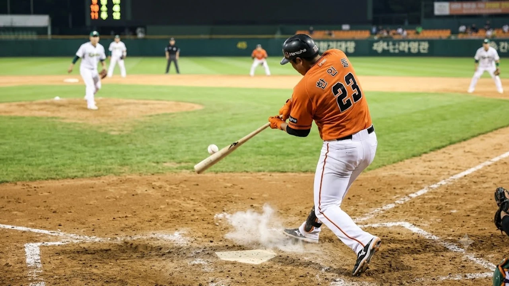

2026년 8월 21일 저녁 대전 한화생명볼파크에서 펼쳐진 맞대결에서 **한화 9점차 대역전승**이라는 KBO 리그 역사에 남을 명승부가 터졌습니다. 3회초까지 0-9로 끌려가며 패색이 짙었던 경기를 15-11로 뒤집은 이 혈투는 후반기 5강 싸움의 판도를 뒤흔드는 강력한 기폭제가 되었습니다.

## 0-9 절망에서 15-11 역전까지의 경기 타임라인

### 3회초 9실점 조기 강판과 위기 상황
선발 마운드가 초반 제구 난조와 집중타를 맞으며 3회초에만 대거 9실점했습니다. 6연패에 빠져 있던 흐름상 경기 초반 대량 실점은 자칫 무기력한 패배로 굳어지기 쉬운 벼랑 끝 상황이었습니다.

### 6회말 빅이닝을 만든 타선의 연속 집중력
반격의 도화선은 6회말에 당겨졌습니다. 선두 타자의 안타를 시작으로 연속 4안타와 상대 실책을 묶어 5점을 뽑아냈고, 단숨에 8-10 턱밑까지 따라붙으며 볼파크를 요동치게 만들었습니다.

### 승부를 뒤집은 8회말 결승타 순간
8회말 1사 만루 풀카운트 승부에서 터진 우중간 싹쓸이 3루타는 승부의 쐐기를 박았습니다. 9점 차 열세를 완벽히 뒤엎고 15-11 스코어를 만든 순간 더그아웃과 관중석은 열광의 도가니로 변했습니다.

## 한화 타선이 증명한 클러치 능력과 승부처 분석

### 하위 타선의 연결력과 출루율 상승
기적의 출발점은 7, 8, 9번 하위 타선이었습니다. 끈질긴 볼넷 출루와 진루타로 상위 타선에 밥상을 차렸고, 상대 선발과 필승조의 투구 수를 한계치까지 끌어올렸습니다.

### 상대 불펜을 무너뜨린 끈질긴 볼카운트 승부
- 2스트라이크 이후 파울 커트로 집요한 승부
- 스트라이크 존을 벗어나는 유인구를 참아내는 선구안
- 실투를 놓치지 않고 라인드라이브 타구로 연결한 집중력

타자 전원이 타석에서 끈질기게 물고 늘어지며 상대 불펜진의 조기 소모와 제구 난조를 이끌어냈습니다.

### 찬스를 놓치지 않은 중심 타선의 해결사 본능
주자가 모인 승부처마다 클린업 트리오의 방망이가 불을 뿜었습니다. 득점권 기회에서 장타를 몰아치며 경기 흐름을 완전히 장악했습니다.

## 기적을 뒷받침한 불펜 계투진과 수비 안정화

### 추가 실점을 원천 봉쇄한 롱릴리프의 무실점 호투
조기 강판된 선발 뒤를 이어 마운드에 오른 롱릴리프가 4이닝을 1피안타 무실점으로 틀어막았습니다. 추가 실점을 철저히 막아낸 불펜의 헌신이 타선 대폭발의 든든한 디딤돌 역할을 해냈습니다.

> "불펜이 버텨주지 못했다면 9점 차 역전 드라마는 시작조차 할 수 없었다."

### 승부처 실점을 막아낸 내야진의 호수비
7회초 실점 위기에서 터져 나온 유격수의 몸을 던진 다이빙 캐치와 더블플레이는 상대의 추격 의지를 완벽히 꺾어놓았습니다. 실책 하나에 승패가 갈리는 접전에서 내야 수비진의 집중력이 빛을 발했습니다.

### 흔들림 없이 경기를 매듭지은 뒷문 운용
역전에 성공한 9회초 마무리 투수가 등판해 세 타자를 연속 삼진과 범타로 돌려세우며 승리를 매듭지었습니다. 국내 프로야구와 해외 스포츠 전반의 흥미진진한 기록과 승부 분석이 궁금하다면 [스포츠 전체 글 보기](/posts/sports/)에서 확인할 수 있습니다.

## 이번 대역전승이 KBO 후반기 레이스에 미칠 영향

### 6연패 사슬을 끊어낸 팀 사기 극대화
단순한 1승을 넘어 6연패의 늪에서 탈출하는 결정적 계기였습니다. 패배 의식을 털어내고 '어떤 점수 차라도 뒤집을 수 있다'는 위닝 멘탈리티를 심어주었습니다.

### 5강 가을야구 경쟁 구도에 불어넣은 변수
치열한 중위권 순위 싸움에서 귀중한 승수를 챙기며 가을야구 진출권을 향한 불씨를 당겼습니다. 직접 맞붙은 경쟁팀과의 승차를 좁혀 후반기 판도를 안갯속으로 밀어 넣었습니다.

### 선발진 재정비와 불펜 소모 최소화 과제
짜릿한 승리 이면에는 선발 조기 강판과 불펜 투구 수 누적이라는 숙제가 남았습니다. 이어지는 주말 3연전을 매끄럽게 치르기 위해서는 선발 로테이션의 이닝 소화력 회복이 관건입니다.

[프로야구 응원용품 및 야구글러브 쿠팡에서 보기](https://www.coupang.com/np/search?q=%ED%94%84%EB%A1%9C%EC%95%BC%EA%B5%AC%EC%9A%A9%ED%92%88&sourceType=affiliate&trackingCode=AF8691300)

#한화이글스 #KBO리그 #대역전승 #프로야구 #한화야구 #불펜야구 #야구하이라이트 #역전드라마