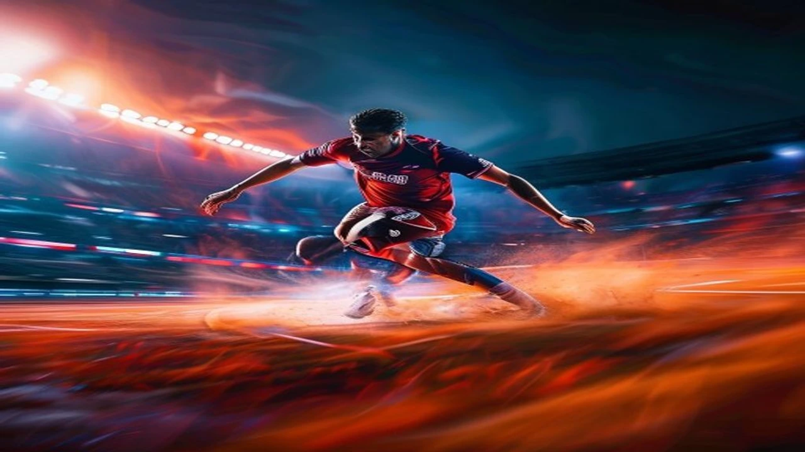

2026 북중미 월드컵 조별리그가 종반으로 치닫는 가운데, 대한민국 대표팀의 무기력한 경기력과 패배에 대한 축구 팬들의 여론이 거세게 폭발하고 있습니다. 특히 많은 이들이 **홍명보 전술 부재**를 가장 큰 원인으로 꼽으며, 국가대표팀의 경기 운영 방식에 심각한 의문을 제기하는 상황입니다. 사상 첫 원정 8강 이상을 노리던 대표팀이 직면한 전술적 한계와 이를 둘러싼 축구계 안팎의 날선 비판들을 자세히 정리했습니다.

## 홍명보호 전술 부재 논란의 핵심과 2002 멤버들의 날선 비판

### "전술이 안 보인다" 안정환·이천수가 쏟아낸 독설의 진실
2026년 6월 월드컵 조별리그 경기 직후 지상파 방송 3사 해설위원들과 유튜브 채널의 비판은 그 어느 때보다 매서웠습니다. MBC 해설위원 안정환은 경기 종료 직후 **"상대가 어떤 전술을 들고나올지 뻔히 보이는 상황에서 우리 대응은 단 하나도 준비되지 않았다"**라며 전술적 무능을 정면으로 꼬집었습니다. 이천수 역시 자신의 유튜브 채널을 통해 "선수들의 개인 기량에만 의존하는 축구는 아시아 예선에서나 통하지 본선에서는 통하지 않는다"라며, 현대 축구의 흐름을 전혀 따라가지 못하는 벤치의 전술 부재를 강도 높게 비판했습니다.

### 과거 4강 신화 주역들이 본 현재 대표팀의 결정적 패인
2002년 한일 월드컵 당시 거스 히딩크 감독 밑에서 철저한 압박과 세밀한 전술 축구를 경험했던 주역들은 현재 홍명보호의 가장 큰 문제점으로 **‘플랜 B의 전멸’**을 언급합니다. 상대가 전방 압박을 강하게 가해올 때 이를 풀어 나갈 세부 전술적 약속이 전혀 되어 있지 않다는 지적입니다. 

> "우리가 2002년에 강팀들을 잡을 수 있었던 이유는 선수 개개인의 능력보다, 11명이 톱니바퀴처럼 움직이는 전술적 완성도가 높았기 때문이다. 지금 대표팀은 공을 잡으면 다음 동작을 어디로 가져가야 할지 선수들조차 우왕좌왕하고 있다."  
> — 축구 전문가 공통 의견

### 축구 커뮤니티와 여론이 격분하는 진짜 이유
축구 팬들이 모이는 대형 커뮤니티인 에펨코리아, 디시인사이드 국축갤 등에서는 단순한 패배 자체보다 과정의 무기력함에 분노하고 있습니다. 경기당 평균 롱볼 비율이 35%를 넘어가며 과거의 구시대적 축구로 회귀했다는 비판이 지배적입니다. 축구 팬들은 선임 과정부터 잡음이 많았던 홍명보 감독이 본선 무대에서조차 전술적 역량을 증명하지 못하자, 대한축구협회의 선택이 틀렸음을 증명하는 명백한 증거라며 목소리를 높이고 있습니다.

## 2026 월드컵 조별리그 경기력 분석: 무전술 vs 맞춤 전술

### 상대국 맞춤 대응 실패와 고집스러운 빌드업의 한계
이번 대회에서 대한민국을 상대한 팀들은 철저한 전방 압박과 중원 봉쇄 전략을 들고나왔습니다. 반면 홍명보호는 후방에서부터 시작하는 느린 템포의 빌드업을 고집하다가 상대 압박에 막혀 허무하게 공을 빼앗기는 장면을 수없이 노출했습니다. 상대의 전술적 변화에 대응하는 벤치의 인게임 전술 수정 능력이 사실상 전무했다는 평가를 받습니다.

### 역대 월드컵 대표팀 전술 완성도 비교 (벤투호 vs 홍명보호)
4년 전 세밀한 후방 빌드업과 확고한 철학으로 16강 진출을 이뤄냈던 파울루 벤투 감독 시절과 비교하면 그 차이는 더욱 명확해집니다.
- **벤투호 (2022)**: 4년 동안 일관된 프로세스로 다져진 확고한 전술적 정체성, 압박 상황에서의 유기적인 패스 경로 확보.
- **홍명보호 (2026)**: 뚜렷한 전술적 색채 없이 경기마다 선수들의 컨디션과 개인 기량(손흥민, 이강인 등)에 의존하는 고립된 형태.

### 데이터로 증명된 공수 밸런스 붕괴와 유효슈팅 급감 원인
국제축구연맹(FIFA) 기술연구그룹(TSG)이 발표한 경기 데이터 리포트에 따르면, 대한민국의 이번 조별리그 파이널 서드(공격 지역) 진입 횟수는 지난 대회 대비 42% 감소했습니다. 중원에서의 전술적 유기성이 떨어지다 보니 공격진으로 향하는 패스의 질이 급격히 저하되었습니다. 이로 인해 경기당 유효슈팅이 고작 1.8개에 그치는 참담한 지표를 기록했습니다.

## 축구 전문가들이 지적하는 홍명보 전술의 장단점 명확한 요약

### 롱볼 축구와 단순한 측면 크로스 위주 공격의 명과 암
홍명보 감독의 축구는 선이 굵고 직선적인 형태를 띱니다. 
- **장점**: 후방 빌드업 리스크를 줄이고 롱패스를 통해 한 번에 상대 뒷공간을 노릴 때 물리적인 시간을 단축합니다.
- **단점**: 세컨드 볼 강탈을 위한 조직적인 움직임이 없다면 소유권을 허무하게 내주며, 단순한 크로스 위주 공격은 피지컬이 좋은 서구권 수비수들에게 쉽게 차단당합니다.

### 선수 개개인의 피지컬과 이름값에만 의존하는 관리형 축구의 한계
유럽 빅리그에서 활약하는 스타 선수들의 기량에 전적으로 기대는 관리형 리더십은 아시아 지역 예선에서는 체급 차이로 승리를 가져다줄 수 있었습니다. 그러나 세계 최고 수준의 조직력을 갖춘 본선 무대에서는 철저히 파해당했습니다. 전술적 유기성이 배제된 상황에서 고립된 에이스들은 상대 집중 견제의 희생양이 될 뿐이었습니다.

[관련 글 보기](/posts/sports/)

### 남은 토너먼트 진출 시 전술 변화를 위한 최소한의 개선책
기적적으로 다음 라운드에 진출하거나 향후 대표팀의 체질 개선을 이루기 위해서는 전술적 대전환이 필요합니다.
- **중원 숫자 확보**: 미드필더진의 간격을 좁혀 3선과 2선의 유기적인 삼각 패스 길을 열어야 합니다.
- **전방 압박 타이밍 세분화**: 무의미한 전원 후퇴 대신, 특정 지역을 설정해 조직적으로 상대를 압박하는 현대적 트렌드를 이식해야 합니다.

## 축구 팬을 위한 월드컵 전술 분석 사이트 및 중계 하이라이트 활용 가이드

### 풋몹(FotMob)과 소파스코어(SofaScore)로 감독 전술 평점 확인하는 법
일반 팬들도 중계방송 화면 너머의 전술을 직관적으로 파악할 수 있는 유용한 도구가 있습니다. 글로벌 축구 통계 앱인 **FotMob**과 **SofaScore**를 활용하면 경기 중 선수들의 평균 위치(Heatmap & Average Positions)를 실시간으로 확인할 수 있습니다. 이를 통해 홍명보호의 고질적인 문제인 '미드필더 라인 공동화 현상'과 선수들 간의 간격이 얼마나 벌어져 있는지를 수치로 직접 검증할 수 있습니다.

### 경기 종료 후 3분 만에 핵심 전술 패착 영상 찾아내는 꿀팁
공식 중계 하이라이트는 골 장면 위주로 편집되어 전술적 흐름을 파악하기 어렵습니다. 경기가 끝난 후 FIFA 공식 플러스(FIFA+) 플랫폼이나 국내 주관 방송사의 '전술 캠(Tactical Cam)' 하이라이트를 활용하는 편이 좋습니다. 전술 캠은 경기장 전체를 높은 앵글에서 비추기 때문에 오프더볼 상황에서 우리 수비진의 대형이 어떻게 무너지는지, 홍명보 감독이 지시한 수비 블록이 왜 작동하지 않았는지 한눈에 파악할 수 있도록 돕습니다.

### 국내외 축구 전술 유튜버들의 정밀 분석 영상 추천 리스트
텍스트 기사나 단순 하이라이트보다 깊이 있는 분석을 원한다면 전문 전술 분석 채널을 참고하는 것이 효과적입니다.
- **새벽의 축구 전문가**: 경기 직후 상세한 그래픽 툴을 활용해 대한민국 대표팀의 후방 빌드업 실패 원인과 동선 겹침 문제를 가장 빠르게 분석하는 채널입니다.
- **달수네라이브**: 기자 출신 전문가들과 은퇴 선수들의 시각을 통해 현장 분위기와 전술적 패착을 가감 없이 전달합니다.
- **페노메논 축구 분석**: 해외 선진 축구 트렌드와 홍명보호의 전술을 전술판을 활용해 1대1로 비교해 주어 초보자도 쉽게 이해할 수 있는 콘텐츠를 제공합니다.

**함께 읽으면 좋은 글**
- [노르웨이 브라진 격파 8강 진출, 진짜 비결 완전 정리](/posts/sports/norway-brazil-shock-haaland-quarterfinals-2026/)
- [2026 월드컵 바뀌는 32강 방식 완벽 정리](/posts/sports/worldcup-2026-format-32games-change/)

#홍명보 #전술부재 #2026월드컵 #축구대표팀 #안정환비판 #이천수독설 #대한축구협회 #월드컵경기분석 #축구전술분석