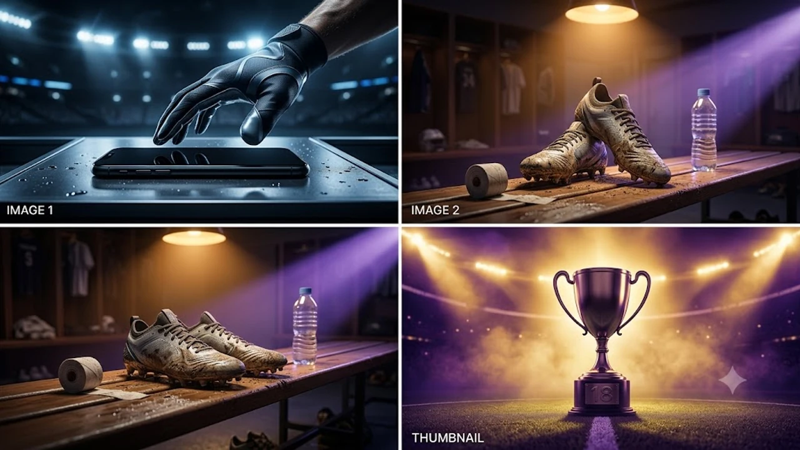

매년 가을 스마트폰 교체 주기가 돌아오면 한정된 초기 물량을 선점하려는 움직임이 분주해집니다. 이번 **아이폰18 사전예약** 역시 공식 발표 직후 출고가와 할인율이 확정되면서 실질 체감 가격을 낮추려는 구매자들의 셈법이 한층 치열해졌습니다. 자급제 공실률과 통신사 공시지원금 변동 폭을 미리 파악해 두면 불필요한 지출을 수십만 원 이상 아낄 수 있습니다.

## 아이폰18 사전예약 일정 및 공식 출시 정보

### 글로벌 공개 직후 확정된 국내 예약 타임라인

애플 키노트 직후 공지된 국내 예약 일정은 9월 중순 금요일 자정을 기점으로 일제히 열립니다. 통상 1차 출시국 지위를 유지할 경우 사전 접수는 약 일주일간 이어지며, 정식 배송과 대리점 개통은 차주 금요일 오전 8시부터 순차 진행됩니다.

- 1차 사전예약 시작: 9월 중순 금요일 00시 정각
- 공식 매장 픽업 및 택배 수령: 예약 시작 7일 후 순차 발송
- 2차 추가 물량 오픈: 1차 마감 직후 취소 물량 기반 수시 오픈

### 1차 출시국 기준 배송 시작일 및 수령 방식

택배 배송을 선택할 경우 대도시권은 출시 당일 새벽이나 오전에 받아볼 수 있으나, 도서 산간 지역은 1~2일 추가 소요가 불가피합니다. 직영 매장인 애플스토어 '픽업 서비스'를 신청하면 당일 대기 없이 지정 시간에 방문해 기기를 직접 개통할 수 있으므로 일정 조율이 편합니다.

### 온·오프라인 매장별 사전예약 오픈 시간 비교

온라인 플랫폼은 00시 정각에 트래픽이 집중되면서 서버 지연이 흔히 일어납니다. 반면 통신사 직영점이나 오프라인 리셀러 매장은 개점 시간인 오전 10시 전후로 사전 접수를 개시하므로 온라인 경쟁에 실패했을 때 대안으로 활용하기 좋습니다.

## 자급제 vs 통신사 사전예약 혜택 정밀 비교

### 오픈마켓 카드 할인율 및 무이자 할부 혜택

쿠팡, 11번가, SSG 등 주요 이커머스 채널의 자급제 혜택은 제휴 카드 즉시 할인이 핵심입니다. 신제품 출시 초기에는 통상 5~8% 안팎의 청구 할인과 최장 22개월 무이자 할부가 결합되어 초기 목돈 지출 부담을 덜어줍니다.

> 통신사 약정 족쇄가 싫다면 자급제 단말기에 알뜰폰 LTE/5G 무제한 요금제를 조합하는 방식이 2년 총비용 기준 40만 원 이상 유리합니다.

### 통신 3사 공시지원금과 선택약정 요금 차이

이통 3사는 초기 지원금을 낮게 책정하는 편이므로 단말기 가격을 깎아주는 공시지원금보다 통신요금을 25% 감면받는 '선택약정'을 고르는 편이 훨씬 이득입니다.

| 구분 | 공시지원금 선택 | 선택약정(25% 요금할인) |
|---|---|---|
| 단말기 할인 | 10~15만 원 수준(초기 기준) | 없음 (정가 구매) |
| 24개월 요금 절감액 | 없음 | 월 2만~3만 원대 누적 할인 |
| 실질 총비용 | 고가 요금제 유지 필수라 불리 | 고가 요금제 쓸수록 유리 |

### 사은품 구성(애플케어플러스, 액세서리 패키지) 가치 평가

통신사 전용 혜택으로 내세우는 사은품은 정품 고속 충전기, 맥세이프 케이스 패키지, 애플케어플러스 10~20% 할인권 등이 주를 이룹니다. 다만 겉보기 혜택에 현혹되기보다는 고가 부가서비스 3~4개월 의무 유지 조건을 면밀히 따져봐야 합니다. IT 기기뿐 아니라 최신 트렌드 전반의 분석이 궁금하다면 [스포츠 전체 글 보기](/posts/sports/)에서 다른 분석도 확인할 수 있습니다.

## 아이폰18 핵심 스펙 변화와 전작 대비 장단점

### A20 칩셋 성능 및 온디바이스 AI 기능 체감 차이

차세대 2나노 공정이 적용된 A20 바이오닉 칩셋은 고부하 작업 시 발열 억제력과 전력 효율이 전작 대비 체감될 정도로 개선되었습니다. 음성 비서와의 자연어 대화 처리, 실시간 통화 녹음 요약 등 기기 내부 연산 처리 속도가 눈에 띄게 빨라졌습니다.

### 카메라 모듈 업그레이드와 센서 개선 포인트

메인 센서 면적이 넓어져 야간 저조도 촬영 시 노이즈가 대폭 줄었습니다. 특히 광각 렌즈 왜곡 억제 알고리즘이 보강되어 실내 인물 촬영이나 역광 환경에서도 피부 톤과 배경 명암비를 자연스럽게 살려냅니다.

### 배터리 용량 및 충전 속도 개선에 대한 실사용 평가

신형 배터리 셀 구조 덕분에 동일 무게 대비 사용 시간이 약 1.5~2시간 늘어났습니다. 유선 충전 규격 역시 최대 35W 급속 입력을 안정적으로 받아들여 배터리 잔량 0%에서 50%까지 25분 안팎에 도달합니다.

## 가장 저렴하게 사전예약 성공하는 실전 구매 가이드

### 쿠팡·11번가 결제 수단 사전 세팅 팁

사전예약 당일 1초 차이로 1차 물량 결제가 갈립니다. 시작 10분 전 반드시 다음 3가지를 마쳐야 합니다.

- 플랫폼별 기본 배송지 최우선 설정 및 재검증
- 결제 수단에 제휴 할인 대상 신용카드 등록 후 '생체 인증 원클릭 결제' 활성화
- 자정 정각 새로고침 후 장바구니를 거치지 않고 바로 '즉시 구매' 클릭

### 기존 기기 중고 보상(트레이드인) 프로그램 활용법

공식 애플 트레이드인은 판정 기준이 까다롭지 않아 외관 흠집이 있어도 정해진 반납 금액을 비교적 온전히 보전해 줍니다. 반면 민팃 같은 무인 ATM이나 중고 거래 플랫폼을 이용하면 상태가 양호한 S급 기기에 한해 공식 보상가보다 10~15% 더 높은 현금을 손에 쥘 수 있습니다.

### 취소표 발생 시간대를 노린 2차 예약 공략법

1차 예약을 놓쳤더라도 포기할 필요는 없습니다. 예약 시작 15~30분 뒤 중복 결제자가 취소하는 물량이 한 번 쏟아지고, 결제 실패 계정의 자동 취소분이 풀리는 새벽 1시~2시 사이에 2차 구매 성공 사례가 빈번하게 나옵니다.

[아이폰18 정품 충전 어댑터 및 전용 케이스 쿠팡에서 보기](https://www.coupang.com/np/search?q=%EC%95%84%EC%9D%B4%ED%8F%B0%EC%BC%80%EC%9D%B4%EC%8A%A4&sourceType=affiliate&trackingCode=AF8691300)

#아이폰18 #아이폰18사전예약 #자급제폰 #선택약정 #애플케어플러스 #아이폰사전예약방법 #스마트폰성지