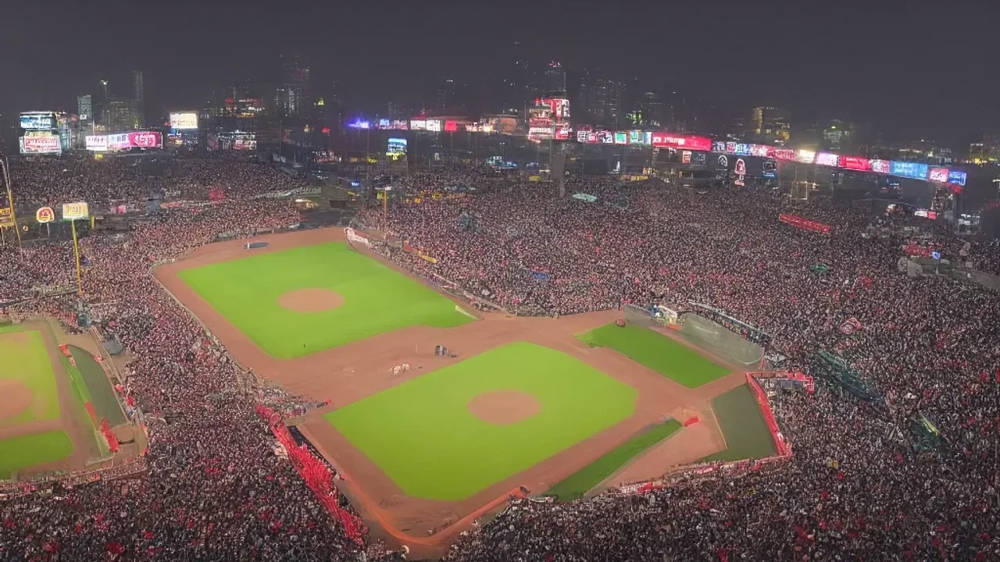
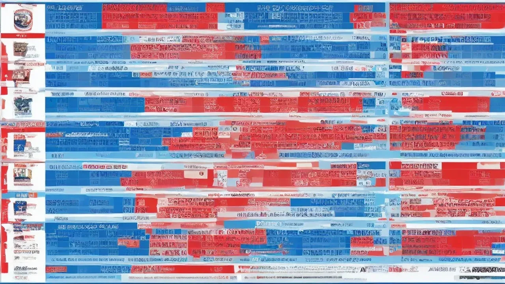

역대 최단기간 500만 관중을 돌파하며 뜨겁게 달아오른 2026 KBO 순위 싸움이 야구팬들의 심장을 직격하고 있습니다. 전통의 명가들과 신흥 강자들이 매 경기마다 선두 자리를 바꾸는 역대급 치열한 페이스를 보여주는 중입니다. 올 시즌 프로야구가 이토록 뜨거운 열기를 뿜어내는 배경과 함께, 치열한 상위권 판도 및 직관 팁까지 진짜 핵심만 모아 완전 정리했습니다.

## 역대 최단 500만 관중 돌파, 2026 KBO 흥행 광풍의 진짜 이유

### 2024 대박 시즌도 넘었다! 역사적 페이스 분석
한국야구위원회(KBO) 공식 발표에 따르면, 2026 KBO 리그는 시즌 345경기 만에 누적 관중 500만 명을 돌파하는 기염을 토했습니다. 기존 역대 최단기간 기록이었던 2024 시즌의 415경기를 무려 70경기나 단축한 전무후무한 대기록입니다. 경기당 평균 관중 수는 14,500명을 상회하며, 전국 10개 구장의 평균 매진율은 58.3%에 육박하는 등 유례없는 티켓 대란이 현실화되었습니다.

### 2030 여성 및 가족 단위 팬덤 유입이 바꾼 야구장 풍경
과거 중장년 남성 중심이던 야구장 관람 문화는 완전히 재편되었습니다. 스포츠 마케팅 조사 기관의 2026년 상반기 발권 데이터 분석 결과, 전체 예매자 중 **20대와 30대 여성 비율이 42.6%**를 차지하며 흥행의 핵심 주축으로 자리 잡았습니다. 단순한 경기 관람을 넘어 선수별 응원가 떼창, 구장 한정 식음료(F&B) 소비, SNS 인증샷 문화가 결합되면서 야구장은 거대한 복합 문화 공간으로 기능합니다.

### 폭발적인 매진율이 증명하는 10개 구단 티켓 파워
특히 주말 시리즈뿐만 아니라 화\~목요일 주중 경기에서도 매진 사례가 속출하는 현상이 두드러집니다. 한화 이글스의 대전 이글스파크는 홈경기 매진율 80%를 넘겼고, LG 트윈스와 두산 베어스가 함께 쓰는 잠실구장은 주말마다 23,750석 전석이 매진되는 위엄을 보여줍니다. 비수기가 사라진 KBO의 이러한 열기는 구단들의 MD 상품 매출을 전년 대비 150% 이상 성장시키는 경제적 효과로 이어졌습니다.

## 6월 대격돌! LG·KT·삼성 상위권 삼국지 전력 비교

### '디펜딩 챔피언' LG 트윈스의 두터운 뎁스와 불펜 리스크
현재 34승으로 선두를 달리는 LG 트윈스는 야수진의 압도적인 뎁스가 가장 큰 강점입니다. 홍창기, 신민재로 이어지는 테이블 세터진의 출루율은 리그 1위(0.385)를 마크하며 상대 투수진을 끊임없이 괴롭힙니다. 다만 지난 시즌에 비해 필승조의 과부하가 빠르게 찾아오면서, 7회 이후 불펜 평균자책점이 5.24까지 치솟는 약점을 노출했습니다. 선발 투수진이 긴 이닝을 소화해주지 못할 경우 여름철 급격한 순위 하락을 겪을 위험성이 존재합니다.

### 마법 같은 상승세 KT 위즈의 선발 야구와 타선 폭발력
선두 LG를 0.5경기 차로 바짝 추격 중인 KT 위즈는 고영표, 쿠에바스로 이어지는 원투펀치가 건재합니다. 5월 한 달간 팀 선발 평균자책점 1위(3.12)를 기록하며 안정적인 경기 운영 능력을 과시했습니다. 강백호와 로하스가 버티는 중심 타선은 득점권 타율 0.310을 기록하며 기회를 놓치지 않는 집중력을 보여줍니다. 야구 전문가들은 KT의 탄탄한 투수력이 장기 레이스에서 가장 안정적인 무기가 될 것으로 평가합니다.

### '전통 명가' 삼성 라이온즈의 홈런 공장 가동과 장타력의 힘
선두와 1경기 차로 3위에 위치한 삼성 라이온즈는 대구 삼성라이온즈파크의 이점을 극대화하는 중입니다. 팀 홈런 1위(78개)를 질주하며 화끈한 거포 야구로 팬들을 열광시킵니다. 구자욱의 정교함에 외국인 타자의 장타력이 시너지를 내면서 경기 후반 한 방으로 승부를 뒤집는 능력이 탁월합니다. 그러나 높은 홈런 의존도만큼 삼진율 역시 리그 최상위권이어서, 투수 친화적인 원정 구장 방문 시 타선의 기복이 심해진다는 명확한 단점을 안고 있습니다.

## 매진 대란 속 원하는 좌석 잡는 야구장 직관 예매 꿀팁

### 구단별 공식 앱 vs 인터파크·티켓링크 예매 오픈 시간 저격하기
피터지는 예매 전쟁에서 승리하려면 구단별 예매처의 특징을 완벽히 파악해야 합니다. LG, 두산, 키움 등은 티켓링크를 사용하고 있으며, SSG와 토요일 홈경기의 일부 구단은 인터파크를 이용합니다. 반면 KT, 한화, 삼성 등은 자체 구단 공식 애플리케이션을 통해서만 선예매 혜택을 제공하므로 유료 멤버십 가입이 필수적입니다. 일반 예매 오픈 시간 정각 3분 전부터 서버 타임 확인 사이트를 켜두고 0.01초 단위로 클릭을 준비하는 태도가 요구됩니다.

> **[2026 시즌 주요 구단 티켓 오픈 타임 테이블]**
> * **KT 위즈 (공식 앱):** 경기 일주일 전 오전 11시 (선예매 필수)
> * **LG 트윈스 (티켓링크):** 경기 7일 전 오전 11시 (연간 회원 선오픈 유의)
> * **삼성 라이온즈 (공식 앱):** 경기 1주일 전 오후 2시 티켓 오픈

### 취소표가 가장 많이 풀리는 '황금 시간대' 집중 공략법
정식 예매에 실패했다고 해서 직관을 포기할 필요는 없습니다. 무통장 입금 기한이 만료되는 **경기 이틀 전 자정(0시 5분 \~ 0시 20분 사이)**에 대량의 취소표가 시스템에 반환됩니다. 또한 경기 당일 취소 수수료가 최고조에 달하는 시점인 경기 시작 4시간 전에도 연석 좌석들이 대거 쏟아져 나옵니다. 이 타이밍을 노려 지속적으로 새로고침을 시도하면 예매 대기 없이 좋은 자리를 선점하는 행운을 잡게 됩니다.

### 여름철 직관 필수 준비물과 구장별 숨은 명당 좌석 추천
6월에 접어들며 낮 경기는 물론 야간 경기 역시 높은 습도와 더위로 지치기 쉽습니다. 보냉백에 얼린 생수, 휴대용 선풍기, 쿨링 패치는 이제 선택이 아닌 생존 필수품입니다. 잠실구장을 방문한다면 오후 6시 이후 그늘이 먼저 지는 1루 네이비석 319블록 앞줄을 추천합니다. 대구 라이온즈파크는 탁 트인 시야와 함께 대구의 명물 납작만두를 즐길 수 있는 3루 내야지정석이 최고의 명당으로 꼽힙니다.

[관련 글 보기](/posts/sports/)

## 야구 전문가와 커뮤니티가 예측하는 2026 시즌 최종 우승 팀은?

### 무더위가 시작되는 7\~8월 '여름 레이스'를 버텨낼 체력왕은 누구?
KBO 리그의 진짜 승부는 7월부터 시작되는 혹서기 레이스에서 판가름 납니다. 체력 소모가 극심한 포수진 and 백업 야구선수들의 두께가 팀의 성패를 결정짓는 핵심 지표가 됩니다. 주전 의존도가 높은 삼성에 비해, 전 포지션에 걸쳐 주전급 백업을 보유한 LG 트윈스가 여름 레이스에서 상대적으로 유리 고지를 점할 것이라는 예측이 지배적입니다.

### 가을야구 진출을 가를 후반기 변수: 부상 복귀 선수와 외국인 투수 교체
현재 하위권에 처진 구단들의 반격 카드 역시 순위표를 흔들 강력한 변수입니다. 에이스급 토종 선발들의 부상 복귀 스케줄과 6월 말 감행될 부진한 외국인 투수들의 교체 타이밍이 맞물려 있습니다. 

* 1선발 외인 교체를 준비 중인 기아 타이거즈
* 부상에서 돌아오는 한화 이글스의 강속구 투수진
* 후반기 대반격을 노리는 두산 베어스의 타선 집중력

이러한 요소들은 상위권 팀들의 승수를 깎아 먹는 무서운 도깨비 팀으로 돌변할 가능성을 내포합니다.

### 역대급 박빙 순위 싸움이 가져올 2026 포스트시즌 관전 포인트
격차가 촘촘한 만큼 단 한 경기 결과로 1위부터 5위까지의 대진표가 완전히 뒤바뀔 확률이 높습니다. 전문가들은 올 시즌 와일드카드 결정전부터 한국시리즈까지 매 단계마다 5차전, 7차전 꽉 찬 승부가 펼쳐질 것으로 내다봅니다. 끝까지 방심할 수 없는 짜릿한 각본 없는 드라마가 2026년 가을 대한민국을 완전히 뒤흔들 것입니다.

#KBO순위 #프로야구순위 #500만관중 #KBO흥행 #야구예매꿀팁 #LG트윈스 #KT위즈 #삼성라이온즈 #2026KBO #야구직관