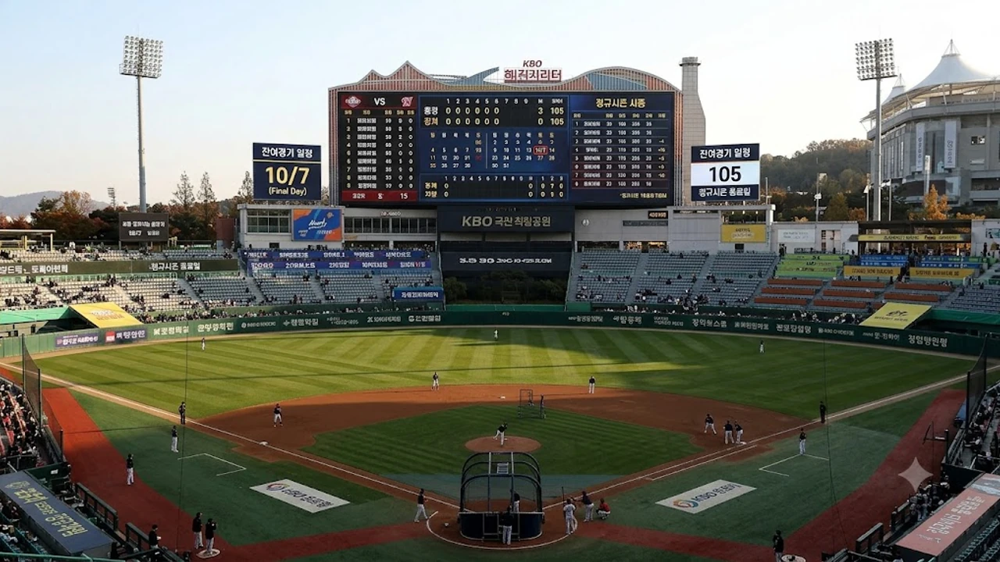

2026 KBO 리그 정규시즌이 막바지로 치달으면서 한국야구위원회(KBO)가 잔여 경기 일정을 공식 발표했습니다. 올가을 포스트시즌 진출을 노리는 중위권 구단들의 치열한 순위 다툼 속에서 **2026 KBO 잔여경기 일정** 편성은 가을야구 막차 탑승을 결정지을 핵심 열쇠입니다. 우천 취소로 밀린 경기들의 재편성과 더블헤더 운영 원칙을 꼼꼼히 파악해 팀별 유불리를 짚어냅니다.

## 2026 KBO 정규시즌 잔여 105경기 공식 일정 개요

### 미편성 및 순연 경기 재배치 기준
KBO 사무국이 확정한 일정표에 따르면 올여름 잦은 기습 폭우와 혹서기 취소로 발생한 미편성 경기 총 105경기가 9월과 10월 초에 걸쳐 빈틈없이 재배치되었습니다. 이동 동선을 줄이기 위해 인접 구장 간 매치업을 우선 묶었으며, 동일 대진 단편 경기는 기존 주중 및 주말 시리즈의 예비일이나 시즌 말미 블록에 집중 배치했습니다.

### 9~10월 경기 개시 시간 변경 안내
일몰 시간과 관람 환경 변화를 반영해 주말 및 공휴일 경기 시간이 바뀝니다. 9월 첫째 주부터 일요일 및 공휴일 경기는 오후 2시로 당겨지며, 토요일 경기는 오후 5시에 시작합니다. 단, 평일 야간 경기는 기존과 동일하게 오후 6시 30분에 플레이볼을 선언합니다. 낮 경기 특유의 타구 판단과 조명 적응 문제가 경기 초반 승패를 가르는 변수로 작용합니다.

### 10월 7일 최종전 대진과 정규시즌 종료 시점
정규시즌 최종전은 추가 우천 취소가 발생하지 않는다는 전제하에 10월 7일 전국 5개 구장에서 일제히 펼쳐집니다. 1위 직행 티켓과 5위 와일드카드 결정전 진출팀이 최종전 당일까지 안갯속에 머무를 가능성이 커 막판까지 총력전이 이어집니다.

## 9월 29일부터 시작되는 더블헤더 운영 규칙

### 우천 순연 시 예비일 우선 배정 원칙
9월 29일 이후 비로 경기가 열리지 못할 경우 발표된 일정 내 예비일로 최우선 배정됩니다. 해당 대진에 예비일이 없다면 다음 날 동일 대진이 잡혀 있을 때 곧바로 더블헤더로 편성됩니다. 예비일마저 모두 소진되면 10월 7일 정규 일정 직후 예비 기간으로 경기가 순연됩니다.

> **더블헤더 엔트리 확대 규정:** 더블헤더 개최 시 구단은 기존 현역 엔트리 외에 추가로 2명의 특별 엔트리를 등록해 운용할 수 있습니다. 체력 고갈을 방지하기 위한 제도적 장치입니다.

### 팀당 더블헤더 제한 및 선수단 체력 안배 규정
선수 부상 방지를 위해 한 팀이 9연전을 초과해 연속 경기를 치를 수 없도록 일정이 제한됩니다. 더블헤더는 1주일에 단 한 차례만 치를 수 있으며, 일요일에는 더블헤더를 개최하지 않는 것이 기본 원칙입니다. 선발 투수의 조기 강판이나 연투가 잦아지면 주간 경기력 전체가 급격히 무너집니다.

### 월요일 경기 편성 및 연장전 적용 가이드라인
주말 취소 경기를 소화하기 위한 월요일 경기가 정식 가동됩니다. 더블헤더 제1경기는 9회까지만 진행하며 연장전을 치르지 않고 무승부로 매듭짓습니다. 제2경기는 정규이닝 종료 후 동점일 경우 12회까지 연장전을 치러 승패를 가립니다.

## 가을야구 판도를 뒤흔들 3대 핵심 변수

### 9월 중순 국제대회 차출에 따른 구단별 전력 공백
시즌 막판 순위 경쟁의 가장 큰 복병은 핵심 자원의 외부 이탈입니다. 국가대표급 에이스 투수와 중심 타자가 차출될 경우 대체 선발과 백업 야수의 활약 여부가 구단 운명을 가릅니다. 선수층이 얇은 팀일수록 9월 중순 일정에서 승률 방어가 어려워집니다.

### 불펜 소모전을 좌우할 더블헤더 선발 로테이션
5인 선발 로테이션이 붕괴되는 순간 롱릴리프와 필승조의 과부하가 필연적으로 발생합니다. 대체 선발이 최소 5이닝을 버텨주지 못하면 다음 3연전까지 불펜 계투진이 연쇄 붕괴를 겪습니다. 투수 엔트리 13~14명을 어떻게 효율적으로 쪼개 쓰느냐가 벤치의 승부처 운영 능력을 증명합니다.

### 0.5경기 차 5위권 맞대결 일정과 상대 전적
5위를 다투는 중위권 팀들 간의 잔여 맞대결은 1승 이상의 가치를 지닙니다. 승리 시 1게임을 벌리고 패배 시 1게임을 잃어 하루 만에 순위표가 뒤집힙니다. 정규시즌 내내 상대 전적에서 우위를 점했던 특정 구장과 요일별 데이터가 벤치의 작전 지시 기준점이 됩니다.

## 잔여 일정으로 보는 5강 와일드카드 진출 시나리오

### 수도권 구단들의 잠실·수원 집중 연전 유불리
수도권 연고 구단들은 장거리 버스 이동 없이 잠실, 문학, 수원을 오가며 잔여 일정을 소화하는 지리적 이점을 누립니다. 이동 피로가 적은 만큼 주전 야수들의 타격 컨디션을 일정하게 유지할 수 있어 승수 쌓기에 유리한 고지를 점합니다. 국내 프로야구 판도 외에 다른 종목의 흐름이 궁금하다면 [스포츠 전체 글 보기](/posts/sports/)에서 최신 분석을 확인할 수 있습니다.

### 지방 원정 연전 일정에 따른 이동 피로도 비교
영호남을 잇는 장거리 원정 연전이 잡힌 팀들은 숙소 이동과 야간 이동에 따른 생체 리듬 저하를 극복해야 합니다. 특히 원정 6연전 이후 홈으로 복귀해 더블헤더를 치르는 험난한 동선이 걸린 구단은 체력 관리 매뉴얼을 철저히 가동해야 합니다.

### 최종전 직전 매직넘버 및 트래직넘버 계산법
포스트시즌 자력 진출을 확정하는 매직넘버와 탈락을 가리키는 트래직넘버가 9월 중순부터 매일 갱신됩니다. 5위 확정 매직넘버는 6위 팀의 잔여 경기 전승을 가정한 상태에서 자력 승수를 합산해 산출합니다.

- **승차 지우기 전략:** 맞대결이 남았을 때 하위 팀은 반드시 해당 경기를 쓸어 담아 상대 트래직넘버를 한 번에 2씩 깎아내야 역전이 가능합니다.
- **타이브레이커 규정:** 정규시즌 5위가 동률로 끝날 경우 상대 전적 다승, 다득점 순으로 최종 진출팀을 가려내므로 1점 차 승부에서의 실점 관리도 끝까지 신경 써야 합니다.

[야구용품 및 응원 굿즈 쿠팡에서 보기](https://www.coupang.com/np/search?q=%EC%95%BC%EA%B5%AC%EC%9A%A9%ED%92%88&sourceType=affiliate&trackingCode=AF8691300)

#2026KBO리그 #KBO잔여경기일정 #프로야구순위싸움 #5강와일드카드 #가을야구경쟁 #더블헤더규정 #KBO일정안내 #프로야구매직넘버