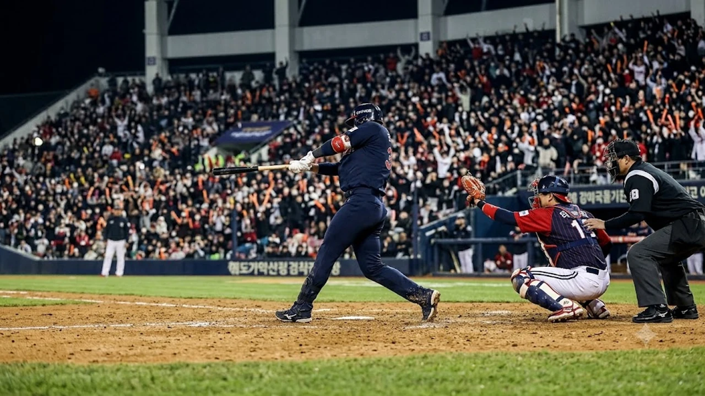

2026 KBO 포스트시즌의 막이 오르자마자 가을야구 판도가 거세게 요동치고 있습니다. 1차전에서 정규시즌 5위 팀이 적지에서 극적인 승리를 거두며 **2026 와일드카드 2차전** 끝장 승부가 성사되었고, 이제 단 한 경기로 준플레이오프 티켓의 주인공이 가려집니다. 벼랑 끝에 몰린 4위 팀과 기세를 탄 5위 팀의 맞대결은 가을야구 단기전 특유의 긴장감과 수싸움을 극대화하고 있습니다.

## 벼랑 끝 2차전 성사: 1차전 업셋이 바꾼 가을야구 판도

### 1차전 승부처 복기와 5위 팀의 반격 요인
1차전의 승패를 가른 결정적 요인은 경기 후반 불펜 싸움과 대타 작전의 적중이었습니다. 5위 팀은 선발 투수가 5이닝을 실점 없이 버텨준 뒤, 7회초 득점권 찬스에서 대타 카드를 과감히 꺼내들어 적시타를 터뜨렸습니다. 반면 4위 팀은 잔루 8개를 남기며 중심 타선의 침묵이 뼈아프게 작용했습니다. 

- **승부처 1**: 7회초 1사 2·3루에서 터진 2타점 결승 좌전 적시타
- **승부처 2**: 8회말 4위 팀의 무사 1루 번트 실패로 인한 더블플레이
- **승부처 3**: 9회말 1점 차 위기를 막아낸 5위 팀 마무리 투수의 연속 삼진

### 4위 팀의 어드밴티지 소멸과 심리적 압박감
정규시즌 4위 팀이 안고 출발했던 '1승 어드밴티지'는 1차전 패배와 함께 완전히 사라졌습니다. 이제 양 팀 모두 무승부 시 4위 진출이라는 규정 하나만을 남겨둔 채 사실상의 단판 승부를 치러야 합니다. 

> 포스트시즌 단기전에서 심리적 우위는 쫓기는 상위 팀보다 잃을 것이 없는 하위 팀에게 급격히 쏠리는 경향을 보입니다.

정규시즌 막판까지 순위 싸움을 치열하게 벌이다 체력 소모가 극심했던 4위 팀 입장에서는 타선의 침체까지 겹치며 상당한 중압감을 짊어지게 되었습니다.

### 역대 와일드카드 2차전 진출팀의 진출 확률
KBO 리그에 와일드카드 결정전 제도가 도입된 이래 5위 팀이 1차전을 잡고 2차전까지 끌고 간 사례는 극히 드뭅니다. 통계상 4위 팀이 비기기만 해도 올라가는 구조상 확률 자체는 4위 쪽에 기울어 있으나, 그라운드 안쪽 공기는 완전히 반대입니다. 1차전의 여세를 몰아 기세가 머리끝까지 오른 5위 팀이 초반 흐름만 틀어쥔다면 역대급 업셋도 충분히 현실로 이어집니다.

## 마운드 총력전: 선발 매치업과 불펜 운용의 명암

### 2차전 선발 투수 구위와 상대 전적 비교
오늘 등판하는 양 팀 선발 투수는 정규시즌 상대전적에서 뚜렷한 강점을 보인 카드들입니다. 4위 팀 선발 투수는 올 시즌 5위 팀을 상대로 평균자책점 2점대 초반을 기록하며 강한 면모를 과시했습니다. 반면 5위 팀 선발은 빠른 패스트볼과 각도 큰 슬라이더를 앞세워 탈삼진 능력이 뛰어난 에이스급 자원입니다.

- **4위 팀 선발**: 정규시즌 12승 투수, 상대 피안타율 0.210, 위기관리 능력 탁월
- **5위 팀 선발**: 탈삼진율 리그 상위 5%, 최근 3경기 연속 퀄리티스타트 달성

초반 3회까지 타순이 한 바퀴 도는 시점에서 실점을 억제하는 쪽이 경기 전체의 주도권을 장악할 공산이 큽니다.

### 필승조 연투 리스크와 롱릴리프 투입 타이밍
1차전에서 양 팀 모두 핵심 필승조를 가동한 탓에 불펜의 피로도가 변수로 떠올랐습니다. 4위 팀은 1차전에서 필승조 3명을 투입하고도 경기를 내줬기 때문에 연투에 따른 구위 저하를 계산해야 합니다. 

만약 선발 투수가 5회를 채우지 못하고 흔들린다면 롱릴리프 요원의 조기 투입 여부가 벤치의 첫 번째 시험대가 됩니다. 단 한 점도 내줄 수 없는 토너먼트 특성상, 템포 빠른 계투 작전이 요구됩니다.

### 마무리 투수 투구수 관리와 조기 등판 시점
오늘 경기는 무승부만 거둬도 4위 팀이 진출하므로, 4위 팀 벤치는 동점 상황인 8회부터 마무리 투수를 조기 투입하는 승부수를 던질 수 있습니다. 반면 반드시 정규이닝 내 승리를 거둬야 하는 5위 팀은 리드를 잡는 즉시 가용한 모든 불펜 자원을 쏟아부어야 합니다. 양 팀 사령탑의 불펜 교체 타이밍이 1점 차 박빙 승부의 분수령입니다.

## 타선 집중력과 벤치 작전: 단판 승부를 가를 변수

### 테이블세터 출루율과 클린업 트리오의 해결력
단기전의 득점 공식은 상위 타선의 출루에서 출발합니다. 1차전에서 양 팀 1, 2번 타자의 출루율은 승패와 직결되었습니다. 4위 팀은 밥상을 차려도 중심 타선의 헛스윙 삼진이 이어지며 흐름을 끊었고, 5위 팀은 하위 타선에서 연결해 준 찬스를 중심 타선이 진루타와 희생플라이로 차분히 엮어냈습니다.

- 1번 타자의 초구 공략 및 볼넷 출루 빈도
- 중심 타선의 득점권 주자 발생 시 타격 접근법
- 하위 타선(7~9번)의 끈질긴 풀카운트 승부

### 번트와 대타 기용 등 벤치의 작전 타이밍
정규시즌에는 강공을 선택할 무사 1루 상황이라도 와일드카드 2차전에서는 철저히 보내기 번트로 주자를 득점권에 보내는 '스몰볼'이 펼쳐질 가능성이 짙습니다. 

특히 좌우 투수 매치업에 따른 원포인트 대타 기용은 경기 중반 승부의 추를 기울일 핵심 무기입니다. 대타 작전 실패 시 벤치가 입을 타격 역시 두 배로 커지므로 벤치의 결단력이 승부를 가릅니다.

### 실책 하나로 갈리는 가을야구 수비 집중력
포스트시즌 같은 빅매치에서는 화려한 홈런포보다 평범한 타구를 깔끔하게 처리하는 내야 수비가 승패를 결정짓습니다. 1차전에서도 외야수의 펜스 플레이 미숙으로 2루타가 3루타로 둔갑하며 실점의 빌미가 되었습니다. 경기 후반 1점을 지켜내는 호수비 하나가 수십 개의 안타보다 값진 결과를 낳습니다.

## 준플레이오프 직행 시나리오와 최종 승부 예측

### 승리 팀의 준플레이오프 마운드 소모 계산
와일드카드 2차전을 통과한 팀은 곧바로 정규시즌 3위 팀과의 준플레이오프에 돌입합니다. 2차전에서 마운드를 모두 소진할 경우, 상위 라운드 1차전 선발 로테이션에 치명적인 공백이 생깁니다. 

이러한 단기전 토너먼트의 치열한 수싸움과 총력전 양상은 축구의 메이저 토너먼트 승부와도 매우 닮아 있습니다. 대규모 단기전 대회의 경기 운영 방식이 궁금하다면 [2026 월드컵 바뀌는 32강 방식 완벽 정리](/posts/sports/worldcup-2026-format-32games-change/) 포스팅을 함께 확인해 보는 것도 흥미로운 비교가 됩니다.

### 현장 데이터 기반 스코어 및 경기 흐름 전망
역대 와일드카드 2차전은 대량 득점 경기보다는 1~2점 차로 갈리는 투수전 양상이 지배적이었습니다. 

| 구분 | 4위 팀 관점 | 5위 팀 관점 |
| :--- | :--- | :--- |
| **경기 목표** | 최소 무승부 확보 (준PO 진출) | 무조건 정규이닝 승리 |
| **마운드 운용** | 1+1 선발 및 불펜 조기 총동원 | 에이스 불펜 대기 및 총력 투입 |
| **공격 전략** | 선취점 중심 안정적 스몰볼 | 초반 기선제압 빅이닝 노림수 |

양 팀 모두 상대 실책과 볼넷을 엮어내는 집중력에 승패를 걸어야 하며, 경기 후반 대주자 및 대수비 교체 카드가 적중하는 팀이 최후의 미소를 지을 확률이 높습니다.

### 팬들이 주목해야 할 오늘 경기 관전 포인트
- 선발 투수가 5이닝 이상을 책임지며 불펜 과부하를 막아주는가
- 4위 팀 중심 타선이 1차전의 극심한 타격 슬럼프를 탈출하는가
- 5위 팀 특유의 기동력 야구가 4위 팀 배터리를 흔들 수 있는가

단 한 판으로 가을야구 잔류와 탈락이 결정되는 2차전은 1회초부터 정규이닝 종료 시점까지 숨 막히는 긴장감 속에 펼쳐집니다. 쌀쌀해진 가을 저녁 야구장을 직접 찾아 열띤 응원을 펼칠 계획이라면 체온 유지를 돕는 방한 용품과 응원 도구를 미리 챙겨두는 편이 좋습니다.

[가을야구 직관 필수 방한 응원용품 쿠팡에서 보기](https://www.coupang.com/np/search?q=%EC%8A%A4%ED%8F%AC%EC%B8%A0%EC%9A%A9%ED%92%88&sourceType=affiliate&trackingCode=AF8691300)

#2026와일드카드2차전 #KBO포스트시즌 #가을야구 #프로야구와일드카드 #준플레이오프 #선발투수매치업 #단판승부 #프로야구중계