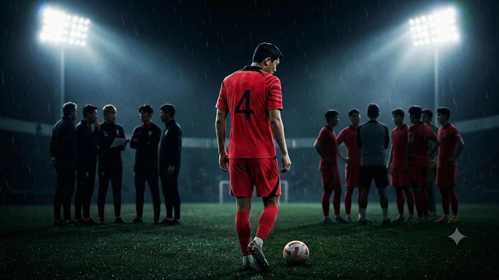

대한민국 축구대표팀의 핵심 수비수 **김민재 훈련불참** 소식이 전해지며 A매치 평가전을 앞둔 축구계가 거센 소용돌이에 휘말렸다. 베네수엘라전 무승부 직후 믹스트존에서 터져 나온 작심 발언과 맞물려 단순한 컨디션 난조를 넘어 대표팀 내부 전술과 소통 체계 전반에 균열이 생긴 것 아니냐는 우려가 쏟아진다. 이틀 연속 정상 훈련에서 제외된 이번 사태는 다가오는 우즈베키스탄전 선발 라인업 구성뿐 아니라 다가오는 메이저 대회를 준비하는 수비 라인의 구조적 안정성까지 뒤흔드는 중대한 시험대다.

## 김민재 '수비수 작심 발언'과 훈련 불참 전말

### 베네수엘라전 직후 믹스트존 발언의 배경
지난 주말 치러진 베네수엘라와의 평가전 직후 공동취재구역(믹스트존)에 모습을 드러낸 김민재의 표정은 몹시 굳어 있었다. 90분 내내 쉴 틈 없이 뒷공간을 커버하며 거친 몸싸움을 벌인 끝에 2-2 무승부로 경기가 끝나자, 평소 인터뷰를 아끼던 그가 작심한 듯 입을 열었다.

> "경기장에서 수비수들이 너무 불쌍하다는 생각이 들었다. 팀 전체가 하나로 뭉쳐서 함께 싸우고 수비한다는 느낌을 전혀 받지 못했다."

이 발언은 최전방 공격진과 중원의 1차 압박이 무너지며 상대 역습 상황마다 센터백 라인에만 극단적인 수비 부담이 가중된 현실을 정면으로 겨냥했다. 현장에 있던 취재진조차 놀랄 정도로 직설적인 어조였으며, 그동안 억눌렸던 전술적 답답함이 일거에 폭발한 순간이었다.

### 이틀 연속 정상 훈련 제외와 실내 개인 훈련 진행 상황
폭풍 같은 발언이 나온 바로 다음 날부터 균열 조짐이 훈련장 밖으로 드러났다. 고양종합운동장 보조경기장에서 진행된 공식 팀 훈련에서 김민재는 축구화를 신지 않고 러닝화 차림으로 나타났다. 코칭스태프와의 짧은 면담 이후 그라운드 단체 훈련에서 완전히 빠진 채 실내 웨이트 트레이닝장으로 이동했다.

이튿날에도 상황은 달라지지 않았다. 전술 훈련이 본격화되는 10월 5일 오후 세션에서도 김민재의 이름은 야외 훈련 명단에서 빠졌고, 의무 트레이너와 함께 실내에서 가벼운 스트레칭과 마사지 치료만 소화했다. 취재진에게 공개된 초반 15분 동안 그의 빈자리는 확연했고, 훈련장에는 이례적인 긴장감이 감돌았다.

### 클린스만호 이후 반복되는 수비 밸런스 붕괴 논란
수비진에 가해지는 과도한 수비 하중 문제는 이번 평가전만의 돌발 변수가 아니다. 이전 체제에서부터 뼈아프게 지적받았던 이른바 '해줘 축구'의 잔재가 여전히 대표팀 전술 전반에 짙게 남아 있다는 평가가 지배적이다.

- 공격 전개 시 양 풀백이 과도하게 전진한 상태에서 발생하는 턴오버
- 3선 미드필더의 수비 전환 속도 저하로 하프스페이스 노출
- 센터백 2명이 상대 공격수 3~4명을 상대로 넓은 배후 공간을 단독 커버

이러한 전술적 불균형은 [2026 FIFA 월드컵 한국 대표팀, 16강 넘을 수 있을까](/posts/sports/worldcup-2026-korea-preview/)에서 꾸준히 분석되었던 고질적 약점과 정확하게 맞닿아 있다. 김민재의 발언은 결국 구조적 결함을 선수 개인의 피지컬로만 메우려는 벤치의 전술적 안일함을 향한 일침이었던 셈이다.

## 단순 피로 누적 vs 내부 불화설 쟁점 비교

### 바이에른 뮌헨 강행군으로 인한 햄스트링 과부하 가능성
김민재의 훈련 열외를 바라보는 첫 번째 시선은 명확한 물리적 한계다. 소속팀 바이에른 뮌헨에서 분데스리가와 UEFA 챔피언스리그를 병행하며 9월 한 달 동안에만 주중·주말 풀타임 출전을 6경기 연속 이어왔다.

특히 뮌헨의 극단적인 하이 라인 전술 탓에 매 경기 40m 이상의 거리를 전력 질주로 복귀해야 했던 김민재의 오른쪽 햄스트링과 내전근에는 이미 경고등이 켜진 상태였다. 장거리 비행 피로가 해소되지 않은 채 귀국 직후 베네수엘라전 90분을 전부 소화했으니, 근육 긴장도가 극에 달해 추가 부상을 막기 위한 예방적 차원의 훈련 제외라는 분석도 설득력을 얻는다.

### 전술적 불만 표출과 코칭스태프 사이의 온도차
반면 단순 피로 누적으로만 보기 어렵다는 목소리도 만만치 않다. 베네수엘라전 하프타임 라커룸과 경기 종료 직후 전술적 압박 타이밍을 두고 코칭스태프와 수비진 사이에 격한 의견 교환이 있었다는 내부 증언이 흘러나왔기 때문이다.

김민재는 공수 간격이 40m 이상 벌어지는 전술적 공백을 벤치가 방치하고 있다고 지적한 반면, 코칭스태프는 공격진의 전방 압박 강도를 조절하기 위해 라인을 무조건 내리기만 할 수는 없다는 입장을 고수한 것으로 전해진다. 믹스트존에서의 공개 발언 역시 이러한 내부 조율 실패에 대한 강한 반발에서 비롯되었다는 해석이 힘을 얻는 이유다.

### 대표팀 관계자 공식 해명과 현장 분위기 교차 검증
논란이 일파만파 커지자 대한축구협회 관계자는 "선수 보호 차원의 통상적인 리커버리 프로그램일 뿐 코칭스태프와의 불화나 선수단 내부 문제는 전혀 사실이 아니다"라며 진화에 나섰다.

하지만 현장 취재진이 목격한 선수단 분위기는 평소와 확연히 달랐다. 주장단을 중심으로 한 미팅에서도 침묵이 길어졌으며, 수비진과 공격진이 별도로 모여 대화를 나누는 모습이 포착되는 등 전술적 불만에 따른 서먹한 기류가 완전히 지워지지 않았음을 보여주었다.

## 우즈베키스탄전 출전 시나리오와 대체 자원 평가

### 김민재 결장 시 센터백 조합(김주성·정승현)의 실전 검증
다가오는 우즈베키스탄과의 2차전에서 김민재가 완전히 결장할 경우, 대표팀은 플랜 B 가동을 피할 수 없다. 현재 대체 자원으로 가장 유력하게 거론되는 카드는 김주성(FC서울)과 정승현의 선발 조합이다.

- **김주성**: 왼발 빌드업 능력이 뛰어나고 전진 패스 시야가 좋으나, 거친 피지컬 경합에서 검증이 더 필요함
- **정승현**: 제공권 장악과 맨마킹 능력이 탁월하지만, 빠른 발을 가진 상대 윙어의 침투 시 순발력 열세

김민재 한 명이 담당하던 광범위한 배후 공간 커버와 강력한 대인 마크를 두 선수가 분담해야 하므로, 수비 라인 전체의 호흡과 포지셔닝이 승패의 절대적 분수령이 된다.

### 벤치 대기 후 후반 교체 투입 카드 가능성
무리한 선발 출전 대신 벤치에서 경기를 시작한 뒤 경기 양상에 따라 후반 20~30분가량을 소화하는 절충안도 유력한 시나리오다. 전반전을 플랜 B 조합으로 버텨낸 뒤, 후반전 상대의 공세가 거세지거나 리드를 지켜야 하는 시점에 투입해 수비 집중력을 끌어올리는 방식이다.

이 카드는 김민재의 근육 부상 재발 위험을 최소화하면서도 경기장 내 수비 리더십을 유지할 수 있는 현실적 대안이다. 다만 벤치 대기 결정 자체가 벤치와의 전술적 갈등이 완전히 봉합되지 않았음을 방증하는 신호로 해석될 여지는 남는다.

### 상대 공격진 특성에 따른 포백 수비진의 구조적 위험도
우즈베키스탄은 빠른 템포의 측면 돌파와 전방 타깃형 스트라이커를 활용한 직선적인 롱볼 축구에 능한 팀이다. 특히 역습 시 좌우 윙포워드의 스프린트 속도가 매우 뛰어나 배후 공간을 노리는 능력이 날카롭다.

만약 김민재의 압도적인 스피드와 커버 플레이 없이 포백 라인이 베네수엘라전처럼 높은 위치를 유지한다면, 단 한 번의 뒷공간 롱패스에도 치명적인 실점 위기를 맞이할 수 있다. 수비 라인의 전진 높이를 대폭 낮추거나 3선 수비형 미드필더의 위치를 센터백 바로 앞까지 끌어내리는 현실적인 타협이 불가피하다.

## 이번 논란이 2026 가을 A매치 체제에 던진 과제

### 전방 압박과 후방 라인 간격 조율 실패 원인
이번 사태의 본질은 김민재 개인의 불만이나 몸 상태에 국한되지 않는다. 현대 축구에서 전방 압박과 후방 빌드업 라인의 간격 유지는 팀 전술의 알파이자 오메가다. 공격 라인이 전방에서 강하게 상대를 옥죄지 못하면서 수비 라인만 하염없이 전진하면, 그 사이 광활한 중원 공간은 상대 역습의 완벽한 활주로가 된다.

수비진이 끊임없이 라인을 올릴 것을 요구받으면서도 정작 앞에서 공을 빼앗아주지 못하는 모순된 구조가 반복되자 세계 최고 수준의 수비수조차 육체적·정신적 한계에 부딪힌 것이다.

### 유럽파 핵심 수비수의 체력 관리 프로토콜 부재
유럽 빅리그에서 매주 극한의 압박을 견디는 핵심 자원들에 대한 세밀한 로테이션 및 컨디셔닝 관리가 여전히 낙제점 수준에 머물러 있다. 손흥민, 이강인 등 공격진에 대한 출전 시간 관리는 언론의 조명을 자주 받는 반면, 90분 내내 몸싸움을 벌이는 중앙 수비수는 늘 당연하게 전 경기 풀타임을 소화해야 한다는 인식이 팽배했다.

A매치 소집 전부터 소속팀 출전 시간과 근육 피로도를 정밀하게 측정하고, 2연전 중 1경기는 과감하게 대체 자원을 시험하는 체계적인 체력 관리 프로토콜 정립이 시급하다.

### 선수단 소통 구조 개선과 감독 전술 유연성의 필요성
선수가 경기 후 공개적인 자리에서 전술적 불만을 터뜨리는 상황은 어떤 이유로든 건강한 팀의 징후가 아니다. 이는 라커룸 내부에서 감독 및 코칭스태프와 전술적 피드백을 자유롭게 주고받는 소통 창구가 제대로 작동하지 않았음을 방증한다.

감독은 자신이 세운 전술적 철학만을 고집할 것이 아니라, 그라운드 위에서 직접 뛰며 몸으로 부딪히는 베테랑 수비진의 현장 목소리를 과감하게 수용해야 한다. 상대 전력과 아군 수비진의 체력 상태에 따라 유연하게 라인 높낮이를 조절하는 실리적인 경기 운영 능력을 보여주지 못한다면, 이번 갈등은 향후 본선 무대에서 더 큰 파국으로 이어질 수 있다.

[스포츠 테이핑 및 관절 보호대 쿠팡에서 보기](https://www.coupang.com/np/search?q=%EC%8A%A4%ED%8F%AC%EC%B8%A0%ED%85%8C%EC%9D%B4%ED%95%91%EB%B3%B4%ED%98%B8%EB%8C%80&sourceType=affiliate&trackingCode=AF8691300)

#김민재 #김민재훈련불참 #축구대표팀 #김민재작심발언 #우즈베키스탄전 #A매치평가전 #축구전술분석 #바이에른뮌헨