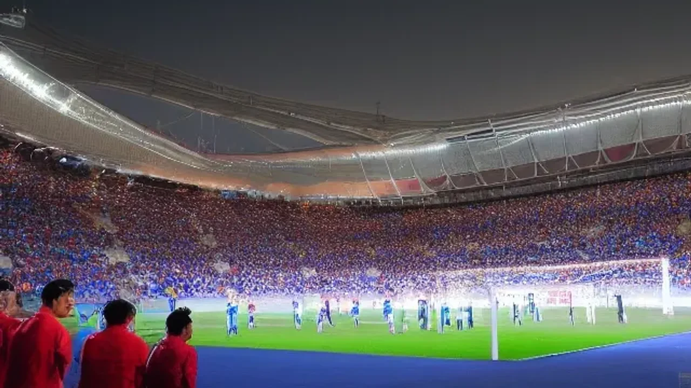
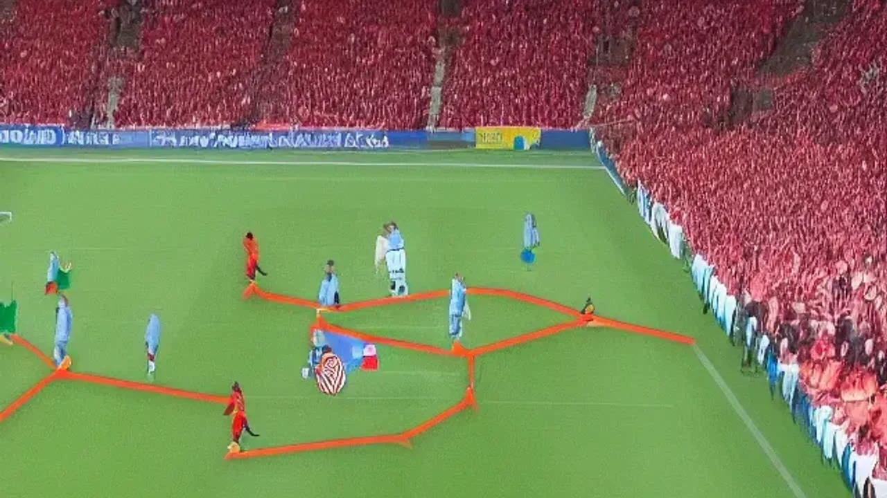

Markdown
대한민국 축구 국가대표팀이 16강 진출의 분수령이 될 조별리그 첫 경기를 앞두고 전술 다듬기에 한창입니다. 이번 **2026 월드컵 체코전**은 조 2위까지 주어지는 토너먼트 티켓의 향방을 가를 가장 결정적인 승부처로 꼽힙니다. 북미 대륙에서 펼쳐지는 이번 본선 무대에서 대표팀이 첫 단추를 어떻게 끼울지, 현지 훈련 상황과 데이터 분석을 기반으로 승리 공식을 치밀하게 짚어봅니다.

## 대한민국 vs 체코, 객관적 전력 분석과 역대 상대 전적

### FIFA 랭킹과 최근 A매치 흐름 비교
국제축구연맹(FIFA)이 발표한 2026년 5월 기준 랭킹을 보면 대한민국은 22위, 체코는 36위에 위치합니다. 순위상으로는 대표팀이 우위에 있으나, 유럽 예선에서 패배 없이 본선 직행 티켓을 따낸 체코의 최근 상승세는 매섭습니다. 한국은 지난 6월 4일 열린 엘살바도르와의 최종 평가전에서 1-0으로 승리하며 조직력을 점검했고, 체코는 오스트리아와의 평가전에서 2-1 승리를 거두며 공수 양면에서 탄탄한 밸런스를 입증했습니다.

### 역대 상대 전적과 메이저 대회 징크스
대한민국 축구 역사에서 체코는 꽤 까다로운 상대로 기억됩니다. 역대 성인 대표팀 상대 전적은 1승 3무 2패로 한국이 약간 열세에 놓여 있습니다. 가장 최근 맞대결이었던 2016년 친선 경기에서는 윤빛가람과 석현준의 연속 골로 2-1 승리를 거둔 좋은 기억이 있지만, 2001년 0-5 대패 같은 아픈 기억도 공존합니다. 월드컵 본선이라는 최고 무대에서 두 팀이 만나는 것은 이번이 처음인 만큼, 과거의 전적보다는 당일 현지 기후와 잔디 적응력이 승패를 가를 핵심 변수입니다.

### 도박사들이 예측한 한국의 승리 확률 배당률
영국 윌리엄 힐을 비롯한 유럽 주요 스포츠 베팅 업체 3사가 공개한 조별리그 A조 1차전 배당률은 팽팽한 흐름을 나타냅니다. 한국의 승리 배당은 평균 2.45, 무승부 3.10, 체코의 승리 배당은 2.80을 형성하고 있습니다. 배당률이 낮을수록 승리 확률이 높다는 뜻이기에, 전 세계 축구 전문가들은 한국의 근소한 우세를 점치고 있습니다. 그러나 이는 승률로 환산했을 때 약 38% 대 32%의 미미한 차이이므로 한 골 싸움이 될 가능성이 큽니다.

## '부상 변수'로 보는 양 팀 예상 선발 라인업 (진짜 베스트 11)

### 손흥민·이강인 중심의 대표팀 공격진 조합 예측
대표팀의 공격진은 주장이자 해결사인 손흥민을 왼쪽 측면 혹은 처진 스트라이커로 배치하고, 이강인을 오른쪽 측면 메이커로 활용하는 '황금 날개' 공식이 가동됩니다. 최전방 원톱 자리를 두고 주민규와 오세훈이 경합을 벌이는 구조입니다. 체코의 수비 벽이 매우 높고 견고하기 때문에, 이강인의 날카로운 가감 없는 침투 패스와 손흥민의 배후 공간 침투 속도가 결합해야만 상대 빗장을 풀 수 있습니다.

### 체코의 장신 스트라이커를 막을 수비 라인의 핵심 과제
체코는 전형적인 선이 굵은 유럽식 축구를 구사합니다. 특히 평균 신장 190cm에 육박하는 최전방 타깃맨 파트리크 시크의 머리를 겨냥한 롱볼 전술이 위협적입니다. 이에 맞서는 대표팀의 중앙 수비 라인은 김민재를 중심으로 강력한 대인 마크를 전개해야 합니다. 포백 라인의 좌우 풀백 역시 단순한 오버래핑을 자제하고, 상대 크로스 타이밍을 1차적으로 차단하는 측면 압박에 집중할 것으로 보입니다.

### 엘살바도르전 부상 이탈 변수와 대체 자원 활용법
지난 엘살바도르와의 평가전 후반전에 발목 통증을 호소하며 교체 아웃된 주전 미드필더 황인범의 회복 여부가 초미의 관심사입니다. 현지 의료진의 정밀 검사 결과 단순 타박상으로 확인되었으나, 첫 경기의 압박감을 고려하면 100%의 컨디션이 아닐 수 있습니다. 만약 황인범의 선발 출전이 불발될 경우, 고승범이나 홍현석이 전진 배치되어 중원 활동량을 메워야 하는 중책을 맡게 됩니다.

> **현지 기자단 한줄평:** "체코의 강력한 피지컬 압박을 견디기 위해서는 중원에서의 거친 볼 경합 능력과 빠른 공수 전환 속도가 필수적이다."

## 체코전 승리를 위한 3가지 핵심 전술 포인트

### 체코 수비진의 느린 발을 공략할 역습 타이밍
체코 수비진은 신체 조건이 뛰어난 반면, 순간적인 방향 전환과 뒷공간 커버 속도가 느리다는 치명적인 약점을 가집니다. 대표팀이 승점 3점을 획득하기 위한 제1공식은 중원에서 볼을 탈취한 즉시 이어지는 원터치 패스 전개입니다. 

* **강점:** 이강인의 롱 패스 정확도와 손흥민의 스프린트 능력 극대화
* **약점:** 패스 미스 발생 시 상대에게 곧바로 위협적인 역습 허용 위험

### 세트피스 상황에서의 신장 열세 극복 방안
코너킥과 프리킥 상황은 이번 경기에서 가장 위험한 순간이자 반대로 기회가 될 수 있는 양날의 검입니다. 체코는 세트피스 상황에서 중앙 수비수들까지 대거 공격에 가담시켜 고공 폭격을 시도하는 성향이 짙습니다. 한국은 지역 방어와 대인 방어를 혼합한 콤팩트한 수비 대형을 유지해야 하며, 골키퍼의 적극적인 공중볼 처리 범위 확장이 요구됩니다.

### 후반 체력 저하 시점의 교체 카드 타이밍 장단점
경기가 열리는 에스타디오 과달라하라는 해발 고도가 높은 지역에 위치해 전반 30분 이후 급격한 체력 저하 현상이 발생할 수 있습니다. 후반 15분 전후로 투입될 조규성이나 황희찬 같은 특급 조커들의 역할이 눈부셔야 합니다.

* **장점:** 빠른 타이밍의 교체로 상대 지친 수비진을 뒤흔드는 효과
* **단점:** 이른 시간 교체 카드 소모 시 연장전이나 돌발 부상 발생 대응력 저하

[관련 글 보기](/posts/sports/)

## 6월 12일 체코전 100% 즐기기: 경기 시간 및 실시간 중계 채널 Guide

### 한국 시간 기준 정확한 킥오프 시간과 채널별 중계 특징
현지 시간으로는 6월 11일 저녁 경기이지만, 시차로 인해 한국 축구 팬들이 경기를 시청하는 시간은 **6월 12일 금요일 오전 11시**입니다. 평일 오전 시간대인 만큼 직장과 학교에서 모바일 기기를 활용한 시청 수요가 폭발할 것으로 보입니다. 지상파 3사(KBS, MBC, SBS)는 각기 다른 색깔의 해설진을 배치해 축구 팬들의 리모컨을 유혹하고 있습니다. 전술적인 깊이를 원한다면 해설위원의 분석 전문성을, 재치 있고 박진감 넘치는 중계를 원한다면 캐스터의 호흡을 기준으로 채널을 선택하는 것이 최선입니다.

### 모바일·온라인 무료 생중계 플랫폼 접속 방법
외부에서 스마트폰이나 태블릿으로 경기를 관람해야 한다면 공식 디지털 중계권을 확보한 OTT 플랫폼을 이용해야 합니다. 대표적인 스트리밍 서비스인 쿠팡플레이와 네이버 스포츠를 통해 고화질 생중계를 시청할 수 있습니다. 특히 네이버 스포츠의 경우 실시간 응원 톡 기능이 활성화되어 있어, 수만 명의 축구 팬들과 함께 랜선 응원을 펼치며 경기 몰입도를 배가시킬 수 있습니다. 데이터 소모량이 크므로 반드시 와이파이 환경을 확보하거나 데이터 무제한 요금제를 확인하는 과정이 선행되어야 합니다.

### 거리 응원 및 주요 시청 포인트 요약
평일 오전이라는 제약이 있지만 광화문 광장과 주요 대도시 광장에서는 대형 스크런을 활용한 거리 응원이 기획되어 있습니다. 출근 시간과 겹치는 오전 9시부터 주변 교통 통제가 예상되므로 이동 시 동선 확인이 필요합니다. 이번 경기는 전반 15분 이내에 체코의 거친 압박을 대표팀이 어떻게 유연하게 풀어나가는지가 전체 90분의 흐름을 지배하는 가장 큰 시청 포인트입니다.

#2026월드컵 #체코전 #대한민국축구대표팀 #월드컵라인업 #체코전중계시간 #손흥민 #이강인 #김민재 #월드컵조별리그 #축구국가대표