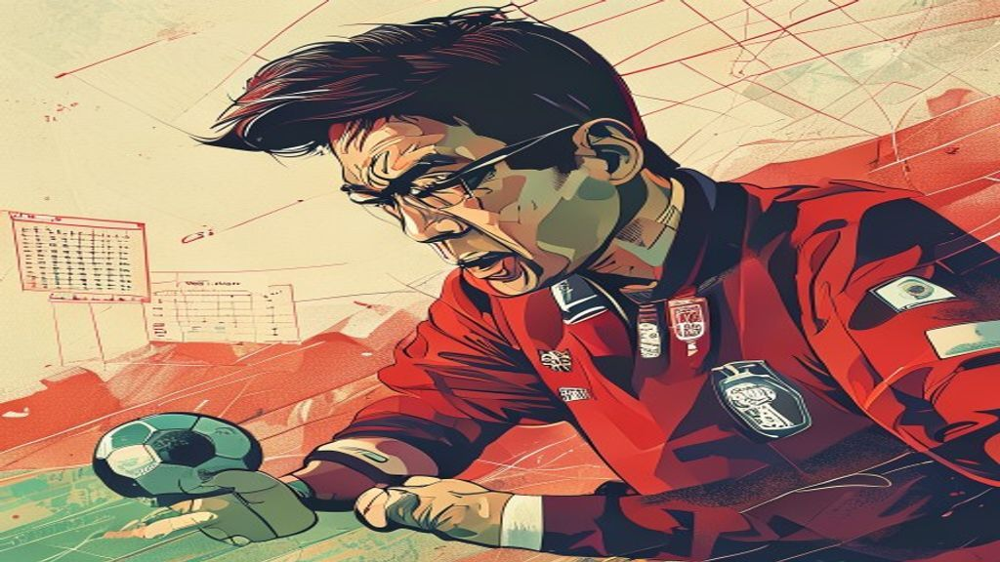
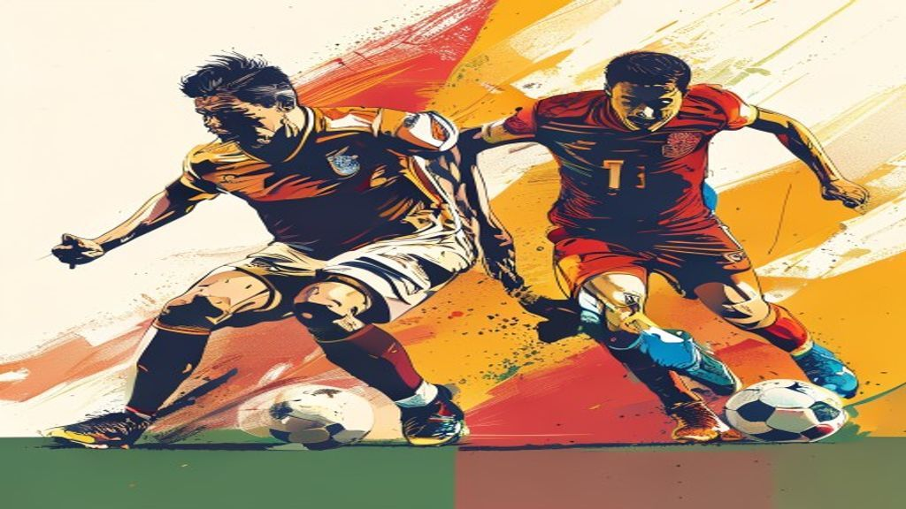

2026 월드컵을 향한 한국 축구의 여정이 뜨겁게 달아오르고 있습니다. 과연 홍명보 감독은 어떤 선수들로 **한국 월드컵 최종 명단**을 꾸릴까요? 팬들의 기대와 우려가 교차하는 가운데, **2026 월드컵 한국** 축구의 미래를 짊어질 **국가대표 26인 예측**은 그야말로 초미의 관심사입니다. 단순한 선수 명단을 넘어, 이번 월드컵 대표팀은 한국 축구의 현재와 미래를 보여주는 중요한 지표가 될 텐데요. 지금부터 팬의 시선으로 흥미로운 분석을 시작해볼까요?

## 홍명보 감독의 26인 명단 구상: 고지대 적응과 전략적 선택

이번 월드컵에서 한국 축구 대표팀은 그 어느 때보다 특별한 도전에 직면할 거예요. 바로 개최지 중 한 곳인 멕시코의 **고지대 환경**입니다. 홍명보 감독은 고지대 적응을 이번 월드컵의 핵심 변수로 보고 대처에 집중하고 있다고 하죠. 과연 이 고지대 변수가 최종 명단에 어떤 영향을 미칠지, 팬들은 벌써부터 궁금증을 감추지 못하고 있습니다.

### 고지대 변수, 선수단 구성에 미칠 영향은?

고지대 환경은 선수들의 체력과 경기력에 직접적인 영향을 미칩니다. 평소보다 산소량이 부족하기 때문에 금방 지치거나 집중력이 떨어질 수 있거든요. 홍명보 감독은 이러한 점을 고려해 지구력이 좋거나 고지대 환경에 빠르게 적응할 수 있는 선수들을 우선적으로 고려할 가능성이 커요.

*   **지구력 좋은 미드필더:** 경기 운영의 핵심인 미드필더진에서는 활동량이 많고 체력 소모가 큰 고지대 환경에서 끝까지 버텨줄 수 있는 선수들이 더욱 빛을 발할 겁니다.
*   **교체 자원 활용 극대화:** 주전 선수들의 체력 안배를 위해 교체 자원의 중요성이 커질 거예요. 짧은 시간 안에 경기의 흐름을 바꿀 수 있는 '조커' 역할의 선수들이 더 많이 발탁될 수도 있습니다.
*   **전술적 유연성:** 한 가지 전술에만 얽매이지 않고, 선수들의 컨디션과 상대 팀에 맞춰 유연하게 변화를 줄 수 있는 선수들을 선호하게 될 거예요.

### K리그 vs 해외파: 최적의 조화는 무엇인가?

이번 대표팀 명단은 K리그 선수와 해외파의 조화가 특징이라고 하죠. 해외파 선수들은 유럽 무대에서 쌓은 경험과 개인 기량으로 팀의 전체적인 수준을 끌어올리는 역할을 합니다. 반면, K리그 선수들은 국내 리그에서 꾸준히 좋은 모습을 보여주며 팀에 안정감을 더하고, 특히 고지대 적응 훈련을 국내에서 비교적 용이하게 진행할 수 있다는 장점도 있죠.

| 구분 | 장점 | 단점 |
|---|---|---|
| **해외파** | - 세계 수준의 경험과 개인 기량   - 강한 압박과 빠른 템포 적응력 | - 고지대 적응 훈련 시간 부족   - 장거리 이동으로 인한 피로 누적 |
| **K리그 선수** | - 국내 훈련을 통한 고지대 적응 용이   - 팀워크 및 전술 이해도 높음 | - 국제 경기 경험 부족   - 상대적으로 낮은 개인 기량 평가 |

결국 중요한 건 각자의 장점을 극대화하면서도 하나의 팀으로 시너지를 낼 수 있는 '최적의 조합'을 찾는 일일 겁니다. 홍명보 감독의 지략이 발휘될 부분이 바로 여기겠죠.

### 깜짝 발탁, 이기혁 같은 뉴페이스의 가능성

월드컵 본선 무대에서는 언제나 '깜짝 발탁' 선수가 등장해 팬들을 놀라게 하곤 합니다. 이번에는 이기혁 선수와 같은 뉴페이스들이 그 주인공이 될 수 있을까요? 팬들은 새로운 스타 탄생에 대한 기대가 큽니다.

*   **이기혁 선수:** K리그에서 보여준 압도적인 퍼포먼스와 잠재력은 이미 많은 팬의 눈도장을 찍었습니다. 패기 넘치는 플레이와 예측 불가능한 움직임은 상대 수비진을 흔들기에 충분하죠.
*   **예상치 못한 히든카드:** 홍명보 감독은 과거에도 과감한 선택으로 팀에 활력을 불어넣는 모습을 보여줬습니다. 이번에도 기존의 틀을 깨는 새로운 인물을 발탁해 경기의 흐름을 바꿀 히든카드로 활용할 가능성도 배제할 수 없습니다.

새로운 얼굴들이 월드컵이라는 큰 무대에서 어떤 모습을 보여줄지, 그들의 패기와 열정이 팀에 어떤 긍정적인 에너지를 불어넣을지 지켜보는 것도 이번 월드컵의 흥미로운 관전 포인트가 될 거예요.

## 세대교체 바람: 손흥민 이후 한국 축구를 이끌 주역은?

글로벌 스포츠 매체 ESPN은 손흥민 선수 이후 한국 축구를 이끌 **세대교체 문제**를 주요 과제로 지적했습니다. 영원한 캡틴 손흥민 선수의 존재감은 여전하지만, 미래를 위한 준비는 필수적이죠. 젊은 선수들의 성장이 그 어느 때보다 중요한 시점입니다.

### 손흥민의 MLS 기록 부진, 팬들의 우려와 대안

손흥민 선수의 MLS 시즌 기록(9도움, 무득점)에 대한 팬들의 우려는 사실입니다. 늘 최고의 퍼포먼스를 보여줬던 그였기에, 공격 포인트가 없다는 점은 많은 팬들에게 아쉬움을 안겨줬습니다. 물론 MLS와 유럽 리그는 환경이 다르지만, 월드컵이라는 큰 무대에서는 모든 것이 중요하게 다가올 수밖에 없어요.

*   **캡틴의 부담:** 에이스이자 캡틴으로서 손흥민 선수가 느끼는 부담은 상상 이상일 겁니다. 팬들은 그의 활약을 간절히 바라지만, 그에게 모든 것을 의존하는 것은 젊은 선수들의 성장을 저해할 수도 있습니다.
*   **대안의 필요성:** 손흥민 선수의 컨디션이 좋지 않거나 상대 팀의 집중 견제에 막혔을 때, 이를 대신할 수 있는 확실한 공격 옵션이 필요합니다. 이는 단순히 한 선수의 부진을 넘어 팀 전체의 공격력을 좌우할 수 있는 문제예요.

### 이강인, 황희찬 등 젊은 공격 자원들의 활약 기대

이런 상황에서 이강인, 황희찬 등 젊은 공격 자원들의 활약은 더욱 중요하게 다가옵니다. 이들은 이미 유럽 무대에서 자신의 기량을 증명하며 한국 축구의 미래를 책임질 주역으로 손꼽히고 있어요.

*   **이강인:** 탁월한 볼 컨트롤과 창의적인 패스, 그리고 날카로운 왼발 슈팅까지, 이강인 선수는 경기의 흐름을 바꿀 수 있는 '게임 체인저'입니다. 그의 예측 불가능한 플레이는 상대 수비진에게 큰 위협이 될 거예요.
*   **황희찬:** 저돌적인 돌파와 강력한 슈팅은 물론, 지치지 않는 활동량으로 상대 수비를 괴롭히는 황희찬 선수는 한국 공격의 핵심 엔진이라고 할 수 있습니다. 득점력과 연계 플레이 모두에서 중요한 역할을 해줄 겁니다.
*   **조규성, 오현규 등:** 이들 외에도 K리그와 해외 리그에서 좋은 모습을 보여주고 있는 젊은 공격수들이 많습니다. 이들이 월드컵 무대에서 잠재력을 폭발시켜 준다면, 한국 축구의 공격력은 한층 더 강해질 거예요.

### 세대교체의 명과 암: 팀워크와 경험의 균형

세대교체는 분명 팀에 새로운 활력을 불어넣는 긍정적인 측면이 있습니다. 젊은 선수들의 패기와 에너지, 그리고 새로운 전술적 시도는 팀을 한 단계 더 발전시킬 수 있죠. 하지만 동시에 우려되는 부분도 있습니다.

*   **세대교체의 긍정적인 면:**
    *   **새로운 동기 부여:** 젊은 선수들은 자신의 능력을 증명하고자 하는 강한 동기를 가지고 있습니다.
    *   **전술적 유연성:** 기존 선수들과 다른 스타일의 플레이는 감독에게 더 많은 전술적 선택지를 제공합니다.
    *   **미래를 위한 투자:** 지금의 세대교체는 다음 월드컵을 위한 중요한 밑거름이 됩니다.

*   **세대교체의 부정적인 면:**
    *   **경험 부족:** 월드컵이라는 큰 무대에서 경험 부족은 예상치 못한 실수로 이어질 수 있습니다.
    *   **팀워크 저해 가능성:** 새로운 선수들이 대거 합류할 경우, 기존 선수들과의 호흡을 맞추는 데 시간이 걸릴 수 있습니다.
    *   **리더십 공백:** 베테랑 선수들의 이탈은 팀 내부의 리더십 공백을 초래할 수도 있습니다.

세대교체는 단순히 나이가 어린 선수를 기용하는 것을 넘어, 팀의 **균형과 조화**를 찾는 과정입니다. 경험 많은 베테랑과 젊은 피가 어떻게 어우러져 시너지를 낼 수 있을지, 홍명보 감독의 혜안이 필요한 시점입니다.

## 팀 내부 결속력, 홍명보호의 숨겨진 과제

월드컵 본선 무대에서는 선수들의 기량만큼이나 **팀 내부의 결속력**이 성패를 가르는 중요한 요소로 작용합니다. 일부 외신은 홍명보 감독의 지도력 논란과 비판적 여론, 그리고 2023년 손흥민-이강인 불화설 재조명 등을 언급하며 팀워크가 이번 월드컵에서 중요한 요소가 될 것이라고 분석했어요.

### 외신이 지적한 홍명보 감독 리더십 논란 재조명

홍명보 감독의 리더십에 대한 논란은 과거에도 있었습니다. 특히 2014년 브라질 월드컵 당시의 경험을 떠올려보면, 감독의 리더십은 선수단의 사기와 경기력에 직접적인 영향을 미친다는 것을 알 수 있죠. 외신에서 이러한 점을 다시 언급하는 것은, 그만큼 팀을 하나로 묶는 감독의 역량이 중요하다는 방증일 겁니다.

> "월드컵과 같은 단기 토너먼트에서는 감독의 전술적 역량뿐만 아니라, 선수들의 정신력을 관리하고 팀의 분위기를 끌어올리는 리더십이 결정적인 역할을 한다. 홍명보 감독은 이러한 부분에서 팬들의 신뢰를 얻는 것이 급선무다."

팬들은 홍명보 감독이 과거의 경험을 발판 삼아, 이번에는 더욱 단단하고 흔들림 없는 리더십을 보여주기를 기대하고 있습니다.

### 2023년 손흥민-이강인 불화설, 이번엔 괜찮을까?

지난 2023년 불거졌던 손흥민-이강인 불화설은 많은 팬들에게 큰 충격을 안겨줬습니다. 비록 당시 사건이 일단락되었지만, 월드컵이라는 큰 대회를 앞두고 다시금 재조명되는 것은 팀 내부의 분위기에 좋지 않은 영향을 미칠 수 있습니다.

*   **과거의 아픔:** 팬들은 과거 팀 내부의 갈등으로 인해 좋지 않은 결과를 낳았던 사례들을 기억하고 있습니다. 이번에는 그런 일이 반복되지 않기를 바라는 마음이 간절하죠.
*   **소통의 중요성:** 선수들 간의 솔직한 대화와 상호 존중이 그 어느 때보다 필요합니다. 감독과 코치진은 선수들이 서로를 믿고 의지할 수 있는 환경을 만들어줘야 합니다.
*   **하나 된 목표:** 월드컵이라는 하나의 목표를 향해 모두가 똘똘 뭉친다면, 과거의 불화설은 오히려 팀을 더 단단하게 만드는 계기가 될 수도 있습니다. 중요한 건 그 과정에서 서로를 이해하고 배려하는 마음입니다.

### 월드컵 무대, 팀워크가 성패를 가른다: 과거 사례 분석

월드컵 역사에는 뛰어난 개인 기량을 가진 선수들이 많았지만, 결국 우승을 차지한 팀들은 대부분 강력한 팀워크를 자랑했습니다.

*   **2002년 한일 월드컵 한국:** '원 팀'으로 똘똘 뭉쳤던 한국 대표팀은 모두의 예상을 뛰어넘는 4강 신화를 이뤄냈습니다. 선수들 간의 끈끈한 유대감과 헌신적인 플레이가 그 비결이었죠.
*   **2014년 독일:** '전차군단' 독일은 화려한 개인기보다는 조직적인 압박과 유기적인 팀 플레이로 세계 정상에 올랐습니다. 모든 선수가 자신의 역할을 충실히 수행하며 하나의 거대한 시스템처럼 움직였습니다.

이러한 사례들은 월드컵에서 팀워크가 얼마나 중요한지를 여실히 보여줍니다. 홍명보 감독과 선수단은 이러한 과거의 경험을 교훈 삼아, 이번 월드컵에서는 '원 팀'으로서 최고의 모습을 보여주길 팬들은 기대하고 있습니다.

## 역대급 조 편성, 사상 첫 원정 8강 현실화될까?

이번 월드컵 조 편성은 박지성 해설위원이 "역대급으로 좋다"고 평가했을 정도로 한국에게 유리하게 작용할 가능성이 크다는 분석이 많습니다. 팬들은 사상 첫 원정 8강 이상의 성과를 기대하며 설레는 마음을 감추지 못하고 있어요.

### 박지성 해설위원의 긍정 평가: 조 1위 가능성

박지성 해설위원은 한국의 조 1위 가능성까지 언급하며 기대감을 높였습니다. 그의 발언은 단순한 희망 사항이 아니라, 오랜 경험과 분석을 바탕으로 한 전문가의 시각이 담겨있기에 더욱 신뢰가 갑니다.

*   **상대적 약체:** 조별리그 상대인 체코와 남아공은 분명 만만치 않은 팀이지만, 월드컵 본선 경험과 객관적인 전력 면에서 한국이 우위에 있다고 평가받습니다.
*   **전력 분석의 중요성:** 상대 팀에 대한 철저한 분석과 맞춤형 전략을 준비한다면 충분히 승점을 확보하고 조 1위까지 노려볼 수 있을 겁니다.

### 멕시코 홈 이점 vs 체코, 남아공 약체 평가

개최국 중 하나인 멕시코의 홈 이점은 분명 부담스러운 부분입니다. 고지대 환경과 열광적인 홈 팬들의 응원은 상대 팀에게 큰 압박으로 작용할 수 있죠. 하지만 체코와 남아공이 비교적 약체로 평가된다는 점은 한국에게 분명한 기회입니다.

*   **멕시코전:** 멕시코와의 경기는 가장 어려운 고비가 될 겁니다. 하지만 홈 이점을 상쇄할 수 있는 철저한 준비와 정신력으로 무장한다면, 충분히 승부를 걸어볼 만합니다. 무승부라도 얻어낸다면 조별리그 통과에 매우 유리한 고지를 점할 수 있을 거예요.
*   **체코, 남아공전:** 이 두 팀과의 경기에서 승점 3점을 목표로 해야 합니다. 특히 첫 경기인 체코전 승리는 조별리그 전체의 분위기를 좌우할 중요한 요소가 될 겁니다.

### 체코전 승점 확보, 조별리그 통과의 핵심 열쇠

박지성 해설위원의 분석처럼, 첫 경기인 **체코전 승점 확보**는 조별리그 통과의 중요한 발판이 될 것입니다. 첫 단추를 잘 꿰는 것이 얼마나 중요한지는 모두가 알고 있죠.

*   **초반 기세:** 첫 경기 승리는 선수들에게 자신감을 불어넣고, 팀 전체의 사기를 끌어올리는 데 결정적인 역할을 합니다.
*   **전략적 운영:** 체코전 승리를 바탕으로 멕시코전과 남아공전에 대한 전략을 더욱 유연하게 가져갈 수 있습니다.
*   **심리적 우위:** 경쟁 팀들에게 한국의 저력을 보여주며 심리적인 우위를 점할 수 있습니다.

이번 월드컵은 한국 축구에게 찾아온 절호의 기회입니다. 선수들이 최고의 컨디션으로 경기에 임하고, 감독의 지략이 빛을 발한다면 사상 첫 원정 8강 이상의 쾌거를 달성할 수도 있을 거예요. [한국 축구의 다른 이야기](/posts/sports/)도 함께 살펴보시면서 이번 월드컵에 대한 기대감을 더욱 키워보세요!

## 2026 월드컵, 한국 축구의 도전과 기회

2026 월드컵은 한국 축구에 있어 여러 가지 도전 과제와 함께 엄청난 기회를 동시에 안겨주는 대회가 될 거예요. 고지대 적응, 세대교체, 그리고 팀워크는 우리가 반드시 극복해야 할 도전이지만, 동시에 역대급 조 편성은 사상 첫 원정 8강 이상의 성과를 기대하게 만듭니다.

### 고지대 적응, 세대교체, 팀워크: 극복해야 할 도전 과제

이번 월드컵에서 한국 축구는 세 가지 큰 도전에 직면하게 될 겁니다. 이 도전들을 어떻게 현명하게 헤쳐나갈지가 바로 성패를 좌우할 핵심 요소예요.

*   **고지대 적응:** 멕시코의 고지대 환경은 선수들의 체력과 경기력에 예상치 못한 변수로 작용할 수 있습니다. 철저한 훈련과 전략적인 선수 기용이 필수적입니다.
*   **세대교체:** 손흥민 선수 이후를 책임질 젊은 선수들의 성장은 희망적이지만, 동시에 경험 부족과 팀워크 저해 가능성이라는 위험도 안고 있습니다.
*   **팀워크:** 과거 불화설이나 감독 리더십 논란은 팀 내부의 결속력을 약화시킬 수 있습니다. 월드컵 무대에서는 무엇보다 선수들이 하나로 뭉치는 것이 중요합니다.

이러한 도전 과제들을 단순히 피하기보다는, 오히려 팀을 더욱 단단하게 만드는 기회로 삼아야 합니다.

### 역대급 조 편성, 원정 8강 이상의 기회

도전 과제가 많다고 해서 마냥 비관적일 필요는 없습니다. 이번 월드컵 조 편성은 한국 축구에게 분명한 기회를 제공하고 있어요.

*   **상대적 우위:** 조별리그 상대 중 체코와 남아공은 객관적인 전력에서 한국이 우위를 점할 수 있는 팀들입니다. 이 경기들에서 승점을 최대한 확보하는 것이 중요하죠.
*   **첫 경기 승리의 중요성:** 특히 체코전 승리는 조별리그 통과에 결정적인 영향을 미칠 겁니다. 초반 기세를 잡는다면 멕시코전에서도 더 자신감 있는 플레이를 보여줄 수 있을 거예요.
*   **사상 첫 원정 8강:** 박지성 해설위원이 언급했듯이, 이번 조 편성은 충분히 원정 8강 그 이상까지도 노려볼 수 있는 절호의 기회입니다. 팬들의 염원이 현실이 될 가능성이 그 어느 때보다 높아요.

### 홍명보 감독의 리더십과 선수단 조화의 중요성

결론적으로, 이번 2026 월드컵에서 한국 축구의 성공은 홍명보 감독의 리더십과 선수단 전체의 조화에 달려 있다고 해도 과언이 아닙니다. 감독은 선수들의 잠재력을 최대한 끌어내고, 고지대 변수에 대한 현명한 대처 방안을 마련해야 합니다.

*   **소통과 신뢰:** 감독과 선수, 그리고 선수들 간의 깊은 소통과 상호 신뢰는 팀워크를 강화하는 가장 기본적인 요소입니다.
*   **전술적 유연성:** 고지대 환경과 상대 팀의 전술에 맞춰 유연하게 변화할 수 있는 전술적 역량이 필요합니다.
*   **정신력 관리:** 월드컵이라는 큰 무대에서 선수들이 압박감을 이겨내고 최고의 기량을 발휘할 수 있도록 정신적인 지지 또한 중요합니다.

팬들은 홍명보 감독이 과거의 경험을 바탕으로 더욱 성숙하고 강력한 리더십을 보여주기를 기대하고 있습니다. 선수단 전체가 하나의 목표를 향해 똘똘 뭉쳐 최선을 다한다면, 분명 2026 월드컵은 한국 축구 역사에 길이 남을 감동적인 순간들을 선사할 거예요. 우리 모두 한마음으로 대한민국 축구 국가대표팀을 응원합시다!

#한국월드컵 #2026월드컵 #국가대표 #최종명단 #홍명보호 #손흥민 #이강인 #축구예측